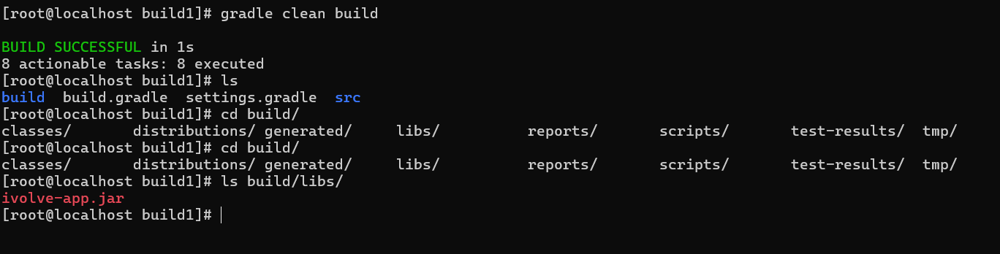
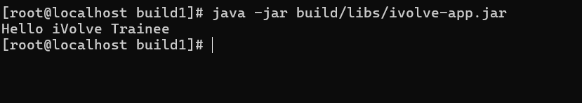

# IVOLVE Task 1 - Java Gradle Project

This project is part of the IVOLVE training program. It demonstrates a simple Java application built with Gradle, including automated testing and build processes.

## Project Overview

This is a basic Java application that prints a greeting message. The project is structured as a standard Gradle Java project with:

- **Main Application**: A simple `App` class that outputs "Hello iVolve Trainee"
- **Unit Tests**: JUnit-based tests to verify the application output
- **Gradle Build System**: Automated build, test, and packaging

## Project Requirements

### Java Version

- **Java 8 (JDK 1.8)** - Required for source compatibility
- The project is configured with `sourceCompatibility = '1.8'` in `build.gradle`

### Gradle Version

- **Gradle 6.9 or 7.6** (recommended)
- Compatible with Java 8 and supports the project's build configuration

### Operating System

- **CentOS Linux** (or compatible RHEL-based distributions)
- The setup script is designed for CentOS using `yum` package manager

## Setup Instructions

### Prerequisites

- A virtual machine (VM) with CentOS Linux installed
- Root/sudo access for package installation
- Internet connection for downloading Java and Gradle

### Step 1: Clone or Navigate to the Project

```bash
cd "task 1"
```


### Step 2: Run the Setup Script

The project includes an automated setup script (`setup_java_gradle.sh`) that will:

1. Remove any existing Java installations
2. Remove any existing Gradle installations
3. Prompt you to select a Java version (8, 11, or 17)
4. Install the selected Java version (OpenJDK)
5. Set up JAVA_HOME environment variable
6. Prompt you to select a Gradle version (recommended: 6.9 or 7.6)
7. Download and install Gradle
8. Verify the installations

**To run the setup script:**

```bash
chmod +x setup_java_gradle.sh
./setup_java_gradle.sh
```

**During setup, you'll be prompted:**

- Java version: Enter `8` (required for this project)
- Gradle version: Enter `7.6` or `6.9` (recommended)

### Step 3: Verify Installation

After running the setup script, verify your installations:

```bash
java -version
javac -version
gradle -v
```

You should see:

- Java version 1.8.x
- Gradle version 7.6.x (or the version you selected)


## How to Use the Project

### Navigate to the Build Directory

```bash
cd build1
```

### Build the Project

To compile the project and create the JAR file:

```bash
gradle build
```

This will:

- Compile the Java source files
- Run the unit tests
- Create a JAR file in `build/libs/ivolve-app.jar`
- Generate test reports in `build/reports/tests/`



### Run Tests

To run only the tests:

```bash
gradle test
```

Test results will be available in:

- HTML report: `build/reports/tests/test/index.html`
- XML report: `build/test-results/test/TEST-com.ivolve.AppTest.xml`


### Clean Build

To perform a clean build (removes previous build artifacts):

```bash
gradle clean build
```

This removes the `build/` directory and performs a fresh build.

### Run the Application

After building, you can run the application in two ways:

**Option 1: Using Gradle**

```bash
gradle run
```

**Option 2: Using Java directly**

```bash
java -jar build/libs/ivolve-app.jar
```

**Expected Output:**

```
Hello iVolve Trainee
```



### View Test Reports

After running tests, you can view the HTML test report:

```bash
# On CentOS, you can use a text-based browser or copy to a machine with a browser
# Or use Python's HTTP server if available:
cd build/reports/tests/test
python3 -m http.server 8000
# Then access http://localhost:8000 in a browser
```

## Project Structure

```
build1/
├── build.gradle          # Gradle build configuration
├── settings.gradle        # Gradle project settings
└── src/
    ├── main/
    │   └── java/
    │       └── com/
    │           └── ivolve/
    │               └── App.java          # Main application class
    └── test/
        └── java/
            └── com/
                └── ivolve/
                    └── AppTest.java     # Unit tests
```

## Build Artifacts

After building, the following artifacts are generated in the `build/` directory:

- **JAR file**: `build/libs/ivolve-app.jar` - Executable JAR file
- **Test reports**: `build/reports/tests/` - HTML and XML test reports
- **Distributions**: `build/distributions/` - TAR and ZIP distributions
- **Scripts**: `build/scripts/` - Shell scripts for running the application

## Troubleshooting

### Java Version Issues

If you encounter compatibility issues:

- Ensure Java 8 is installed: `java -version` should show 1.8.x
- Verify JAVA_HOME is set correctly: `echo $JAVA_HOME`

### Gradle Issues

If Gradle commands fail:

- Verify Gradle is in PATH: `which gradle`
- Check Gradle version compatibility: `gradle -v`
- Ensure Gradle version is 6.9 or higher

### Build Failures

If the build fails:

- Clean and rebuild: `gradle clean build`
- Check for compilation errors in the output
- Verify all dependencies are downloaded (check `~/.gradle/caches/`)

## Notes

- The setup script is designed for CentOS/RHEL systems using `yum`
- For other Linux distributions, you may need to modify the package manager commands
- The project uses JUnit 4.13.2 for testing
- The main class is `com.ivolve.App` as specified in `build.gradle`

## License

See the LICENSE file in the parent directory for license information.
