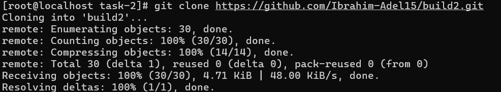
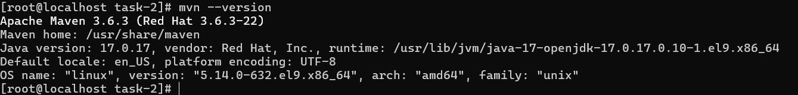
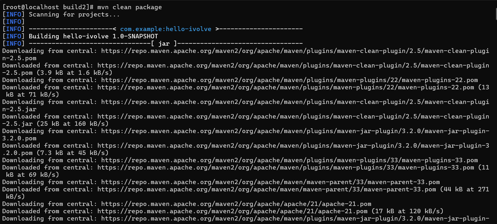
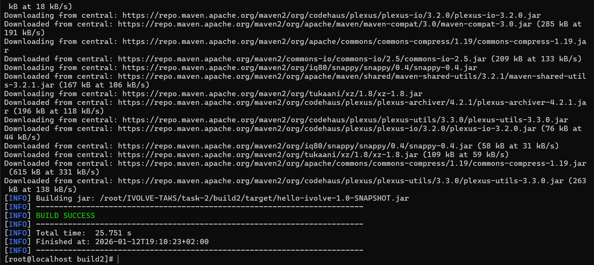
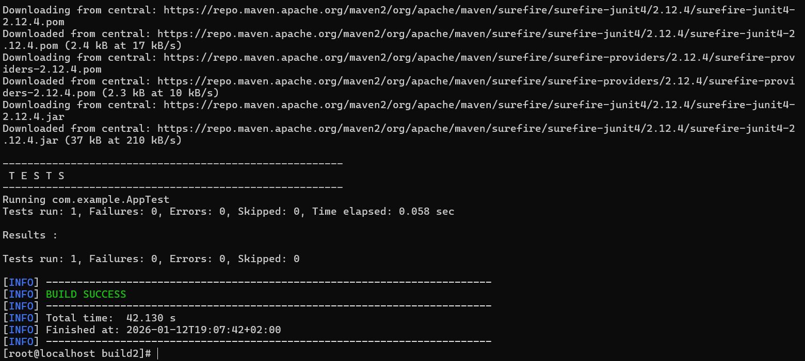

# IVOLVE Task 2 - Java Maven Project

This project is part of the IVOLVE training program. It demonstrates a simple Java application built with Maven, including automated testing and build processes.

## Project Overview

This is a basic Java application that prints a greeting message. The project is structured as a standard Maven Java project with:

- **Main Application**: A simple `App` class that outputs "Hello Ivolve Trainee"
- **Unit Tests**: JUnit-based tests to verify the application output
- **Maven Build System**: Automated build, test, and packaging using Apache Maven

## Project Requirements

### Java Version

- **Java 11 (JDK 11)** - Required for source compatibility
- The project is configured with `maven.compiler.source` and `maven.compiler.target` set to `11` in `pom.xml`

### Maven Version

- **Maven 3.6+** (recommended: 3.8 or 3.9)
- Compatible with Java 11 and supports the project's build configuration

### Operating System

- **CentOS Linux** (or compatible RHEL-based distributions)
- The setup process uses standard package managers like `yum`

## Setup Instructions

### Prerequisites

- A virtual machine (VM) with CentOS Linux installed
- Root/sudo access for package installation
- Internet connection for downloading Java and Maven

### Step 1: Clone or Navigate to the Project

```bash
cd task-2
```



### Step 2: Install Java 11

Since this project requires Java 11, you need to install it on your CentOS system:

```bash
# Install Java 11 OpenJDK Development Kit
sudo yum install -y java-11-openjdk-devel

# Set JAVA_HOME (add to ~/.bashrc for persistence)
export JAVA_HOME=$(dirname $(dirname $(readlink -f $(which javac))))
export PATH=$JAVA_HOME/bin:$PATH
```

### Step 3: Install Maven

Install Apache Maven on your CentOS system:

```bash
# Download Maven (replace version with latest if needed)
cd /tmp
wget https://downloads.apache.org/maven/maven-3/3.9.6/binaries/apache-maven-3.9.6-bin.tar.gz

# Extract Maven
sudo tar -xzf apache-maven-3.9.6-bin.tar.gz -C /opt/

# Create symlink
sudo ln -sfn /opt/apache-maven-3.9.6 /opt/maven

# Add Maven to PATH (add to ~/.bashrc for persistence)
export PATH=/opt/maven/bin:$PATH
```

### Step 4: Verify Installation

After installation, verify your installations:

```bash
java -version
javac -version
mvn -version
```

You should see:

- Java version 11.x
- Maven version 3.9.x (or the version you installed)



## How to Use the Project

### Navigate to the Build Directory

```bash
cd build2
```

### Build the Project

To compile the project and create the JAR file:

```bash
mvn clean compile
mvn package
```

Or in a single command:

```bash
mvn clean package
```

This will:

- Compile the Java source files
- Run the unit tests
- Create a JAR file in `target/hello-ivolve-1.0-SNAPSHOT.jar`
- Generate test reports in `target/surefire-reports/`





### Run Tests

To run only the tests:

```bash
mvn test
```

Test results will be available in:

- Text report: `target/surefire-reports/com.example.AppTest.txt`
- XML report: `target/surefire-reports/TEST-com.example.AppTest.xml`



### Clean Build

To perform a clean build (removes previous build artifacts):

```bash
mvn clean package
```

This removes the `target/` directory and performs a fresh build.

### Run the Application

After building, you can run the application in two ways:

**Option 1: Using Maven**

```bash
mvn exec:java -Dexec.mainClass="com.example.App"
```

**Option 2: Using Java directly**

```bash
java -jar target/hello-ivolve-1.0-SNAPSHOT.jar
```

**Expected Output:**

```
Hello Ivolve Trainee
```


### View Test Reports

After running tests, you can view the test reports:

```bash
# View text report
cat target/surefire-reports/com.example.AppTest.txt

# View XML report
cat target/surefire-reports/TEST-com.example.AppTest.xml
```

## Project Structure

```
build2/
├── pom.xml                    # Maven project configuration
└── src/
    ├── main/
    │   └── java/
    │       └── com/
    │           └── example/
    │               └── App.java          # Main application class
    └── test/
        └── java/
            └── com/
                └── example/
                    └── AppTest.java     # Unit tests
```

## Build Artifacts

After building, the following artifacts are generated in the `target/` directory:

- **JAR file**: `target/hello-ivolve-1.0-SNAPSHOT.jar` - Executable JAR file
- **Test reports**: `target/surefire-reports/` - Text and XML test reports
- **Compiled classes**: `target/classes/` - Compiled Java classes
- **Test classes**: `target/test-classes/` - Compiled test classes

## Troubleshooting

### Java Version Issues

If you encounter compatibility issues:

- Ensure Java 11 is installed: `java -version` should show 11.x
- Verify JAVA_HOME is set correctly: `echo $JAVA_HOME`
- Check that `javac` is available: `javac -version`

### Maven Issues

If Maven commands fail:

- Verify Maven is in PATH: `which mvn`
- Check Maven version compatibility: `mvn -version`
- Ensure Maven version is 3.6 or higher
- Verify Maven can access repositories (check internet connection)

### Build Failures

If the build fails:

- Clean and rebuild: `mvn clean package`
- Check for compilation errors in the output
- Verify all dependencies are downloaded (check `~/.m2/repository/`)
- Ensure you're in the correct directory (`build2/`)

### Dependency Download Issues

If Maven cannot download dependencies:

- Check your internet connection
- Verify Maven settings: `cat ~/.m2/settings.xml` (if exists)
- Try clearing Maven cache: `rm -rf ~/.m2/repository/` (will re-download all dependencies)

## Maven vs Gradle

This project uses **Maven** as the build tool, which differs from Task 1 that used Gradle:

- **Maven** uses XML-based configuration (`pom.xml`)
- **Gradle** uses Groovy/Kotlin-based configuration (`build.gradle`)
- Both are powerful build tools with similar capabilities
- Maven follows convention over configuration
- Gradle offers more flexibility and performance optimizations

## Notes

- The project uses Maven's standard directory layout
- JUnit 4.13.2 is used for testing
- The main class is `com.example.App` as specified in `pom.xml`
- Maven automatically downloads dependencies from Maven Central Repository
- The project artifact ID is `hello-ivolve` with version `1.0-SNAPSHOT`

## License

See the LICENSE file in the parent directory for license information.
