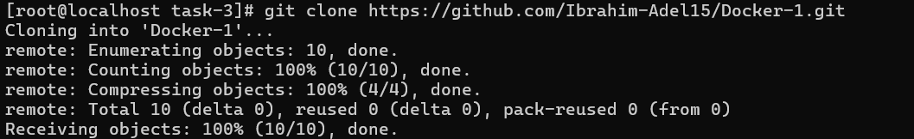
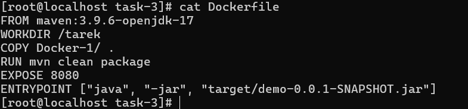
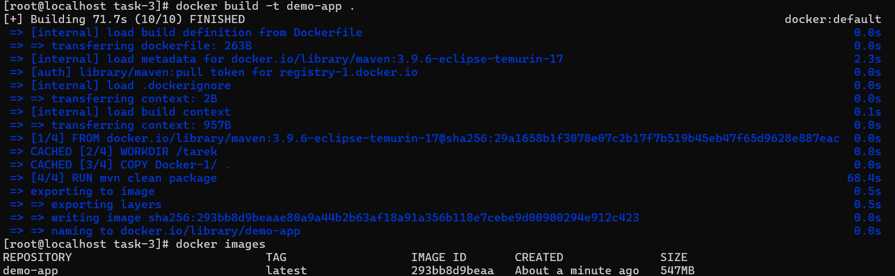
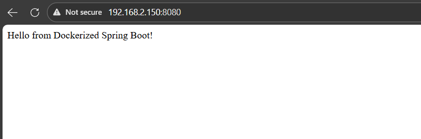

# IVOLVE Task 3 - Dockerized Spring Boot Application

This project is part of the IVOLVE training program. It demonstrates how to containerize a Spring Boot application using Docker, including building and running the application in a containerized environment.

## Project Overview

This is a Spring Boot web application that returns a greeting message. The project demonstrates:

- **Spring Boot Application**: A RESTful web service built with Spring Boot 3.2.0
- **Docker Containerization**: Complete Docker setup for building and running the application
- **Maven Build System**: Uses Maven to build the Spring Boot application inside Docker
- **Web Service**: Exposes a REST endpoint that returns "Hello from Dockerized Spring Boot!"

## Project Requirements

### Java Version

- **Java 17** - Required for Spring Boot 3.2.0
- The Docker image uses `maven:3.9.6-eclipse-temurin-17` which includes Java 17

### Maven Version

- **Maven 3.9.6** - Included in the Docker base image
- Used to build the Spring Boot application

### Docker

- **Docker** - Required to build and run the containerized application
- Docker must be installed and running on your system

### Operating System

- **CentOS Linux** (or compatible RHEL-based distributions)
- Any Linux distribution with Docker support
- Docker Desktop for Windows/Mac (if not using Linux VM)

## Setup Instructions

### Prerequisites

- A virtual machine (VM) with CentOS Linux installed (or Docker Desktop)
- Docker installed and running
- Internet connection for downloading Docker images and Maven dependencies

### Step 1: Install Docker

If Docker is not already installed on your CentOS system:

```bash
# Remove old versions if any
sudo yum remove -y docker docker-client docker-client-latest docker-common docker-latest docker-latest-logrotate docker-logrotate docker-engine

# Install required packages
sudo yum install -y yum-utils

# Add Docker repository
sudo yum-config-manager --add-repo https://download.docker.com/linux/centos/docker-ce.repo

# Install Docker Engine
sudo yum install -y docker-ce docker-ce-cli containerd.io docker-buildx-plugin docker-compose-plugin

# Start Docker service
sudo systemctl start docker
sudo systemctl enable docker

# Add your user to docker group (to run docker without sudo)
sudo usermod -aG docker $USER

# Log out and log back in for group changes to take effect
```

### Step 2: Verify Docker Installation

Verify that Docker is installed and running:

```bash
docker --version
docker info
```

### Step 3: Clone or Navigate to the Project

```bash
cd task-3
```



## How to Use the Project

### Understanding the Dockerfile

The `Dockerfile` contains the following instructions:

```dockerfile
FROM maven:3.9.6-eclipse-temurin-17
WORKDIR /tarek
COPY Docker-1/ .
RUN mvn clean package
EXPOSE 8080
ENTRYPOINT ["java", "-jar", "target/demo-0.0.1-SNAPSHOT.jar"]
```

**Explanation:**
- Uses Maven 3.9.6 with Java 17 (Eclipse Temurin) as base image
- Sets working directory to `/tarek`
- Copies the Maven project from `Docker-1/` directory
- Builds the application using Maven
- Exposes port 8080 for the web service
- Runs the Spring Boot JAR file as the entry point



### Build the Docker Image

To build the Docker image from the Dockerfile:

```bash
docker build -t ivolve-spring-boot:latest .
```

This command:
- Builds a Docker image tagged as `ivolve-spring-boot:latest`
- Uses the Dockerfile in the current directory
- Downloads the base Maven image if not already present
- Builds the Spring Boot application inside the container
- Creates a ready-to-run Docker image



### Run the Docker Container

After building the image, run the container:

```bash
docker run -d -p 8080:8080 --name ivolve-app ivolve-spring-boot:latest
```

**Command breakdown:**
- `-d`: Run container in detached mode (background)
- `-p 8080:8080`: Map container port 8080 to host port 8080
- `--name ivolve-app`: Name the container `ivolve-app`
- `ivolve-spring-boot:latest`: Use the image we just built


### Access the Application

Once the container is running, you can access the application:

**Option 1: Using curl (from command line)**

```bash
curl http://localhost:8080
```

**Option 2: Using a web browser**

Open your browser and navigate to:
```
http://localhost:8080
```

**Expected Output:**
```
Hello from Dockerized Spring Boot!
```



### View Container Logs

To see the application logs:

```bash
docker logs ivolve-app
```

Or follow logs in real-time:

```bash
docker logs -f ivolve-app
```

### Stop the Container

To stop the running container:

```bash
docker stop ivolve-app
```

### Start a Stopped Container

To start a previously stopped container:

```bash
docker start ivolve-app
```

### Remove the Container

To remove the container (must be stopped first):

```bash
docker stop ivolve-app
docker rm ivolve-app
```

### Remove the Docker Image

To remove the Docker image:

```bash
docker rmi ivolve-spring-boot:latest
```


## Project Structure

```
task-3/
├── Dockerfile                  # Docker configuration file
└── Docker-1/
    ├── pom.xml                 # Maven project configuration
    └── src/
        └── main/
            └── java/
                └── com/
                    └── example/
                        └── demo/
                            └── DemoApplication.java    # Spring Boot application
```

## Docker Commands Reference

### Container Management

```bash
# List running containers
docker ps

# List all containers (including stopped)
docker ps -a

# Stop a container
docker stop <container-name-or-id>

# Start a container
docker start <container-name-or-id>

# Remove a container
docker rm <container-name-or-id>

# View container logs
docker logs <container-name-or-id>

# Execute command in running container
docker exec -it <container-name-or-id> /bin/bash
```

### Image Management

```bash
# List Docker images
docker images

# Remove an image
docker rmi <image-name-or-id>

# Inspect an image
docker inspect <image-name-or-id>
```

### Build and Run

```bash
# Build image
docker build -t <image-name>:<tag> .

# Run container
docker run -d -p <host-port>:<container-port> --name <container-name> <image-name>:<tag>

# Run container interactively
docker run -it <image-name>:<tag> /bin/bash
```

## Troubleshooting

### Docker Not Running

If you get "Cannot connect to the Docker daemon":

```bash
# Check Docker service status
sudo systemctl status docker

# Start Docker service
sudo systemctl start docker

# Enable Docker to start on boot
sudo systemctl enable docker
```

### Port Already in Use

If port 8080 is already in use:

```bash
# Find what's using the port
sudo netstat -tulpn | grep 8080

# Or use a different port when running
docker run -d -p 8081:8080 --name ivolve-app ivolve-spring-boot:latest
```

### Container Won't Start

If the container exits immediately:

```bash
# Check container logs
docker logs ivolve-app

# Run container interactively to see errors
docker run -it ivolve-spring-boot:latest /bin/bash
```

### Permission Denied

If you get permission denied errors:

```bash
# Add user to docker group
sudo usermod -aG docker $USER

# Log out and log back in, or use:
newgrp docker
```

### Build Failures

If Docker build fails:

- Check internet connection (needs to download base image)
- Verify Dockerfile syntax
- Check that `Docker-1/` directory exists and contains the Maven project
- Review build logs for specific error messages

### Application Not Accessible

If you can't access the application:

- Verify container is running: `docker ps`
- Check port mapping: `docker port ivolve-app`
- Verify firewall settings (if applicable)
- Check container logs for errors: `docker logs ivolve-app`

## Docker Concepts Explained

### Dockerfile

A text file containing instructions for building a Docker image. Each instruction creates a layer in the image.

### Docker Image

A read-only template used to create containers. Built from a Dockerfile or pulled from a registry.

### Docker Container

A running instance of a Docker image. Containers are isolated environments that run applications.

### Port Mapping

Maps a port on the host machine to a port in the container, allowing external access to containerized applications.

### Multi-stage Builds

This project uses a single-stage build. For production, consider multi-stage builds to reduce image size.

## Advantages of Docker

- **Consistency**: Same environment across development, testing, and production
- **Isolation**: Applications run in isolated containers
- **Portability**: Run anywhere Docker is installed
- **Scalability**: Easy to scale applications horizontally
- **Dependency Management**: All dependencies included in the image

## Next Steps

- Explore Docker Compose for multi-container applications
- Learn about Docker volumes for persistent data
- Study Docker networking for container communication
- Investigate Docker registries for image distribution
- Consider Kubernetes for container orchestration

## Notes

- The application uses Spring Boot 3.2.0 which requires Java 17
- The Docker image includes Maven for building the application
- The application runs on port 8080 inside the container
- The working directory in the container is `/tarek`
- Spring Boot creates an executable JAR with embedded Tomcat server

## License

See the LICENSE file in the parent directory for license information.
