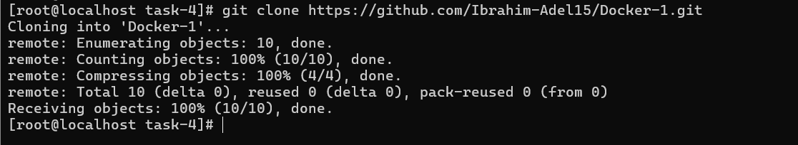
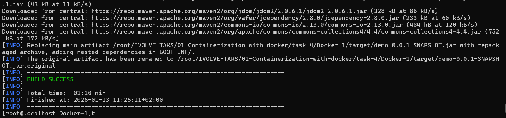
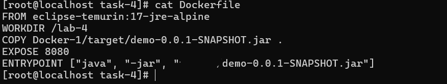
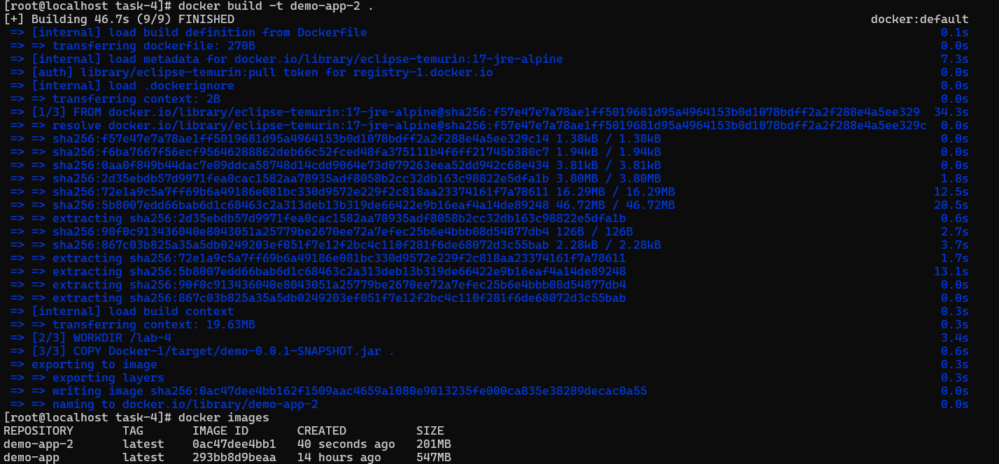
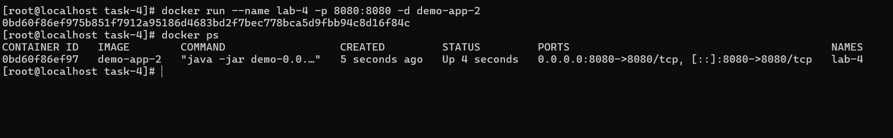
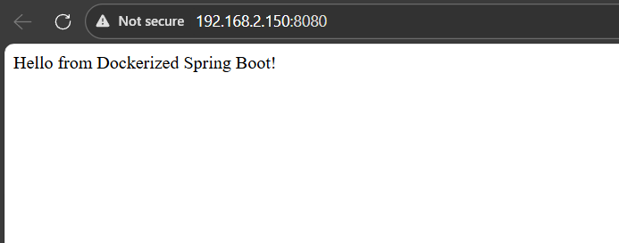
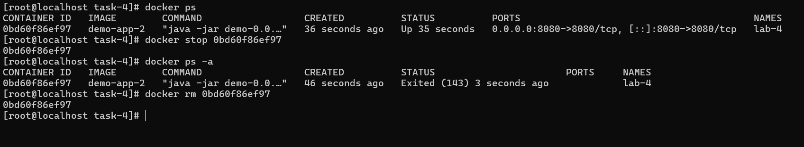

# IVOLVE Task 4 - Run Java Spring Boot App in a Container

This lab is part of the IVOLVE training program. It demonstrates how to take an existing Spring Boot application, build it with Maven, and run it inside a lightweight Docker container using a Java 17 base image.

## Lab Overview

In this lab you:

- **Clone** a Spring Boot application from GitHub  
- **Build** the application using Maven  
- **Write a Dockerfile** that:
  - Uses a **Java 17** base image  
  - Creates a **working directory**  
  - Copies the **JAR file** from `target/demo-0.0.1-SNAPSHOT.jar` into the container  
  - **Exposes port 8080**  
  - Runs the app using `java -jar demo-0.0.1-SNAPSHOT.jar`  
- **Build** a Docker image (e.g. `app2`) and note the **image size**  
- **Run** a container (e.g. `container2`) from that image  
- **Test** the application on port 8080  
- **Stop and delete** the container  

## Project Requirements

### Java & Spring Boot

- **Java 17** (required by Spring Boot 3.2.0)
- Spring Boot application defined in `Docker-1/pom.xml`:
  - Parent: `spring-boot-starter-parent` version **3.2.0**
  - `java.version` set to **17**
  - Uses `spring-boot-starter-web`

### Maven

- **Maven 3.6+** (locally or inside a build container)
- In this lab, Maven is used locally to build the JAR before building the final runtime image.

### Docker

- **Docker Engine** installed and running
- Able to build and run Linux containers

### Operating System

- **CentOS Linux** (or any Linux with Docker support), or Docker Desktop on Windows/Mac

## Setup Instructions

### Step 1: Clone the Application Code

Clone the Spring Boot application repository:

```bash
git clone https://github.com/Ibrahim-Adel15/Docker-1.git
cd Docker-1
```



> In this lab structure, the cloned project is available under `Docker-1/` inside `task-4`.

### Step 2: Build the Application with Maven

From inside the `Docker-1` directory, build the Spring Boot JAR:

```bash
cd Docker-1
mvn clean package
```

This will:

- Download all required dependencies
- Compile the source code
- Package the application into a JAR:  
  `target/demo-0.0.1-SNAPSHOT.jar`



## Dockerfile Explanation

The lab requires a Dockerfile that:

- Uses a **Java 17** base image  
- Creates a **work directory**  
- Copies the **JAR file** into the container  
- Exposes **port 8080**  
- Runs the app using the JAR in `target/demo-0.0.1-SNAPSHOT.jar`

The Dockerfile you created in this lab looks like this:

```dockerfile
FROM eclipse-temurin:17-jre-alpine
WORKDIR /lab-4
COPY Docker-1/target/demo-0.0.1-SNAPSHOT.jar .
EXPOSE 8080
ENTRYPOINT ["java", "-jar", "demo-0.0.1-SNAPSHOT.jar"]
```

**Explanation:**

- **`FROM eclipse-temurin:17-jre-alpine`**  
  Uses a lightweight Java 17 JRE base image based on Alpine Linux.

- **`WORKDIR /lab-4`**  
  Creates and switches to the `/lab-4` directory inside the container. All subsequent commands run from here.

- **`COPY Docker-1/target/demo-0.0.1-SNAPSHOT.jar .`**  
  Copies the built Spring Boot JAR from the host into the container’s work directory.

- **`EXPOSE 8080`**  
  Documents that the application listens on port 8080 inside the container.

- **`ENTRYPOINT ["java", "-jar", "demo-0.0.1-SNAPSHOT.jar"]`**  
  Defines the command that runs when the container starts, launching the Spring Boot application.



## Build the Docker Image (app2)

From the `task-4` directory (where the Dockerfile lives), build the image:

```bash
cd task-4
docker build -t app2:latest .
```

This command:

- Reads the `Dockerfile` in the current directory  
- Uses the `eclipse-temurin:17-jre-alpine` base image  
- Copies the JAR into the image  
- Creates a runtime image tagged as **`app2:latest`**



After the build, you can check the image size:

```bash
docker images app2
```

Note the **SIZE** column for `app2` to compare with other images or previous labs.

## Run the Container (container2)

Now run a container from the `app2` image:

```bash
docker run -d -p 8080:8080 --name container2 app2:latest
```

**Command breakdown:**

- `-d` – Run in detached (background) mode  
- `-p 8080:8080` – Map host port 8080 → container port 8080  
- `--name container2` – Name the container `container2`  
- `app2:latest` – Use the `app2` image built in the previous step



You can confirm the container is running:

```bash
docker ps
```

## Test the Application

With `container2` running, test that the Spring Boot app is responding on port 8080.

### Option 1: Using curl

```bash
curl http://localhost:8080
```

### Option 2: Using a Browser

Open your browser and navigate to:

```text
http://localhost:8080
```

**Expected Output:**

```text
Hello from Dockerized Spring Boot!
```



## Stop and Delete the Container

When you are done testing, stop and remove `container2`:

```bash
# Stop the container
docker stop container2

# Remove the container
docker rm container2
```



Optionally, remove the image if you no longer need it:

```bash
docker rmi app2:latest
```

## Project Structure

```text
task-4/
├── Dockerfile                          # Dockerfile for Lab 4
├── Docker-1/                           # Cloned Spring Boot project
│   ├── pom.xml                         # Maven project configuration
│   ├── src/
│   │   └── main/
│   │       └── java/
│   │           └── com/
│   │               └── example/
│   │                   └── demo/
│   │                       └── DemoApplication.java   # Spring Boot app
│   └── target/
│       └── demo-0.0.1-SNAPSHOT.jar     # Built Spring Boot JAR
└── screenshots/                        # Lab 4 screenshots
    ├── git-clone.png
    ├── mvn-build.png
    ├── show-dockerfile.png
    ├── docker-build.png
    ├── docker-run.png
    ├── show-app-working-port-8080.png
    └── stop-and-delete-container.png
```

## Useful Docker Commands (Quick Reference)

```bash
# List images
docker images

# List running containers
docker ps

# List all containers (including stopped)
docker ps -a

# Stop a container
docker stop <container-name-or-id>

# Remove a container
docker rm <container-name-or-id>

# Remove an image
docker rmi <image-name-or-id>
```

## Troubleshooting

### Port 8080 Already in Use

If port 8080 is already in use:

```bash
sudo netstat -tulpn | grep 8080
```

Run the container on a different host port:

```bash
docker run -d -p 8081:8080 --name container2 app2:latest
```

### Container Exits Immediately

- Check logs:

```bash
docker logs container2
```

- Make sure the JAR path in the Dockerfile matches the actual JAR location.

### Image Build Fails

- Ensure you have run `mvn clean package` and that `Docker-1/target/demo-0.0.1-SNAPSHOT.jar` exists.  
- Check your internet connection (Docker may need to pull the base image).  
- Verify the Dockerfile syntax.

## Notes

- This lab focuses on the **runtime image** using a JRE-only base image (`eclipse-temurin:17-jre-alpine`) to keep the image smaller.  
- The Spring Boot application is built **outside** the final image (using Maven) and then copied into the container.  
- The application runs on **port 8080** inside the container and is mapped to a host port using `-p`.

## License

See the LICENSE file in the parent directory for license information.

