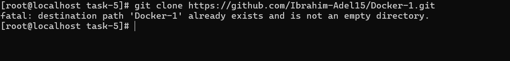
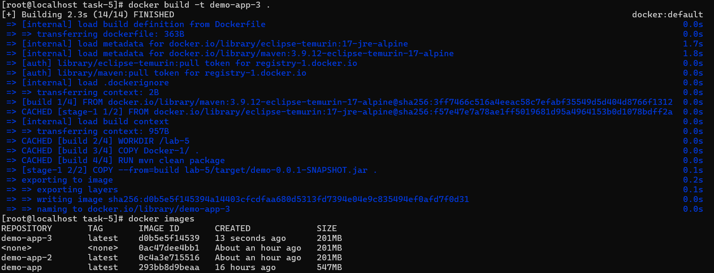
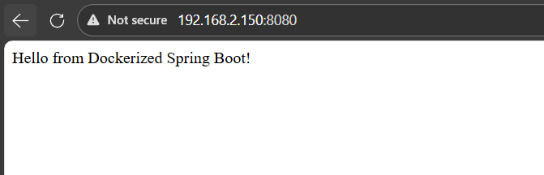
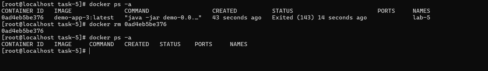

# IVOLVE Task 5 - Multi-Stage Build for a Spring Boot App

This lab is part of the IVOLVE training program. It demonstrates how to use Docker multi-stage builds to create optimized, smaller Docker images for a Spring Boot application by separating the build stage from the runtime stage.

## Lab Overview

In this lab you:

- **Clone** a Spring Boot application from GitHub
- **Write a Dockerfile with Multi-Stage Build** that:
  - **Stage 1 (Build)**: Uses a **Maven base image** to build the application
  - Copies the application code into the container
  - Builds the app using `mvn package`
  - **Stage 2 (Runtime)**: Uses a **Java base image** (JRE only, no Maven)
  - Copies the JAR file from the first stage
  - Exposes port 8080
  - Runs the app using `java -jar`
- **Build** a Docker image (e.g. `app3`) and note the **image size** (should be smaller than single-stage builds)
- **Run** a container (e.g. `container3`) from that image
- **Test** the application on port 8080
- **Stop and delete** the container

## Why Multi-Stage Builds?

Multi-stage builds offer several advantages:

- **Smaller Image Size**: Final image only contains the runtime (JRE), not build tools (Maven)
- **Better Security**: Fewer tools and dependencies in the production image
- **Faster Deployments**: Smaller images mean faster pulls and pushes
- **Cleaner Separation**: Build dependencies stay in the build stage, not in production

## Project Requirements

### Java & Spring Boot

- **Java 17** (required by Spring Boot 3.2.0)
- Spring Boot application defined in `Docker-1/pom.xml`:
  - Parent: `spring-boot-starter-parent` version **3.2.0**
  - `java.version` set to **17**
  - Uses `spring-boot-starter-web`

### Maven

- **Maven 3.9.12** - Used in the build stage (included in the Maven base image)
- Only needed during build, not in the final runtime image

### Docker

- **Docker Engine** installed and running
- Support for multi-stage builds (Docker 17.05+)

### Operating System

- **CentOS Linux** (or any Linux with Docker support), or Docker Desktop on Windows/Mac

## Setup Instructions

### Step 1: Clone the Application Code

Clone the Spring Boot application repository:

```bash
git clone https://github.com/Ibrahim-Adel15/Docker-1.git
cd Docker-1
```



> In this lab structure, the cloned project is available under `Docker-1/` inside `task-5`.

## Dockerfile Explanation

The lab requires a **multi-stage Dockerfile** that separates the build process from the runtime environment.

### Multi-Stage Dockerfile

The Dockerfile you created in this lab uses two stages:

```dockerfile
# Stage 1: Build Stage
FROM maven:3.9.12-eclipse-temurin-17-alpine AS build
WORKDIR /lab-5
COPY Docker-1/ .
RUN mvn clean package

# Stage 2: Runtime Stage
FROM eclipse-temurin:17-jre-alpine
COPY --from=build lab-5/target/demo-0.0.1-SNAPSHOT.jar .
EXPOSE 8080
ENTRYPOINT ["java","-jar","demo-0.0.1-SNAPSHOT.jar"]
```

### Stage-by-Stage Breakdown

#### Stage 1: Build Stage (`AS build`)

```dockerfile
FROM maven:3.9.12-eclipse-temurin-17-alpine AS build
WORKDIR /lab-5
COPY Docker-1/ .
RUN mvn clean package
```

**What it does:**
- Uses `maven:3.9.12-eclipse-temurin-17-alpine` as the base image
  - Includes Maven build tool
  - Includes Java 17 JDK (needed for compilation)
  - Alpine Linux for smaller size
- Sets working directory to `/lab-5`
- Copies the entire `Docker-1/` directory (source code, `pom.xml`, etc.)
- Runs `mvn clean package` to build the JAR file
- Creates `target/demo-0.0.1-SNAPSHOT.jar`

#### Stage 2: Runtime Stage

```dockerfile
FROM eclipse-temurin:17-jre-alpine
COPY --from=build lab-5/target/demo-0.0.1-SNAPSHOT.jar .
EXPOSE 8080
ENTRYPOINT ["java","-jar","demo-0.0.1-SNAPSHOT.jar"]
```

**What it does:**
- Uses `eclipse-temurin:17-jre-alpine` as the base image
  - Only includes Java 17 JRE (runtime), not JDK or Maven
  - Much smaller than the Maven image
  - Alpine Linux for minimal size
- `COPY --from=build`: Copies the JAR file from the **build stage**
  - Only copies the final artifact, not source code or build tools
- Exposes port 8080 for the web service
- Runs the application using `java -jar`


## How to Use the Project

### Build the Docker Image

Build the Docker image using the multi-stage Dockerfile:

```bash
docker build -t app3:latest .
```

**What happens during build:**
1. Docker executes **Stage 1 (build)**:
   - Downloads Maven base image (if not cached)
   - Copies source code
   - Runs Maven to build the JAR
2. Docker executes **Stage 2 (runtime)**:
   - Downloads Java JRE base image (if not cached)
   - Copies only the JAR file from Stage 1
   - Final image contains only JRE + JAR file

**Note the image size:**
```bash
docker images app3
```

The final image should be significantly smaller than a single-stage build that includes Maven!



### Run the Docker Container

Run a container from the `app3` image:

```bash
docker run -d -p 8080:8080 --name container3 app3:latest
```

**Command breakdown:**
- `-d`: Run in detached mode (background)
- `-p 8080:8080`: Map container port 8080 to host port 8080
- `--name container3`: Name the container `container3`
- `app3:latest`: Use the image we just built


### Test the Application

Once the container is running, test the application:

**Option 1: Using curl**

```bash
curl http://localhost:8080
```

**Option 2: Using a web browser**

Open your browser and navigate to:
```
http://localhost:8080
```

**Expected Output:**
```
Hello from Dockerized Spring Boot!
```



### Verify Container Status

Check that the container is running:

```bash
docker ps
```

You should see `container3` in the list.

### View Container Logs

To see the application logs:

```bash
docker logs container3
```

Or follow logs in real-time:

```bash
docker logs -f container3
```

### Stop and Delete the Container

Stop the running container:

```bash
docker stop container3
```

Delete the container:

```bash
docker rm container3
```

Or stop and delete in one command:

```bash
docker stop container3 && docker rm container3
```



### Remove the Docker Image (Optional)

To remove the Docker image:

```bash
docker rmi app3:latest
```

## Project Structure

```
task-5/
├── Dockerfile                  # Multi-stage Dockerfile
└── Docker-1/
    ├── pom.xml                 # Maven project configuration
    └── src/
        └── main/
            └── java/
                └── com/
                    └── example/
                        └── demo/
                            └── DemoApplication.java    # Spring Boot application
```

## Image Size Comparison

### Single-Stage Build (Task 4)
- Base image: `eclipse-temurin:17-jre-alpine` (~200-250 MB)
- Final image size: ~250-300 MB (JRE + JAR)

### Multi-Stage Build (Task 5)
- Build stage: `maven:3.9.12-eclipse-temurin-17-alpine` (~400-500 MB) - **discarded**
- Runtime stage: `eclipse-temurin:17-jre-alpine` (~200-250 MB)
- Final image size: ~250-300 MB (JRE + JAR only)

**Note:** While the final sizes may be similar in this case, multi-stage builds provide:
- **Cleaner separation** of build and runtime
- **No build tools** in production image (security benefit)
- **Scalability** - as projects grow, the benefits become more apparent
- **Best practice** for production deployments

## Multi-Stage Build Benefits

### 1. Smaller Production Images
- Only runtime dependencies are included
- Build tools (Maven, npm, etc.) are excluded from final image

### 2. Better Security
- Fewer attack surfaces (no build tools in production)
- Reduced risk of exposing build-time secrets

### 3. Faster Deployments
- Smaller images = faster network transfers
- Quicker container startup times

### 4. Cleaner Architecture
- Clear separation between build and runtime
- Easier to maintain and understand

## Troubleshooting

### Build Stage Fails

If the build stage fails:

```bash
# Check build logs
docker build -t app3:latest . 2>&1 | tee build.log

# Verify source code is present
ls -la Docker-1/

# Check Maven can access dependencies (internet connection)
```

### JAR File Not Found

If you get "JAR file not found" error:

- Verify the JAR path in `COPY --from=build`
- Check that `mvn package` completed successfully in Stage 1
- Ensure the JAR name matches: `demo-0.0.1-SNAPSHOT.jar`

### Container Exits Immediately

If the container exits right after starting:

```bash
# Check container logs
docker logs container3

# Verify JAR file exists in container
docker exec container3 ls -la

# Check Java version compatibility
docker exec container3 java -version
```

### Port Already in Use

If port 8080 is already in use:

```bash
# Find what's using the port
sudo netstat -tulpn | grep 8080

# Or use a different port
docker run -d -p 8081:8080 --name container3 app3:latest
```

### Image Size Not Smaller

If the image size doesn't seem smaller:

- Remember: Build stage image is discarded, only runtime stage is kept
- Compare with a single-stage build that includes Maven in the final image
- Use `docker images` to see actual sizes
- Consider using `docker system df` to see disk usage

## Advanced Multi-Stage Build Tips

### Using Named Stages

You can name stages for clarity:

```dockerfile
FROM maven:3.9.12-eclipse-temurin-17-alpine AS builder
# ... build steps ...

FROM eclipse-temurin:17-jre-alpine AS runtime
COPY --from=builder /lab-5/target/demo-0.0.1-SNAPSHOT.jar .
# ... runtime steps ...
```

### Multiple Build Stages

You can have more than two stages:

```dockerfile
# Stage 1: Dependencies
FROM maven:3.9.12-eclipse-temurin-17-alpine AS dependencies
COPY pom.xml .
RUN mvn dependency:go-offline

# Stage 2: Build
FROM maven:3.9.12-eclipse-temurin-17-alpine AS build
COPY --from=dependencies /root/.m2 /root/.m2
COPY . .
RUN mvn package

# Stage 3: Runtime
FROM eclipse-temurin:17-jre-alpine
COPY --from=build /lab-5/target/demo-0.0.1-SNAPSHOT.jar .
# ...
```

### Building Specific Stages

You can build only a specific stage:

```bash
# Build only the build stage
docker build --target build -t app3-build:latest .

# Build the final stage (default)
docker build -t app3:latest .
```

## Docker Commands Reference

### Build Commands

```bash
# Build image
docker build -t app3:latest .

# Build with no cache
docker build --no-cache -t app3:latest .

# Build specific stage
docker build --target build -t app3-build:latest .
```

### Container Management

```bash
# Run container
docker run -d -p 8080:8080 --name container3 app3:latest

# Stop container
docker stop container3

# Start stopped container
docker start container3

# Remove container
docker rm container3

# View logs
docker logs container3
```

### Image Management

```bash
# List images
docker images

# Inspect image
docker inspect app3:latest

# Check image size
docker images app3

# Remove image
docker rmi app3:latest
```

## Comparison: Single-Stage vs Multi-Stage

| Aspect | Single-Stage (Task 4) | Multi-Stage (Task 5) |
|--------|----------------------|----------------------|
| **Base Image** | JRE only | Build: Maven+JDK, Runtime: JRE |
| **Build Tools** | Not included | Included in build stage only |
| **Final Image** | JRE + JAR | JRE + JAR (same) |
| **Security** | Good | Better (no build tools) |
| **Best Practice** | Good for simple apps | Recommended for production |
| **Complexity** | Simpler | Slightly more complex |

## Notes

- The multi-stage build uses Alpine Linux images for smaller size
- Maven and JDK are only present in the build stage, not in the final image
- The `COPY --from=build` instruction copies artifacts between stages
- Alpine images use `musl libc` instead of `glibc` (may affect some applications)
- The final image contains only what's needed to run the application

## Next Steps

- Explore Docker Compose for multi-container applications
- Learn about Docker layer caching optimization
- Study Docker build arguments and secrets
- Investigate Docker buildkit for faster builds
- Consider using `.dockerignore` to exclude unnecessary files

## License

See the LICENSE file in the parent directory for license information.
