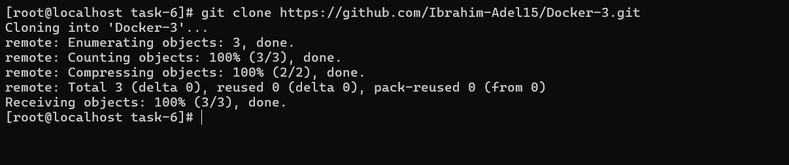
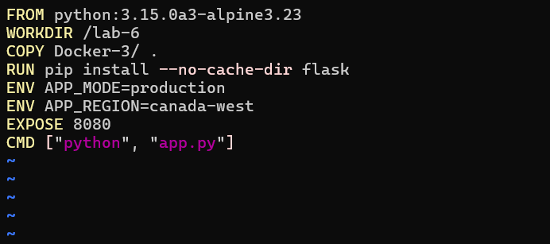
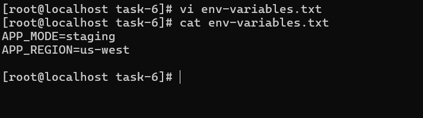
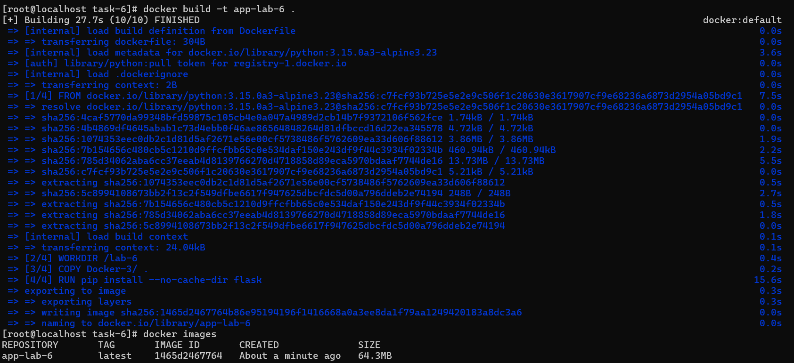
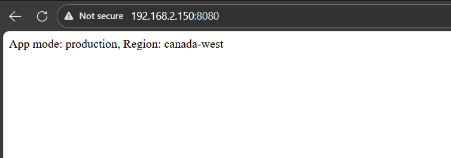
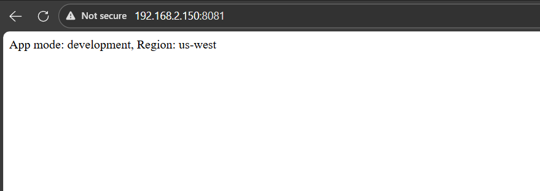
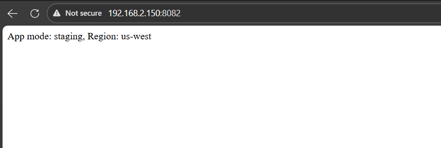
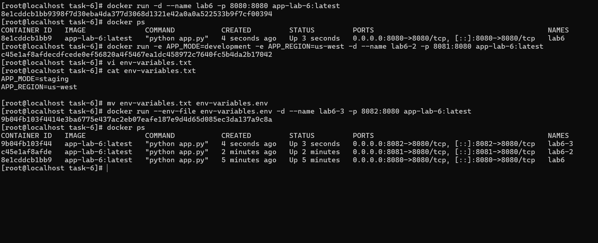

# IVOLVE Task 6 - Python Flask App with Environment Variables

This lab is part of the IVOLVE training program. It demonstrates how to containerize a Python Flask application using Docker, manage environment variables, and run multiple container instances with different configurations.

## Lab Overview

In this lab you:

- **Clone** a Python Flask application from GitHub
- **Write a Dockerfile** that:
  - Uses a **Python 3.15** base image (Alpine Linux)
  - Creates a **working directory**
  - Copies the application code into the container
  - Installs Flask using `pip`
  - Sets **environment variables** (APP_MODE, APP_REGION)
  - Exposes **port 8080**
  - Runs the Flask app using `python app.py`
- **Build** a Docker image (e.g. `app6`)
- **Run multiple containers** from the same image with:
  - Different **port mappings** (8080, 8081, 8082)
  - Different **environment variables** (using env file or command line)
- **Test** each container instance
- **Stop and delete** the containers

## Why Environment Variables?

Environment variables are essential for:

- **Configuration Management**: Different settings for development, staging, and production
- **Multi-Environment Deployments**: Same image, different configurations
- **Security**: Sensitive data (API keys, passwords) without hardcoding
- **Flexibility**: Change behavior without rebuilding the image
- **Scalability**: Run multiple instances with different configurations

## Project Requirements

### Python

- **Python 3.15** (or compatible version)
- The Docker image uses `python:3.15.0a3-alpine3.23` which includes Python 3.15

### Flask

- **Flask** web framework
- Installed via `pip install flask` during image build

### Docker

- **Docker Engine** installed and running
- Support for environment variable management

### Operating System

- **CentOS Linux** (or any Linux with Docker support), or Docker Desktop on Windows/Mac

## Setup Instructions

### Step 1: Clone the Application Code

Clone the Python Flask application repository:

```bash
git clone https://github.com/Ibrahim-Adel15/Docker-1.git
cd Docker-1
```



> In this lab structure, the cloned project is available under `Docker-3/` inside `task-6`.

## Dockerfile Explanation

The lab requires a Dockerfile that sets up a Python Flask application with environment variables.

### Dockerfile

The Dockerfile you created in this lab looks like this:

```dockerfile
FROM python:3.15.0a3-alpine3.23
WORKDIR /lab-6
COPY Docker-3/ .
RUN pip install --no-cache-dir flask
ENV APP_MODE=production
ENV APP_REGION=canada-west
EXPOSE 8080
CMD ["python", "app.py"]
```

**Explanation:**

- **`FROM python:3.15.0a3-alpine3.23`**  
  Uses Python 3.15 base image based on Alpine Linux (lightweight).

- **`WORKDIR /lab-6`**  
  Creates and switches to the `/lab-6` directory inside the container.

- **`COPY Docker-3/ .`**  
  Copies the Flask application code from `Docker-3/` directory into the container.

- **`RUN pip install --no-cache-dir flask`**  
  Installs Flask framework. The `--no-cache-dir` flag reduces image size by not storing pip cache.

- **`ENV APP_MODE=production`**  
  Sets the `APP_MODE` environment variable to `production` (default value in image).

- **`ENV APP_REGION=canada-west`**  
  Sets the `APP_REGION` environment variable to `canada-west` (default value in image).

- **`EXPOSE 8080`**  
  Documents that the application listens on port 8080 inside the container.

- **`CMD ["python", "app.py"]`**  
  Defines the default command to run the Flask application when the container starts.



## Environment Variables File

The lab includes an `env-variables.env` file for managing environment variables:

```bash
APP_MODE=staging
APP_REGION=us-west
```

This file allows you to override the default environment variables set in the Dockerfile when running containers.



## How to Use the Project

### Build the Docker Image

Build the Docker image from the Dockerfile:

```bash
cd task-6
docker build -t app6:latest .
```

This command:

- Reads the `Dockerfile` in the current directory
- Uses the `python:3.15.0a3-alpine3.23` base image
- Copies the Flask application code
- Installs Flask
- Sets default environment variables
- Creates an image tagged as **`app6:latest`**



### Run Multiple Containers

You can run multiple container instances from the same image, each with different configurations.

#### Container 1: Default Environment Variables (Port 8080)

Run the first container with default environment variables from the Dockerfile:

```bash
docker run -d -p 8080:8080 --name container6-1 app6:latest
```

This uses:
- `APP_MODE=production` (from Dockerfile)
- `APP_REGION=canada-west` (from Dockerfile)
- Port mapping: `8080:8080`



#### Container 2: Using Environment File (Port 8081)

Run the second container using the environment file:

```bash
docker run -d -p 8081:8080 --env-file env-variables.env --name container6-2 app6:latest
```

This uses:
- `APP_MODE=staging` (from env file)
- `APP_REGION=us-west` (from env file)
- Port mapping: `8081:8080`



#### Container 3: Using Command Line Variables (Port 8082)

Run the third container with environment variables passed via command line:

```bash
docker run -d -p 8082:8080 \
  -e APP_MODE=development \
  -e APP_REGION=us-east \
  --name container6-3 app6:latest
```

This uses:
- `APP_MODE=development` (from command line)
- `APP_REGION=us-east` (from command line)
- Port mapping: `8082:8080`



### Verify All Containers Are Running

Check that all three containers are running:

```bash
docker ps
```

You should see all three containers (`container6-1`, `container6-2`, `container6-3`) running simultaneously.



### Test Each Container

Test each container instance to verify they're running with different configurations:

**Test Container 1 (Port 8080):**
```bash
curl http://localhost:8080
```

**Test Container 2 (Port 8081):**
```bash
curl http://localhost:8081
```

**Test Container 3 (Port 8082):**
```bash
curl http://localhost:8082
```

Or open in a web browser:
- `http://localhost:8080`
- `http://localhost:8081`
- `http://localhost:8082`

Each container should respond, and you can verify they're using different environment variables by checking the application output or logs.

### View Container Logs

To see the application logs for each container:

```bash
# Container 1 logs
docker logs container6-1

# Container 2 logs
docker logs container6-2

# Container 3 logs
docker logs container6-3
```

Or follow logs in real-time:

```bash
docker logs -f container6-1
```

### Inspect Environment Variables

To verify the environment variables in a running container:

```bash
# Check environment variables in container6-1
docker exec container6-1 env | grep APP

# Check environment variables in container6-2
docker exec container6-2 env | grep APP

# Check environment variables in container6-3
docker exec container6-3 env | grep APP
```

### Stop and Delete Containers

Stop all containers:

```bash
docker stop container6-1 container6-2 container6-3
```

Delete all containers:

```bash
docker rm container6-1 container6-2 container6-3
```

Or stop and delete in one command:

```bash
docker stop container6-1 container6-2 container6-3 && \
docker rm container6-1 container6-2 container6-3
```

### Remove the Docker Image (Optional)

To remove the Docker image:

```bash
docker rmi app6:latest
```

## Environment Variable Methods

### Method 1: Dockerfile ENV (Default Values)

Set default environment variables in the Dockerfile:

```dockerfile
ENV APP_MODE=production
ENV APP_REGION=canada-west
```

**Pros:**
- Default values are baked into the image
- No need to specify if defaults are acceptable

**Cons:**
- Less flexible (requires rebuild to change)
- Not suitable for sensitive data

### Method 2: Environment File (--env-file)

Use an environment file:

```bash
docker run -d --env-file env-variables.env app6:latest
```

**Pros:**
- Easy to manage multiple variables
- Can version control the file
- Good for different environments (dev, staging, prod)

**Cons:**
- File must exist and be accessible
- All variables in file are loaded

### Method 3: Command Line (-e)

Pass variables via command line:

```bash
docker run -d -e APP_MODE=development -e APP_REGION=us-east app6:latest
```

**Pros:**
- Most flexible
- Easy to override specific variables
- Good for one-off runs

**Cons:**
- Can be verbose with many variables
- Not ideal for sensitive data (visible in process list)

### Method 4: Combination

You can combine methods (command line overrides env file, which overrides Dockerfile):

```bash
docker run -d --env-file env-variables.env -e APP_MODE=override app6:latest
```

**Priority order:**
1. Command line (`-e`) - Highest priority
2. Environment file (`--env-file`)
3. Dockerfile (`ENV`) - Lowest priority

## Project Structure

```
task-6/
├── Dockerfile                  # Docker configuration file
├── env-variables.env            # Environment variables file
└── Docker-3/
    └── app.py                   # Flask application
```

## Troubleshooting

### Container Exits Immediately

If the container exits right after starting:

```bash
# Check container logs
docker logs container6-1

# Verify Flask is installed
docker exec container6-1 pip list | grep flask

# Check if app.py exists
docker exec container6-1 ls -la /lab-6/
```

### Port Already in Use

If a port is already in use:

```bash
# Find what's using the port
sudo netstat -tulpn | grep 8080

# Or use different ports
docker run -d -p 8083:8080 --name container6-4 app6:latest
```

### Environment Variables Not Working

If environment variables aren't being read:

```bash
# Verify variables are set
docker exec container6-1 env | grep APP

# Check if application reads from environment
docker exec container6-1 printenv APP_MODE
```

### Flask Application Not Starting

If Flask doesn't start:

```bash
# Check Python version
docker exec container6-1 python --version

# Verify app.py syntax
docker exec container6-1 python -m py_compile app.py

# Run app.py manually to see errors
docker exec -it container6-1 python app.py
```

### Multiple Containers Conflict

If containers conflict:

```bash
# List all containers
docker ps -a

# Remove conflicting containers
docker rm -f container6-1 container6-2 container6-3

# Start fresh
docker run -d -p 8080:8080 --name container6-1 app6:latest
```

## Docker Commands Reference

### Build Commands

```bash
# Build image
docker build -t app6:latest .

# Build with no cache
docker build --no-cache -t app6:latest .
```

### Run Commands with Environment Variables

```bash
# Using default (Dockerfile ENV)
docker run -d -p 8080:8080 --name container6-1 app6:latest

# Using environment file
docker run -d -p 8081:8080 --env-file env-variables.env --name container6-2 app6:latest

# Using command line
docker run -d -p 8082:8080 -e APP_MODE=dev -e APP_REGION=us-east --name container6-3 app6:latest

# Combining methods
docker run -d -p 8083:8080 --env-file env-variables.env -e APP_MODE=override --name container6-4 app6:latest
```

### Container Management

```bash
# List running containers
docker ps

# List all containers
docker ps -a

# Stop container
docker stop container6-1

# Start stopped container
docker start container6-1

# Remove container
docker rm container6-1

# View logs
docker logs container6-1

# Follow logs
docker logs -f container6-1

# Execute command in container
docker exec container6-1 env
```

### Environment Variable Inspection

```bash
# View all environment variables
docker exec container6-1 env

# Filter specific variables
docker exec container6-1 env | grep APP

# Check specific variable
docker exec container6-1 printenv APP_MODE
```

## Best Practices

### 1. Use Environment Files for Different Environments

Create separate env files:
- `env.dev` - Development environment
- `env.staging` - Staging environment
- `env.prod` - Production environment

### 2. Don't Hardcode Sensitive Data

Never put secrets in Dockerfile or commit them to version control:

```dockerfile
# ❌ Bad
ENV DB_PASSWORD=secret123

# ✅ Good
# Use --env-file or secrets management
```

### 3. Use .dockerignore

Create a `.dockerignore` file to exclude unnecessary files:

```
__pycache__
*.pyc
*.pyo
.env
.git
```

### 4. Document Environment Variables

Document all environment variables in your README or application documentation.

### 5. Use Health Checks

Add health checks to your Dockerfile:

```dockerfile
HEALTHCHECK --interval=30s --timeout=3s \
  CMD curl -f http://localhost:8080/ || exit 1
```

## Use Cases

### Development Environment

```bash
docker run -d -p 8080:8080 \
  -e APP_MODE=development \
  -e APP_REGION=local \
  --name dev-container app6:latest
```

### Staging Environment

```bash
docker run -d -p 8081:8080 \
  --env-file env-variables.env \
  --name staging-container app6:latest
```

### Production Environment

```bash
docker run -d -p 8080:8080 \
  -e APP_MODE=production \
  -e APP_REGION=canada-west \
  --name prod-container app6:latest
```

### Load Testing (Multiple Instances)

```bash
# Run 5 instances for load testing
for i in {1..5}; do
  docker run -d -p $((8080+$i)):8080 \
    -e APP_MODE=production \
    -e APP_REGION=us-west \
    --name load-test-$i app6:latest
done
```

## Notes

- The Flask application reads environment variables using `os.environ.get()`
- Environment variables set via command line override those in env files
- Environment variables in env files override those in Dockerfile
- All three containers can run simultaneously on different ports
- Alpine Linux images are smaller but use `musl libc` (may affect some Python packages)
- The `--no-cache-dir` flag in pip install reduces image size

## Next Steps

- Explore Docker Compose for managing multiple containers
- Learn about Docker secrets for sensitive data
- Study Docker networking for container communication
- Investigate Docker volumes for persistent data
- Consider using Docker Swarm or Kubernetes for orchestration

## License

See the LICENSE file in the parent directory for license information.
