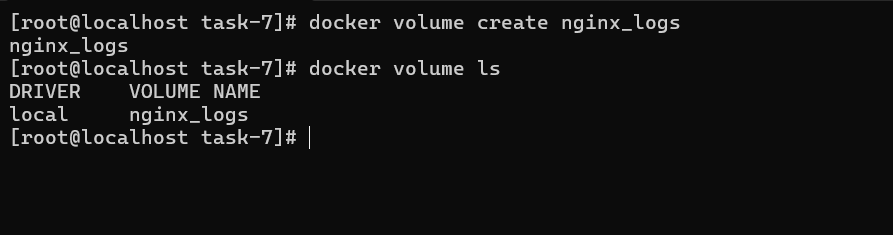
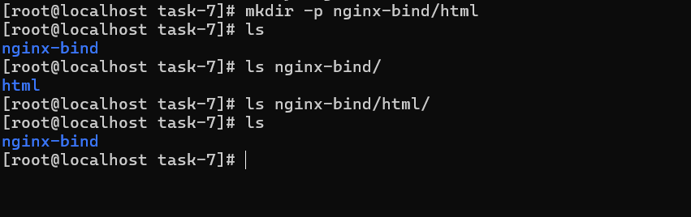
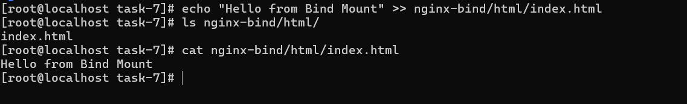
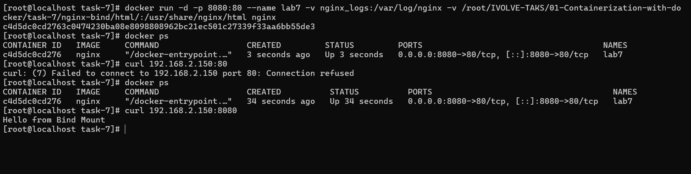
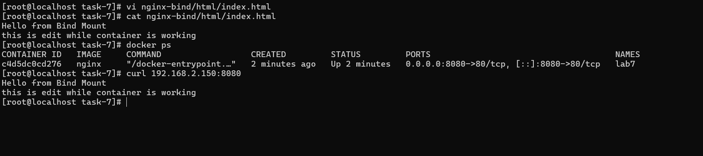
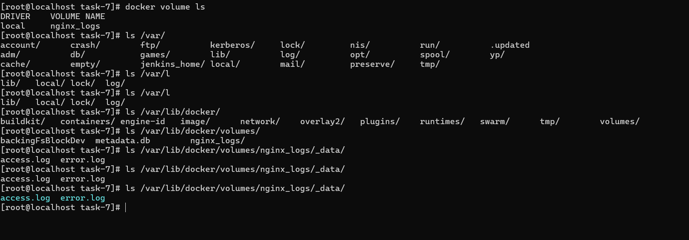
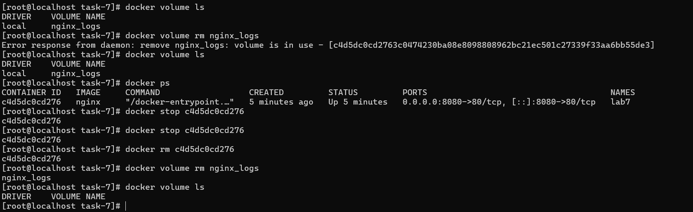

# IVOLVE Task 7 - Docker Volumes and Bind Mounts with Nginx

This lab is part of the IVOLVE training program. It demonstrates how to use Docker volumes and bind mounts to persist data and enable live updates for containerized applications, specifically using Nginx as a web server.

## Lab Overview

In this lab you:

- **Create** `nginx_logs` volume to persist Nginx logs and verify it in the default volumes path
- **Create** a directory `nginx-bind/html` to serve a custom HTML file from your host machine
- **Create** `index.html` file with "Hello from Bind Mount" in `nginx-bind/html` directory
- **Run** Nginx container with:
  - **Volume** for `/var/log/nginx` (using `nginx_logs` named volume)
  - **Bind Mount** for `/usr/share/nginx/html`
- **Verify** Nginx page by running curl command from your local machine
- **Change** the `index.html` file in your local machine then verify Nginx page again
- **Verify** logs are stored in the `nginx_logs` volume
- **Delete** the volume

## Why Docker Volumes?

Docker volumes are essential for:

- **Data Persistence**: Data survives container removal
- **Live Updates**: Changes on host reflect immediately in container
- **Performance**: Better I/O performance than container filesystem
- **Backup & Migration**: Easy to backup and move data
- **Sharing Data**: Share data between containers
- **Development**: Edit code on host, see changes in container instantly

## Types of Docker Volumes

### 1. Bind Mounts
- Mount a host directory directly into container
- Changes on host are immediately visible in container
- Perfect for development
- Path must exist on host

### 2. Named Volumes
- Managed by Docker
- Stored in Docker's storage directory
- Better for production
- Portable across systems

### 3. Anonymous Volumes
- Created automatically by Docker
- Removed when container is deleted
- Temporary storage

## Project Requirements

### Nginx

- **Nginx** web server
- Official Nginx Docker image will be used

### Docker

- **Docker Engine** installed and running
- Support for volume management

### Operating System

- **CentOS Linux** (or any Linux with Docker support), or Docker Desktop on Windows/Mac

## Setup Instructions

### Step 1: Create nginx_logs Volume

Create a named volume to persist Nginx logs:

```bash
docker volume create nginx_logs
```

**Verify the volume was created:**

```bash
docker volume ls
```

You should see `nginx_logs` in the list.

**Verify it in the default volumes path:**

On Linux, Docker volumes are stored in `/var/lib/docker/volumes/`. Verify the volume exists:

```bash
# Check volume location
docker volume inspect nginx_logs

# On Linux, verify the directory exists
sudo ls -la /var/lib/docker/volumes/nginx_logs/
```

The output will show the volume's mount point, typically:
- Linux: `/var/lib/docker/volumes/nginx_logs/_data`
- Windows/Mac (Docker Desktop): Managed by Docker Desktop



### Step 2: Create Directory Structure

Create the directory structure for Nginx HTML files:

```bash
cd task-7
mkdir -p nginx-bind/html
```

This creates:
- `nginx-bind/` - Main directory for bind mount
- `nginx-bind/html/` - Directory for HTML files (will be mounted to Nginx)



### Step 3: Create HTML File

Create an `index.html` file in the `nginx-bind/html/` directory with the exact content:

```bash
cd nginx-bind/html
cat > index.html << EOF
Hello from Bind Mount
EOF
```

Or using a text editor:

```bash
nano index.html
# or
vim index.html
```

Add the following content (exactly as specified):

```html
Hello from Bind Mount
```



## Understanding Volumes and Bind Mounts

### Named Volume (nginx_logs)

A named volume is Docker-managed storage that persists data independently of containers. In this lab, we use `nginx_logs` to store Nginx log files.

**Benefits:**
- Data persists even after container removal
- Managed by Docker (portable)
- Better for production use
- Logs survive container restarts

### Bind Mount (HTML Files)

A bind mount maps a directory or file from the host machine directly into a container. Changes made on the host are immediately visible in the container.

**Benefits:**
- Live updates (edit on host, see changes instantly)
- Perfect for development
- Direct access to host filesystem

### Nginx Default Locations

- **HTML files**: `/usr/share/nginx/html` (we'll bind mount this)
- **Log files**: `/var/log/nginx` (we'll use named volume for this)

## How to Use the Project

### Step 4: Run Nginx Container with Volume and Bind Mount

Run an Nginx container with **both** a named volume for logs and a bind mount for HTML:

```bash
cd task-7
docker run -d \
  --name nginx-bind \
  -p 8080:80 \
  -v nginx_logs:/var/log/nginx \
  -v $(pwd)/nginx-bind/html:/usr/share/nginx/html \
  nginx:alpine
```

**Command breakdown:**

- `-d`: Run in detached mode (background)
- `--name nginx-bind`: Name the container `nginx-bind`
- `-p 8080:80`: Map container port 80 to host port 8080
- `-v nginx_logs:/var/log/nginx`: **Named volume** for Nginx logs
  - `nginx_logs`: Named volume we created earlier
  - `/var/log/nginx`: Container directory where Nginx stores logs
- `-v $(pwd)/nginx-bind/html:/usr/share/nginx/html`: **Bind mount** for HTML files
  - `$(pwd)/nginx-bind/html`: Host directory (current directory + path)
  - `/usr/share/nginx/html`: Container directory (Nginx default HTML location)
- `nginx:alpine`: Use lightweight Nginx Alpine image

**Alternative syntax (using --mount):**

```bash
docker run -d \
  --name nginx-bind \
  -p 8080:80 \
  --mount type=volume,source=nginx_logs,target=/var/log/nginx \
  --mount type=bind,source=$(pwd)/nginx-bind/html,target=/usr/share/nginx/html \
  nginx:alpine
```



### Step 5: Verify Nginx Page

Verify the Nginx page by running curl command from your local machine:

**Using curl:**

```bash
curl http://localhost:8080
```

**Expected output:**
```
Hello from Bind Mount
```

**Using a web browser:**

Open your browser and navigate to:
```
http://localhost:8080
```

You should see:
```
Hello from Bind Mount
```

### Step 6: Change HTML File and Verify Again

The power of bind mounts: **edit the file on the host, changes appear immediately in the container!**

1. **Edit the HTML file on your local machine:**

```bash
cd task-7/nginx-bind/html
nano index.html
# or
vim index.html
```

Change the content to (for example):

```html
Hello from Bind Mount
Updated content - changes are live!
```

2. **Verify Nginx page again** by running curl:

```bash
curl http://localhost:8080
```

The changes should appear immediately **without restarting the container!**



### Step 7: Verify Logs are Stored in nginx_logs Volume

Verify that Nginx logs are being stored in the `nginx_logs` volume:

**Method 1: Access logs from the volume directly**

On Linux, access the volume's data directory:

```bash
# Check volume mount point
docker volume inspect nginx_logs

# Access logs (replace with actual mount point from inspect)
sudo ls -la /var/lib/docker/volumes/nginx_logs/_data/

# View access log
sudo cat /var/lib/docker/volumes/nginx_logs/_data/access.log

# View error log
sudo cat /var/lib/docker/volumes/nginx_logs/_data/error.log
```

**Method 2: Access logs from within the container**

```bash
# View access log
docker exec nginx-bind cat /var/log/nginx/access.log

# View error log
docker exec nginx-bind cat /var/log/nginx/error.log

# List log files
docker exec nginx-bind ls -la /var/log/nginx/
```

**Method 3: Generate some traffic and check logs**

```bash
# Generate some requests
curl http://localhost:8080
curl http://localhost:8080

# Check access log (should show the requests)
docker exec nginx-bind cat /var/log/nginx/access.log
```

**Verify logs persist after container restart:**

```bash
# Stop container
docker stop nginx-bind

# Start container again
docker start nginx-bind

# Check logs (should still be there)
docker exec nginx-bind cat /var/log/nginx/access.log
```

The logs should persist because they're stored in the `nginx_logs` volume, not in the container's filesystem.



### Step 8: Delete the Volume

After completing the lab, clean up by deleting the volume:

**Important:** The container must be stopped and removed before deleting the volume.

```bash
# Stop the container
docker stop nginx-bind

# Remove the container
docker rm nginx-bind

# Delete the nginx_logs volume
docker volume rm nginx_logs
```

**Verify the volume was deleted:**

```bash
docker volume ls
```

The `nginx_logs` volume should no longer appear in the list.



## Docker Volume Management

### List Volumes

List all Docker volumes:

```bash
docker volume ls
```

### Inspect a Volume

Get detailed information about a volume:

```bash
docker volume inspect nginx_logs
```

This shows:
- Volume name
- Mount point (where data is stored)
- Creation date
- Driver information

### Remove All Unused Volumes

Clean up unused volumes:

```bash
docker volume prune
```

**Warning:** This removes all volumes not used by at least one container.

## Project Structure

```
task-7/
├── nginx-bind/
│   └── html/
│       └── index.html          # HTML file (bind mounted to container)
└── screenshots/                # Lab screenshots
```

## Bind Mount vs Named Volume

### When to Use Bind Mounts

- ✅ **Development**: Edit code on host, see changes instantly
- ✅ **Configuration files**: Mount config files from host
- ✅ **Logs**: Access logs from host filesystem
- ✅ **Host-specific paths**: When you need specific host paths

### When to Use Named Volumes

- ✅ **Production**: Docker-managed, portable
- ✅ **Database data**: Persistent storage for databases
- ✅ **Backup**: Easier to backup Docker-managed volumes
- ✅ **Cross-platform**: Works consistently across systems

## Troubleshooting

### Container Won't Start

If the container exits immediately:

```bash
# Check logs
docker logs nginx-bind

# Verify directory exists
ls -la nginx-bind/html/

# Check permissions
ls -ld nginx-bind/html/
```

### Permission Denied

If you get permission errors:

```bash
# Check directory permissions
ls -ld nginx-bind/html/

# Fix permissions if needed
chmod 755 nginx-bind/html/
chmod 644 nginx-bind/html/index.html
```

### Changes Not Reflecting

If changes don't appear:

```bash
# Verify bind mount is correct
docker inspect nginx-bind | grep -A 10 Mounts

# Check if file exists in container
docker exec nginx-bind ls -la /usr/share/nginx/html/

# Verify Nginx is serving the correct file
docker exec nginx-bind cat /usr/share/nginx/html/index.html
```

### Port Already in Use

If port 8080 is already in use:

```bash
# Find what's using the port
sudo netstat -tulpn | grep 8080

# Use a different port
docker run -d --name nginx-bind -p 8081:80 \
  -v $(pwd)/nginx-bind/html:/usr/share/nginx/html:ro \
  nginx:alpine
```

### Volume Not Found

If you get "volume not found" error:

```bash
# List volumes
docker volume ls

# Create volume if it doesn't exist
docker volume create volume-name
```

## Docker Commands Reference

### Volume Commands

```bash
# Create volume
docker volume create volume-name

# List volumes
docker volume ls

# Inspect volume
docker volume inspect volume-name

# Remove volume
docker volume rm volume-name

# Remove unused volumes
docker volume prune
```

### Bind Mount Commands

```bash
# Using -v flag
docker run -v /host/path:/container/path image:tag

# Using --mount flag (recommended)
docker run --mount type=bind,source=/host/path,target=/container/path image:tag

# Read-only bind mount
docker run -v /host/path:/container/path:ro image:tag
```

### Container Commands

```bash
# Run with bind mount
docker run -d --name nginx-bind -p 8080:80 \
  -v $(pwd)/nginx-bind/html:/usr/share/nginx/html:ro \
  nginx:alpine

# Run with named volume
docker run -d --name nginx-volume -p 8081:80 \
  -v nginx-data:/usr/share/nginx/html \
  nginx:alpine

# Inspect container mounts
docker inspect nginx-bind | grep -A 10 Mounts

# View logs
docker logs nginx-bind

# Stop container
docker stop nginx-bind

# Remove container
docker rm nginx-bind
```

## Advanced Volume Operations

### Mount Multiple Directories

Mount multiple directories:

```bash
docker run -d --name nginx-multi \
  -p 8080:80 \
  -v $(pwd)/nginx-bind/html:/usr/share/nginx/html:ro \
  -v $(pwd)/nginx-bind/config:/etc/nginx/conf.d:ro \
  nginx:alpine
```

### Mount Single File

Mount a single file instead of directory:

```bash
docker run -d --name nginx-config \
  -p 8080:80 \
  -v $(pwd)/nginx.conf:/etc/nginx/nginx.conf:ro \
  nginx:alpine
```

### Volume Backup

Backup a named volume:

```bash
# Create backup
docker run --rm \
  -v nginx-data:/data \
  -v $(pwd):/backup \
  alpine tar czf /backup/nginx-backup.tar.gz -C /data .

# Restore backup
docker run --rm \
  -v nginx-data:/data \
  -v $(pwd):/backup \
  alpine tar xzf /backup/nginx-backup.tar.gz -C /data
```

## Best Practices

### 1. Use Read-Only Mounts When Possible

```bash
-v /host/path:/container/path:ro
```

Prevents containers from modifying host files accidentally.

### 2. Use Named Volumes for Production

Named volumes are managed by Docker and more portable:

```bash
-v volume-name:/container/path
```

### 3. Use Bind Mounts for Development

Bind mounts are perfect for development workflows:

```bash
-v $(pwd)/src:/app/src
```

### 4. Document Volume Usage

Document which volumes are used and their purposes in your README or documentation.

### 5. Clean Up Unused Volumes

Regularly clean up unused volumes:

```bash
docker volume prune
```

## Use Cases

### Development Workflow

```bash
# Mount source code for live editing
docker run -d --name dev-app \
  -v $(pwd)/src:/app/src \
  -p 3000:3000 \
  node:alpine npm start
```

### Configuration Management

```bash
# Mount configuration files
docker run -d --name nginx-config \
  -v $(pwd)/nginx.conf:/etc/nginx/nginx.conf:ro \
  -p 80:80 \
  nginx:alpine
```

### Log Collection

```bash
# Mount logs directory
docker run -d --name app-logs \
  -v $(pwd)/logs:/var/log/app \
  -p 8080:8080 \
  myapp:latest
```

### Database Persistence

```bash
# Use named volume for database
docker run -d --name postgres-db \
  -v postgres-data:/var/lib/postgresql/data \
  -e POSTGRES_PASSWORD=secret \
  postgres:alpine
```

## Notes

- Bind mounts provide immediate synchronization between host and container
- Changes to files in bind mounts are visible instantly (no container restart needed)
- Read-only mounts (`:ro`) prevent containers from modifying host files
- Named volumes are stored in Docker's managed directory (usually `/var/lib/docker/volumes/`)
- Absolute paths work better than relative paths for bind mounts
- On Windows/Mac, Docker Desktop handles path translation automatically
- Volume data persists even after container removal (unless using anonymous volumes)

## Next Steps

- Explore Docker Compose volumes
- Learn about volume drivers and plugins
- Study Docker volume backup strategies
- Investigate Docker volume networking
- Consider using Docker volumes with Kubernetes

## License

See the LICENSE file in the parent directory for license information.
