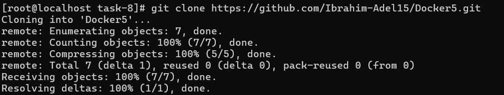
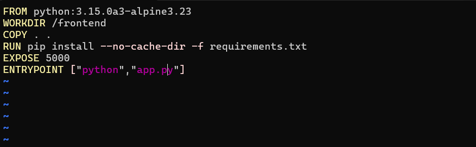
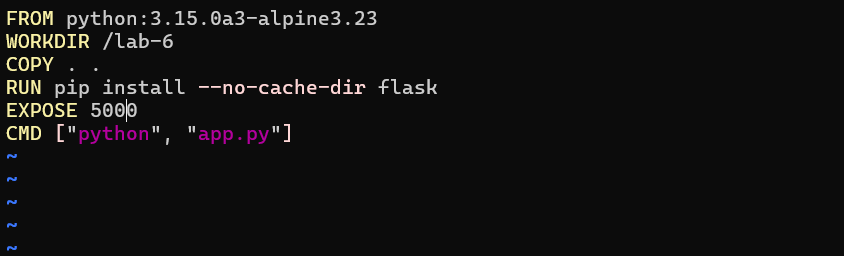
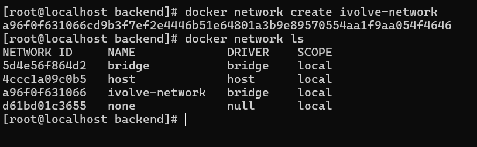
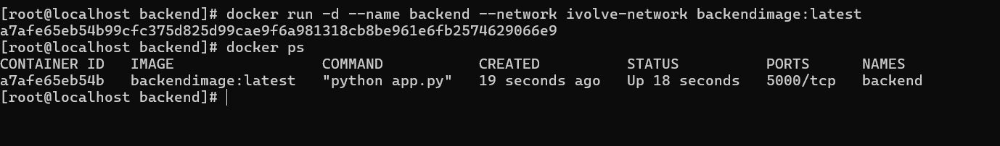
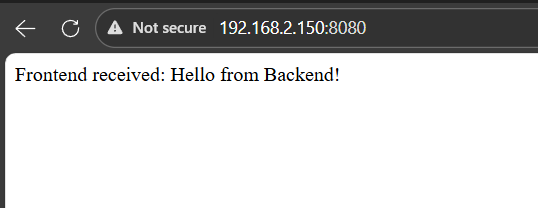
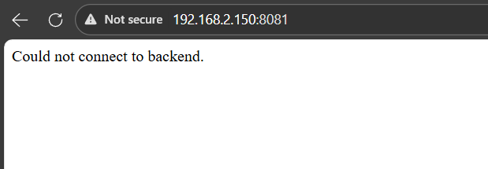
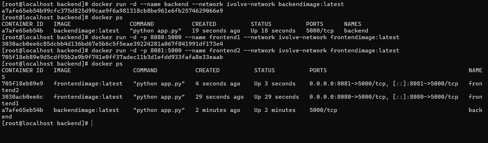
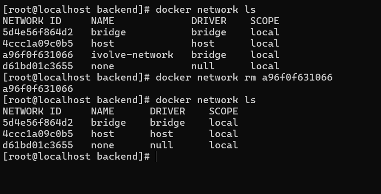

# IVOLVE Task 8 - Custom Docker Network for Microservices

This lab is part of the IVOLVE training program. It demonstrates how to create custom Docker networks to enable communication between microservices containers, and how network isolation affects container connectivity.

## Lab Overview

In this lab you:

- **Clone** the frontend and backend code from GitHub
- **Write Dockerfile for frontend** and create image:
  - Use Python image
  - Install packages from `requirements.txt` file
  - Expose port 5000
  - Run Python command on `app.py`
- **Write Dockerfile for backend** and create image:
  - Use Python image
  - Install Flask
  - Expose port 5000
  - Run Python command on `app.py`
- **Create** a new network called `ivolve-network`
- **Run** backend container using `ivolve-network`
- **Run** frontend container (`frontend1`) using `ivolve-network`
- **Run** another frontend container (`frontend2`) using default network
- **Verify** the communication between containers
- **Delete** `ivolve-network`

## Why Docker Networks?

Docker networks are essential for:

- **Service Discovery**: Containers can communicate using container names
- **Network Isolation**: Separate networks isolate containers from each other
- **Microservices Architecture**: Connect related services on the same network
- **Security**: Control which containers can communicate
- **Scalability**: Easy to add/remove services from networks
- **Load Balancing**: Multiple containers can share the same network

## Types of Docker Networks

### 1. Bridge Network (Default)
- Default network for containers
- Containers can communicate using IP addresses
- Container names resolve to IPs only on the same network
- Isolated from other networks

### 2. Custom Bridge Network
- User-defined bridge network
- Better isolation and control
- Automatic DNS resolution (container names work as hostnames)
- Recommended for multi-container applications

### 3. Host Network
- Container shares host's network stack
- No network isolation
- Direct access to host ports

### 4. None Network
- Container has no network interfaces
- Complete network isolation

## Project Requirements

### Python

- **Python 3.15** (or compatible version)
- Both Dockerfiles use `python:3.15.0a3-alpine3.23`

### Flask

- **Flask** web framework (for both frontend and backend)
- **Requests** library (for frontend to communicate with backend)

### Docker

- **Docker Engine** installed and running
- Support for custom networks

### Operating System

- **CentOS Linux** (or any Linux with Docker support), or Docker Desktop on Windows/Mac

## Setup Instructions

### Step 1: Clone the Application Code

Clone the frontend and backend code from GitHub:

```bash
git clone https://github.com/Ibrahim-Adel15/Docker5.git
cd Docker5
```



> In this lab structure, the cloned project is available under `Docker5/` inside `task-8`.

The repository contains:
- `frontend/` - Frontend Flask application
- `backend/` - Backend Flask application

## Dockerfile Explanation

### Frontend Dockerfile

The frontend Dockerfile should:

- Use Python base image
- Install packages from `requirements.txt`
- Expose port 5000
- Run `app.py`

**Frontend Dockerfile:**

```dockerfile
FROM python:3.15.0a3-alpine3.23
WORKDIR /frontend
COPY . .
RUN pip install --no-cache-dir -r requirements.txt
EXPOSE 5000
ENTRYPOINT ["python","app.py"]
```

**Explanation:**

- **`FROM python:3.15.0a3-alpine3.23`**  
  Uses Python 3.15 base image based on Alpine Linux.

- **`WORKDIR /frontend`**  
  Sets the working directory to `/frontend`.

- **`COPY . .`**  
  Copies all files from the current directory (frontend/) into the container.

- **`RUN pip install --no-cache-dir -r requirements.txt`**  
  Installs packages listed in `requirements.txt` (flask, requests).

- **`EXPOSE 5000`**  
  Documents that the application listens on port 5000.

- **`ENTRYPOINT ["python","app.py"]`**  
  Runs the Flask application when the container starts.



### Backend Dockerfile

The backend Dockerfile should:

- Use Python base image
- Install Flask
- Expose port 5000
- Run `app.py`

**Backend Dockerfile:**

```dockerfile
FROM python:3.15.0a3-alpine3.23
WORKDIR /lab-6
COPY . .
RUN pip install --no-cache-dir flask
EXPOSE 5000
CMD ["python", "app.py"]
```

**Explanation:**

- **`FROM python:3.15.0a3-alpine3.23`**  
  Uses Python 3.15 base image based on Alpine Linux.

- **`WORKDIR /lab-6`**  
  Sets the working directory to `/lab-6`.

- **`COPY . .`**  
  Copies all files from the current directory (backend/) into the container.

- **`RUN pip install --no-cache-dir flask`**  
  Installs Flask framework.

- **`EXPOSE 5000`**  
  Documents that the application listens on port 5000.

- **`CMD ["python", "app.py"]`**  
  Runs the Flask application when the container starts.



## How to Use the Project

### Step 2: Build Frontend Image

Build the frontend Docker image:

```bash
cd Docker5/frontend
docker build -t frontend:latest .
```

This creates an image tagged as `frontend:latest`.

### Step 3: Build Backend Image

Build the backend Docker image:

```bash
cd ../backend
docker build -t backend:latest .
```

This creates an image tagged as `backend:latest`.

### Step 4: Create Custom Network

Create a new Docker network called `ivolve-network`:

```bash
docker network create ivolve-network
```

**Verify the network was created:**

```bash
docker network ls
```

You should see `ivolve-network` in the list.

**Inspect the network:**

```bash
docker network inspect ivolve-network
```

This shows network details including subnet, gateway, and connected containers.



### Step 5: Run Backend Container on ivolve-network

Run the backend container using the `ivolve-network`:

```bash
docker run -d \
  --name backend \
  --network ivolve-network \
  -p 5001:5000 \
  backend:latest
```

**Command breakdown:**

- `-d`: Run in detached mode (background)
- `--name backend`: Name the container `backend` (this becomes the hostname)
- `--network ivolve-network`: Connect to the custom network
- `-p 5001:5000`: Map container port 5000 to host port 5001
- `backend:latest`: Use the backend image we built

**Verify backend is running:**

```bash
curl http://localhost:5001
```

Expected output:
```
Hello from Backend!
```



### Step 6: Run Frontend Container (frontend1) on ivolve-network

Run the first frontend container on the same network:

```bash
docker run -d \
  --name frontend1 \
  --network ivolve-network \
  -p 8080:5000 \
  frontend:latest
```

**Command breakdown:**

- `-d`: Run in detached mode
- `--name frontend1`: Name the container `frontend1`
- `--network ivolve-network`: Connect to the same network as backend
- `-p 8080:5000`: Map container port 5000 to host port 8080
- `frontend:latest`: Use the frontend image we built

**Why this works:** Since `frontend1` and `backend` are on the same network (`ivolve-network`), the frontend can communicate with the backend using the container name `backend` as the hostname.



### Step 7: Run Frontend Container (frontend2) on Default Network

Run a second frontend container on the default network (not on `ivolve-network`):

```bash
docker run -d \
  --name frontend2 \
  -p 8081:5000 \
  frontend:latest
```

**Command breakdown:**

- `-d`: Run in detached mode
- `--name frontend2`: Name the container `frontend2`
- No `--network` flag: Uses default bridge network
- `-p 8081:5000`: Map container port 5000 to host port 8081
- `frontend:latest`: Use the frontend image we built

**Why this won't work:** Since `frontend2` is on the default network and `backend` is on `ivolve-network`, they are isolated from each other. The frontend cannot reach the backend.



### Step 8: Verify Communication Between Containers

Test the communication to demonstrate network isolation:

**Test frontend1 (on ivolve-network):**

```bash
curl http://localhost:8080
```

**Expected output:**
```
Frontend received: Hello from Backend!
```

✅ **Success!** `frontend1` can communicate with `backend` because they're on the same network.

**Test frontend2 (on default network):**

```bash
curl http://localhost:8081
```

**Expected output:**
```
Could not connect to backend.
```

❌ **Failure!** `frontend2` cannot communicate with `backend` because they're on different networks.

**Verify all containers are running:**

```bash
docker ps
```

You should see all three containers running:
- `backend` (on ivolve-network, port 5001)
- `frontend1` (on ivolve-network, port 8080)
- `frontend2` (on default network, port 8081)



### Understanding Container Communication

**How frontend1 communicates with backend:**

The frontend code in `app.py` makes a request to:
```python
r = requests.get("http://backend:5000")
```

On the `ivolve-network`:
- Docker's built-in DNS resolves `backend` to the backend container's IP
- The request succeeds because both containers are on the same network

**Why frontend2 cannot communicate:**

- `frontend2` is on the default bridge network
- `backend` is on `ivolve-network`
- Docker's DNS only resolves names within the same network
- `frontend2` cannot resolve `backend` hostname
- Even if it could, the networks are isolated

### Inspect Network Connections

**View containers on ivolve-network:**

```bash
docker network inspect ivolve-network
```

This shows:
- Network configuration
- Connected containers (`backend`, `frontend1`)
- IP addresses assigned to each container

**View containers on default network:**

```bash
docker network inspect bridge
```

This shows:
- Default network configuration
- Connected containers (`frontend2`)
- Note: `backend` and `frontend1` are NOT listed here

### Step 9: Delete the Network

After completing the lab, clean up by deleting the network:

**Important:** All containers on the network must be stopped and removed first.

```bash
# Stop all containers
docker stop backend frontend1 frontend2

# Remove all containers
docker rm backend frontend1 frontend2

# Delete the network
docker network rm ivolve-network
```

**Verify the network was deleted:**

```bash
docker network ls
```

The `ivolve-network` should no longer appear in the list.



## Project Structure

```
task-8/
├── Docker5/
│   ├── frontend/
│   │   ├── Dockerfile          # Frontend Dockerfile
│   │   ├── app.py              # Frontend Flask application
│   │   └── requirements.txt   # Python dependencies
│   └── backend/
│       ├── Dockerfile          # Backend Dockerfile
│       └── app.py             # Backend Flask application
└── screenshots/                # Lab screenshots
```

## Application Architecture

### Frontend Application

The frontend (`frontend/app.py`) is a Flask application that:
- Listens on port 5000
- Makes HTTP requests to `http://backend:5000`
- Returns the backend's response to the client
- Shows "Could not connect to backend." if connection fails

### Backend Application

The backend (`backend/app.py`) is a Flask application that:
- Listens on port 5000
- Returns "Hello from Backend!" when accessed
- Simple REST endpoint for testing

## Troubleshooting

### Container Cannot Connect to Backend

If `frontend1` cannot connect to `backend`:

```bash
# Verify both are on the same network
docker network inspect ivolve-network

# Check backend is running
docker ps | grep backend

# Test backend directly
docker exec backend curl http://localhost:5000

# Test DNS resolution from frontend1
docker exec frontend1 ping backend
```

### Port Already in Use

If a port is already in use:

```bash
# Find what's using the port
sudo netstat -tulpn | grep 8080

# Use different ports
docker run -d --name frontend1 --network ivolve-network -p 8082:5000 frontend:latest
```

### Network Not Found

If you get "network not found" error:

```bash
# List networks
docker network ls

# Create network if it doesn't exist
docker network create ivolve-network
```

### Container Name Resolution Fails

If container names don't resolve:

```bash
# Verify containers are on the same network
docker network inspect ivolve-network

# Check container's network configuration
docker inspect frontend1 | grep -A 10 Networks

# Test DNS from within container
docker exec frontend1 nslookup backend
```

### Build Failures

If image builds fail:

```bash
# Check Dockerfile syntax
cat Dockerfile

# Verify files exist
ls -la frontend/
ls -la backend/

# Build with verbose output
docker build --no-cache -t frontend:latest .
```

## Docker Network Commands Reference

### Network Management

```bash
# Create network
docker network create network-name

# List networks
docker network ls

# Inspect network
docker network inspect network-name

# Remove network
docker network rm network-name

# Remove unused networks
docker network prune
```

### Container Network Operations

```bash
# Run container on specific network
docker run -d --name container --network network-name image:tag

# Connect running container to network
docker network connect network-name container-name

# Disconnect container from network
docker network disconnect network-name container-name

# Inspect container's network
docker inspect container-name | grep -A 10 Networks
```

### Network Types

```bash
# Create bridge network (default type)
docker network create --driver bridge network-name

# Create network with custom subnet
docker network create --subnet=172.20.0.0/16 network-name

# Create network with custom gateway
docker network create --gateway=172.20.0.1 network-name
```

## Best Practices

### 1. Use Custom Networks for Microservices

Create separate networks for different application tiers:

```bash
# Frontend network
docker network create frontend-network

# Backend network
docker network create backend-network

# Database network
docker network create db-network
```

### 2. Use Descriptive Container Names

Container names become hostnames on the network:

```bash
# Good
docker run --name backend-api --network app-network backend:latest

# Bad
docker run --name c1 --network n1 backend:latest
```

### 3. Isolate Services

Keep related services on the same network, isolate unrelated ones:

```bash
# Production and staging on separate networks
docker network create prod-network
docker network create staging-network
```

### 4. Use Network Aliases

Create multiple aliases for the same container:

```bash
docker run -d --name backend \
  --network app-network \
  --network-alias api \
  --network-alias backend-service \
  backend:latest
```

### 5. Document Network Architecture

Document which containers should be on which networks in your README or architecture diagrams.

## Use Cases

### Microservices Architecture

```bash
# Create network for microservices
docker network create microservices-network

# Run services
docker run -d --name user-service --network microservices-network user-service:latest
docker run -d --name order-service --network microservices-network order-service:latest
docker run -d --name payment-service --network microservices-network payment-service:latest
```

### Multi-Tier Application

```bash
# Frontend tier
docker network create frontend-tier
docker run -d --name web-app --network frontend-tier web:latest

# Backend tier
docker network create backend-tier
docker run -d --name api --network backend-tier api:latest

# Database tier
docker network create db-tier
docker run -d --name db --network db-tier postgres:latest
```

### Development vs Production

```bash
# Development network
docker network create dev-network

# Production network
docker network create prod-network

# Isolate environments
docker run -d --name app-dev --network dev-network app:dev
docker run -d --name app-prod --network prod-network app:prod
```

## Network Isolation Demonstration

This lab demonstrates:

1. **Same Network Communication:**
   - `frontend1` and `backend` on `ivolve-network`
   - ✅ Can communicate using container names
   - ✅ DNS resolution works automatically

2. **Different Network Isolation:**
   - `frontend2` on default network
   - `backend` on `ivolve-network`
   - ❌ Cannot communicate
   - ❌ DNS resolution fails

3. **Network Benefits:**
   - Security through isolation
   - Organized service grouping
   - Easy service discovery

## Notes

- Container names on the same network can be used as hostnames
- Docker provides automatic DNS resolution for containers on the same network
- Networks are isolated by default (containers on different networks cannot communicate)
- The default bridge network has limited DNS capabilities compared to custom networks
- Port mappings (`-p`) are still needed to access containers from the host
- Container-to-container communication on the same network doesn't require port mappings
- Networks persist until explicitly deleted (even if no containers are connected)

## Next Steps

- Explore Docker Compose for multi-container applications
- Learn about Docker overlay networks for Swarm
- Study Docker network drivers and plugins
- Investigate service discovery mechanisms
- Consider using Docker Compose networks for easier management

## License

See the LICENSE file in the parent directory for license information.
