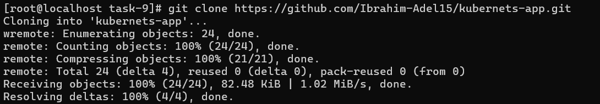
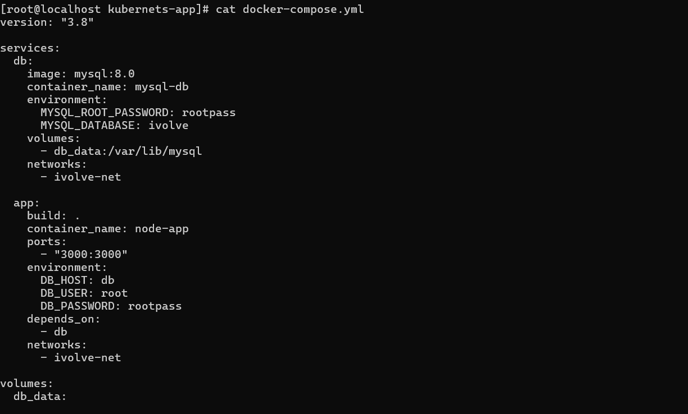
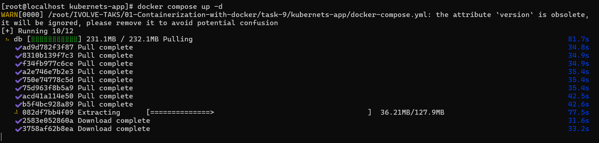
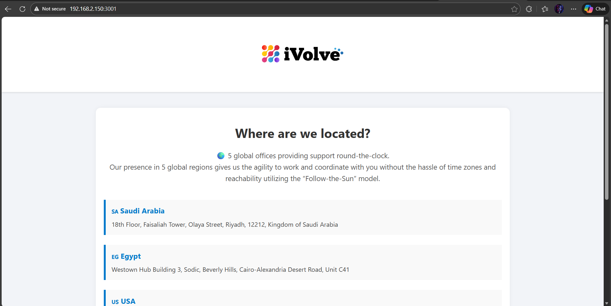
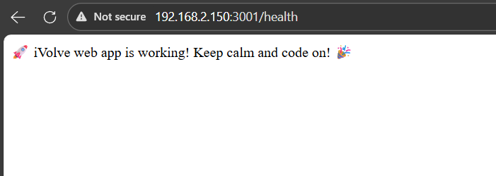
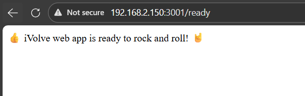
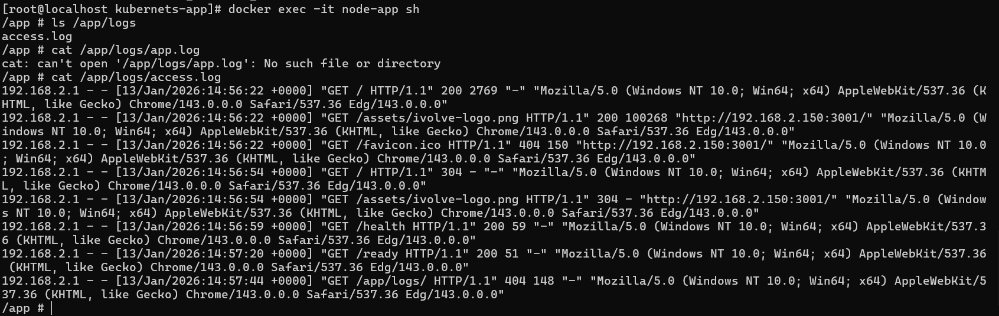

# IVOLVE Task 9 - Containerized Node.js and MySQL Stack Using Docker Compose

This lab is part of the IVOLVE training program. It demonstrates how to use Docker Compose to orchestrate a multi-container application with Node.js and MySQL, including service dependencies, environment variables, volumes, and networking.

## Lab Overview

In this lab you:

- **Clone** the application source code from GitHub
- **Understand** that the application requires a MySQL connection and must find a database named `ivolve`
- **Create** `docker-compose.yml` file with:
  - **App service**:
    - Build from the local Dockerfile
    - Map port 3000
    - Use environment variables: `DB_HOST`, `DB_USER`, `DB_PASSWORD`
  - **db service**:
    - Use MySQL image
    - Set environment variable `MYSQL_ROOT_PASSWORD`
    - `db_data` volume for `/var/lib/mysql`
- **Verify** app is working
- **Verify** app `/health` & `/ready` endpoints
- **Verify** app access logs at `/app/logs/`
- **Push** the Docker image into your DockerHub

## Why Docker Compose?

Docker Compose is essential for:

- **Multi-Container Applications**: Define and run multiple containers together
- **Service Orchestration**: Manage dependencies between services
- **Configuration Management**: Centralized configuration in YAML files
- **Development Workflow**: Easy local development environment setup
- **Reproducibility**: Same environment across different machines
- **Networking**: Automatic network creation and service discovery
- **Volumes**: Easy volume management for data persistence

## Project Requirements

### Node.js

- **Node.js 18** (or compatible version)
- The Dockerfile uses `node:18-alpine` base image

### MySQL

- **MySQL 8.0** database server
- Official MySQL Docker image will be used

### Docker Compose

- **Docker Compose** installed (usually comes with Docker Desktop)
- Version 3.8+ recommended

### DockerHub Account

- **DockerHub account** for pushing images
- DockerHub credentials for authentication

### Operating System

- **CentOS Linux** (or any Linux with Docker support), or Docker Desktop on Windows/Mac

## Setup Instructions

### Step 1: Clone the Application Code

Clone the application source code from GitHub:

```bash
git clone https://github.com/Ibrahim-Adel15/kubernets-app.git
cd kubernets-app
```



> In this lab structure, the cloned project is available under `kubernets-app/` inside `task-9`.

The repository contains:
- `server.js` - Node.js Express server
- `Dockerfile` - Dockerfile for the Node.js application
- `package.json` - Node.js dependencies
- `db.js` - Database connection logic
- `frontend/` - Frontend HTML files
- `docker-compose.yml` - Docker Compose configuration (you'll create this)

### Understanding the Application

The application:
- **Requires MySQL connection** - Connects to MySQL database
- **Must find database named `ivolve`** - The application checks for and creates this database
- **Exposes port 3000** - Web server listens on port 3000
- **Health endpoints** - `/health` and `/ready` for health checks
- **Access logs** - Logs stored in `/app/logs/access.log`

## Docker Compose Configuration

### Step 2: Create docker-compose.yml

Create a `docker-compose.yml` file with the following configuration:

```yaml
version: "3.8"

services:
  db:
    image: mysql:8.0
    container_name: mysql-db
    environment:
      MYSQL_ROOT_PASSWORD: rootpass
      MYSQL_DATABASE: ivolve
    volumes:
      - db_data:/var/lib/mysql
    networks:
      - ivolve-net

  app:
    build: .
    container_name: node-app
    ports:
      - "3001:3000"
    environment:
      DB_HOST: db
      DB_USER: root
      DB_PASSWORD: rootpass
    depends_on:
      - db
    networks:
      - ivolve-net

volumes:
  db_data:

networks:
  ivolve-net:
```



### Configuration Explanation

#### App Service

```yaml
app:
  build: .                    # Build from local Dockerfile
  container_name: node-app     # Container name
  ports:
    - "3001:3000"              # Map host port 3001 to container port 3000
  environment:
    DB_HOST: db                # Database hostname (service name)
    DB_USER: root              # Database username
    DB_PASSWORD: rootpass      # Database password
  depends_on:
    - db                       # Wait for db service to start
  networks:
    - ivolve-net               # Connect to custom network
```

**Key points:**
- `build: .` - Builds from the Dockerfile in the current directory
- `ports: "3001:3000"` - Maps container port 3000 to host port 3001
- `DB_HOST: db` - Uses the service name `db` as hostname (Docker Compose DNS)
- `depends_on` - Ensures `db` starts before `app`

#### DB Service

```yaml
db:
  image: mysql:8.0            # Use MySQL 8.0 image
  container_name: mysql-db     # Container name
  environment:
    MYSQL_ROOT_PASSWORD: rootpass  # Root password
    MYSQL_DATABASE: ivolve     # Create database named 'ivolve'
  volumes:
    - db_data:/var/lib/mysql   # Persist MySQL data
  networks:
    - ivolve-net               # Connect to custom network
```

**Key points:**
- `MYSQL_DATABASE: ivolve` - Automatically creates the `ivolve` database
- `db_data:/var/lib/mysql` - Named volume for data persistence
- Data survives container restarts

#### Volumes

```yaml
volumes:
  db_data:                    # Named volume for MySQL data
```

Creates a Docker-managed volume for MySQL data persistence.

#### Networks

```yaml
networks:
  ivolve-net:                 # Custom network for service communication
```

Creates a custom network where services can communicate using service names.

## How to Use the Project

### Step 3: Start the Application Stack

Start all services using Docker Compose:

```bash
docker-compose up -d
```

**Command breakdown:**
- `docker-compose up` - Starts all services defined in `docker-compose.yml`
- `-d` - Run in detached mode (background)

This command will:
1. Create the `ivolve-net` network
2. Create the `db_data` volume
3. Pull the MySQL 8.0 image (if not cached)
4. Build the Node.js app image from Dockerfile
5. Start the `db` service
6. Start the `app` service (after db is ready)



### View Running Services

Check that all services are running:

```bash
docker-compose ps
```

Or using Docker directly:

```bash
docker ps
```

You should see:
- `mysql-db` - MySQL database container
- `node-app` - Node.js application container

### Step 4: Verify App is Working

Access the application in your browser:

```
http://localhost:3001
```

Or using curl:

```bash
curl http://localhost:3001
```

You should see the application's frontend page.



### Step 5: Verify Health Endpoints

#### Check /health Endpoint

```bash
curl http://localhost:3001/health
```

**Expected output:**
```
🚀 iVolve web app is working! Keep calm and code on! 🎉
```

This endpoint checks if the application can connect to the database.



#### Check /ready Endpoint

```bash
curl http://localhost:3001/ready
```

**Expected output:**
```
👍 iVolve web app is ready to rock and roll! 🤘
```

This endpoint verifies the application is ready to serve requests.



### Step 6: Verify Access Logs

Access logs are stored in `/app/logs/access.log` inside the container.

**View logs from the container:**

```bash
docker exec node-app cat /app/logs/access.log
```

**Or follow logs in real-time:**

```bash
docker exec node-app tail -f /app/logs/access.log
```

**Generate some traffic and check logs:**

```bash
# Make some requests
curl http://localhost:3001
curl http://localhost:3001/health
curl http://localhost:3001/ready

# Check logs
docker exec node-app cat /app/logs/access.log
```

You should see log entries for each request made to the application.



### Step 7: Push Docker Image to DockerHub

Before pushing, you need to:

1. **Login to DockerHub:**

```bash
docker login
```

Enter your DockerHub username and password when prompted.

2. **Tag the image:**

Tag the image with your DockerHub username:

```bash
docker tag node-app:latest YOUR_DOCKERHUB_USERNAME/ivolve-app:latest
```

Replace `YOUR_DOCKERHUB_USERNAME` with your actual DockerHub username.

**Or build with tag directly:**

```bash
docker build -t YOUR_DOCKERHUB_USERNAME/ivolve-app:latest .
```

3. **Push the image:**

```bash
docker push YOUR_DOCKERHUB_USERNAME/ivolve-app:latest
```

**Verify the image was pushed:**

Visit your DockerHub profile:
```
https://hub.docker.com/r/YOUR_DOCKERHUB_USERNAME/ivolve-app
```

## Docker Compose Commands Reference

### Basic Commands

```bash
# Start services
docker-compose up

# Start services in background
docker-compose up -d

# Stop services
docker-compose stop

# Stop and remove containers
docker-compose down

# View running services
docker-compose ps

# View logs
docker-compose logs

# View logs for specific service
docker-compose logs app
docker-compose logs db

# Follow logs
docker-compose logs -f

# Rebuild services
docker-compose build

# Rebuild and start
docker-compose up --build
```

### Service Management

```bash
# Start specific service
docker-compose up db

# Stop specific service
docker-compose stop app

# Restart specific service
docker-compose restart app

# Scale services (if configured)
docker-compose up --scale app=3
```

### Volume and Network Management

```bash
# Remove volumes when stopping
docker-compose down -v

# Remove networks
docker-compose down --remove-orphans

# List volumes
docker volume ls

# Inspect volume
docker volume inspect kubernets-app_db_data
```

## Project Structure

```
task-9/
├── kubernets-app/
│   ├── docker-compose.yml     # Docker Compose configuration
│   ├── Dockerfile             # Node.js app Dockerfile
│   ├── package.json          # Node.js dependencies
│   ├── server.js             # Express server
│   ├── db.js                 # Database connection logic
│   └── frontend/             # Frontend files
│       ├── index.html
│       └── assets/
└── screenshots/              # Lab screenshots
```

## Application Architecture

### Node.js Application

The application (`server.js`) is an Express.js server that:
- Connects to MySQL database
- Serves static frontend files
- Provides `/health` and `/ready` endpoints
- Logs all requests to `/app/logs/access.log`
- Checks for and creates the `ivolve` database if needed

### MySQL Database

The MySQL service:
- Runs MySQL 8.0
- Creates `ivolve` database automatically
- Stores data in persistent volume (`db_data`)
- Accessible via service name `db` from other services

### Service Communication

- **App → DB**: Uses `db` as hostname (Docker Compose DNS)
- **Network**: Both services on `ivolve-net` network
- **Ports**: Only app exposes port to host (3001:3000)

## Troubleshooting

### Services Won't Start

If services fail to start:

```bash
# Check logs
docker-compose logs

# Check specific service logs
docker-compose logs app
docker-compose logs db

# Verify docker-compose.yml syntax
docker-compose config
```

### Database Connection Fails

If the app cannot connect to the database:

```bash
# Check if db service is running
docker-compose ps db

# Check db logs
docker-compose logs db

# Test database connection from app container
docker exec node-app ping db

# Verify environment variables
docker exec node-app env | grep DB_
```

### Port Already in Use

If port 3001 is already in use:

```bash
# Find what's using the port
sudo netstat -tulpn | grep 3001

# Change port in docker-compose.yml
# Change "3001:3000" to "3002:3000"
```

### Volume Issues

If database data is not persisting:

```bash
# List volumes
docker volume ls

# Inspect volume
docker volume inspect kubernets-app_db_data

# Check volume mount
docker inspect mysql-db | grep -A 10 Mounts
```

### Build Failures

If image build fails:

```bash
# Build with verbose output
docker-compose build --no-cache

# Check Dockerfile syntax
cat Dockerfile

# Verify files exist
ls -la
```

### Health/Ready Endpoints Fail

If health checks fail:

```bash
# Check app logs
docker-compose logs app

# Verify database is accessible
docker exec mysql-db mysql -uroot -prootpass -e "SHOW DATABASES;"

# Check if ivolve database exists
docker exec mysql-db mysql -uroot -prootpass -e "SHOW DATABASES LIKE 'ivolve';"
```

## Docker Compose Best Practices

### 1. Use Version Control

Always commit `docker-compose.yml` to version control:

```bash
git add docker-compose.yml
git commit -m "Add Docker Compose configuration"
```

### 2. Use Environment Files

Create `.env` file for sensitive data:

```bash
# .env file
DB_PASSWORD=secretpassword
MYSQL_ROOT_PASSWORD=secretrootpass
```

Reference in docker-compose.yml:

```yaml
environment:
  DB_PASSWORD: ${DB_PASSWORD}
```

### 3. Use Health Checks

Add health checks to services:

```yaml
app:
  healthcheck:
    test: ["CMD", "curl", "-f", "http://localhost:3000/health"]
    interval: 30s
    timeout: 10s
    retries: 3
```

### 4. Use Restart Policies

Configure restart policies:

```yaml
app:
  restart: unless-stopped
```

### 5. Resource Limits

Set resource limits:

```yaml
app:
  deploy:
    resources:
      limits:
        cpus: '0.5'
        memory: 512M
```

## Advanced Docker Compose Features

### Environment Variables

Use environment files:

```yaml
app:
  env_file:
    - .env
    - .env.local
```

### Multiple Compose Files

Use multiple compose files:

```bash
docker-compose -f docker-compose.yml -f docker-compose.prod.yml up
```

### Service Dependencies

Control startup order:

```yaml
app:
  depends_on:
    db:
      condition: service_healthy
```

### Networks

Create multiple networks:

```yaml
networks:
  frontend:
  backend:
```

## Use Cases

### Development Environment

```bash
# Start development stack
docker-compose up

# Make changes and rebuild
docker-compose up --build
```

### Production Deployment

```bash
# Use production compose file
docker-compose -f docker-compose.prod.yml up -d
```

### Testing

```bash
# Run tests in isolated environment
docker-compose -f docker-compose.test.yml up --abort-on-container-exit
```

## Notes

- Docker Compose automatically creates a network for services
- Service names can be used as hostnames (e.g., `db` resolves to database container)
- Volumes persist data even after containers are removed
- `depends_on` ensures startup order but doesn't wait for service readiness
- Use health checks for true readiness dependencies
- Port mappings are only needed for external access
- Internal service communication doesn't require port mappings
- The `ivolve` database is created automatically by MySQL service

## Next Steps

- Explore Docker Compose override files
- Learn about Docker Swarm for orchestration
- Study Kubernetes for container orchestration
- Investigate Docker Compose profiles
- Consider using Docker Compose for CI/CD pipelines

## License

See the LICENSE file in the parent directory for license information.
