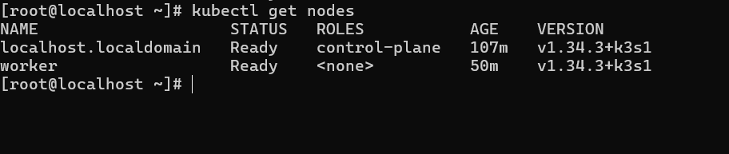
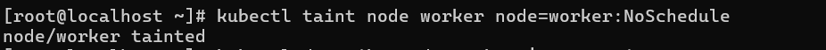
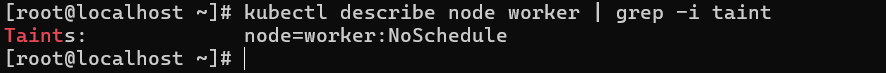

# IVOLVE Task 10 - Node Isolation Using Taints in Kubernetes

This lab is part of the IVOLVE training program. It demonstrates how to use Kubernetes taints to control pod scheduling and isolate nodes, preventing pods from being scheduled on specific nodes unless they have matching tolerations.

## Lab Overview

In this lab you:

- **Run** Kubernetes cluster with 2 nodes
- **Taint** one node with a specific key-value `node=worker` and effect `NoSchedule`
- **Describe** all nodes to verify the taint

## Why Kubernetes Taints?

Kubernetes taints are essential for:

- **Node Isolation**: Prevent pods from being scheduled on specific nodes
- **Dedicated Nodes**: Reserve nodes for specific workloads (e.g., GPU nodes, database nodes)
- **Maintenance Mode**: Mark nodes as unavailable during maintenance
- **Workload Separation**: Isolate different types of workloads
- **Resource Management**: Control which pods can use specific node resources
- **Security**: Isolate sensitive workloads on dedicated nodes

## Understanding Taints and Tolerations

### Taints

A **taint** is a property of a node that repels pods. It has three components:

1. **Key**: Identifier for the taint (e.g., `node`)
2. **Value**: Optional value associated with the key (e.g., `worker`)
3. **Effect**: What happens when a pod without matching toleration tries to schedule
   - `NoSchedule`: Pods without toleration won't be scheduled
   - `PreferNoSchedule`: Kubernetes will try to avoid scheduling (soft)
   - `NoExecute`: Evicts existing pods without toleration

### Tolerations

A **toleration** is a property of a pod that allows it to be scheduled on a tainted node. The pod must have a toleration that matches the node's taint.

## Project Requirements

### VMware Workstation

- **VMware Workstation** installed on your host machine
- **2 Virtual Machines** created:
  - **Master VM** (named `ks3`) - Control plane node
  - **Worker VM** - Worker node

### Kubernetes

- **Kubernetes cluster** with 2 nodes (master and worker)
- **kubeadm** installed on both VMs
- Access to `kubectl` command-line tool on master node
- Cluster admin permissions

### Operating System

- **CentOS Linux** or **Ubuntu Linux** on both VMs
- Network connectivity between VMs
- Docker and container runtime installed on both VMs

## Setup Instructions

### Prerequisites: VMware Workstation Setup

Before starting, ensure you have:

1. **VMware Workstation** installed on your host machine
2. **2 Virtual Machines** created:
   - **Master VM** (named `ks3` or similar) - Control plane node
   - **Worker VM** - Worker node
3. Both VMs should have:
   - Linux OS (CentOS or Ubuntu recommended)
   - Network connectivity between VMs
   - Docker and Kubernetes tools installed

### Step 1: Run Kubernetes Cluster with 2 Nodes

This lab uses **kubeadm** to set up a Kubernetes cluster across 2 VMs in VMware Workstation.

#### On Master Node (ks3)

1. **Initialize the cluster:**

```bash
sudo kubeadm init --pod-network-cidr=10.244.0.0/16
```

2. **Set up kubectl:**

```bash
mkdir -p $HOME/.kube
sudo cp -i /etc/kubernetes/admin.conf $HOME/.kube/config
sudo chown $(id -u):$(id -g) $HOME/.kube/config
```

3. **Install network plugin (e.g., Flannel):**

```bash
kubectl apply -f https://github.com/flannel-io/flannel/releases/latest/download/kube-flannel.yml
```

4. **Get the join command:**

```bash
kubeadm token create --print-join-command
```

Copy the output command (you'll need it for the worker node).

#### On Worker Node

1. **Join the cluster:**

```bash
sudo kubeadm join <master-ip>:6443 --token <token> --discovery-token-ca-cert-hash sha256:<hash>
```

Replace `<master-ip>`, `<token>`, and `<hash>` with values from the master node's join command.

#### Verify the Cluster

**On the master node (ks3), verify both nodes are in the cluster:**

```bash
kubectl get nodes
```

You should see 2 nodes in the cluster. Example output:

```
NAME           STATUS   ROLES           AGE   VERSION
ks3            Ready    control-plane   5m    v1.28.0
worker-node    Ready    <none>          4m    v1.28.0
```

**Note:** The master node (ks3) is the control plane, and the worker node is ready to accept pods.



### Step 2: Taint One Node

Taint one of the worker nodes with the key-value `node=worker` and effect `NoSchedule`.

**First, identify the node to taint:**

```bash
kubectl get nodes
```

**Apply the taint to a worker node:**

```bash
kubectl taint nodes <node-name> node=worker:NoSchedule
```

Replace `<node-name>` with the actual name of the worker node. For example:

```bash
kubectl taint nodes worker-node node=worker:NoSchedule
```

**Command breakdown:**
- `kubectl taint nodes` - Command to add a taint to a node
- `<node-name>` - Name of the node to taint
- `node=worker` - Key-value pair for the taint
- `:NoSchedule` - Effect of the taint

**What this does:**
- The node is marked with taint `node=worker:NoSchedule`
- Pods without a matching toleration will NOT be scheduled on this node
- Existing pods without toleration will remain (NoSchedule doesn't evict)



### Step 3: Describe All Nodes to Verify the Taint

Describe all nodes to verify the taint was applied correctly:

**Describe a specific node:**

```bash
kubectl describe node <node-name>
```

**Or describe all nodes:**

```bash
kubectl describe nodes
```

**Look for the Taints section in the output:**

```
Name:               worker-node
Roles:              <none>
Labels:             ...
Annotations:        ...
Taints:             node=worker:NoSchedule
...
```

The output should show:
- **Taints**: `node=worker:NoSchedule` on the tainted node
- **Taints**: `<none>` on the non-tainted node



## Understanding Taint Effects

### NoSchedule

- **Effect**: Pods without matching toleration **will not be scheduled** on the node
- **Existing Pods**: Existing pods without toleration **remain running**
- **Use Case**: Reserve node for specific workloads

### PreferNoSchedule

- **Effect**: Kubernetes will **try to avoid** scheduling pods without toleration
- **Existing Pods**: Existing pods remain running
- **Use Case**: Soft preference, not hard requirement

### NoExecute

- **Effect**: Pods without matching toleration **will not be scheduled** AND **existing pods will be evicted**
- **Existing Pods**: Existing pods without toleration **are evicted**
- **Use Case**: Maintenance mode, node draining

## Testing the Taint

### Test 1: Deploy Pod Without Toleration

Deploy a pod without a toleration:

```bash
kubectl run test-pod --image=nginx --restart=Never
```

**Check pod status:**

```bash
kubectl get pods -o wide
```

**Expected result:**
- The pod should be scheduled on the **non-tainted node**
- The pod should **NOT** be scheduled on the tainted node

### Test 2: Deploy Pod With Toleration

Deploy a pod with a matching toleration:

```bash
cat > pod-with-toleration.yaml << EOF
apiVersion: v1
kind: Pod
metadata:
  name: test-pod-tolerated
spec:
  containers:
  - name: nginx
    image: nginx
  tolerations:
  - key: "node"
    operator: "Equal"
    value: "worker"
    effect: "NoSchedule"
EOF

kubectl apply -f pod-with-toleration.yaml
```

**Check pod status:**

```bash
kubectl get pods -o wide
```

**Expected result:**
- The pod **can be scheduled** on the tainted node because it has a matching toleration

## Kubernetes Commands Reference

### Node Management

```bash
# List all nodes
kubectl get nodes

# Describe a node
kubectl describe node <node-name>

# Get node details in YAML
kubectl get node <node-name> -o yaml

# Get node details in JSON
kubectl get node <node-name> -o json
```

### Taint Management

```bash
# Add taint to node
kubectl taint nodes <node-name> <key>=<value>:<effect>

# Remove taint from node
kubectl taint nodes <node-name> <key>=<value>:<effect>-

# Remove all taints from node
kubectl taint nodes <node-name> <key>-

# List taints on all nodes
kubectl get nodes -o custom-columns=NAME:.metadata.name,TAINTS:.spec.taints
```

### Pod Management

```bash
# List all pods
kubectl get pods

# List pods with node information
kubectl get pods -o wide

# Describe a pod
kubectl describe pod <pod-name>

# Delete a pod
kubectl delete pod <pod-name>
```

## Taint Examples

### Example 1: Dedicated GPU Node

```bash
kubectl taint nodes gpu-node-1 nvidia.com/gpu=true:NoSchedule
```

### Example 2: Database Node

```bash
kubectl taint nodes db-node-1 database=mysql:NoSchedule
```

### Example 3: Maintenance Mode

```bash
kubectl taint nodes worker-node-1 maintenance=true:NoExecute
```

### Example 4: Development Environment

```bash
kubectl taint nodes dev-node-1 environment=development:PreferNoSchedule
```

## Creating Pods with Tolerations

### YAML Example

```yaml
apiVersion: v1
kind: Pod
metadata:
  name: my-pod
spec:
  containers:
  - name: app
    image: nginx
  tolerations:
  - key: "node"
    operator: "Equal"
    value: "worker"
    effect: "NoSchedule"
```

### Toleration Operators

- **Equal**: Key and value must match exactly
- **Exists**: Key must exist (value is ignored)

### Example: Exists Operator

```yaml
tolerations:
- key: "node"
  operator: "Exists"
  effect: "NoSchedule"
```

This toleration matches any taint with key `node`, regardless of value.

## Troubleshooting

### Taint Not Applied

If the taint doesn't appear:

```bash
# Verify node exists
kubectl get nodes

# Check for typos in node name
kubectl get nodes | grep <node-name>

# Verify taint command syntax
kubectl taint nodes <node-name> node=worker:NoSchedule
```

### Pod Still Scheduled on Tainted Node

If a pod is scheduled on a tainted node:

```bash
# Check if pod has toleration
kubectl describe pod <pod-name> | grep -A 5 Tolerations

# Check node taints
kubectl describe node <node-name> | grep -A 5 Taints

# Verify taint effect
kubectl get node <node-name> -o jsonpath='{.spec.taints}'
```

### Cannot Remove Taint

If you can't remove a taint:

```bash
# Check exact taint format
kubectl describe node <node-name> | grep Taints

# Remove with exact format
kubectl taint nodes <node-name> node=worker:NoSchedule-

# Or remove all taints with key
kubectl taint nodes <node-name> node-
```

### Cluster Has Only One Node

If your cluster has only one node:

```bash
# Verify worker node joined successfully
kubectl get nodes

# Check worker node connectivity from master
ping <worker-node-ip>

# Re-run join command on worker node if needed
sudo kubeadm join <master-ip>:6443 --token <token> --discovery-token-ca-cert-hash sha256:<hash>
```

### VMware Network Issues

If VMs cannot communicate:

```bash
# Verify network connectivity between VMs
ping <other-vm-ip>

# Check VMware network adapter settings
# Ensure both VMs are on the same network (NAT or Bridged)

# Verify firewall rules
sudo firewall-cmd --list-all
```

## Best Practices

### 1. Use Descriptive Taint Keys

Use meaningful keys:

```bash
# Good
kubectl taint nodes node-1 workload=gpu:NoSchedule

# Bad
kubectl taint nodes node-1 x=1:NoSchedule
```

### 2. Document Taints

Document why nodes are tainted:

```bash
# Add annotation to node
kubectl annotate node <node-name> taint-reason="Reserved for GPU workloads"
```

### 3. Use Appropriate Effects

Choose the right effect for your use case:

- **NoSchedule**: Reserve node for specific workloads
- **PreferNoSchedule**: Soft preference
- **NoExecute**: Maintenance or node draining

### 4. Remove Taints When Not Needed

Clean up taints when they're no longer needed:

```bash
kubectl taint nodes <node-name> node=worker:NoSchedule-
```

### 5. Use Taints with Node Selectors

Combine taints with node selectors for better control:

```yaml
spec:
  nodeSelector:
    node-type: worker
  tolerations:
  - key: "node"
    operator: "Equal"
    value: "worker"
    effect: "NoSchedule"
```

## Use Cases

### Dedicated Workload Nodes

Reserve nodes for specific workloads:

```bash
# GPU nodes
kubectl taint nodes gpu-node-1 nvidia.com/gpu=true:NoSchedule

# Database nodes
kubectl taint nodes db-node-1 database=mysql:NoSchedule
```

### Maintenance Mode

Mark nodes for maintenance:

```bash
kubectl taint nodes worker-node-1 maintenance=true:NoExecute
```

### Environment Isolation

Separate development and production:

```bash
# Development nodes
kubectl taint nodes dev-node-1 environment=dev:PreferNoSchedule

# Production nodes
kubectl taint nodes prod-node-1 environment=prod:NoSchedule
```

## Taint vs Node Selector

### Taint
- **Node property** that repels pods
- Pods need **toleration** to be scheduled
- Used to **exclude** pods from nodes

### Node Selector
- **Pod property** that attracts pods to nodes
- Pods specify **nodeSelector** to be scheduled
- Used to **include** pods on nodes

### Combined Usage

Use both for fine-grained control:

```yaml
spec:
  nodeSelector:
    node-type: worker
  tolerations:
  - key: "node"
    operator: "Equal"
    value: "worker"
    effect: "NoSchedule"
```

## Notes

- Taints are node-level properties
- Tolerations are pod-level properties
- A pod can only be scheduled on a tainted node if it has a matching toleration
- `NoSchedule` prevents new pods but doesn't evict existing ones
- `NoExecute` evicts existing pods without toleration
- Taints persist across node restarts
- You can have multiple taints on a node
- Pods need tolerations for ALL taints on a node (unless using `operator: Exists`)

## Next Steps

- Explore node affinity and anti-affinity
- Learn about pod disruption budgets
- Study node selectors and node affinity
- Investigate pod tolerations in deployments
- Consider using taints in production environments

## License

See the LICENSE file in the parent directory for license information.
