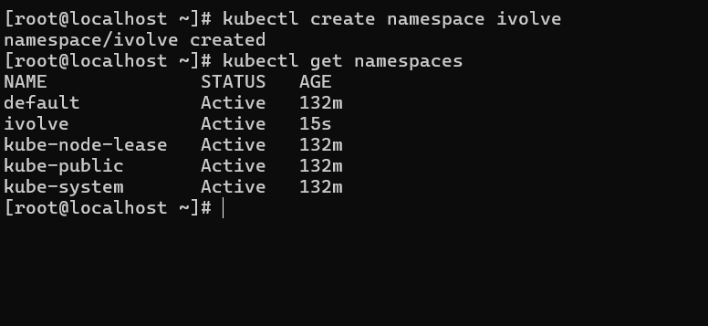
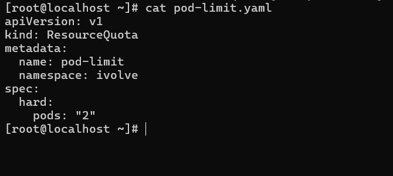
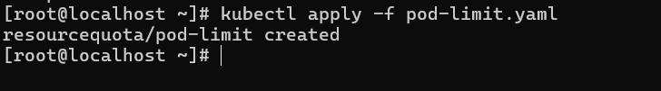

# IVOLVE Task 11 - Namespace Management and Resource Quota Enforcement

This lab is part of the IVOLVE training program. It demonstrates how to create and manage Kubernetes namespaces, and how to enforce resource quotas to control resource consumption within namespaces.

## Lab Overview

In this lab you:

- **Create** a namespace called `ivolve`
- **Apply** resource quota to limit pods number to only 2 pods within the namespace

## Why Kubernetes Namespaces?

Kubernetes namespaces are essential for:

- **Resource Isolation**: Separate resources and workloads logically
- **Access Control**: Apply RBAC policies per namespace
- **Resource Management**: Set quotas and limits per namespace
- **Multi-tenancy**: Support multiple teams or projects in one cluster
- **Organization**: Group related resources together
- **Security**: Isolate sensitive workloads

## Why Resource Quotas?

Resource quotas are essential for:

- **Resource Limits**: Prevent resource exhaustion in namespaces
- **Cost Control**: Limit resource consumption per team/project
- **Fair Sharing**: Ensure fair distribution of cluster resources
- **Capacity Planning**: Predict and manage cluster capacity
- **Compliance**: Enforce organizational policies
- **Prevent Overconsumption**: Stop runaway processes from consuming all resources

## Understanding Namespaces and Resource Quotas

### Namespaces

A **namespace** is a virtual cluster within a Kubernetes cluster. It provides:
- Logical separation of resources
- Scoped resource names (same name can exist in different namespaces)
- Isolated resource quotas and limits
- Separate access control policies

### Resource Quotas

A **ResourceQuota** provides constraints that limit aggregate resource consumption per namespace. It can limit:
- Compute resources (CPU, memory)
- Storage resources (persistent volume claims)
- Object counts (pods, services, configmaps, etc.)

## Project Requirements

### VMware Workstation

- **VMware Workstation** installed on your host machine
- **2 Virtual Machines** created:
  - **Master VM** (named `ks3`) - Control plane node
  - **Worker VM** - Worker node

### Kubernetes

- **Kubernetes cluster** with 2 nodes (master and worker)
- **kubeadm** installed on both VMs
- Access to `kubectl` command-line tool on master node
- Cluster admin permissions

### Operating System

- **CentOS Linux** or **Ubuntu Linux** on both VMs
- Network connectivity between VMs
- Docker and container runtime installed on both VMs

## Setup Instructions

### Prerequisites: VMware Workstation Setup

Before starting, ensure you have:

1. **VMware Workstation** installed on your host machine
2. **2 Virtual Machines** created:
   - **Master VM** (named `ks3` or similar) - Control plane node
   - **Worker VM** - Worker node
3. Both VMs should have:
   - Linux OS (CentOS or Ubuntu recommended)
   - Network connectivity between VMs
   - Docker and Kubernetes tools installed
4. **Kubernetes cluster** is running with both nodes in Ready state

**Verify cluster is ready:**

```bash
kubectl get nodes
```

Both nodes should show `Ready` status.

## How to Use the Project

### Step 1: Create a Namespace Called ivolve

Create a new namespace named `ivolve`:

**Using kubectl command:**

```bash
kubectl create namespace ivolve
```

**Or using YAML file:**

```bash
cat > namespace.yaml << EOF
apiVersion: v1
kind: Namespace
metadata:
  name: ivolve
EOF

kubectl apply -f namespace.yaml
```

**Verify the namespace was created:**

```bash
kubectl get namespaces
```

You should see `ivolve` in the list:

```
NAME              STATUS   AGE
default           Active   5d
ivolve            Active   5s
kube-node-lease    Active   5d
kube-public       Active   5d
kube-system       Active   5d
```

**Describe the namespace:**

```bash
kubectl describe namespace ivolve
```



### Step 2: Apply Resource Quota to Limit Pods

Create a ResourceQuota that limits the number of pods to 2 within the `ivolve` namespace.

**Create the ResourceQuota YAML file:**

```bash
cat > pod-limit-quota.yaml << EOF
apiVersion: v1
kind: ResourceQuota
metadata:
  name: pod-limit
  namespace: ivolve
spec:
  hard:
    pods: "2"
EOF
```

**Explanation:**
- `apiVersion: v1` - Kubernetes API version
- `kind: ResourceQuota` - Resource type
- `metadata.name: pod-limit` - Name of the quota
- `metadata.namespace: ivolve` - Namespace where quota applies
- `spec.hard.pods: "2"` - Maximum number of pods allowed



**Apply the ResourceQuota:**

```bash
kubectl apply -f pod-limit-quota.yaml
```

**Or create directly with kubectl:**

```bash
kubectl create quota pod-limit --namespace=ivolve --hard=pods=2
```

**Verify the ResourceQuota was created:**

```bash
kubectl get resourcequota -n ivolve
```

You should see:

```
NAME        AGE   REQUEST   LIMIT
pod-limit   5s    pods: 0/2
```

**Describe the ResourceQuota:**

```bash
kubectl describe resourcequota pod-limit -n ivolve
```

Output should show:

```
Name:            pod-limit
Namespace:       ivolve
Resource         Used  Hard
--------         ----  ----
pods             0     2
```



## Testing the Resource Quota

### Test 1: Create Pods Within Limit

Create 2 pods (within the limit):

```bash
# Create first pod
kubectl run pod1 --image=nginx --namespace=ivolve --restart=Never

# Create second pod
kubectl run pod2 --image=nginx --namespace=ivolve --restart=Never
```

**Check pod status:**

```bash
kubectl get pods -n ivolve
```

Both pods should be running:

```
NAME   READY   STATUS    RESTARTS   AGE
pod1   1/1     Running   0          10s
pod2   1/1     Running   0          8s
```

**Check quota usage:**

```bash
kubectl describe resourcequota pod-limit -n ivolve
```

Output should show:

```
Resource         Used  Hard
--------         ----  ----
pods             2     2
```

### Test 2: Attempt to Exceed Limit

Try to create a third pod (should fail):

```bash
kubectl run pod3 --image=nginx --namespace=ivolve --restart=Never
```

**Check pod status:**

```bash
kubectl get pods -n ivolve
```

The third pod should show an error:

```
NAME   READY   STATUS    RESTARTS   AGE
pod1   1/1     Running   0          2m
pod2   1/1     Running   0          2m
pod3   0/1     Pending   0          10s
```

**Describe the pending pod:**

```bash
kubectl describe pod pod3 -n ivolve
```

You should see an error message like:

```
Events:
  Type     Reason            Age   From               Message
  ----     ------            ----  ----               -------
  Warning  FailedScheduling  10s   default-scheduler  0/2 nodes are available: 2 Insufficient pods.
```

The error indicates that the quota limit has been reached.

**Check quota status:**

```bash
kubectl describe resourcequota pod-limit -n ivolve
```

Output should show:

```
Resource         Used  Hard
--------         ----  ----
pods             2     2
```

### Test 3: Delete Pod and Create New One

Delete one pod and verify you can create a new one:

```bash
# Delete pod1
kubectl delete pod pod1 -n ivolve

# Create new pod
kubectl run pod4 --image=nginx --namespace=ivolve --restart=Never

# Verify
kubectl get pods -n ivolve
```

You should now have `pod2` and `pod4 running, and `pod3` should be scheduled.

## Kubernetes Commands Reference

### Namespace Management

```bash
# Create namespace
kubectl create namespace <namespace-name>

# List all namespaces
kubectl get namespaces
kubectl get ns

# Describe namespace
kubectl describe namespace <namespace-name>

# Delete namespace
kubectl delete namespace <namespace-name>

# Switch context to namespace
kubectl config set-context --current --namespace=<namespace-name>
```

### Resource Quota Management

```bash
# Create resource quota
kubectl create quota <quota-name> --namespace=<namespace> --hard=<resource>=<limit>

# List resource quotas
kubectl get resourcequota -n <namespace>
kubectl get quota -n <namespace>

# Describe resource quota
kubectl describe resourcequota <quota-name> -n <namespace>

# Delete resource quota
kubectl delete resourcequota <quota-name> -n <namespace>

# Edit resource quota
kubectl edit resourcequota <quota-name> -n <namespace>
```

### Pod Management in Namespace

```bash
# Create pod in namespace
kubectl run <pod-name> --image=<image> --namespace=<namespace>

# List pods in namespace
kubectl get pods -n <namespace>

# Describe pod in namespace
kubectl describe pod <pod-name> -n <namespace>

# Delete pod in namespace
kubectl delete pod <pod-name> -n <namespace>
```

## Resource Quota Examples

### Example 1: Limit Pods Only

```yaml
apiVersion: v1
kind: ResourceQuota
metadata:
  name: pod-limit
  namespace: ivolve
spec:
  hard:
    pods: "2"
```

### Example 2: Limit CPU and Memory

```yaml
apiVersion: v1
kind: ResourceQuota
metadata:
  name: compute-quota
  namespace: ivolve
spec:
  hard:
    requests.cpu: "2"
    requests.memory: 4Gi
    limits.cpu: "4"
    limits.memory: 8Gi
```

### Example 3: Limit Multiple Resources

```yaml
apiVersion: v1
kind: ResourceQuota
metadata:
  name: comprehensive-quota
  namespace: ivolve
spec:
  hard:
    pods: "10"
    requests.cpu: "4"
    requests.memory: 8Gi
    limits.cpu: "8"
    limits.memory: 16Gi
    persistentvolumeclaims: "4"
    services: "5"
    configmaps: "10"
    secrets: "10"
```

### Example 4: Limit Storage

```yaml
apiVersion: v1
kind: ResourceQuota
metadata:
  name: storage-quota
  namespace: ivolve
spec:
  hard:
    persistentvolumeclaims: "5"
    requests.storage: "50Gi"
```

## Troubleshooting

### Namespace Not Created

If namespace creation fails:

```bash
# Check for typos
kubectl get namespaces | grep ivolve

# Verify permissions
kubectl auth can-i create namespaces

# Check cluster status
kubectl cluster-info
```

### Resource Quota Not Applied

If quota doesn't work:

```bash
# Verify quota exists
kubectl get resourcequota -n ivolve

# Check quota details
kubectl describe resourcequota pod-limit -n ivolve

# Verify namespace
kubectl get namespace ivolve
```

### Pods Not Respecting Quota

If pods are created beyond the limit:

```bash
# Check quota status
kubectl describe resourcequota pod-limit -n ivolve

# Verify quota is in correct namespace
kubectl get resourcequota --all-namespaces

# Check if quota is active
kubectl get resourcequota pod-limit -n ivolve -o yaml
```

### Cannot Delete Namespace

If namespace won't delete:

```bash
# Check what's in the namespace
kubectl get all -n ivolve

# Force delete (use with caution)
kubectl delete namespace ivolve --force --grace-period=0

# Check finalizers
kubectl get namespace ivolve -o jsonpath='{.spec.finalizers}'
```

## Best Practices

### 1. Use Descriptive Namespace Names

Use meaningful names:

```bash
# Good
kubectl create namespace production
kubectl create namespace development
kubectl create namespace staging

# Bad
kubectl create namespace ns1
kubectl create namespace test
```

### 2. Set Appropriate Quotas

Set realistic quotas based on:
- Available cluster resources
- Team needs
- Application requirements
- Cost constraints

### 3. Monitor Quota Usage

Regularly check quota usage:

```bash
# Check all quotas
kubectl get resourcequota --all-namespaces

# Monitor specific namespace
kubectl describe resourcequota -n ivolve
```

### 4. Use ResourceQuota with LimitRange

Combine ResourceQuota with LimitRange for better control:

```yaml
# LimitRange sets default limits per pod
apiVersion: v1
kind: LimitRange
metadata:
  name: pod-limit-range
  namespace: ivolve
spec:
  limits:
  - default:
      cpu: "500m"
      memory: "512Mi"
    type: Container
```

### 5. Document Namespace Purpose

Add labels and annotations:

```bash
kubectl label namespace ivolve purpose=training
kubectl annotate namespace ivolve description="Training namespace for iVolve"
```

## Use Cases

### Multi-Tenancy

Separate teams or projects:

```bash
# Create namespaces for different teams
kubectl create namespace team-a
kubectl create namespace team-b
kubectl create namespace team-c

# Apply different quotas
kubectl create quota team-a-quota -n team-a --hard=pods=10,cpu=4,memory=8Gi
kubectl create quota team-b-quota -n team-b --hard=pods=5,cpu=2,memory=4Gi
```

### Environment Separation

Separate environments:

```bash
kubectl create namespace production
kubectl create namespace staging
kubectl create namespace development

# Different quotas per environment
kubectl create quota prod-quota -n production --hard=pods=50,cpu=20,memory=40Gi
kubectl create quota dev-quota -n development --hard=pods=10,cpu=4,memory=8Gi
```

### Cost Control

Limit resource consumption:

```yaml
apiVersion: v1
kind: ResourceQuota
metadata:
  name: cost-control
  namespace: ivolve
spec:
  hard:
    pods: "5"
    requests.cpu: "2"
    requests.memory: 4Gi
    limits.cpu: "4"
    limits.memory: 8Gi
```

## Resource Quota vs LimitRange

### ResourceQuota
- **Namespace-level** resource limits
- Limits **total** resources in namespace
- Applied to **all resources** in namespace
- Prevents namespace from exceeding limits

### LimitRange
- **Pod/Container-level** resource limits
- Sets **default** and **max/min** limits per pod
- Applied to **individual pods**
- Ensures pods have resource requests/limits

### Combined Usage

Use both for comprehensive control:

```yaml
# ResourceQuota: Namespace total
apiVersion: v1
kind: ResourceQuota
metadata:
  name: namespace-quota
  namespace: ivolve
spec:
  hard:
    pods: "10"
    requests.cpu: "4"
    requests.memory: 8Gi

---
# LimitRange: Per-pod limits
apiVersion: v1
kind: LimitRange
metadata:
  name: pod-limits
  namespace: ivolve
spec:
  limits:
  - max:
      cpu: "1"
      memory: "2Gi"
    min:
      cpu: "100m"
      memory: "128Mi"
    default:
      cpu: "500m"
      memory: "512Mi"
    type: Container
```

## Notes

- ResourceQuota is enforced at namespace level
- Quotas prevent creation of new resources when limit is reached
- Existing resources are not affected when quota is applied
- Quotas are additive (multiple quotas in same namespace combine)
- Pods count includes all pod states (Pending, Running, Succeeded, Failed)
- ResourceQuota only limits resources, doesn't guarantee availability
- Quotas are checked during resource creation, not runtime
- Deleted resources free up quota immediately

## Next Steps

- Explore LimitRange for per-pod resource limits
- Learn about ResourceQuota scopes
- Study namespace resource isolation
- Investigate RBAC with namespaces
- Consider using namespaces for multi-tenancy

## License

See the LICENSE file in the parent directory for license information.
