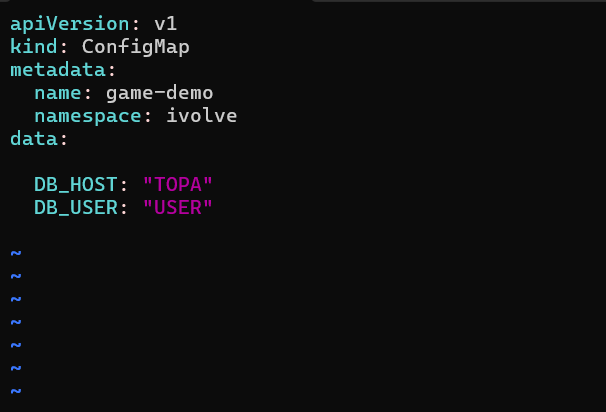
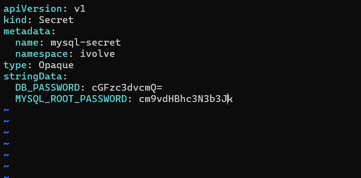

# IVOLVE Task 12 - Managing Configuration and Sensitive Data with ConfigMaps and Secrets

This lab is part of the IVOLVE training program. It demonstrates how to use Kubernetes ConfigMaps and Secrets to manage configuration data and sensitive information, specifically for MySQL database connections.

## Lab Overview

In this lab you:

- **Define** a ConfigMap to store non-sensitive MySQL configuration variables:
  - `DB_HOST` - The hostname of the MySQL StatefulSet service
  - `DB_USER` - The database user that the application will use to connect to the ivolve database
- **Define** a Secret to store sensitive MySQL credentials securely:
  - `DB_PASSWORD` - The password for the DB_USER
  - `MYSQL_ROOT_PASSWORD` - The root password for MySQL database
- **Use base64 encoding** for the Secret data values

## Why ConfigMaps?

ConfigMaps are essential for:

- **Configuration Management**: Store non-sensitive configuration data
- **Decoupling**: Separate configuration from application code
- **Flexibility**: Update configuration without rebuilding images
- **Reusability**: Share configuration across multiple pods
- **Environment-Specific**: Different configs for dev, staging, prod
- **Version Control**: Track configuration changes

## Why Secrets?

Secrets are essential for:

- **Security**: Store sensitive data (passwords, API keys, tokens)
- **Encryption**: Secrets can be encrypted at rest
- **Access Control**: RBAC can restrict secret access
- **Best Practices**: Never hardcode sensitive data in images
- **Compliance**: Meet security requirements for sensitive data
- **Rotation**: Easier to rotate credentials

## Understanding ConfigMaps and Secrets

### ConfigMaps

A **ConfigMap** is an API object used to store non-confidential data in key-value pairs. It can be:
- Mounted as files in pods
- Used as environment variables
- Referenced in pod specifications

### Secrets

A **Secret** is an API object that contains a small amount of sensitive data such as passwords, tokens, or keys. Secrets are:
- Base64 encoded by default
- Can be encrypted at rest (with proper setup)
- Should never be committed to version control
- More secure than ConfigMaps for sensitive data

### Base64 Encoding

Base64 encoding is used for Secret values because:
- Kubernetes stores secrets as base64-encoded strings
- Provides basic obfuscation (not encryption)
- Standard encoding format
- Easy to encode/decode

## Project Requirements

### VMware Workstation

- **VMware Workstation** installed on your host machine
- **2 Virtual Machines** created:
  - **Master VM** (named `ks3`) - Control plane node
  - **Worker VM** - Worker node

### Kubernetes

- **Kubernetes cluster** with 2 nodes (master and worker)
- **kubeadm** installed on both VMs
- Access to `kubectl` command-line tool on master node
- Cluster admin permissions
- **Namespace `ivolve`** created (from previous lab)

### Operating System

- **CentOS Linux** or **Ubuntu Linux** on both VMs
- Network connectivity between VMs
- Docker and container runtime installed on both VMs

## Setup Instructions

### Prerequisites: VMware Workstation Setup

Before starting, ensure you have:

1. **VMware Workstation** installed on your host machine
2. **2 Virtual Machines** created:
   - **Master VM** (named `ks3` or similar) - Control plane node
   - **Worker VM** - Worker node
3. Both VMs should have:
   - Linux OS (CentOS or Ubuntu recommended)
   - Network connectivity between VMs
   - Docker and Kubernetes tools installed
4. **Kubernetes cluster** is running with both nodes in Ready state
5. **Namespace `ivolve`** exists (created in previous lab)

**Verify prerequisites:**

```bash
# Check cluster status
kubectl get nodes

# Verify namespace exists
kubectl get namespace ivolve
```

## How to Use the Project

### Step 1: Define ConfigMap for Non-Sensitive MySQL Configuration

Create a ConfigMap to store non-sensitive MySQL configuration variables.

#### Encode Values to Base64

First, encode the secret values to base64:

```bash
# Encode DB_PASSWORD
echo -n "password" | base64
# Output: cGFzc3dvcmQ=

# Encode MYSQL_ROOT_PASSWORD
echo -n "rootpassword" | base64
# Output: cm9vdHBhc3N3b3Jk
```

**Note:** The `-n` flag prevents adding a newline character, which is important for base64 encoding.

#### Create ConfigMap YAML

Create the ConfigMap YAML file:

```bash
cat > mysql-config.yaml << EOF
apiVersion: v1
kind: ConfigMap
metadata:
  name: mysql-config
  namespace: ivolve
data:
  DB_HOST: "mysql-service"
  DB_USER: "ivolve_user"
EOF
```

**Explanation:**
- `apiVersion: v1` - Kubernetes API version
- `kind: ConfigMap` - Resource type
- `metadata.name: mysql-config` - Name of the ConfigMap
- `metadata.namespace: ivolve` - Namespace where ConfigMap is created
- `data.DB_HOST: "mysql-service"` - Hostname of MySQL StatefulSet service
- `data.DB_USER: "ivolve_user"` - Database user for connecting to ivolve database

**Note:** ConfigMap values are stored as plain text (not base64 encoded).

#### Apply the ConfigMap

```bash
kubectl apply -f mysql-config.yaml
```

**Verify the ConfigMap was created:**

```bash
kubectl get configmap -n ivolve
```

You should see:

```
NAME           DATA   AGE
mysql-config   2      5s
```

**Describe the ConfigMap:**

```bash
kubectl describe configmap mysql-config -n ivolve
```

**View ConfigMap data:**

```bash
kubectl get configmap mysql-config -n ivolve -o yaml
```



### Step 2: Define Secret for Sensitive MySQL Credentials

Create a Secret to store sensitive MySQL credentials using base64 encoding.

#### Encode Secret Values to Base64

Encode the sensitive values to base64:

```bash
# Encode DB_PASSWORD
echo -n "password" | base64
# Output: cGFzc3dvcmQ=

# Encode MYSQL_ROOT_PASSWORD
echo -n "rootpassword" | base64
# Output: cm9vdHBhc3N3b3Jk
```

**Important:** Always use `-n` flag to prevent newline characters in the encoded value.

#### Create Secret YAML with Base64 Encoding

Create the Secret YAML file with base64-encoded values:

```bash
cat > mysql-secret.yaml << EOF
apiVersion: v1
kind: Secret
metadata:
  name: mysql-secret
  namespace: ivolve
type: Opaque
data:
  DB_PASSWORD: cGFzc3dvcmQ=
  MYSQL_ROOT_PASSWORD: cm9vdHBhc3N3b3Jk
EOF
```

**Explanation:**
- `apiVersion: v1` - Kubernetes API version
- `kind: Secret` - Resource type
- `metadata.name: mysql-secret` - Name of the Secret
- `metadata.namespace: ivolve` - Namespace where Secret is created
- `type: Opaque` - Secret type (generic secret)
- `data.DB_PASSWORD: cGFzc3dvcmQ=` - Base64-encoded password for DB_USER
- `data.MYSQL_ROOT_PASSWORD: cm9vdHBhc3N3b3Jk` - Base64-encoded root password for MySQL

**Important:** 
- Secret values in the `data` field must be base64-encoded
- Never put plain text passwords in the `data` field
- The `type: Opaque` indicates a generic secret

#### Apply the Secret

```bash
kubectl apply -f mysql-secret.yaml
```

**Verify the Secret was created:**

```bash
kubectl get secret -n ivolve
```

You should see:

```
NAME           TYPE     DATA   AGE
mysql-secret   Opaque   2      5s
```

**Describe the Secret:**

```bash
kubectl describe secret mysql-secret -n ivolve
```

**View Secret (values are base64 encoded):**

```bash
kubectl get secret mysql-secret -n ivolve -o yaml
```

**Decode Secret values (for verification):**

```bash
# Decode DB_PASSWORD
echo "cGFzc3dvcmQ=" | base64 -d
# Output: password

# Decode MYSQL_ROOT_PASSWORD
echo "cm9vdHBhc3N3b3Jk" | base64 -d
# Output: rootpassword
```



## Alternative Methods

### Method 1: Create ConfigMap from Command Line

```bash
kubectl create configmap mysql-config \
  --from-literal=DB_HOST=mysql-service \
  --from-literal=DB_USER=ivolve_user \
  -n ivolve
```

### Method 2: Create Secret from Command Line

```bash
# Create secret with base64 encoding
kubectl create secret generic mysql-secret \
  --from-literal=DB_PASSWORD=password \
  --from-literal=MYSQL_ROOT_PASSWORD=rootpassword \
  -n ivolve
```

Kubernetes automatically base64-encodes values when using `--from-literal`.

### Method 3: Create Secret from File

```bash
# Create files with sensitive data
echo -n "password" > db-password.txt
echo -n "rootpassword" > root-password.txt

# Create secret from files
kubectl create secret generic mysql-secret \
  --from-file=DB_PASSWORD=db-password.txt \
  --from-file=MYSQL_ROOT_PASSWORD=root-password.txt \
  -n ivolve

# Clean up files
rm db-password.txt root-password.txt
```

## Using ConfigMaps and Secrets in Pods

### Using ConfigMap as Environment Variables

```yaml
apiVersion: v1
kind: Pod
metadata:
  name: mysql-app
  namespace: ivolve
spec:
  containers:
  - name: app
    image: mysql:8.0
    env:
    - name: DB_HOST
      valueFrom:
        configMapKeyRef:
          name: mysql-config
          key: DB_HOST
    - name: DB_USER
      valueFrom:
        configMapKeyRef:
          name: mysql-config
          key: DB_USER
```

### Using Secret as Environment Variables

```yaml
apiVersion: v1
kind: Pod
metadata:
  name: mysql-app
  namespace: ivolve
spec:
  containers:
  - name: app
    image: mysql:8.0
    env:
    - name: DB_PASSWORD
      valueFrom:
        secretKeyRef:
          name: mysql-secret
          key: DB_PASSWORD
    - name: MYSQL_ROOT_PASSWORD
      valueFrom:
        secretKeyRef:
          name: mysql-secret
          key: MYSQL_ROOT_PASSWORD
```

### Using Both ConfigMap and Secret

```yaml
apiVersion: v1
kind: Pod
metadata:
  name: mysql-app
  namespace: ivolve
spec:
  containers:
  - name: app
    image: mysql:8.0
    envFrom:
    - configMapRef:
        name: mysql-config
    - secretRef:
        name: mysql-secret
```

### Using as Volume Mounts

```yaml
apiVersion: v1
kind: Pod
metadata:
  name: mysql-app
  namespace: ivolve
spec:
  containers:
  - name: app
    image: mysql:8.0
    volumeMounts:
    - name: config
      mountPath: /etc/config
      readOnly: true
    - name: secret
      mountPath: /etc/secret
      readOnly: true
  volumes:
  - name: config
    configMap:
      name: mysql-config
  - name: secret
    secret:
      secretName: mysql-secret
```

## Kubernetes Commands Reference

### ConfigMap Commands

```bash
# Create ConfigMap from YAML
kubectl apply -f mysql-config.yaml

# Create ConfigMap from command line
kubectl create configmap <name> --from-literal=<key>=<value> -n <namespace>

# List ConfigMaps
kubectl get configmap -n <namespace>
kubectl get cm -n <namespace>

# Describe ConfigMap
kubectl describe configmap <name> -n <namespace>

# Get ConfigMap YAML
kubectl get configmap <name> -n <namespace> -o yaml

# Edit ConfigMap
kubectl edit configmap <name> -n <namespace>

# Delete ConfigMap
kubectl delete configmap <name> -n <namespace>
```

### Secret Commands

```bash
# Create Secret from YAML
kubectl apply -f mysql-secret.yaml

# Create Secret from command line
kubectl create secret generic <name> --from-literal=<key>=<value> -n <namespace>

# List Secrets
kubectl get secret -n <namespace>

# Describe Secret
kubectl describe secret <name> -n <namespace>

# Get Secret YAML (values are base64 encoded)
kubectl get secret <name> -n <namespace> -o yaml

# Decode Secret value
echo "<base64-value>" | base64 -d

# Edit Secret
kubectl edit secret <name> -n <namespace>

# Delete Secret
kubectl delete secret <name> -n <namespace>
```

### Base64 Encoding/Decoding

```bash
# Encode to base64
echo -n "plaintext" | base64

# Decode from base64
echo "base64encoded" | base64 -d

# Encode file
base64 < file.txt

# Decode file
base64 -d < encoded.txt > file.txt
```

## Troubleshooting

### ConfigMap Not Found

If ConfigMap is not found:

```bash
# Verify ConfigMap exists
kubectl get configmap mysql-config -n ivolve

# Check namespace
kubectl get namespace ivolve

# Verify ConfigMap name in pod spec
kubectl describe pod <pod-name> -n ivolve
```

### Secret Not Found

If Secret is not found:

```bash
# Verify Secret exists
kubectl get secret mysql-secret -n ivolve

# Check namespace
kubectl get namespace ivolve

# Verify Secret name in pod spec
kubectl describe pod <pod-name> -n ivolve
```

### Base64 Encoding Issues

If base64 encoding fails:

```bash
# Always use -n flag to prevent newline
echo -n "password" | base64

# Verify encoding
echo "cGFzc3dvcmQ=" | base64 -d

# Check for newline characters
echo -n "password" | base64 | od -c
```

### Pod Cannot Access ConfigMap/Secret

If pod cannot access:

```bash
# Check pod status
kubectl get pod <pod-name> -n ivolve

# Check pod events
kubectl describe pod <pod-name> -n ivolve

# Verify ConfigMap/Secret exists in same namespace
kubectl get configmap,secret -n ivolve

# Check RBAC permissions
kubectl auth can-i get configmap -n ivolve
kubectl auth can-i get secret -n ivolve
```

### Incorrect Base64 Values

If base64 values are incorrect:

```bash
# Decode and verify
kubectl get secret mysql-secret -n ivolve -o jsonpath='{.data.DB_PASSWORD}' | base64 -d

# Re-encode correctly
echo -n "correctpassword" | base64

# Update Secret
kubectl patch secret mysql-secret -n ivolve -p '{"data":{"DB_PASSWORD":"<new-base64-value>"}}'
```

## Best Practices

### 1. Use ConfigMaps for Non-Sensitive Data

```yaml
# Good: Use ConfigMap for hostnames, usernames, URLs
data:
  DB_HOST: "mysql-service"
  DB_USER: "ivolve_user"
  API_URL: "https://api.example.com"
```

### 2. Use Secrets for Sensitive Data

```yaml
# Good: Use Secret for passwords, tokens, keys
data:
  DB_PASSWORD: <base64-encoded>
  API_KEY: <base64-encoded>
  TLS_CERT: <base64-encoded>
```

### 3. Always Base64 Encode Secret Values

```bash
# Good: Encode before putting in YAML
echo -n "password" | base64

# Bad: Plain text in data field
data:
  DB_PASSWORD: password  # WRONG!
```

### 4. Never Commit Secrets to Version Control

```bash
# Add to .gitignore
*.secret.yaml
secrets/
.env
```

### 5. Use Descriptive Names

```bash
# Good
kubectl create secret generic mysql-secret

# Bad
kubectl create secret generic secret1
```

### 6. Rotate Secrets Regularly

```bash
# Update secret value
kubectl create secret generic mysql-secret \
  --from-literal=DB_PASSWORD=newpassword \
  --dry-run=client -o yaml | kubectl apply -f -

# Restart pods to use new secret
kubectl rollout restart deployment <deployment-name> -n ivolve
```

### 7. Use Separate Secrets for Different Purposes

```bash
# Database secrets
kubectl create secret generic db-secret

# API secrets
kubectl create secret generic api-secret

# TLS secrets
kubectl create secret tls tls-secret
```

## Security Considerations

### Secret Encryption at Rest

Enable encryption at rest for Secrets:

```bash
# Check if encryption is enabled
kubectl get encryptionconfig -n kube-system

# Secrets should be encrypted in etcd
```

### RBAC for Secrets

Restrict access to secrets:

```yaml
apiVersion: rbac.authorization.k8s.io/v1
kind: Role
metadata:
  name: secret-reader
  namespace: ivolve
rules:
- apiGroups: [""]
  resources: ["secrets"]
  resourceNames: ["mysql-secret"]
  verbs: ["get", "list"]
```

### Never Log Secret Values

```bash
# Bad: Logs secret value
kubectl get secret mysql-secret -n ivolve -o yaml | grep -v "metadata"

# Good: Only describe (doesn't show values)
kubectl describe secret mysql-secret -n ivolve
```

## Use Cases

### Database Configuration

```yaml
# ConfigMap for database connection
apiVersion: v1
kind: ConfigMap
metadata:
  name: db-config
data:
  DB_HOST: "mysql-service"
  DB_PORT: "3306"
  DB_NAME: "ivolve"
  DB_USER: "ivolve_user"

---
# Secret for database credentials
apiVersion: v1
kind: Secret
metadata:
  name: db-secret
data:
  DB_PASSWORD: <base64-encoded>
```

### API Configuration

```yaml
# ConfigMap for API settings
apiVersion: v1
kind: ConfigMap
metadata:
  name: api-config
data:
  API_URL: "https://api.example.com"
  API_VERSION: "v1"
  TIMEOUT: "30"

---
# Secret for API keys
apiVersion: v1
kind: Secret
metadata:
  name: api-secret
data:
  API_KEY: <base64-encoded>
  API_SECRET: <base64-encoded>
```

### TLS Certificates

```yaml
# Secret for TLS certificates
apiVersion: v1
kind: Secret
metadata:
  name: tls-secret
type: kubernetes.io/tls
data:
  tls.crt: <base64-encoded-cert>
  tls.key: <base64-encoded-key>
```

## Notes

- ConfigMaps store data as plain text (not base64)
- Secrets store data as base64-encoded strings
- Base64 encoding is NOT encryption (just encoding)
- Secrets can be encrypted at rest with proper etcd encryption
- ConfigMaps and Secrets are namespace-scoped
- Values are automatically decoded when used in pods
- Secrets are more secure than ConfigMaps but still need proper access control
- Never commit secrets to version control
- Use `-n` flag with echo to prevent newline in base64 encoding
- Kubernetes automatically base64-encodes when using `--from-literal` or `--from-file`

## Next Steps

- Explore Secret types (Opaque, TLS, docker-registry)
- Learn about External Secrets Operator
- Study ConfigMap and Secret volume mounts
- Investigate Secret rotation strategies
- Consider using Sealed Secrets or External Secrets

## License

See the LICENSE file in the parent directory for license information.
