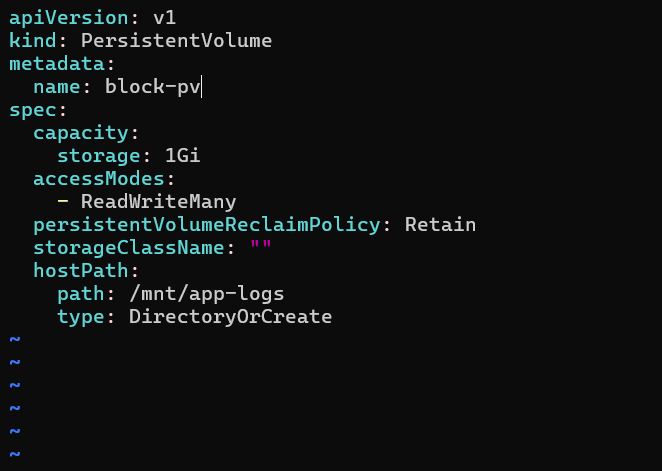
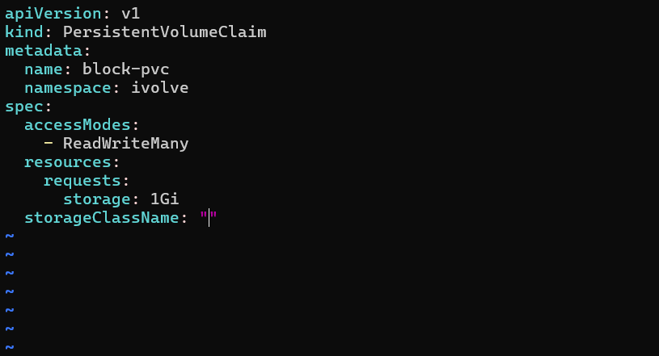

# IVOLVE Task 13 - Persistent Volumes and Persistent Volume Claims

This lab is part of the IVOLVE training program. It demonstrates how to create and manage Persistent Volumes (PV) and Persistent Volume Claims (PVC) in Kubernetes to provide persistent storage for applications.

## Lab Overview

In this lab you:

- **Create** a PersistentVolume (PV) to provision storage
- **Create** a PersistentVolumeClaim (PVC) to request storage from the PV
- **Understand** the relationship between PVs and PVCs
- **Verify** the binding between PV and PVC

## Why Persistent Volumes?

Persistent Volumes are essential for:

- **Data Persistence**: Store data that survives pod restarts and deletions
- **Stateful Applications**: Support databases, file storage, and stateful workloads
- **Storage Abstraction**: Decouple storage from pods
- **Storage Management**: Centralized storage provisioning
- **Portability**: Applications don't need to know storage details
- **Lifecycle Management**: Independent of pod lifecycle

## Understanding Persistent Volumes and Claims

### PersistentVolume (PV)

A **PersistentVolume** is a cluster-level resource that represents physical storage in the cluster. It is:
- Provisioned by cluster administrators
- Independent of any pod
- Can be statically or dynamically provisioned
- Has a lifecycle independent of pods

### PersistentVolumeClaim (PVC)

A **PersistentVolumeClaim** is a request for storage by a user. It is:
- Namespace-scoped resource
- Requests specific size and access modes
- Binds to a matching PersistentVolume
- Used by pods to access storage

### Binding Process

1. User creates a PVC with specific requirements
2. Kubernetes finds a matching PV
3. PV and PVC are bound together
4. Pod can use the PVC to access storage

## Project Requirements

### VMware Workstation

- **VMware Workstation** installed on your host machine
- **2 Virtual Machines** created:
  - **Master VM** (named `ks3`) - Control plane node
  - **Worker VM** - Worker node

### Kubernetes

- **Kubernetes cluster** with 2 nodes (master and worker)
- **kubeadm** installed on both VMs
- Access to `kubectl` command-line tool on master node
- Cluster admin permissions
- **Namespace `ivolve`** created (from previous labs)

### Operating System

- **CentOS Linux** or **Ubuntu Linux** on both VMs
- Network connectivity between VMs
- Docker and container runtime installed on both VMs
- Storage available on worker node for hostPath volumes

## Setup Instructions

### Prerequisites: VMware Workstation Setup

Before starting, ensure you have:

1. **VMware Workstation** installed on your host machine
2. **2 Virtual Machines** created:
   - **Master VM** (named `ks3` or similar) - Control plane node
   - **Worker VM** - Worker node
3. Both VMs should have:
   - Linux OS (CentOS or Ubuntu recommended)
   - Network connectivity between VMs
   - Docker and Kubernetes tools installed
4. **Kubernetes cluster** is running with both nodes in Ready state
5. **Namespace `ivolve`** exists (created in previous labs)

**Verify prerequisites:**

```bash
# Check cluster status
kubectl get nodes

# Verify namespace exists
kubectl get namespace ivolve
```

## How to Use the Project

### Step 1: Create PersistentVolume

Create a PersistentVolume to provision storage in the cluster.

#### Create PersistentVolume YAML

Create the PersistentVolume YAML file:

```bash
cat > persistent-volume.yaml << EOF
apiVersion: v1
kind: PersistentVolume
metadata:
  name: block-pv
spec:
  capacity:
    storage: 1Gi
  accessModes:
    - ReadWriteMany
  persistentVolumeReclaimPolicy: Retain
  storageClassName: ""
  hostPath:
    path: /mnt/app-logs
    type: DirectoryOrCreate
EOF
```

**Explanation:**
- `apiVersion: v1` - Kubernetes API version
- `kind: PersistentVolume` - Resource type
- `metadata.name: block-pv` - Name of the PersistentVolume
- `spec.capacity.storage: 1Gi` - Storage capacity (1 Gibibyte)
- `spec.accessModes: ReadWriteMany` - Access mode (can be mounted by multiple nodes)
- `spec.persistentVolumeReclaimPolicy: Retain` - What happens when PVC is deleted
- `spec.storageClassName: ""` - Empty string means no storage class (static provisioning)
- `spec.hostPath.path: /mnt/app-logs` - Path on the host node
- `spec.hostPath.type: DirectoryOrCreate` - Create directory if it doesn't exist

**Access Modes:**
- `ReadWriteOnce` (RWO): Can be mounted as read-write by a single node
- `ReadOnlyMany` (ROX): Can be mounted read-only by many nodes
- `ReadWriteMany` (RWX): Can be mounted as read-write by many nodes

**Reclaim Policies:**
- `Retain`: Manual reclamation (admin must delete PV)
- `Recycle`: Basic scrub (deprecated)
- `Delete`: Delete associated storage asset

#### Apply the PersistentVolume

```bash
kubectl apply -f persistent-volume.yaml
```

**Verify the PersistentVolume was created:**

```bash
kubectl get pv
```

You should see:

```
NAME      CAPACITY   ACCESS MODES   RECLAIM POLICY   STATUS      CLAIM   STORAGECLASS   REASON   AGE
block-pv  1Gi        RWX            Retain           Available                                   5s
```

**Status meanings:**
- `Available`: PV is available and not bound to any PVC
- `Bound`: PV is bound to a PVC
- `Released`: PVC was deleted, but PV is not yet reclaimed
- `Failed`: PV failed automatic reclamation

**Describe the PersistentVolume:**

```bash
kubectl describe pv block-pv
```



### Step 2: Create PersistentVolumeClaim

Create a PersistentVolumeClaim to request storage from the PersistentVolume.

#### Create PersistentVolumeClaim YAML

Create the PersistentVolumeClaim YAML file:

```bash
cat > persistent-volume-claim.yaml << EOF
apiVersion: v1
kind: PersistentVolumeClaim
metadata:
  name: block-pvc
  namespace: ivolve
spec:
  accessModes:
    - ReadWriteMany
  resources:
    requests:
      storage: 1Gi
  storageClassName: ""
EOF
```

**Explanation:**
- `apiVersion: v1` - Kubernetes API version
- `kind: PersistentVolumeClaim` - Resource type
- `metadata.name: block-pvc` - Name of the PersistentVolumeClaim
- `metadata.namespace: ivolve` - Namespace where PVC is created
- `spec.accessModes: ReadWriteMany` - Must match PV access mode
- `spec.resources.requests.storage: 1Gi` - Requested storage size (must be ≤ PV size)
- `spec.storageClassName: ""` - Empty string matches PV with empty storageClassName

**Important:** The PVC's access mode and storage size must match or be compatible with the PV.

#### Apply the PersistentVolumeClaim

```bash
kubectl apply -f persistent-volume-claim.yaml
```

**Verify the PersistentVolumeClaim was created:**

```bash
kubectl get pvc -n ivolve
```

You should see:

```
NAME       STATUS   VOLUME    CAPACITY   ACCESS MODES   STORAGECLASS   AGE
block-pvc  Bound    block-pv  1Gi        RWX                           5s
```

**Status meanings:**
- `Pending`: PVC is waiting for a matching PV
- `Bound`: PVC is bound to a PV
- `Lost`: PV was deleted or doesn't exist

**Describe the PersistentVolumeClaim:**

```bash
kubectl describe pvc block-pvc -n ivolve
```

**Verify the binding:**

```bash
kubectl get pv
```

The PV should now show `Bound` status:

```
NAME      CAPACITY   ACCESS MODES   RECLAIM POLICY   STATUS   CLAIM              STORAGECLASS   REASON   AGE
block-pv  1Gi        RWX            Retain           Bound    ivolve/block-pvc                   10s
```



## Using PVC in Pods

### Mount PVC as Volume

Create a pod that uses the PVC:

```bash
cat > pod-with-pvc.yaml << EOF
apiVersion: v1
kind: Pod
metadata:
  name: app-pod
  namespace: ivolve
spec:
  containers:
  - name: app
    image: nginx
    volumeMounts:
    - name: storage
      mountPath: /data
  volumes:
  - name: storage
    persistentVolumeClaim:
      claimName: block-pvc
EOF

kubectl apply -f pod-with-pvc.yaml
```

**Verify the pod can access storage:**

```bash
# Check pod is running
kubectl get pod app-pod -n ivolve

# Test writing to the volume
kubectl exec app-pod -n ivolve -- sh -c "echo 'Hello from PV' > /data/test.txt"

# Verify file exists
kubectl exec app-pod -n ivolve -- cat /data/test.txt
```

### Verify Data Persistence

Test that data persists after pod deletion:

```bash
# Delete the pod
kubectl delete pod app-pod -n ivolve

# Create a new pod with the same PVC
kubectl apply -f pod-with-pvc.yaml

# Wait for pod to be ready
kubectl wait --for=condition=ready pod app-pod -n ivolve

# Verify data still exists
kubectl exec app-pod -n ivolve -- cat /data/test.txt
```

The file should still exist, proving data persistence.

## Kubernetes Commands Reference

### PersistentVolume Commands

```bash
# Create PV from YAML
kubectl apply -f persistent-volume.yaml

# List all PVs
kubectl get pv

# Describe PV
kubectl describe pv <pv-name>

# Get PV YAML
kubectl get pv <pv-name> -o yaml

# Delete PV
kubectl delete pv <pv-name>

# Edit PV
kubectl edit pv <pv-name>
```

### PersistentVolumeClaim Commands

```bash
# Create PVC from YAML
kubectl apply -f persistent-volume-claim.yaml

# List PVCs in namespace
kubectl get pvc -n <namespace>
kubectl get pvc -n ivolve

# List all PVCs
kubectl get pvc --all-namespaces

# Describe PVC
kubectl describe pvc <pvc-name> -n <namespace>

# Get PVC YAML
kubectl get pvc <pvc-name> -n <namespace> -o yaml

# Delete PVC
kubectl delete pvc <pvc-name> -n <namespace>

# Edit PVC
kubectl edit pvc <pvc-name> -n <namespace>
```

### Volume Commands

```bash
# List volumes in pod
kubectl describe pod <pod-name> -n <namespace> | grep -A 10 Volumes

# Check volume mounts
kubectl get pod <pod-name> -n <namespace> -o jsonpath='{.spec.volumes}'
```

## Troubleshooting

### PV Not Available

If PV shows as unavailable:

```bash
# Check PV status
kubectl get pv

# Describe PV for details
kubectl describe pv block-pv

# Verify hostPath exists on worker node
# SSH to worker node and check
ls -la /mnt/app-logs

# Check node labels (for node affinity)
kubectl get nodes --show-labels
```

### PVC Not Binding

If PVC stays in Pending status:

```bash
# Check PVC status
kubectl get pvc -n ivolve

# Describe PVC for events
kubectl describe pvc block-pvc -n ivolve

# Verify PV exists and is Available
kubectl get pv

# Check access modes match
kubectl get pv block-pv -o jsonpath='{.spec.accessModes}'
kubectl get pvc block-pvc -n ivolve -o jsonpath='{.spec.accessModes}'

# Check storage size compatibility
kubectl get pv block-pv -o jsonpath='{.spec.capacity.storage}'
kubectl get pvc block-pvc -n ivolve -o jsonpath='{.spec.resources.requests.storage}'
```

### Pod Cannot Mount Volume

If pod cannot mount the PVC:

```bash
# Check pod status
kubectl get pod <pod-name> -n ivolve

# Check pod events
kubectl describe pod <pod-name> -n ivolve

# Verify PVC is bound
kubectl get pvc block-pvc -n ivolve

# Check volume mount in pod spec
kubectl get pod <pod-name> -n ivolve -o yaml | grep -A 10 volumeMounts
```

### Storage Not Accessible

If storage is not accessible:

```bash
# Check permissions on hostPath
# SSH to worker node
sudo ls -la /mnt/app-logs

# Fix permissions if needed
sudo chmod 777 /mnt/app-logs

# Verify pod can write
kubectl exec <pod-name> -n ivolve -- touch /data/test
```

## Best Practices

### 1. Use Storage Classes for Dynamic Provisioning

For production, use StorageClasses:

```yaml
apiVersion: storage.k8s.io/v1
kind: StorageClass
metadata:
  name: fast-ssd
provisioner: kubernetes.io/no-provisioner
volumeBindingMode: WaitForFirstConsumer
```

### 2. Match Access Modes to Use Case

Choose appropriate access mode:

```yaml
# Single pod: ReadWriteOnce
accessModes:
  - ReadWriteOnce

# Multiple pods, read-only: ReadOnlyMany
accessModes:
  - ReadOnlyMany

# Multiple pods, read-write: ReadWriteMany
accessModes:
  - ReadWriteMany
```

### 3. Use Appropriate Reclaim Policy

```yaml
# Development: Delete (auto-cleanup)
persistentVolumeReclaimPolicy: Delete

# Production: Retain (manual cleanup)
persistentVolumeReclaimPolicy: Retain
```

### 4. Set Resource Quotas for Storage

Limit storage per namespace:

```yaml
apiVersion: v1
kind: ResourceQuota
metadata:
  name: storage-quota
  namespace: ivolve
spec:
  hard:
    persistentvolumeclaims: "5"
    requests.storage: "50Gi"
```

### 5. Use Descriptive Names

```bash
# Good
kubectl create pv mysql-data-pv

# Bad
kubectl create pv pv1
```

## Storage Types

### hostPath (Local Storage)

```yaml
hostPath:
  path: /mnt/data
  type: DirectoryOrCreate
```

**Use cases:**
- Development and testing
- Single-node clusters
- Local storage requirements

**Limitations:**
- Not suitable for multi-node clusters
- Data tied to specific node
- No data replication

### NFS (Network File System)

```yaml
nfs:
  server: nfs-server.example.com
  path: /exports/data
```

**Use cases:**
- Shared storage across nodes
- ReadWriteMany access mode
- Centralized storage

### Cloud Storage

```yaml
# AWS EBS
awsElasticBlockStore:
  volumeID: vol-12345678

# GCE Persistent Disk
gcePersistentDisk:
  pdName: my-disk

# Azure Disk
azureDisk:
  diskName: my-disk
```

## Use Cases

### Database Storage

```yaml
apiVersion: v1
kind: PersistentVolume
metadata:
  name: mysql-pv
spec:
  capacity:
    storage: 10Gi
  accessModes:
    - ReadWriteOnce
  persistentVolumeReclaimPolicy: Retain
  hostPath:
    path: /mnt/mysql-data
```

### Log Storage

```yaml
apiVersion: v1
kind: PersistentVolume
metadata:
  name: logs-pv
spec:
  capacity:
    storage: 5Gi
  accessModes:
    - ReadWriteMany
  persistentVolumeReclaimPolicy: Retain
  hostPath:
    path: /mnt/app-logs
```

### Shared File Storage

```yaml
apiVersion: v1
kind: PersistentVolume
metadata:
  name: shared-pv
spec:
  capacity:
    storage: 20Gi
  accessModes:
    - ReadWriteMany
  persistentVolumeReclaimPolicy: Retain
  nfs:
    server: nfs.example.com
    path: /shared
```

## PV and PVC Lifecycle

### Creation Flow

1. **Admin creates PV** - Storage is provisioned
2. **User creates PVC** - Requests storage
3. **Kubernetes binds** - Matches PVC to PV
4. **Pod uses PVC** - Mounts volume

### Deletion Flow

1. **Delete Pod** - Pod is removed, data remains
2. **Delete PVC** - Claim is removed
3. **PV status changes** - Based on reclaim policy:
   - `Retain`: PV becomes `Released`, data preserved
   - `Delete`: PV is deleted, storage removed

### Reclaiming Retained PVs

For `Retain` policy, manually reclaim:

```bash
# Delete PVC
kubectl delete pvc block-pvc -n ivolve

# PV becomes Released
kubectl get pv

# Manually delete PV
kubectl delete pv block-pv

# Or edit PV to remove claim reference
kubectl patch pv block-pv -p '{"spec":{"claimRef":null}}'
```

## Notes

- PVs are cluster-scoped resources (not namespaced)
- PVCs are namespace-scoped resources
- One PV can only bind to one PVC
- One PVC can only bind to one PV
- Binding is based on matching access modes, size, and storage class
- hostPath volumes are only suitable for single-node or development
- For production, use cloud storage or network storage
- Data in hostPath volumes persists on the node's filesystem
- PVs with `Retain` policy must be manually cleaned up
- Storage size in PVC must be ≤ PV size for binding

## Next Steps

- Explore StorageClasses for dynamic provisioning
- Learn about StatefulSets with persistent storage
- Study volume snapshots and backups
- Investigate CSI (Container Storage Interface) drivers
- Consider using cloud provider storage solutions

## License

See the LICENSE file in the parent directory for license information.
