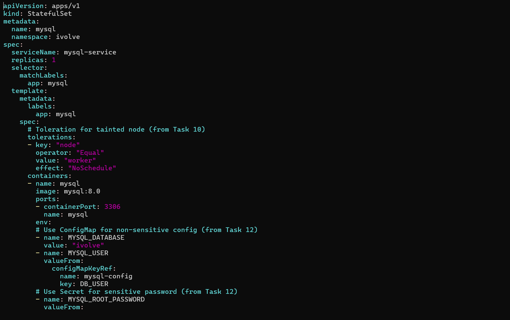
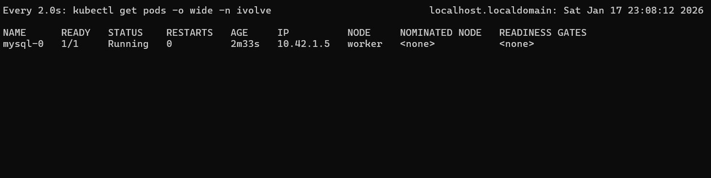
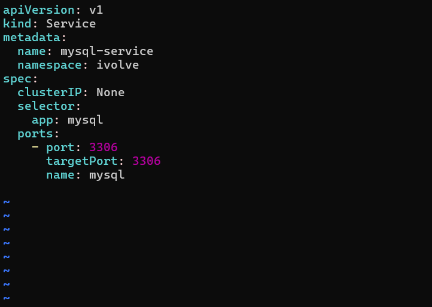
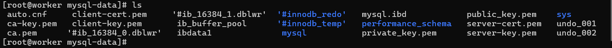

# IVOLVE Task 14 - MySQL StatefulSet with Persistent Storage

This lab is part of the IVOLVE training program. It demonstrates how to deploy a stateful MySQL database using StatefulSets, integrating concepts from previous labs including taints, secrets, persistent volumes, and services.

## Lab Overview

In this lab you:

- **Create** a StatefulSet with 1 replica running MySQL
- **Configure** the StatefulSet pods to consume the root password from the secret (from Task 12)
- **Add** a toleration to the StatefulSet pod spec for the taint key `node=worker` with effect `NoSchedule` (from Task 10)
- **Configure** a Persistent Volume Claim (PVC) and mount it to `/var/lib/mysql` in the StatefulSet
- **Write** a YAML manifest for a headless service (clusterIP: None) targeting the MySQL StatefulSet pods
- **Confirm** the database is operational by connecting with a MySQL client

## Prerequisites from Previous Tasks

This lab builds upon concepts from previous tasks:

### Task 10: Node Taints
- A worker node is tainted with `node=worker:NoSchedule`
- We'll add a toleration to allow the StatefulSet to run on this tainted node

### Task 11: Namespace
- Namespace `ivolve` exists and is ready for use

### Task 12: ConfigMaps and Secrets
- ConfigMap `mysql-config` with `DB_HOST` and `DB_USER`
- Secret `mysql-secret` with `DB_PASSWORD` and `MYSQL_ROOT_PASSWORD` (base64 encoded)

### Task 13: Persistent Volumes
- Understanding of PersistentVolumes and PersistentVolumeClaims

**Verify prerequisites:**

```bash
# Check tainted node exists
kubectl get nodes
kubectl describe node <worker-node-name> | grep Taints

# Verify namespace exists
kubectl get namespace ivolve

# Verify ConfigMap and Secret exist
kubectl get configmap mysql-config -n ivolve
kubectl get secret mysql-secret -n ivolve
```

## Why StatefulSets?

StatefulSets are essential for:

- **Stateful Applications**: Databases, message queues, and other stateful workloads
- **Stable Network Identity**: Each pod gets a stable hostname
- **Ordered Deployment**: Pods are created and deleted in order
- **Stable Storage**: Each pod gets its own persistent volume
- **Service Discovery**: Headless services provide stable DNS names
- **Data Persistence**: Survives pod restarts and rescheduling

## Understanding StatefulSets

### StatefulSet vs Deployment

| Feature | Deployment | StatefulSet |
|---------|-----------|-------------|
| Pod Identity | Random | Stable (ordinal) |
| Storage | Shared | Individual per pod |
| Network | Service IP | Stable DNS |
| Scaling | Any order | Ordered |
| Use Case | Stateless apps | Stateful apps |

### Headless Service

A **headless service** (`clusterIP: None`) provides:
- Stable DNS names for each pod
- Direct pod-to-pod communication
- Service discovery without load balancing
- Format: `<pod-name>.<service-name>.<namespace>.svc.cluster.local`

## Project Requirements

### VMware Workstation

- **VMware Workstation** installed on your host machine
- **2 Virtual Machines** created:
  - **Master VM** (named `ks3`) - Control plane node
  - **Worker VM** - Worker node (tainted with `node=worker:NoSchedule`)

### Kubernetes

- **Kubernetes cluster** with 2 nodes (master and worker)
- **kubeadm** installed on both VMs
- Access to `kubectl` command-line tool on master node
- Cluster admin permissions
- **All prerequisites from Tasks 10, 11, 12, 13** completed

### MySQL

- **MySQL 8.0** Docker image will be used
- MySQL client for testing connection

## Setup Instructions

### Prerequisites: Verify Previous Tasks

Before starting, ensure all previous tasks are completed:

```bash
# Task 10: Verify tainted node
kubectl describe node <worker-node-name> | grep -A 5 Taints
# Should show: node=worker:NoSchedule

# Task 11: Verify namespace
kubectl get namespace ivolve

# Task 12: Verify ConfigMap and Secret
kubectl get configmap mysql-config -n ivolve
kubectl get secret mysql-secret -n ivolve

# Task 13: Understanding of PV/PVC concepts
```

## How to Use the Project

### Step 1: Create PersistentVolume for MySQL

Create a PersistentVolume specifically for MySQL with ReadWriteOnce access mode:

```bash
cat > mysql-pv.yaml << EOF
apiVersion: v1
kind: PersistentVolume
metadata:
  name: mysql-pv
spec:
  capacity:
    storage: 5Gi
  accessModes:
    - ReadWriteOnce
  persistentVolumeReclaimPolicy: Retain
  storageClassName: ""
  hostPath:
    path: /mnt/mysql-data
    type: DirectoryOrCreate
EOF

kubectl apply -f mysql-pv.yaml
```

**Verify the PV was created:**

```bash
kubectl get pv mysql-pv
```

### Step 2: Create PersistentVolumeClaim for MySQL

Create a PersistentVolumeClaim that matches the PV:

```bash
cat > mysql-pvc.yaml << EOF
apiVersion: v1
kind: PersistentVolumeClaim
metadata:
  name: mysql-pvc
  namespace: ivolve
spec:
  accessModes:
    - ReadWriteOnce
  resources:
    requests:
      storage: 5Gi
  storageClassName: ""
EOF

kubectl apply -f mysql-pvc.yaml
```

**Verify the PVC is bound:**

```bash
kubectl get pvc mysql-pvc -n ivolve
```

You should see `STATUS: Bound`.

### Step 3: Create MySQL StatefulSet

Create a StatefulSet YAML file that integrates all previous task components:

```bash
cat > mysql-statefulset.yaml << EOF
apiVersion: apps/v1
kind: StatefulSet
metadata:
  name: mysql
  namespace: ivolve
spec:
  serviceName: mysql-service
  replicas: 1
  selector:
    matchLabels:
      app: mysql
  template:
    metadata:
      labels:
        app: mysql
    spec:
      # Toleration for tainted node (from Task 10)
      tolerations:
      - key: "node"
        operator: "Equal"
        value: "worker"
        effect: "NoSchedule"
      containers:
      - name: mysql
        image: mysql:8.0
        ports:
        - containerPort: 3306
          name: mysql
        env:
        # Use ConfigMap for non-sensitive config (from Task 12)
        - name: MYSQL_DATABASE
          value: "ivolve"
        - name: MYSQL_USER
          valueFrom:
            configMapKeyRef:
              name: mysql-config
              key: DB_USER
        # Use Secret for sensitive password (from Task 12)
        - name: MYSQL_ROOT_PASSWORD
          valueFrom:
            secretKeyRef:
              name: mysql-secret
              key: MYSQL_ROOT_PASSWORD
        - name: MYSQL_PASSWORD
          valueFrom:
            secretKeyRef:
              name: mysql-secret
              key: DB_PASSWORD
        volumeMounts:
        - name: mysql-data
          mountPath: /var/lib/mysql
      volumes:
      # Use MySQL PVC
      - name: mysql-data
        persistentVolumeClaim:
          claimName: mysql-pvc
EOF
```

**Key components explained:**

1. **Toleration (from Task 10):**
```yaml
tolerations:
- key: "node"
  operator: "Equal"
  value: "worker"
  effect: "NoSchedule"
```
   - Allows pod to be scheduled on node tainted with `node=worker:NoSchedule`

2. **Secret Reference (from Task 12):**
```yaml
env:
- name: MYSQL_ROOT_PASSWORD
  valueFrom:
    secretKeyRef:
      name: mysql-secret
      key: MYSQL_ROOT_PASSWORD
```
   - Consumes root password from the secret created in Task 12
   - Kubernetes automatically decodes base64 values

3. **ConfigMap Reference (from Task 12):**
```yaml
env:
- name: MYSQL_USER
  valueFrom:
    configMapKeyRef:
      name: mysql-config
      key: DB_USER
```
   - Uses database user from ConfigMap

4. **Persistent Volume Claim:**
```yaml
volumes:
- name: mysql-data
  persistentVolumeClaim:
    claimName: mysql-pvc
```
   - Mounts PVC to `/var/lib/mysql` for data persistence
   - Uses ReadWriteOnce access mode (appropriate for MySQL)

**Apply the StatefulSet:**

```bash
kubectl apply -f mysql-statefulset.yaml
```

**Verify the StatefulSet:**

```bash
kubectl get statefulset -n ivolve
```

You should see:

```
NAME    READY   AGE
mysql   0/1     10s
```

**Check pod status:**

```bash
kubectl get pods -n ivolve -l app=mysql
```

**Wait for pod to be ready:**

```bash
kubectl wait --for=condition=ready pod -l app=mysql -n ivolve --timeout=300s
```



**Verify pod is scheduled on tainted node:**

```bash
kubectl get pod -n ivolve -l app=mysql -o wide
```

The pod should be running on the worker node (the one with the taint).



### Step 4: Create Headless Service

Create a headless service (clusterIP: None) for the MySQL StatefulSet:

```bash
cat > mysql-service.yaml << EOF
apiVersion: v1
kind: Service
metadata:
  name: mysql-service
  namespace: ivolve
spec:
  clusterIP: None
  selector:
    app: mysql
  ports:
  - port: 3306
    targetPort: 3306
    name: mysql
EOF
```

**Explanation:**
- `clusterIP: None` - Makes it a headless service
- `selector.app: mysql` - Targets pods with label `app=mysql`
- `port: 3306` - Service port
- `targetPort: 3306` - Container port

**Apply the service:**

```bash
kubectl apply -f mysql-service.yaml
```

**Verify the service:**

```bash
kubectl get svc mysql-service -n ivolve
```

You should see:

```
NAME            TYPE        CLUSTER-IP   EXTERNAL-IP   PORT(S)    AGE
mysql-service   ClusterIP   None         <none>        3306/TCP   5s
```

**Note:** `CLUSTER-IP` shows `None`, confirming it's a headless service.



### Step 5: Verify Persistent Storage

Verify that the persistent volume is mounted correctly:

```bash
# Check volume mount in pod
kubectl describe pod mysql-0 -n ivolve | grep -A 10 Mounts

# Verify storage is accessible
kubectl exec mysql-0 -n ivolve -- ls -la /var/lib/mysql
```

You should see MySQL data files in the directory.



### Step 6: Confirm Database is Operational

#### Get Root Password

Retrieve the root password from the secret:

```bash
# Get and decode the root password
ROOT_PASSWORD=$(kubectl get secret mysql-secret -n ivolve -o jsonpath='{.data.MYSQL_ROOT_PASSWORD}' | base64 -d)

# Display it (for verification)
echo "Root password: $ROOT_PASSWORD"
```

#### Connect to MySQL Database

**Method 1: Using kubectl exec (Direct Connection)**

```bash
# Connect to MySQL
kubectl exec -it mysql-0 -n ivolve -- mysql -u root -p$ROOT_PASSWORD
```

**Method 2: Using Headless Service DNS**

```bash
# Create a temporary MySQL client pod
kubectl run mysql-client --image=mysql:8.0 --rm -it --restart=Never -n ivolve -- \
  mysql -h mysql-service.ivolve.svc.cluster.local -u root -p$ROOT_PASSWORD
```

#### Verify Database Operations

Once connected, run these SQL commands:

```sql
-- 1. Show all databases (should see 'ivolve' database)
SHOW DATABASES;

-- 2. Use the ivolve database
USE ivolve;

-- 3. Show tables (initially empty)
SHOW TABLES;

-- 4. Create a test table
CREATE TABLE test_table (
    id INT AUTO_INCREMENT PRIMARY KEY,
    name VARCHAR(50),
    created_at TIMESTAMP DEFAULT CURRENT_TIMESTAMP
);

-- 5. Insert test data
INSERT INTO test_table (name) VALUES ('Hello from MySQL StatefulSet');
INSERT INTO test_table (name) VALUES ('Database is operational!');

-- 6. Query the data
SELECT * FROM test_table;

-- 7. Check MySQL version
SELECT VERSION();

-- 8. Show current user
SELECT USER();

-- 9. Exit
EXIT;
```

#### Test Data Persistence

Verify that data persists across pod restarts:

```bash
# 1. Get root password
ROOT_PASSWORD=$(kubectl get secret mysql-secret -n ivolve -o jsonpath='{.data.MYSQL_ROOT_PASSWORD}' | base64 -d)

# 2. Query data before restart
kubectl exec mysql-0 -n ivolve -- mysql -u root -p$ROOT_PASSWORD -e "USE ivolve; SELECT * FROM test_table;"

# 3. Delete the pod (StatefulSet will recreate it)
kubectl delete pod mysql-0 -n ivolve

# 4. Wait for pod to be ready (this may take 1-2 minutes)
kubectl wait --for=condition=ready pod mysql-0 -n ivolve --timeout=300s

# 5. Query data after restart (should still exist!)
kubectl exec mysql-0 -n ivolve -- mysql -u root -p$ROOT_PASSWORD -e "USE ivolve; SELECT * FROM test_table;"
```

The data should still exist, proving persistent storage is working.

## Integration Summary

This lab integrates all previous tasks:

### Task 10 Integration: Taints and Tolerations
- Worker node is tainted with `node=worker:NoSchedule`
- StatefulSet has toleration to run on tainted node
- Pod is scheduled on the worker node

### Task 11 Integration: Namespace
- All resources created in `ivolve` namespace
- Namespace provides logical isolation

### Task 12 Integration: ConfigMaps and Secrets
- ConfigMap `mysql-config` provides `DB_USER`
- Secret `mysql-secret` provides `MYSQL_ROOT_PASSWORD` and `DB_PASSWORD`
- Values are consumed as environment variables

### Task 13 Integration: Persistent Storage
- PersistentVolume `mysql-pv` provides storage (5Gi, ReadWriteOnce)
- PersistentVolumeClaim `mysql-pvc` requests and binds to the PV
- Mounted to `/var/lib/mysql` for data persistence
- Data survives pod restarts

## Project Structure

```
task-14/
├── mysql-pv.yaml              # PersistentVolume for MySQL
├── mysql-pvc.yaml             # PersistentVolumeClaim for MySQL
├── mysql-statefulset.yaml     # MySQL StatefulSet
├── mysql-service.yaml        # Headless service for MySQL
└── screenshots/               # Lab screenshots
```

## Kubernetes Commands Reference

### StatefulSet Commands

```bash
# Create StatefulSet
kubectl apply -f mysql-statefulset.yaml

# List StatefulSets
kubectl get statefulset -n ivolve
kubectl get sts -n ivolve

# Describe StatefulSet
kubectl describe statefulset mysql -n ivolve

# Scale StatefulSet
kubectl scale statefulset mysql --replicas=3 -n ivolve

# Delete StatefulSet
kubectl delete statefulset mysql -n ivolve
```

### Service Commands

```bash
# Create service
kubectl apply -f mysql-service.yaml

# List services
kubectl get svc -n ivolve

# Describe service
kubectl describe svc mysql-service -n ivolve

# Test service DNS
kubectl run -it --rm --image=busybox --restart=Never test-dns -n ivolve -- \
  nslookup mysql-service.ivolve.svc.cluster.local
```

### Pod Commands

```bash
# List pods
kubectl get pods -n ivolve -l app=mysql

# Describe pod
kubectl describe pod mysql-0 -n ivolve

# View logs
kubectl logs mysql-0 -n ivolve

# Execute command in pod
kubectl exec -it mysql-0 -n ivolve -- bash

# Connect to MySQL
kubectl exec -it mysql-0 -n ivolve -- mysql -u root -p
```

## Best Practices

### 1. Use StatefulSets for Stateful Applications

StatefulSets provide:
- Stable network identity
- Ordered deployment/scaling
- Stable storage per pod

### 2. Use Headless Services for StatefulSets

Headless services provide:
- Stable DNS names
- Direct pod-to-pod communication
- No load balancing overhead

### 3. Use ReadWriteOnce for Databases

MySQL and most databases need:
- Exclusive access to storage
- ReadWriteOnce access mode
- Proper volume sizing (5Gi+ recommended)

### 4. Store Secrets Properly

- Never hardcode passwords
- Use Kubernetes Secrets
- Base64 encode in YAML
- Rotate secrets regularly

### 5. Add Resource Limits

```yaml
resources:
  requests:
    memory: "512Mi"
    cpu: "250m"
  limits:
    memory: "1Gi"
    cpu: "500m"
```

## Use Cases

### Database Deployment

StatefulSets are perfect for:
- MySQL, PostgreSQL, MongoDB
- Message queues (RabbitMQ, Kafka)
- Cache systems (Redis Cluster)
- Any stateful application

### High Availability

Scale StatefulSet for HA:

```bash
kubectl scale statefulset mysql --replicas=3 -n ivolve
```

Each replica gets:
- Unique hostname (mysql-0, mysql-1, mysql-2)
- Own persistent volume
- Stable DNS name

## Notes

- StatefulSets create pods with ordinal names (mysql-0, mysql-1, etc.)
- Headless services provide DNS: `<pod-name>.<service-name>.<namespace>.svc.cluster.local`
- PVCs are created per pod when using volumeClaimTemplates
- Tolerations must match taints exactly (key, value, effect)
- Secrets are automatically base64-decoded when used in pods
- Data in `/var/lib/mysql` persists across pod restarts
- StatefulSets maintain pod identity and storage
- Headless services don't provide load balancing
- ReadWriteOnce is the correct access mode for MySQL (single pod)

## Next Steps

- Scale StatefulSet to multiple replicas
- Configure MySQL replication
- Set up backup strategies
- Implement monitoring and alerting
- Explore StatefulSet update strategies

## License

See the LICENSE file in the parent directory for license information.
