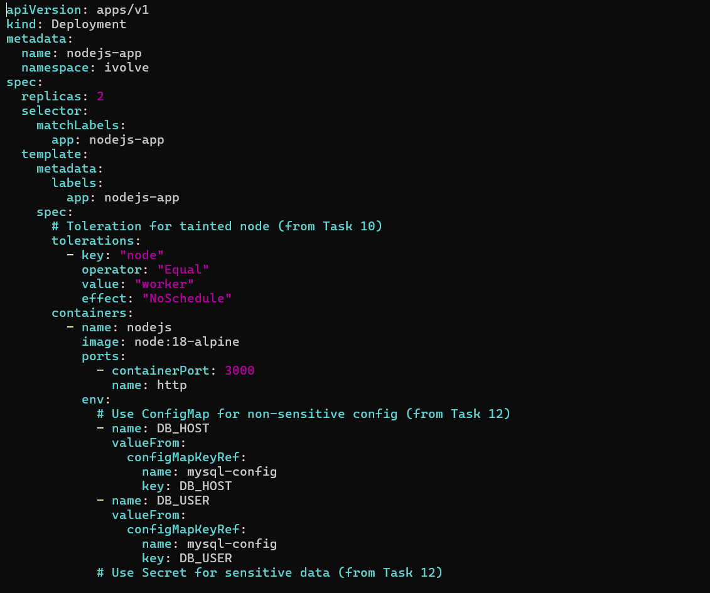
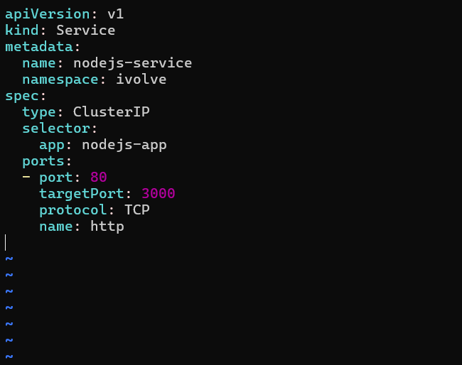

# IVOLVE Task 15 - Node.js Application Deployment with ClusterIP Service

This lab is part of the IVOLVE training program. It demonstrates how to deploy a Node.js application using Deployments, integrate with ConfigMaps, Secrets, persistent storage, and expose it using a ClusterIP service.

## Lab Overview

In this lab you:

- **Create** a Deployment named `nodejs-app` with 2 replicas (note: only 1 pod will be running due to resource quota from Task 11)
- **Use** a Node.js image from Docker Hub
- **Configure** pods to use environment variables from ConfigMap and Secret (from Task 12)
- **Add** a toleration to the pod spec with key `node=worker` with effect `NoSchedule` (from Task 10)
- **Configure** pod to use the static created PV (ReadWriteMany from Task 13)
- **Create** a ClusterIP service named `nodejs-service` to balance traffic across all deployment replicas

## Prerequisites from Previous Tasks

This lab builds upon concepts from previous tasks:

### Task 10: Node Taints
- A worker node is tainted with `node=worker:NoSchedule`
- We'll add a toleration to allow pods to run on this tainted node

### Task 11: Namespace and Resource Quota
- Namespace `ivolve` exists
- Resource quota limits pods to 2 (that's why only 1 pod runs when requesting 2 replicas)

### Task 12: ConfigMaps and Secrets
- ConfigMap `mysql-config` with `DB_HOST` and `DB_USER`
- Secret `mysql-secret` with `DB_PASSWORD` and `MYSQL_ROOT_PASSWORD`
- We'll use these for the Node.js app configuration

### Task 13: Persistent Volumes
- PersistentVolume `block-pv` with ReadWriteMany access mode
- PersistentVolumeClaim `block-pvc` bound to the PV
- We'll mount this for application logs/data

**Verify prerequisites:**

```bash
# Check tainted node exists
kubectl get nodes
kubectl describe node <worker-node-name> | grep Taints

# Verify namespace and quota
kubectl get namespace ivolve
kubectl get resourcequota -n ivolve

# Verify ConfigMap and Secret exist
kubectl get configmap mysql-config -n ivolve
kubectl get secret mysql-secret -n ivolve

# Verify PVC exists and is bound
kubectl get pvc block-pvc -n ivolve
```

## Why Deployments?

Deployments are essential for:

- **Stateless Applications**: Perfect for web applications, APIs, and stateless services
- **Rolling Updates**: Zero-downtime updates
- **Rollback Capability**: Easy rollback to previous versions
- **Scaling**: Easy horizontal scaling
- **Self-Healing**: Automatically replaces failed pods
- **Replica Management**: Maintains desired number of replicas

## Understanding Deployments vs StatefulSets

| Feature | Deployment | StatefulSet |
|---------|-----------|-------------|
| Pod Identity | Random | Stable (ordinal) |
| Storage | Shared or individual | Individual per pod |
| Network | Service IP | Stable DNS |
| Scaling | Any order | Ordered |
| Use Case | Stateless apps | Stateful apps |

## Understanding ClusterIP Services

A **ClusterIP service** provides:
- Internal cluster access only
- Load balancing across pod replicas
- Stable IP address and DNS name
- Service discovery within the cluster
- Format: `<service-name>.<namespace>.svc.cluster.local`

## Project Requirements

### VMware Workstation

- **VMware Workstation** installed on your host machine
- **2 Virtual Machines** created:
  - **Master VM** (named `ks3`) - Control plane node
  - **Worker VM** - Worker node (tainted with `node=worker:NoSchedule`)

### Kubernetes

- **Kubernetes cluster** with 2 nodes (master and worker)
- **kubeadm** installed on both VMs
- Access to `kubectl` command-line tool on master node
- Cluster admin permissions
- **All prerequisites from Tasks 10, 11, 12, 13** completed

### Node.js

- **Node.js** Docker image from Docker Hub (e.g., `node:18-alpine`)
- Application will use environment variables for configuration

## Setup Instructions

### Prerequisites: Verify Previous Tasks

Before starting, ensure all previous tasks are completed:

```bash
# Task 10: Verify tainted node
kubectl describe node <worker-node-name> | grep -A 5 Taints
# Should show: node=worker:NoSchedule

# Task 11: Verify namespace and quota
kubectl get namespace ivolve
kubectl get resourcequota -n ivolve
# Should show pod limit: pods: X/2

# Task 12: Verify ConfigMap and Secret
kubectl get configmap mysql-config -n ivolve
kubectl get secret mysql-secret -n ivolve

# Task 13: Verify PVC (ReadWriteMany)
kubectl get pvc block-pvc -n ivolve
# Should show STATUS: Bound
```

## How to Use the Project

### Step 1: Create Node.js Deployment

Create a Deployment YAML file that integrates all previous task components:

```bash
cat > nodejs-deployment.yaml << EOF
apiVersion: apps/v1
kind: Deployment
metadata:
  name: nodejs-app
  namespace: ivolve
spec:
  replicas: 2
  selector:
    matchLabels:
      app: nodejs-app
  template:
    metadata:
      labels:
        app: nodejs-app
    spec:
      # Toleration for tainted node (from Task 10)
      tolerations:
      - key: "node"
        operator: "Equal"
        value: "worker"
        effect: "NoSchedule"
      containers:
      - name: nodejs
        image: node:18-alpine
        ports:
        - containerPort: 3000
          name: http
        env:
        # Use ConfigMap for non-sensitive config (from Task 12)
        - name: DB_HOST
          valueFrom:
            configMapKeyRef:
              name: mysql-config
              key: DB_HOST
        - name: DB_USER
          valueFrom:
            configMapKeyRef:
              name: mysql-config
              key: DB_USER
        # Use Secret for sensitive data (from Task 12)
        - name: DB_PASSWORD
          valueFrom:
            secretKeyRef:
              name: mysql-secret
              key: DB_PASSWORD
        # Application port
        - name: PORT
          value: "3000"
        volumeMounts:
        - name: app-storage
          mountPath: /app/data
      volumes:
      # Use ReadWriteMany PVC from Task 13
      - name: app-storage
        persistentVolumeClaim:
          claimName: block-pvc
EOF
```

**Key components explained:**

1. **Toleration (from Task 10):**
```yaml
tolerations:
- key: "node"
  operator: "Equal"
  value: "worker"
  effect: "NoSchedule"
```
   - Allows pods to be scheduled on node tainted with `node=worker:NoSchedule`

2. **ConfigMap Reference (from Task 12):**
```yaml
env:
- name: DB_HOST
  valueFrom:
    configMapKeyRef:
      name: mysql-config
      key: DB_HOST
```
   - Uses `DB_HOST` and `DB_USER` from ConfigMap

3. **Secret Reference (from Task 12):**
```yaml
env:
- name: DB_PASSWORD
  valueFrom:
    secretKeyRef:
      name: mysql-secret
      key: DB_PASSWORD
```
   - Uses `DB_PASSWORD` from Secret

4. **Persistent Volume Claim (from Task 13):**
```yaml
volumes:
- name: app-storage
  persistentVolumeClaim:
    claimName: block-pvc
```
   - Uses `block-pvc` with ReadWriteMany access mode
   - Mounted to `/app/data` for shared storage

**Apply the Deployment:**

```bash
kubectl apply -f nodejs-deployment.yaml
```

**Verify the Deployment:**

```bash
kubectl get deployment nodejs-app -n ivolve
```

You should see:

```
NAME        READY   UP-TO-DATE   AVAILABLE   AGE
nodejs-app  1/2     2            1           10s
```

**Note:** Only 1 pod is running because of the resource quota from Task 11 (pods: 2/2 limit, and MySQL pod is already using 1).

**Check pod status:**

```bash
kubectl get pods -n ivolve -l app=nodejs-app
```

You should see:

```
NAME                         READY   STATUS    RESTARTS   AGE
nodejs-app-xxxxxxxxxx-xxxxx  1/1     Running   0          30s
nodejs-app-xxxxxxxxxx-yyyyy  0/1     Pending   0          30s
```

One pod is `Running`, the other is `Pending` (due to resource quota).

**Verify pod is scheduled on tainted node:**

```bash
kubectl get pod -n ivolve -l app=nodejs-app -o wide
```

The running pod should be on the worker node (the one with the taint).

**Verify toleration is working:**

```bash
kubectl describe pod -n ivolve -l app=nodejs-app | grep -A 5 Tolerations
```

**Screenshot: Node.js Deployment**



### Step 2: Create ClusterIP Service

Create a ClusterIP service to expose the Node.js application:

```bash
cat > nodejs-service.yaml << EOF
apiVersion: v1
kind: Service
metadata:
  name: nodejs-service
  namespace: ivolve
spec:
  type: ClusterIP
  selector:
    app: nodejs-app
  ports:
  - port: 80
    targetPort: 3000
    protocol: TCP
    name: http
EOF
```

**Explanation:**
- `type: ClusterIP` - Default service type (internal cluster access)
- `selector.app: nodejs-app` - Targets pods with label `app=nodejs-app`
- `port: 80` - Service port (external)
- `targetPort: 3000` - Container port (where Node.js app listens)
- `protocol: TCP` - Protocol used

**Apply the service:**

```bash
kubectl apply -f nodejs-service.yaml
```

**Verify the service:**

```bash
kubectl get svc nodejs-service -n ivolve
```

You should see:

```
NAME            TYPE        CLUSTER-IP      EXTERNAL-IP   PORT(S)   AGE
nodejs-service  ClusterIP   10.96.xxx.xxx   <none>        80/TCP    5s
```

**Describe the service:**

```bash
kubectl describe svc nodejs-service -n ivolve
```

**Verify service endpoints:**

```bash
kubectl get endpoints nodejs-service -n ivolve
```

This shows the pod IPs that the service is load balancing to.

**Screenshot: ClusterIP Service**



### Step 3: Verify Deployment Configuration

**Check environment variables in pod:**

```bash
# Get the running pod name
POD_NAME=$(kubectl get pods -n ivolve -l app=nodejs-app -o jsonpath='{.items[0].metadata.name}')

# Check environment variables
kubectl exec $POD_NAME -n ivolve -- env | grep -E "DB_|PORT"
```

You should see:
- `DB_HOST` from ConfigMap
- `DB_USER` from ConfigMap
- `DB_PASSWORD` from Secret
- `PORT=3000`

**Verify persistent volume is mounted:**

```bash
kubectl exec $POD_NAME -n ivolve -- ls -la /app/data
```

The directory should be accessible and writable.

**Check pod logs:**

```bash
kubectl logs $POD_NAME -n ivolve
```

### Step 4: Test the Service

**Get service ClusterIP:**

```bash
kubectl get svc nodejs-service -n ivolve -o jsonpath='{.spec.clusterIP}'
```

**Test service from within cluster:**

```bash
# Create a test pod to access the service
kubectl run curl-test --image=curlimages/curl --rm -it --restart=Never -n ivolve -- \
  curl http://nodejs-service.ivolve.svc.cluster.local

# Or using the ClusterIP directly
CLUSTER_IP=$(kubectl get svc nodejs-service -n ivolve -o jsonpath='{.spec.clusterIP}')
kubectl run curl-test --image=curlimages/curl --rm -it --restart=Never -n ivolve -- \
  curl http://$CLUSTER_IP
```

**Test service DNS resolution:**

```bash
kubectl run test-dns --image=busybox --rm -it --restart=Never -n ivolve -- \
  nslookup nodejs-service.ivolve.svc.cluster.local
```

## Integration Summary

This lab integrates all previous tasks:

### Task 10 Integration: Taints and Tolerations
- Worker node is tainted with `node=worker:NoSchedule`
- Deployment has toleration to run on tainted node
- Pods are scheduled on the worker node

### Task 11 Integration: Namespace and Resource Quota
- All resources created in `ivolve` namespace
- Resource quota limits pods to 2
- Only 1 pod runs when requesting 2 replicas (MySQL pod uses 1 slot)

### Task 12 Integration: ConfigMaps and Secrets
- ConfigMap `mysql-config` provides `DB_HOST` and `DB_USER`
- Secret `mysql-secret` provides `DB_PASSWORD`
- Values are consumed as environment variables

### Task 13 Integration: Persistent Storage
- PersistentVolumeClaim `block-pvc` (ReadWriteMany) provides shared storage
- Mounted to `/app/data` for application data/logs
- Multiple pods can access the same volume

## Project Structure

```
task-15/
├── nodejs-deployment.yaml    # Node.js Deployment
├── nodejs-service.yaml      # ClusterIP Service
└── screenshots/              # Lab screenshots
```

## Kubernetes Commands Reference

### Deployment Commands

```bash
# Create Deployment
kubectl apply -f nodejs-deployment.yaml

# List Deployments
kubectl get deployment -n ivolve
kubectl get deploy -n ivolve

# Describe Deployment
kubectl describe deployment nodejs-app -n ivolve

# Scale Deployment
kubectl scale deployment nodejs-app --replicas=3 -n ivolve

# Update Deployment
kubectl set image deployment/nodejs-app nodejs=node:20-alpine -n ivolve

# Rollout status
kubectl rollout status deployment/nodejs-app -n ivolve

# Rollback Deployment
kubectl rollout undo deployment/nodejs-app -n ivolve
```

### Service Commands

```bash
# Create service
kubectl apply -f nodejs-service.yaml

# List services
kubectl get svc -n ivolve

# Describe service
kubectl describe svc nodejs-service -n ivolve

# Get service endpoints
kubectl get endpoints nodejs-service -n ivolve

# Test service DNS
kubectl run test --image=busybox --rm -it --restart=Never -n ivolve -- \
  nslookup nodejs-service.ivolve.svc.cluster.local
```

### Pod Commands

```bash
# List pods
kubectl get pods -n ivolve -l app=nodejs-app

# Describe pod
kubectl describe pod <pod-name> -n ivolve

# View logs
kubectl logs <pod-name> -n ivolve

# View logs from all pods
kubectl logs -l app=nodejs-app -n ivolve

# Execute command in pod
kubectl exec -it <pod-name> -n ivolve -- sh
```

## Troubleshooting

During the deployment of this lab, we encountered two common issues and their solutions:

### Issue 1: CrashLoopBackOff - Container Exiting Immediately

**Problem:**
After applying the Node.js deployment, the pod was in `CrashLoopBackOff` status:

```bash
kubectl get pods -n ivolve
NAME                          READY   STATUS             RESTARTS   AGE
nodejs-app-5795cbc847-jt8l4   0/1     CrashLoopBackOff   2          68s
```

**Root Cause:**
The `node:18-alpine` image doesn't have a default command to run. When the container starts, it immediately exits because there's no application or process to keep it running.

**Solution:**
Added a command to the container specification that runs a simple Node.js HTTP server:

```yaml
containers:
  - name: nodejs
    image: node:18-alpine
    command:
    - sh
    - -c
    - |
      node -e "
      const http = require('http');
      const port = process.env.PORT || 3000;
      const server = http.createServer((req, res) => {
        res.writeHead(200, {'Content-Type': 'text/plain'});
        res.end('Hello from Node.js App!\nDB_HOST: ' + (process.env.DB_HOST || 'N/A') + '\nDB_USER: ' + (process.env.DB_USER || 'N/A'));
      });
      server.listen(port, '0.0.0.0', () => {
        console.log('Node.js server running on port', port);
      });
      "
```

**Explanation:**
- The command creates a simple HTTP server using Node.js built-in `http` module
- The server listens on port 3000 (from `PORT` environment variable)
- It responds with a message showing environment variables from ConfigMap
- The server keeps the container running indefinitely

**Verification:**
After applying the fix, check the pod logs:

```bash
kubectl logs -n ivolve -l app=nodejs-app
```

You should see: `Node.js server running on port 3000`

### Issue 2: Missing Resource Requests and Limits Warning

**Problem:**
Kubernetes issued a warning when applying the deployment:

```
One or more containers do not have resources - this can cause noisy neighbor issues
```

**Root Cause:**
The container specification was missing resource requests and limits. Without these, Kubernetes cannot:
- Properly schedule pods based on available resources
- Prevent one pod from consuming all available resources (noisy neighbor)
- Enforce resource quotas effectively

**Solution:**
Added resource requests and limits to the container specification:

```yaml
containers:
  - name: nodejs
    # ... other configuration ...
    resources:
      requests:
        memory: "256Mi"
        cpu: "100m"
      limits:
        memory: "512Mi"
        cpu: "500m"
```

**Explanation:**
- **Requests**: Guaranteed resources (256Mi memory, 100m CPU) - Kubernetes reserves these for the pod
- **Limits**: Maximum allowed resources (512Mi memory, 500m CPU) - Pod cannot exceed these
- Prevents noisy neighbor issues by bounding resource consumption
- Helps Kubernetes scheduler make better placement decisions
- Enables proper resource quota enforcement

**Best Practice:**
Always define resource requests and limits for production workloads to:
- Ensure predictable performance
- Prevent resource exhaustion
- Enable proper scheduling
- Support autoscaling

**Verification:**
After adding resources, the warning should disappear. Verify with:

```bash
kubectl describe deployment nodejs-app -n ivolve | grep -A 10 Resources
```

### General Troubleshooting Tips

**If pod is not starting:**

1. **Check pod status:**
   ```bash
   kubectl get pods -n ivolve -l app=nodejs-app
   ```

2. **Describe pod for events:**
   ```bash
   kubectl describe pod <pod-name> -n ivolve
   ```

3. **Check pod logs:**
   ```bash
   kubectl logs <pod-name> -n ivolve
   ```

4. **Verify environment variables:**
   ```bash
   kubectl exec <pod-name> -n ivolve -- env | grep DB_
   ```

5. **Check ConfigMap and Secret exist:**
   ```bash
   kubectl get configmap mysql-config -n ivolve
   kubectl get secret mysql-secret -n ivolve
   ```

6. **Verify PVC is bound:**
   ```bash
   kubectl get pvc block-pvc -n ivolve
   ```

7. **Check resource quota:**
   ```bash
   kubectl get resourcequota -n ivolve
   ```

**If service is not accessible:**

1. **Verify service endpoints:**
   ```bash
   kubectl get endpoints nodejs-service -n ivolve
   ```

2. **Check service selector matches pod labels:**
   ```bash
   kubectl get pods -n ivolve -l app=nodejs-app --show-labels
   kubectl get svc nodejs-service -n ivolve -o yaml | grep selector
   ```

3. **Test from within cluster:**
   ```bash
   kubectl run curl-test --image=curlimages/curl --rm -it --restart=Never -n ivolve -- \
     curl http://nodejs-service.ivolve.svc.cluster.local
   ```

## Best Practices

### 1. Use Deployments for Stateless Applications

Deployments are perfect for:
- Web applications
- APIs and microservices
- Stateless workloads
- Applications that can scale horizontally

### 2. Use ClusterIP for Internal Services

ClusterIP services provide:
- Internal cluster access only
- Load balancing across replicas
- Service discovery
- No external exposure (more secure)

### 3. Use ReadWriteMany for Shared Storage

ReadWriteMany is ideal for:
- Shared logs
- Shared configuration files
- Multiple pods accessing same data
- Application data that needs to be shared

### 4. Configure Resource Quotas

Resource quotas help:
- Control resource consumption
- Prevent resource exhaustion
- Ensure fair resource distribution
- Plan capacity

### 5. Use Environment Variables from ConfigMaps/Secrets

Benefits:
- Configuration management
- Security (secrets)
- Flexibility
- No hardcoded values

## Use Cases

### Web Application Deployment

```yaml
apiVersion: apps/v1
kind: Deployment
metadata:
  name: web-app
spec:
  replicas: 3
  template:
    spec:
      containers:
      - name: web
        image: nginx
        envFrom:
        - configMapRef:
            name: app-config
        - secretRef:
            name: app-secret
```

### API Service

```yaml
apiVersion: v1
kind: Service
metadata:
  name: api-service
spec:
  type: ClusterIP
  selector:
    app: api
  ports:
  - port: 80
    targetPort: 8080
```

## Notes

- Deployments create pods with random names
- ClusterIP services provide internal access only
- ReadWriteMany allows multiple pods to access the same volume
- Resource quotas limit the number of pods that can run
- Tolerations allow pods to run on tainted nodes
- ConfigMaps and Secrets provide configuration without hardcoding
- Service DNS format: `<service-name>.<namespace>.svc.cluster.local`
- ClusterIP is the default service type
- Load balancing is automatic across all pod replicas

## Next Steps

- Explore NodePort and LoadBalancer service types
- Implement health checks and readiness probes
- Set up horizontal pod autoscaling
- Configure resource requests and limits
- Implement rolling updates and rollbacks

## License

See the LICENSE file in the parent directory for license information.
