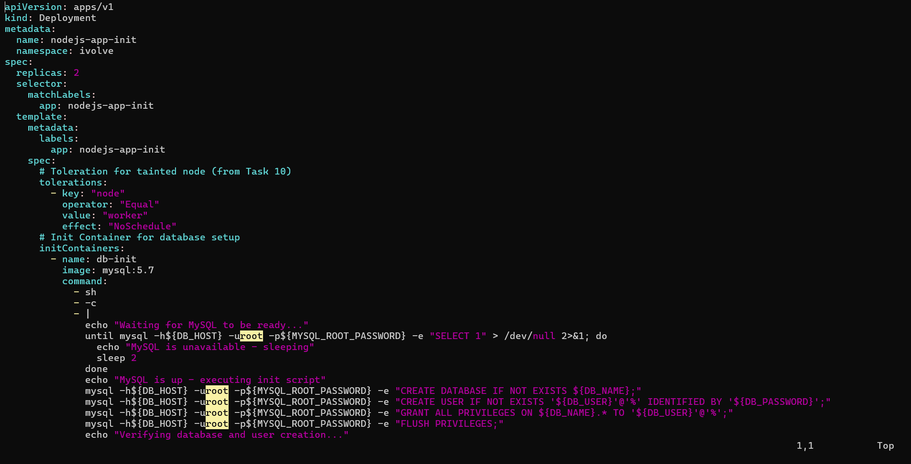

# IVOLVE Task 16 - Kubernetes Init Container for Pre-Deployment Database Setup

This lab is part of the IVOLVE training program. It demonstrates how to use init containers to perform pre-deployment setup tasks, specifically creating a database and user before the main application container starts.

## Lab Overview

In this lab you:

- **Modify** the existing Node.js Deployment to include an init container
- **Use** a MySQL client image (mysql:5.7) for the init container
- **Pass** necessary DB connection parameters using environment variables from ConfigMap/Secret
- **Create** the 'ivolve' database and a user with all access on the ivolve database via the init container
- **Connect** to MySQL manually to verify the ivolve database and user exist with the expected privileges

## Prerequisites from Previous Tasks

This lab builds upon concepts from previous tasks:

### Task 10: Node Taints
- A worker node is tainted with `node=worker:NoSchedule`
- We'll add a toleration to allow pods to run on this tainted node

### Task 11: Namespace and Resource Quota
- Namespace `ivolve` exists
- Resource quota limits pods to 2

### Task 12: ConfigMaps and Secrets
- ConfigMap `mysql-config` with `DB_HOST` and `DB_USER`
- Secret `mysql-secret` with `DB_PASSWORD` and `MYSQL_ROOT_PASSWORD`
- We'll use these for database connection in the init container

### Task 13: Persistent Volumes
- PersistentVolume `block-pv` with ReadWriteMany access mode
- PersistentVolumeClaim `block-pvc` bound to the PV

### Task 14: MySQL StatefulSet
- MySQL StatefulSet running in the `ivolve` namespace
- Headless service `mysql-service` for MySQL connectivity
- MySQL is accessible and ready to accept connections

**Verify prerequisites:**

```bash
# Check MySQL StatefulSet is running
kubectl get pods -n ivolve -l app=mysql

# Verify MySQL service exists
kubectl get svc mysql-service -n ivolve

# Verify ConfigMap and Secret exist
kubectl get configmap mysql-config -n ivolve
kubectl get secret mysql-secret -n ivolve

# Verify PVC exists and is bound
kubectl get pvc block-pvc -n ivolve
```

## Understanding Init Containers

**Init containers** are specialized containers that run before the main application containers in a pod. They are useful for:

- **Pre-deployment setup**: Database initialization, schema creation, user setup
- **Dependency checks**: Waiting for external services to be ready
- **Data migration**: Moving or preparing data before the app starts
- **Security**: Setting up certificates, keys, or permissions
- **Configuration**: Downloading config files or secrets

### Key Characteristics of Init Containers

1. **Sequential Execution**: Init containers run one after another, in order
2. **Must Succeed**: All init containers must complete successfully (exit code 0) before main containers start
3. **Failure Handling**: If an init container fails, the pod is restarted and init containers run again
4. **Resource Isolation**: Each init container can have its own resource requests/limits
5. **Shared Volumes**: Init containers share volumes with main containers

### Init Container vs Regular Container

| Feature | Init Container | Regular Container |
|---------|---------------|-------------------|
| Execution Order | Runs first | Runs after init containers |
| Failure Impact | Pod restarts | Only that container restarts |
| Purpose | Setup/preparation | Main application logic |
| Restart Policy | Always restarts on failure | Depends on restart policy |
| Multiple Containers | Run sequentially | Run in parallel |

## Why Use Init Containers for Database Setup?

Using init containers for database setup provides:

- **Automation**: Database and user creation happens automatically
- **Idempotency**: Can safely run multiple times (IF NOT EXISTS)
- **Dependency Management**: Ensures database is ready before app starts
- **Separation of Concerns**: Database setup logic separate from application code
- **Consistency**: Same setup process for all pod replicas

## Project Requirements

### VMware Workstation

- **VMware Workstation** installed on your host machine
- **2 Virtual Machines** created:
  - **Master VM** (named `ks3`) - Control plane node
  - **Worker VM** - Worker node (tainted with `node=worker:NoSchedule`)

### Kubernetes

- **Kubernetes cluster** with 2 nodes (master and worker)
- **kubeadm** installed on both VMs
- Access to `kubectl` command-line tool on master node
- **MySQL StatefulSet** running (from Task 14)

### Software

- **kubectl** - Kubernetes command-line tool
- **MySQL client** - For manual database verification (optional, can use pod)

## Step-by-Step Instructions

### Step 1: Review Existing Resources

Before creating the deployment with init container, verify that all prerequisites are in place:

```bash
# Check MySQL is running
kubectl get pods -n ivolve -l app=mysql

# Verify MySQL service
kubectl get svc mysql-service -n ivolve

# Check ConfigMap
kubectl get configmap mysql-config -n ivolve -o yaml

# Check Secret
kubectl get secret mysql-secret -n ivolve -o yaml
```

### Step 2: Create Node.js Deployment with Init Container

Create a new deployment file `nodejs-deployment-init.yaml`:

```bash
cat > nodejs-deployment-init.yaml << 'EOF'
apiVersion: apps/v1
kind: Deployment
metadata:
  name: nodejs-app-init
  namespace: ivolve
spec:
  replicas: 2
  selector:
    matchLabels:
      app: nodejs-app-init
  template:
    metadata:
      labels:
        app: nodejs-app-init
    spec:
      # Toleration for tainted node (from Task 10)
      tolerations:
        - key: "node"
          operator: "Equal"
          value: "worker"
          effect: "NoSchedule"
      # Init Container for database setup
      initContainers:
        - name: db-init
          image: mysql:5.7
          command:
            - sh
            - -c
            - |
              echo "Waiting for MySQL to be ready..."
              until mysql -h${DB_HOST} -uroot -p${MYSQL_ROOT_PASSWORD} -e "SELECT 1" > /dev/null 2>&1; do
                echo "MySQL is unavailable - sleeping"
                sleep 2
              done
              echo "MySQL is up - executing init script"
              mysql -h${DB_HOST} -uroot -p${MYSQL_ROOT_PASSWORD} -e "CREATE DATABASE IF NOT EXISTS ${DB_NAME};"
              mysql -h${DB_HOST} -uroot -p${MYSQL_ROOT_PASSWORD} -e "CREATE USER IF NOT EXISTS '${DB_USER}'@'%' IDENTIFIED BY '${DB_PASSWORD}';"
              mysql -h${DB_HOST} -uroot -p${MYSQL_ROOT_PASSWORD} -e "GRANT ALL PRIVILEGES ON ${DB_NAME}.* TO '${DB_USER}'@'%';"
              mysql -h${DB_HOST} -uroot -p${MYSQL_ROOT_PASSWORD} -e "FLUSH PRIVILEGES;"
              echo "Verifying database and user creation..."
              mysql -h${DB_HOST} -uroot -p${MYSQL_ROOT_PASSWORD} -e "SHOW DATABASES;"
              mysql -h${DB_HOST} -uroot -p${MYSQL_ROOT_PASSWORD} -e "SELECT User, Host FROM mysql.user WHERE User='${DB_USER}';"
              mysql -h${DB_HOST} -uroot -p${MYSQL_ROOT_PASSWORD} -e "SHOW GRANTS FOR '${DB_USER}'@'%';"
              echo "Database and user setup completed successfully!"
          env:
            # Use ConfigMap for non-sensitive config (from Task 12)
            - name: DB_HOST
              valueFrom:
                configMapKeyRef:
                  name: mysql-config
                  key: DB_HOST
            - name: DB_USER
              valueFrom:
                configMapKeyRef:
                  name: mysql-config
                  key: DB_USER
            - name: DB_NAME
              value: "ivolve"
            # Use Secret for sensitive data (from Task 12)
            - name: MYSQL_ROOT_PASSWORD
              valueFrom:
                secretKeyRef:
                  name: mysql-secret
                  key: MYSQL_ROOT_PASSWORD
            - name: DB_PASSWORD
              valueFrom:
                secretKeyRef:
                  name: mysql-secret
                  key: DB_PASSWORD
      containers:
        - name: nodejs
          image: node:18-alpine
          command:
            - sh
            - -c
            - |
              node -e "
              const http = require('http');
              const port = process.env.PORT || 3000;
              const server = http.createServer((req, res) => {
                res.writeHead(200, {'Content-Type': 'text/plain'});
                res.end('Hello from Node.js App with Init Container!\nDB_HOST: ' + (process.env.DB_HOST || 'N/A') + '\nDB_USER: ' + (process.env.DB_USER || 'N/A') + '\nDB_NAME: ' + (process.env.DB_NAME || 'N/A'));
              });
              server.listen(port, '0.0.0.0', () => {
                console.log('Node.js server running on port', port);
              });
              "
          ports:
            - containerPort: 3000
              name: http
          env:
            # Use ConfigMap for non-sensitive config (from Task 12)
            - name: DB_HOST
              valueFrom:
                configMapKeyRef:
                  name: mysql-config
                  key: DB_HOST
            - name: DB_USER
              valueFrom:
                configMapKeyRef:
                  name: mysql-config
                  key: DB_USER
            - name: DB_NAME
              value: "ivolve"
            # Use Secret for sensitive data (from Task 12)
            - name: DB_PASSWORD
              valueFrom:
                secretKeyRef:
                  name: mysql-secret
                  key: DB_PASSWORD
            # Application port
            - name: PORT
              value: "3000"
          volumeMounts:
            - name: app-storage
              mountPath: /app/data
      volumes:
        # Use ReadWriteMany PVC from Task 13
        - name: app-storage
          persistentVolumeClaim:
            claimName: block-pvc
EOF
```

**Key components explained:**

1. **Init Container Definition:**
```yaml
initContainers:
  - name: db-init
    image: mysql:5.7
```
   - Uses `mysql:5.7` image which includes MySQL client tools
   - Runs before the main Node.js container

2. **MySQL Connection Wait:**
```bash
until mysql -h${DB_HOST} -uroot -p${MYSQL_ROOT_PASSWORD} -e "SELECT 1" > /dev/null 2>&1; do
  echo "MySQL is unavailable - sleeping"
  sleep 2
done
```
   - Waits for MySQL to be ready before attempting database operations
   - Prevents race conditions where init container runs before MySQL is ready

3. **Database and User Creation:**
```bash
mysql -h${DB_HOST} -uroot -p${MYSQL_ROOT_PASSWORD} -e "CREATE DATABASE IF NOT EXISTS ${DB_NAME};"
mysql -h${DB_HOST} -uroot -p${MYSQL_ROOT_PASSWORD} -e "CREATE USER IF NOT EXISTS '${DB_USER}'@'%' IDENTIFIED BY '${DB_PASSWORD}';"
mysql -h${DB_HOST} -uroot -p${MYSQL_ROOT_PASSWORD} -e "GRANT ALL PRIVILEGES ON ${DB_NAME}.* TO '${DB_USER}'@'%';"
mysql -h${DB_HOST} -uroot -p${MYSQL_ROOT_PASSWORD} -e "FLUSH PRIVILEGES;"
```
   - `CREATE DATABASE IF NOT EXISTS` - Creates database only if it doesn't exist (idempotent)
   - `CREATE USER IF NOT EXISTS` - Creates user only if it doesn't exist (idempotent)
   - `GRANT ALL PRIVILEGES` - Grants all privileges on the ivolve database to the user
   - `FLUSH PRIVILEGES` - Reloads privilege tables to apply changes
   - Each command uses `-e` flag to execute SQL directly

4. **Environment Variables from ConfigMap/Secret:**
```yaml
env:
  - name: DB_HOST
    valueFrom:
      configMapKeyRef:
        name: mysql-config
        key: DB_HOST
  - name: MYSQL_ROOT_PASSWORD
    valueFrom:
      secretKeyRef:
        name: mysql-secret
        key: MYSQL_ROOT_PASSWORD
```
   - Uses ConfigMap for non-sensitive data (DB_HOST, DB_USER)
   - Uses Secret for sensitive data (MYSQL_ROOT_PASSWORD, DB_PASSWORD)

**Apply the Deployment:**

```bash
kubectl apply -f nodejs-deployment-init.yaml
```

**Verify the Deployment:**

```bash
kubectl get deployment nodejs-app-init -n ivolve
```

You should see:

```
NAME              READY   UP-TO-DATE   AVAILABLE   AGE
nodejs-app-init   1/2     2            1           10s
```

**Note:** Only 1 pod is running because of the resource quota from Task 11 (pods: 2/2 limit, and MySQL pod is already using 1).

### Step 3: Monitor Init Container Execution

**Check pod status:**

```bash
kubectl get pods -n ivolve -l app=nodejs-app-init
```

Initially, you might see:

```
NAME                                READY   STATUS            RESTARTS   AGE
nodejs-app-init-xxxxxxxxxx-xxxxx    0/1     Init:0/1          0          5s
```

The `Init:0/1` status means the init container is running.

**Watch pod status:**

```bash
kubectl get pods -n ivolve -l app=nodejs-app-init -w
```

**View init container logs:**

```bash
# Get the pod name
POD_NAME=$(kubectl get pods -n ivolve -l app=nodejs-app-init -o jsonpath='{.items[0].metadata.name}')

# View init container logs
kubectl logs $POD_NAME -n ivolve -c db-init
```

You should see output like:

```
Waiting for MySQL to be ready...
MySQL is up - executing init script
Database
information_schema
ivolve
mysql
performance_schema
sys
User    Host
ivolve_user      %
Grants for ivolve_user@%
GRANT ALL PRIVILEGES ON `ivolve`.* TO 'ivolve_user'@'%'
Database and user setup completed successfully!
```

**Check when init container completes:**

```bash
kubectl describe pod $POD_NAME -n ivolve | grep -A 10 "Init Containers"
```

Once the init container completes successfully, the main container will start:

```
NAME                                READY   STATUS    RESTARTS   AGE
nodejs-app-init-xxxxxxxxxx-xxxxx    1/1     Running   0          30s
```

**Screenshot: Init Container with Deployment**



### Step 4: Verify Database and User Creation

**Connect to MySQL manually to verify:**

**Option 1: Using kubectl exec into MySQL pod:**

```bash
# Get MySQL pod name
MYSQL_POD=$(kubectl get pods -n ivolve -l app=mysql -o jsonpath='{.items[0].metadata.name}')

# Connect to MySQL
kubectl exec -it $MYSQL_POD -n ivolve -- mysql -uroot -p$(kubectl get secret mysql-secret -n ivolve -o jsonpath='{.data.MYSQL_ROOT_PASSWORD}' | base64 -d)
```

**Option 2: Using a temporary MySQL client pod:**

```bash
# Create a temporary MySQL client pod
kubectl run mysql-client --image=mysql:5.7 --rm -it --restart=Never -n ivolve -- \
  mysql -hmysql-service.ivolve.svc.cluster.local -uroot -p$(kubectl get secret mysql-secret -n ivolve -o jsonpath='{.data.MYSQL_ROOT_PASSWORD}' | base64 -d)
```

**Once connected to MySQL, run these verification commands:**

```sql
-- Show all databases
SHOW DATABASES;
```

You should see `ivolve` in the list:

```
+--------------------+
| Database           |
+--------------------+
| information_schema |
| ivolve             |
| mysql              |
| performance_schema |
| sys                |
+--------------------+
```

```sql
-- Check if user exists
SELECT User, Host FROM mysql.user WHERE User='ivolve_user';
```

You should see:

```
+-------------+------+
| User        | Host |
+-------------+------+
| ivolve_user | %    |
+-------------+------+
```

```sql
-- Check user privileges on ivolve database
SHOW GRANTS FOR 'ivolve_user'@'%';
```

You should see:

```
+----------------------------------------------------------+
| Grants for ivolve_user@%                                 |
+----------------------------------------------------------+
| GRANT USAGE ON *.* TO 'ivolve_user'@'%'                  |
| GRANT ALL PRIVILEGES ON `ivolve`.* TO 'ivolve_user'@'%' |
+----------------------------------------------------------+
```

```sql
-- Test connection with the new user
-- Exit MySQL first, then connect with the new user
EXIT;
```

**Test connection with the created user:**

```bash
# Get password from secret
DB_PASSWORD=$(kubectl get secret mysql-secret -n ivolve -o jsonpath='{.data.DB_PASSWORD}' | base64 -d)

# Connect with the new user
kubectl run mysql-client-test --image=mysql:5.7 --rm -it --restart=Never -n ivolve -- \
  mysql -hmysql-service.ivolve.svc.cluster.local -uivolve_user -p${DB_PASSWORD} ivolve
```

Once connected, verify access:

```sql
-- Show current database
SELECT DATABASE();

-- Should show: ivolve

-- Create a test table
CREATE TABLE IF NOT EXISTS test_table (id INT, name VARCHAR(50));

-- Insert test data
INSERT INTO test_table VALUES (1, 'Test');

-- Query the data
SELECT * FROM test_table;

-- Clean up
DROP TABLE test_table;
EXIT;
```

**Screenshot: Verify Database and User**


### Step 5: Create ClusterIP Service

Create a ClusterIP service for the Node.js application:

```bash
cat > nodejs-service.yaml << EOF
apiVersion: v1
kind: Service
metadata:
  name: nodejs-service-init
  namespace: ivolve
spec:
  type: ClusterIP
  selector:
    app: nodejs-app-init
  ports:
  - port: 80
    targetPort: 3000
    protocol: TCP
    name: http
EOF
```

**Apply the service:**

```bash
kubectl apply -f nodejs-service.yaml
```

**Verify the service:**

```bash
kubectl get svc nodejs-service-init -n ivolve
```

You should see:

```
NAME                 TYPE        CLUSTER-IP      EXTERNAL-IP   PORT(S)   AGE
nodejs-service-init  ClusterIP   10.96.xxx.xxx   <none>        80/TCP    5s
```

### Step 6: Test the Application

**Test the service:**

```bash
# Test from within cluster
kubectl run curl-test --image=curlimages/curl --rm -it --restart=Never -n ivolve -- \
  curl http://nodejs-service-init.ivolve.svc.cluster.local
```

You should see:

```
Hello from Node.js App with Init Container!
DB_HOST: mysql-service
DB_USER: ivolve_user
DB_NAME: ivolve
```

## Understanding Init Container Execution Flow

```
Pod Creation
    │
    ├─> Init Container (db-init) starts
    │   │
    │   ├─> Wait for MySQL to be ready
    │   │
    │   ├─> Connect to MySQL
    │   │
    │   ├─> Create database 'ivolve' (if not exists)
    │   │
    │   ├─> Create user 'ivolve_user' (if not exists)
    │   │
    │   ├─> Grant privileges
    │   │
    │   └─> Exit with code 0 (success)
    │
    └─> Main Container (nodejs) starts
        │
        └─> Application runs
```

## Integration Summary

This lab integrates all previous tasks:

### Task 10 Integration: Taints and Tolerations
- Worker node is tainted with `node=worker:NoSchedule`
- Deployment has toleration to run on tainted node

### Task 11 Integration: Namespace and Resource Quota
- All resources created in `ivolve` namespace
- Resource quota limits pods to 2

### Task 12 Integration: ConfigMaps and Secrets
- ConfigMap `mysql-config` provides `DB_HOST` and `DB_USER`
- Secret `mysql-secret` provides `MYSQL_ROOT_PASSWORD` and `DB_PASSWORD`
- Values are consumed as environment variables in init container

### Task 13 Integration: Persistent Storage
- PersistentVolumeClaim `block-pvc` (ReadWriteMany) provides shared storage
- Mounted to `/app/data` for application data/logs

### Task 14 Integration: MySQL StatefulSet
- MySQL StatefulSet provides the database server
- Headless service `mysql-service` enables connectivity
- Init container connects to MySQL to set up database and user

## Project Structure

```
task-16/
├── nodejs-deployment-init.yaml    # Node.js Deployment with Init Container
├── nodejs-service.yaml             # ClusterIP Service
├── README.md                       # This file
└── screenshots/                    # Lab screenshots (to be added)
```

## Key Concepts

### Init Container Best Practices

1. **Idempotency**: Use `IF NOT EXISTS` clauses to make operations safe to run multiple times
2. **Error Handling**: Check for service availability before attempting operations
3. **Logging**: Include informative log messages for debugging
4. **Resource Limits**: Set appropriate resource limits for init containers
5. **Timeout Handling**: Consider adding timeouts for long-running operations

### MySQL User Creation Best Practices

1. **Least Privilege**: Grant only necessary privileges
2. **Host Restriction**: Use specific host patterns (e.g., `'%'` for any host, or specific IPs)
3. **Password Security**: Store passwords in Secrets, never in ConfigMaps
4. **User Naming**: Use descriptive user names that indicate purpose
5. **Regular Audits**: Periodically review user privileges

## Common Commands

### Deployment Commands

```bash
# List deployments
kubectl get deployment -n ivolve

# Describe deployment
kubectl describe deployment nodejs-app-init -n ivolve

# View deployment YAML
kubectl get deployment nodejs-app-init -n ivolve -o yaml
```

### Pod Commands

```bash
# List pods
kubectl get pods -n ivolve -l app=nodejs-app-init

# Describe pod
kubectl describe pod <pod-name> -n ivolve

# View init container logs
kubectl logs <pod-name> -n ivolve -c db-init

# View main container logs
kubectl logs <pod-name> -n ivolve -c nodejs

# View all container logs
kubectl logs <pod-name> -n ivolve --all-containers=true
```

### Service Commands

```bash
# List services
kubectl get svc -n ivolve

# Describe service
kubectl describe svc nodejs-service-init -n ivolve

# Get service endpoints
kubectl get endpoints nodejs-service-init -n ivolve
```

### MySQL Verification Commands

```bash
# Connect to MySQL
MYSQL_POD=$(kubectl get pods -n ivolve -l app=mysql -o jsonpath='{.items[0].metadata.name}')
kubectl exec -it $MYSQL_POD -n ivolve -- mysql -uroot -p$(kubectl get secret mysql-secret -n ivolve -o jsonpath='{.data.MYSQL_ROOT_PASSWORD}' | base64 -d)

# Show databases
SHOW DATABASES;

# Show users
SELECT User, Host FROM mysql.user;

# Show grants
SHOW GRANTS FOR 'ivolve_user'@'%';
```

## Troubleshooting

During the deployment of this lab, we encountered a connection issue with the init container and its resolution:

### Issue: Init Container Stuck in Connection Loop

**Problem:**
The init container was stuck in a loop trying to connect to MySQL, continuously showing:
```
MySQL is unavailable - sleeping (attempt 1/60)
MySQL is unavailable - sleeping (attempt 2/60)
...
```

**Root Cause:**
The init container was attempting to connect to an incorrect hostname:
```
mysql-0.TOPA.ivolve.svc.cluster.local  ❌ (doesn't exist)
```

Instead of the correct hostname:
```
mysql-0.mysql-service.ivolve.svc.cluster.local  ✅ (correct)
```

**Why This Happened:**
1. The init container was using `DB_HOST` from the ConfigMap to construct the MySQL hostname:
   ```yaml
   MYSQL_HOST="mysql-0.${DB_HOST}.ivolve.svc.cluster.local"
   ```

2. The ConfigMap in the cluster had an incorrect value:
   ```yaml
   DB_HOST: "TOPA"  # ❌ Wrong value
   ```
   
   Instead of:
   ```yaml
   DB_HOST: "mysql-service"  # ✅ Correct value
   ```

3. This resulted in the init container trying to connect to a non-existent hostname, causing the connection to fail indefinitely.

**Solution:**
We modified the init container script to use the actual Kubernetes service name directly, instead of relying on the ConfigMap value:

```yaml
# Fixed code
MYSQL_SERVICE="mysql-service"  # Use the actual service name
MYSQL_POD_HOST="mysql-0.${MYSQL_SERVICE}.ivolve.svc.cluster.local"
```

**Why This Works:**
1. **Service Name is Fixed**: The MySQL service name `mysql-service` is a fixed infrastructure name (from Task 14), not a configuration value.
2. **Separation of Concerns**: 
   - **ConfigMap `DB_HOST`**: Used by the application container to know where to connect (for flexibility)
   - **Service Name**: Used by the init container for infrastructure connections (for reliability)
3. **More Reliable**: Using the service name directly ensures we always connect to the correct MySQL instance, regardless of ConfigMap values.

**Key Lesson:**
- **Infrastructure names** (service names, pod names) should be used directly in init containers
- **Configuration values** (from ConfigMap) should be used by application containers for flexibility
- Don't mix infrastructure names with configuration values - they serve different purposes

**How to Debug Similar Issues:**

1. **Check init container logs:**
   ```bash
   POD_NAME=$(kubectl get pods -n ivolve -l app=nodejs-app-init -o jsonpath='{.items[0].metadata.name}')
   kubectl logs $POD_NAME -n ivolve -c db-init
   ```

2. **Verify the hostname being used:**
   - Look for connection attempts in logs
   - Check what hostname is being constructed

3. **Test DNS resolution:**
   ```bash
   kubectl run test --image=busybox --rm -it --restart=Never -n ivolve -- \
     nslookup mysql-0.mysql-service.ivolve.svc.cluster.local
   ```

4. **Test MySQL connection manually:**
   ```bash
   kubectl run mysql-test --image=mysql:5.7 --rm -it --restart=Never -n ivolve -- \
     mysql -hmysql-0.mysql-service.ivolve.svc.cluster.local -P3306 -uroot -p$(kubectl get secret mysql-secret -n ivolve -o jsonpath='{.data.MYSQL_ROOT_PASSWORD}' | base64 -d) -e "SELECT 1"
   ```

5. **Verify ConfigMap values:**
   ```bash
   kubectl get configmap mysql-config -n ivolve -o yaml
   ```

6. **Check service exists:**
   ```bash
   kubectl get svc mysql-service -n ivolve
   ```

**General Troubleshooting Tips:**

- **If init container fails immediately:**
  - Check YAML syntax errors
  - Verify environment variables are correctly referenced
  - Check if required ConfigMaps/Secrets exist

- **If init container is stuck waiting:**
  - Check logs to see what it's waiting for
  - Verify the service/dependency is actually running
  - Test connectivity manually from a test pod
  - Check DNS resolution

- **If MySQL connection fails:**
  - Verify MySQL pod is running: `kubectl get pods -n ivolve -l app=mysql`
  - Check MySQL service exists: `kubectl get svc mysql-service -n ivolve`
  - Verify password is correct: Check Secret values
  - Test connection from a test pod

- **If database/user already exists:**
  - This is normal - the `IF NOT EXISTS` clauses make operations idempotent
  - The init container will succeed even if database/user already exist

## Best Practices

### 1. Use Init Containers for Setup Tasks

Init containers are perfect for:
- Database initialization
- Schema creation
- User setup
- Dependency checks
- Data migration
- Certificate generation

### 2. Make Operations Idempotent

Always use `IF NOT EXISTS` or check before creating:
- `CREATE DATABASE IF NOT EXISTS`
- `CREATE USER IF NOT EXISTS`
- Check before creating resources

### 3. Wait for Dependencies

Always wait for dependent services:
- Use health checks
- Implement retry logic
- Set appropriate timeouts

### 4. Use Secrets for Sensitive Data

Never store passwords or secrets in:
- ConfigMaps
- Environment variables (plain text)
- Code or configuration files

Always use:
- Kubernetes Secrets
- Secret management systems
- Encrypted storage

### 5. Log Init Container Operations

Include informative logs:
- Start/end of operations
- Success/failure messages
- Error details
- Verification results

## Use Cases

### Database Initialization

```yaml
initContainers:
  - name: db-init
    image: mysql:5.7
    command:
      - sh
      - -c
      - |
        mysql -h${DB_HOST} -uroot -p${MYSQL_ROOT_PASSWORD} -e "CREATE DATABASE IF NOT EXISTS ${DB_NAME};"
        mysql -h${DB_HOST} -uroot -p${MYSQL_ROOT_PASSWORD} -e "CREATE USER IF NOT EXISTS '${DB_USER}'@'%' IDENTIFIED BY '${DB_PASSWORD}';"
        mysql -h${DB_HOST} -uroot -p${MYSQL_ROOT_PASSWORD} -e "GRANT ALL PRIVILEGES ON ${DB_NAME}.* TO '${DB_USER}'@'%';"
        mysql -h${DB_HOST} -uroot -p${MYSQL_ROOT_PASSWORD} -e "FLUSH PRIVILEGES;"
```

### Schema Migration

```yaml
initContainers:
  - name: schema-migration
    image: myapp:migrate
    command:
      - /app/migrate
      - -database
      - ${DB_CONNECTION_STRING}
      - -path
      - /migrations
      - up
```

### Dependency Check

```yaml
initContainers:
  - name: wait-for-api
    image: busybox
    command:
      - sh
      - -c
      - |
        until wget -q --spider http://api-service:8080/health; do
          echo "Waiting for API..."
          sleep 2
        done
```

## Notes

- Init containers run sequentially, one after another
- All init containers must succeed (exit code 0) before main containers start
- If an init container fails, the pod restarts and init containers run again
- Init containers share volumes with main containers
- Init containers can have their own resource requests/limits
- Use `IF NOT EXISTS` to make operations idempotent
- Always wait for dependent services before using them
- Store sensitive data in Secrets, not ConfigMaps
- Log init container operations for debugging
- Test init container logic independently before deploying

## Next Steps

- Explore multiple init containers (sequential execution)
- Implement health checks and readiness probes
- Set up database migrations using init containers
- Configure resource requests and limits for init containers
- Implement retry logic with exponential backoff
- Use init containers for certificate generation
- Explore sidecar containers for additional functionality

## License

See the LICENSE file in the parent directory for license information.
