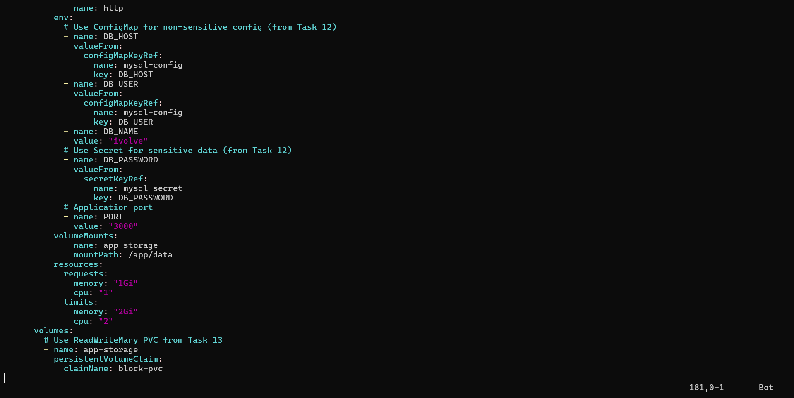
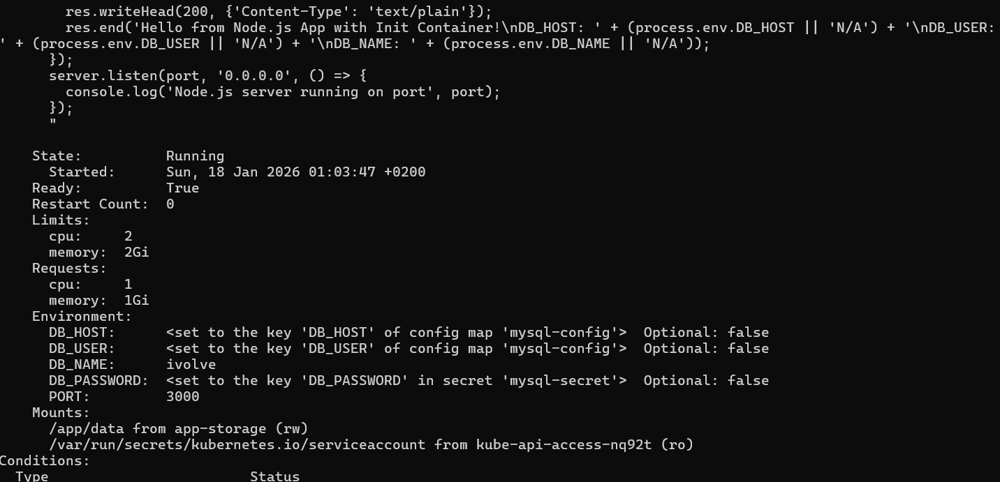
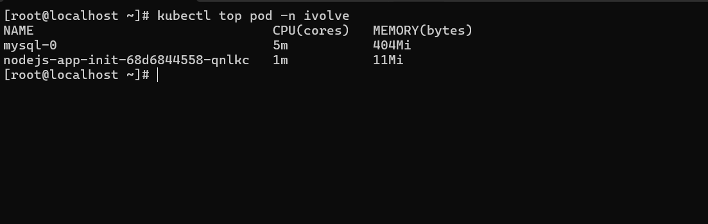

# IVOLVE Task 17 - Pod Resource Management with CPU and Memory Requests and Limits

This lab is part of the IVOLVE training program. It demonstrates how to configure resource requests and limits for containers in Kubernetes, ensuring proper resource allocation, scheduling, and preventing resource exhaustion.

## Lab Overview

In this lab you:

- **Update** the existing Node.js Deployment to include resource requests and limits
- **Configure** resource requests:
  - CPU: 1 (1 vCPU)
  - Memory: 1Gi
- **Configure** resource limits:
  - CPU: 2 (2 vCPUs)
  - Memory: 2Gi
- **Use** `kubectl describe pod` to verify the applied resource requests and limits
- **Use** `kubectl top pod` to monitor real-time resource usage

## Prerequisites from Previous Tasks

This lab builds upon concepts from previous tasks:

### Task 10: Node Taints
- A worker node is tainted with `node=worker:NoSchedule`
- Deployment has toleration to run on tainted node

### Task 11: Namespace and Resource Quota
- Namespace `ivolve` exists
- Resource quota limits pods to 2

### Task 12: ConfigMaps and Secrets
- ConfigMap `mysql-config` with `DB_HOST` and `DB_USER`
- Secret `mysql-secret` with `DB_PASSWORD` and `MYSQL_ROOT_PASSWORD`

### Task 13: Persistent Volumes
- PersistentVolumeClaim `block-pvc` (ReadWriteMany) provides shared storage

### Task 14: MySQL StatefulSet
- MySQL StatefulSet running in the `ivolve` namespace

### Task 16: Init Containers
- Node.js Deployment with init container for database setup

**Verify prerequisites:**

```bash
# Check deployment exists
kubectl get deployment nodejs-app-init -n ivolve

# Verify pods are running
kubectl get pods -n ivolve -l app=nodejs-app-init
```

## Understanding Resource Requests and Limits

**Resource requests** and **limits** are essential for:

- **Resource Guarantees**: Requests ensure pods get guaranteed resources
- **Resource Bounds**: Limits prevent pods from consuming excessive resources
- **Scheduling**: Kubernetes uses requests to decide where to place pods
- **Quality of Service (QoS)**: Determines pod priority and eviction behavior
- **Noisy Neighbor Prevention**: Limits prevent one pod from starving others

### Resource Requests

**Requests** specify the minimum resources a container needs:

- **Scheduling**: Kubernetes scheduler uses requests to find nodes with available resources
- **Guaranteed**: Pod is guaranteed to get at least the requested resources
- **Reserved**: Resources are reserved on the node for the pod
- **QoS Class**: Contributes to pod's Quality of Service classification

### Resource Limits

**Limits** specify the maximum resources a container can use:

- **Enforcement**: Container cannot exceed these limits
- **Throttling**: CPU is throttled if limit is reached
- **Termination**: Memory limit exceeded results in OOMKilled
- **Protection**: Prevents resource exhaustion on nodes

### CPU and Memory Units

**CPU Units:**
- `1` = 1 CPU core
- `1000m` = 1000 millicores = 1 CPU core
- `500m` = 0.5 CPU core
- `2` = 2 CPU cores

**Memory Units:**
- `1Gi` = 1 Gibibyte (1024^3 bytes)
- `1G` = 1 Gigabyte (1000^3 bytes)
- `512Mi` = 512 Mebibytes
- `1Ki` = 1 Kibibyte

**Note:** Kubernetes uses binary units (Gi, Mi, Ki) by default, but also supports decimal units (G, M, K).

## Quality of Service (QoS) Classes

Kubernetes assigns QoS classes based on resource configuration:

### 1. Guaranteed
- All containers have requests and limits set
- Requests equal limits for all resources
- **Priority**: Highest (last to be evicted)

### 2. Burstable
- At least one container has requests but not limits
- Or requests < limits
- **Priority**: Medium

### 3. BestEffort
- No requests or limits set
- **Priority**: Lowest (first to be evicted)

## Project Requirements

### VMware Workstation

- **VMware Workstation** installed on your host machine
- **2 Virtual Machines** created:
  - **Master VM** (named `ks3`) - Control plane node
  - **Worker VM** - Worker node (tainted with `node=worker:NoSchedule`)

### Kubernetes

- **Kubernetes cluster** with 2 nodes (master and worker)
- **kubeadm** installed on both VMs
- Access to `kubectl` command-line tool on master node
- **Metrics Server** installed (required for `kubectl top`)

### Software

- **kubectl** - Kubernetes command-line tool
- **metrics-server** - For resource usage monitoring (optional but recommended)

## Step-by-Step Instructions

### Step 1: Review Current Deployment

Before adding resources, check the current deployment:

```bash
# View current deployment
kubectl get deployment nodejs-app-init -n ivolve -o yaml | grep -A 20 resources
```

If no resources are configured, you'll see no output or a warning.

### Step 2: Update Deployment with Resource Requests and Limits

Update the Node.js deployment to include resource requests and limits:

```bash
cat > nodejs-deployment-init.yaml << 'EOF'
apiVersion: apps/v1
kind: Deployment
metadata:
  name: nodejs-app-init
  namespace: ivolve
spec:
  replicas: 2
  selector:
    matchLabels:
      app: nodejs-app-init
  template:
    metadata:
      labels:
        app: nodejs-app-init
    spec:
      # Toleration for tainted node (from Task 10)
      tolerations:
        - key: "node"
          operator: "Equal"
          value: "worker"
          effect: "NoSchedule"
      # Init Container for database setup (from Task 16)
      initContainers:
        - name: db-init
          image: mysql:5.7
          # ... init container configuration ...
      containers:
        - name: nodejs
          image: node:18-alpine
          # ... container configuration ...
          resources:
            requests:
              memory: "1Gi"
              cpu: "1"
            limits:
              memory: "2Gi"
              cpu: "2"
      volumes:
        - name: app-storage
          persistentVolumeClaim:
            claimName: block-pvc
EOF
```

**Key components explained:**

1. **Resource Requests:**
```yaml
resources:
  requests:
    memory: "1Gi"
    cpu: "1"
```
   - **CPU: 1** = 1 vCPU (guaranteed minimum)
   - **Memory: 1Gi** = 1 Gibibyte (guaranteed minimum)
   - Kubernetes scheduler uses these to find suitable nodes
   - Resources are reserved on the node

2. **Resource Limits:**
```yaml
resources:
  limits:
    memory: "2Gi"
    cpu: "2"
```
   - **CPU: 2** = 2 vCPUs (maximum allowed)
   - **Memory: 2Gi** = 2 Gibibytes (maximum allowed)
   - Container cannot exceed these limits
   - CPU throttling occurs if limit is reached
   - Memory limit exceeded results in OOMKilled

**Apply the updated deployment:**

```bash
kubectl apply -f nodejs-deployment-init.yaml
```

**Verify the deployment:**

```bash
kubectl get deployment nodejs-app-init -n ivolve
```

You should see the deployment updated:

```
NAME              READY   UP-TO-DATE   AVAILABLE   AGE
nodejs-app-init   1/2     2            1           5m
```

**Screenshot: Resources in Deployment**



### Step 3: Verify Resource Requests and Limits

**Use `kubectl describe pod` to verify resources:**

```bash
# Get pod name
POD_NAME=$(kubectl get pods -n ivolve -l app=nodejs-app-init -o jsonpath='{.items[0].metadata.name}')

# Describe the pod to see resources
kubectl describe pod $POD_NAME -n ivolve
```

Look for the `Limits` and `Requests` sections:

```
Containers:
  nodejs:
    ...
    Limits:
      cpu:     2
      memory:  2Gi
    Requests:
      cpu:     1
      memory:  1Gi
```

**Screenshot: Describe Pod**



**Check QoS class:**

```bash
kubectl get pod $POD_NAME -n ivolve -o jsonpath='{.status.qosClass}'
```

Since requests < limits, the QoS class will be **Burstable**.

**Verify in YAML format:**

```bash
kubectl get pod $POD_NAME -n ivolve -o yaml | grep -A 10 resources
```

You should see:

```yaml
resources:
  limits:
    cpu: "2"
    memory: 2Gi
  requests:
    cpu: "1"
    memory: 1Gi
```

### Step 4: Monitor Real-Time Resource Usage

**Use `kubectl top pod` to monitor resource usage:**

**Note:** This requires the Metrics Server to be installed. If not installed, you'll see an error.

**Check if metrics server is installed:**

```bash
kubectl get deployment metrics-server -n kube-system
```

**Monitor pod resource usage:**

```bash
# Monitor all pods in namespace
kubectl top pods -n ivolve

# Monitor specific pod
kubectl top pod $POD_NAME -n ivolve
```

You should see output like:

```
NAME                                CPU(cores)   MEMORY(bytes)
nodejs-app-init-xxxxxxxxxx-xxxxx   5m           45Mi
mysql-0                             10m          200Mi
```

**Screenshot: Top Pod**



**Monitor continuously:**

```bash
# Watch resource usage (updates every 2 seconds)
watch kubectl top pods -n ivolve
```

**Monitor with labels:**

```bash
kubectl top pods -n ivolve -l app=nodejs-app-init
```

**Compare usage vs limits:**

```bash
# Get current usage
kubectl top pod $POD_NAME -n ivolve

# Get limits
kubectl get pod $POD_NAME -n ivolve -o jsonpath='{.spec.containers[0].resources.limits}'
```

## Understanding Resource Behavior

### CPU Behavior

**Requests:**
- Guaranteed CPU time
- Used for scheduling decisions
- Pod gets at least this amount

**Limits:**
- Maximum CPU time
- CPU throttling if exceeded
- Container shares CPU with other containers

**Example:**
- Request: 1 CPU → Guaranteed 1 CPU
- Limit: 2 CPUs → Can use up to 2 CPUs if available
- If limit reached, CPU is throttled (not terminated)

### Memory Behavior

**Requests:**
- Guaranteed memory
- Used for scheduling decisions
- Memory is reserved on node

**Limits:**
- Maximum memory
- **OOMKilled** if exceeded
- Container is terminated if limit exceeded

**Example:**
- Request: 1Gi → Guaranteed 1Gi
- Limit: 2Gi → Can use up to 2Gi
- If limit exceeded, container is killed and restarted

## Integration Summary

This lab integrates all previous tasks:

### Task 10 Integration: Taints and Tolerations
- Worker node is tainted with `node=worker:NoSchedule`
- Deployment has toleration to run on tainted node

### Task 11 Integration: Namespace and Resource Quota
- All resources created in `ivolve` namespace
- Resource quota limits pods to 2
- Resource requests count toward quota

### Task 12 Integration: ConfigMaps and Secrets
- ConfigMap `mysql-config` provides `DB_HOST` and `DB_USER`
- Secret `mysql-secret` provides `DB_PASSWORD`

### Task 13 Integration: Persistent Storage
- PersistentVolumeClaim `block-pvc` (ReadWriteMany) provides shared storage

### Task 14 Integration: MySQL StatefulSet
- MySQL StatefulSet provides the database server

### Task 16 Integration: Init Containers
- Init container sets up database before main container starts

## Project Structure

```
task-17/
├── nodejs-deployment-init.yaml    # Node.js Deployment with Resources
├── README.md                       # This file
└── screenshots/                    # Lab screenshots
    ├── descripe.png               # kubectl describe pod output
    ├── reasources-in-deployment.png  # Resources in deployment
    └── top-pod.png                # kubectl top pod output
```

## Key Concepts

### Resource Requests vs Limits

| Aspect | Requests | Limits |
|--------|----------|--------|
| Purpose | Minimum guaranteed | Maximum allowed |
| Scheduling | Used by scheduler | Not used for scheduling |
| Enforcement | Soft guarantee | Hard limit |
| CPU Exceeded | Shares with others | Throttled |
| Memory Exceeded | May be evicted | OOMKilled |
| QoS Impact | Contributes to QoS | Contributes to QoS |

### Quality of Service (QoS) Classes

**Guaranteed:**
- All containers have requests = limits
- Highest priority
- Last to be evicted

**Burstable:**
- At least one container has requests < limits
- Medium priority
- Evicted before Guaranteed

**BestEffort:**
- No requests or limits
- Lowest priority
- First to be evicted

## Common Commands

### Deployment Commands

```bash
# List deployments
kubectl get deployment -n ivolve

# Describe deployment
kubectl describe deployment nodejs-app-init -n ivolve

# View deployment YAML
kubectl get deployment nodejs-app-init -n ivolve -o yaml
```

### Pod Commands

```bash
# List pods
kubectl get pods -n ivolve -l app=nodejs-app-init

# Describe pod (shows resources)
kubectl describe pod <pod-name> -n ivolve

# View pod YAML
kubectl get pod <pod-name> -n ivolve -o yaml

# Check QoS class
kubectl get pod <pod-name> -n ivolve -o jsonpath='{.status.qosClass}'
```

### Resource Monitoring Commands

```bash
# Monitor all pods
kubectl top pods -n ivolve

# Monitor specific pod
kubectl top pod <pod-name> -n ivolve

# Monitor nodes
kubectl top nodes

# Monitor with labels
kubectl top pods -n ivolve -l app=nodejs-app-init
```

### Resource Verification Commands

```bash
# Check resource requests
kubectl get pod <pod-name> -n ivolve -o jsonpath='{.spec.containers[0].resources.requests}'

# Check resource limits
kubectl get pod <pod-name> -n ivolve -o jsonpath='{.spec.containers[0].resources.limits}'

# Check both
kubectl get pod <pod-name> -n ivolve -o jsonpath='{.spec.containers[0].resources}'
```

## Best Practices

### 1. Always Set Resource Requests and Limits

**Why:**
- Prevents noisy neighbor issues
- Enables proper scheduling
- Ensures predictable performance
- Supports autoscaling

**How:**
```yaml
resources:
  requests:
    memory: "256Mi"
    cpu: "100m"
  limits:
    memory: "512Mi"
    cpu: "500m"
```

### 2. Set Realistic Resource Values

**Guidelines:**
- **Requests**: Based on typical usage (not peak)
- **Limits**: Based on maximum acceptable usage
- **Ratio**: Limits should be 1.5-2x requests for burst capacity
- **Monitor**: Adjust based on actual usage

### 3. Use Appropriate CPU Units

**Recommendations:**
- Use millicores (`m`) for fractional CPUs (e.g., `500m`)
- Use whole numbers for full CPUs (e.g., `1`, `2`)
- Be consistent across deployments

### 4. Use Binary Memory Units

**Recommendations:**
- Prefer binary units: `Gi`, `Mi`, `Ki`
- More accurate for memory allocation
- Standard in Kubernetes

### 5. Monitor and Adjust

**Process:**
1. Set initial requests/limits based on estimates
2. Monitor actual usage with `kubectl top`
3. Adjust based on real-world usage
4. Leave headroom for bursts

### 6. Consider Workload Characteristics

**CPU-intensive:**
- Higher CPU requests/limits
- Lower memory requirements

**Memory-intensive:**
- Higher memory requests/limits
- Lower CPU requirements

**Balanced:**
- Similar CPU and memory ratios

## Use Cases

### Web Application

```yaml
resources:
  requests:
    memory: "512Mi"
    cpu: "500m"
  limits:
    memory: "1Gi"
    cpu: "1"
```

### Database

```yaml
resources:
  requests:
    memory: "2Gi"
    cpu: "1"
  limits:
    memory: "4Gi"
    cpu: "2"
```

### Background Worker

```yaml
resources:
  requests:
    memory: "256Mi"
    cpu: "200m"
  limits:
    memory: "512Mi"
    cpu: "500m"
```

## Notes

- Resource requests are used for scheduling decisions
- Resource limits prevent resource exhaustion
- CPU limits result in throttling (not termination)
- Memory limits result in OOMKilled (termination)
- QoS class affects eviction priority
- Metrics Server is required for `kubectl top`
- Resource quotas enforce namespace-level limits
- Requests should be based on typical usage
- Limits should allow for burst capacity
- Monitor and adjust resources based on actual usage

## Troubleshooting

### Issue: "kubectl top" shows "error: metrics not available"

**Cause:** Metrics Server is not installed or not running.

**Solution:**
```bash
# Check if metrics server exists
kubectl get deployment metrics-server -n kube-system

# If not installed, install it (example for kubeadm)
kubectl apply -f https://github.com/kubernetes-sigs/metrics-server/releases/latest/download/components.yaml
```

### Issue: Pod is in Pending state

**Cause:** No node has enough resources to satisfy requests.

**Solution:**
```bash
# Check node resources
kubectl describe nodes

# Check pod events
kubectl describe pod <pod-name> -n ivolve

# Reduce resource requests if necessary
```

### Issue: Pod is OOMKilled

**Cause:** Container exceeded memory limit.

**Solution:**
```bash
# Check pod status
kubectl get pod <pod-name> -n ivolve

# Check events
kubectl describe pod <pod-name> -n ivolve | grep -A 10 Events

# Increase memory limit or optimize application
```

### Issue: CPU throttling

**Cause:** Container is hitting CPU limit.

**Solution:**
```bash
# Monitor CPU usage
kubectl top pod <pod-name> -n ivolve

# Increase CPU limit or optimize application
```

## Next Steps

- Explore Horizontal Pod Autoscaling (HPA)
- Implement Vertical Pod Autoscaling (VPA)
- Configure resource quotas at namespace level
- Set up resource monitoring and alerting
- Implement resource-based scheduling policies
- Explore node affinity and anti-affinity
- Configure pod disruption budgets

## License

See the LICENSE file in the parent directory for license information.
