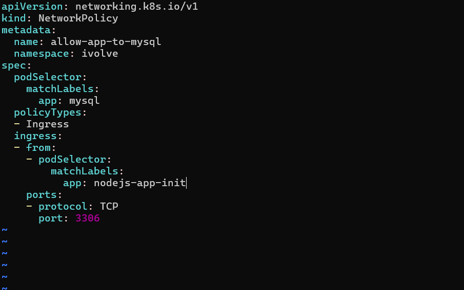

# IVOLVE Task 18 - Control Pod-to-Pod Traffic via Network Policy

This lab is part of the IVOLVE training program. It demonstrates how to use Kubernetes NetworkPolicies to control traffic between pods, implementing network segmentation and security at the pod level.

## Lab Overview

In this lab you:

- **Define** a NetworkPolicy resource to control pod-to-pod traffic
- **Configure** the policy to target MySQL pods (`app=mysql`)
- **Restrict** ingress traffic to only allow connections from application pods
- **Limit** access to MySQL's default port (3306)
- **Verify** the network policy is working correctly

## Prerequisites from Previous Tasks

This lab builds upon concepts from previous tasks:

### Task 10: Node Taints
- A worker node is tainted with `node=worker:NoSchedule`
- Deployments have toleration to run on tainted node

### Task 11: Namespace and Resource Quota
- Namespace `ivolve` exists
- Resource quota limits pods to 2

### Task 12: ConfigMaps and Secrets
- ConfigMap `mysql-config` with `DB_HOST` and `DB_USER`
- Secret `mysql-secret` with `DB_PASSWORD` and `MYSQL_ROOT_PASSWORD`

### Task 13: Persistent Volumes
- PersistentVolumeClaim `block-pvc` (ReadWriteMany) provides shared storage

### Task 14: MySQL StatefulSet
- MySQL StatefulSet running in the `ivolve` namespace
- MySQL pods labeled with `app: mysql`
- Headless service `mysql-service` for MySQL connectivity

### Task 16: Init Containers
- Node.js Deployment (`nodejs-app-init`) with init container for database setup
- Node.js pods labeled with `app: nodejs-app-init`

### Task 17: Resource Management
- Node.js Deployment configured with resource requests and limits

**Verify prerequisites:**

```bash
# Check MySQL StatefulSet is running
kubectl get pods -n ivolve -l app=mysql

# Check Node.js Deployment is running
kubectl get pods -n ivolve -l app=nodejs-app-init

# Verify MySQL service exists
kubectl get svc mysql-service -n ivolve
```

## Understanding Network Policies

**NetworkPolicies** are Kubernetes resources that control traffic flow between pods:

- **Pod-level Firewall**: Acts as a firewall at the pod level
- **Default Deny**: By default, all traffic is allowed; NetworkPolicy restricts it
- **Label-based**: Uses pod labels to select pods and define rules
- **Namespace-scoped**: NetworkPolicies apply within a namespace
- **Ingress/Egress**: Can control both incoming (ingress) and outgoing (egress) traffic

### Key Concepts

**Pod Selector:**
- Selects pods to which the policy applies
- Uses label selectors (`matchLabels` or `matchExpressions`)

**Policy Types:**
- **Ingress**: Controls incoming traffic to selected pods
- **Egress**: Controls outgoing traffic from selected pods

**Ingress Rules:**
- Define which pods can send traffic to the selected pods
- Can specify source pods, namespaces, or IP blocks
- Can restrict to specific ports and protocols

**Egress Rules:**
- Define which pods the selected pods can send traffic to
- Can specify destination pods, namespaces, or IP blocks
- Can restrict to specific ports and protocols

### Default Behavior

**Without NetworkPolicy:**
- All pods can communicate with all other pods
- No restrictions on traffic flow

**With NetworkPolicy:**
- If a pod is selected by a NetworkPolicy, it becomes isolated
- Only traffic matching the policy rules is allowed
- All other traffic is denied

**Important:** NetworkPolicy requires a **CNI plugin** that supports NetworkPolicy (e.g., Calico, Cilium, Weave Net). If your cluster doesn't have a compatible CNI, NetworkPolicies will have no effect.

## Project Requirements

### VMware Workstation

- **VMware Workstation** installed on your host machine
- **2 Virtual Machines** created:
  - **Master VM** (named `ks3`) - Control plane node
  - **Worker VM** - Worker node (tainted with `node=worker:NoSchedule`)

### Kubernetes

- **Kubernetes cluster** with 2 nodes (master and worker)
- **kubeadm** installed on both VMs
- **CNI plugin** that supports NetworkPolicy (e.g., Calico, Cilium, Weave Net)
- Access to `kubectl` command-line tool on master node

### Software

- **kubectl** - Kubernetes command-line tool
- **MySQL client** - For testing database connectivity (optional)

## Step-by-Step Instructions

### Step 1: Verify Current Pod Communication

Before applying the NetworkPolicy, verify that pods can communicate:

```bash
# Get MySQL pod name
MYSQL_POD=$(kubectl get pods -n ivolve -l app=mysql -o jsonpath='{.items[0].metadata.name}')

# Get Node.js pod name
NODEJS_POD=$(kubectl get pods -n ivolve -l app=nodejs-app-init -o jsonpath='{.items[0].metadata.name}')

# Test connectivity from Node.js pod to MySQL pod
kubectl exec -n ivolve $NODEJS_POD -- nc -zv mysql-service.ivolve.svc.cluster.local 3306
```

You should see successful connection (if MySQL is ready).

### Step 2: Review NetworkPolicy YAML

Create the NetworkPolicy YAML file:

```bash
cat > network-policy-allow-app-to-mysql.yaml << 'EOF'
apiVersion: networking.k8s.io/v1
kind: NetworkPolicy
metadata:
  name: allow-app-to-mysql
  namespace: ivolve
spec:
  podSelector:
    matchLabels:
      app: mysql
  policyTypes:
  - Ingress
  ingress:
  - from:
    - podSelector:
        matchLabels:
          app: nodejs-app-init
    ports:
    - protocol: TCP
      port: 3306
EOF
```

**Key components explained:**

1. **Metadata:**
```yaml
metadata:
  name: allow-app-to-mysql
  namespace: ivolve
```
   - **Name**: `allow-app-to-mysql` - Identifies the policy
   - **Namespace**: `ivolve` - Policy applies to pods in this namespace

2. **Pod Selector:**
```yaml
podSelector:
  matchLabels:
    app: mysql
```
   - **Target**: Selects pods with label `app=mysql`
   - **Effect**: This policy applies to MySQL pods
   - **Isolation**: MySQL pods become isolated (only matching traffic allowed)

3. **Policy Types:**
```yaml
policyTypes:
- Ingress
```
   - **Ingress Only**: Only controls incoming traffic
   - **No Egress**: Outgoing traffic from MySQL pods is not restricted

4. **Ingress Rules:**
```yaml
ingress:
- from:
  - podSelector:
      matchLabels:
        app: nodejs-app-init
  ports:
  - protocol: TCP
    port: 3306
```
   - **Source**: Only pods with label `app=nodejs-app-init` can send traffic
   - **Port**: Only port 3306 (MySQL default port) is allowed
   - **Protocol**: TCP protocol only
   - **Effect**: All other pods are blocked from accessing MySQL

### Step 3: Apply NetworkPolicy

**Apply the NetworkPolicy:**

```bash
kubectl apply -f network-policy-allow-app-to-mysql.yaml
```

**Verify the NetworkPolicy was created:**

```bash
kubectl get networkpolicy -n ivolve
```

You should see:

```
NAME                  POD-SELECTOR   AGE
allow-app-to-mysql    app=mysql      5s
```

**Screenshot: Network Policy**



**Describe the NetworkPolicy:**

```bash
kubectl describe networkpolicy allow-app-to-mysql -n ivolve
```

You should see:

```
Name:         allow-app-to-mysql
Namespace:    ivolve
Created:      2026-01-18 10:00:00 +0000 UTC
Spec:
  PodSelector:     app=mysql
  Allowing ingress traffic:
    To Port: 3306/TCP
    From:
      PodSelector: app=nodejs-app-init
  Policy Types: Ingress
```

### Step 4: Verify NetworkPolicy is Working

**Test connectivity from allowed pod (Node.js app):**

```bash
# Get Node.js pod name
NODEJS_POD=$(kubectl get pods -n ivolve -l app=nodejs-app-init -o jsonpath='{.items[0].metadata.name}')

# Test MySQL connectivity from Node.js pod
kubectl exec -n ivolve $NODEJS_POD -- nc -zv mysql-service.ivolve.svc.cluster.local 3306
```

**Expected result:** Connection should succeed (if MySQL is ready).

**Test connectivity from disallowed pod (if any other pod exists):**

```bash
# Try to connect from a pod that doesn't match the policy
# This should fail if NetworkPolicy is enforced
kubectl run test-pod --image=busybox -n ivolve --rm -it --restart=Never -- nc -zv mysql-service.ivolve.svc.cluster.local 3306
```

**Expected result:** Connection should fail (if CNI supports NetworkPolicy).

**Verify MySQL is still accessible from Node.js app:**

```bash
# Get Node.js pod name
NODEJS_POD=$(kubectl get pods -n ivolve -l app=nodejs-app-init -o jsonpath='{.items[0].metadata.name}')

# Test MySQL connection using MySQL client
kubectl exec -n ivolve $NODEJS_POD -- sh -c 'apk add --no-cache mysql-client && mysql -h mysql-service.ivolve.svc.cluster.local -u root -p$MYSQL_ROOT_PASSWORD -e "SELECT 1"'
```

**Expected result:** MySQL query should succeed.

### Step 5: Verify NetworkPolicy Enforcement

**Check NetworkPolicy status:**

```bash
# List all NetworkPolicies
kubectl get networkpolicies -n ivolve

# Describe NetworkPolicy
kubectl describe networkpolicy allow-app-to-mysql -n ivolve

# View NetworkPolicy YAML
kubectl get networkpolicy allow-app-to-mysql -n ivolve -o yaml
```

**Verify pods are selected:**

```bash
# Check MySQL pods (should be selected by the policy)
kubectl get pods -n ivolve -l app=mysql --show-labels

# Check Node.js pods (should be allowed to connect)
kubectl get pods -n ivolve -l app=nodejs-app-init --show-labels
```

## NetworkPolicy Breakdown

### What This Policy Does

**Target Pods:**
- MySQL pods with label `app=mysql`

**Allowed Traffic:**
- **Source**: Pods with label `app=nodejs-app-init`
- **Destination Port**: 3306 (MySQL)
- **Protocol**: TCP

**Blocked Traffic:**
- All other pods trying to access MySQL
- All traffic to MySQL on ports other than 3306
- All traffic from pods without label `app=nodejs-app-init`

### Traffic Flow

**Before NetworkPolicy:**
```
All Pods → MySQL (Port 3306) ✅ Allowed
All Pods → MySQL (Any Port) ✅ Allowed
```

**After NetworkPolicy:**
```
Node.js App Pods → MySQL (Port 3306) ✅ Allowed
Other Pods → MySQL (Port 3306) ❌ Blocked
All Pods → MySQL (Other Ports) ❌ Blocked
```

## Integration Summary

This lab integrates all previous tasks:

### Task 10 Integration: Taints and Tolerations
- Worker node is tainted with `node=worker:NoSchedule`
- Deployments have toleration to run on tainted node

### Task 11 Integration: Namespace and Resource Quota
- All resources created in `ivolve` namespace
- Resource quota limits pods to 2

### Task 12 Integration: ConfigMaps and Secrets
- ConfigMap `mysql-config` provides `DB_HOST` and `DB_USER`
- Secret `mysql-secret` provides `DB_PASSWORD`

### Task 13 Integration: Persistent Storage
- PersistentVolumeClaim `block-pvc` provides shared storage

### Task 14 Integration: MySQL StatefulSet
- MySQL StatefulSet provides the database server
- MySQL pods labeled with `app: mysql`

### Task 16 Integration: Init Containers
- Node.js Deployment with init container for database setup
- Node.js pods labeled with `app: nodejs-app-init`

### Task 17 Integration: Resource Management
- Node.js Deployment configured with resource requests and limits

## Project Structure

```
task-18/
├── network-policy-allow-app-to-mysql.yaml  # NetworkPolicy YAML
├── README.md                                # This file
└── screenshots/                             # Lab screenshots
    └── network-policy.png                   # NetworkPolicy verification
```

## Key Concepts

### NetworkPolicy Selectors

**Pod Selector:**
- Selects pods to which the policy applies
- Uses `matchLabels` for exact label matching
- Uses `matchExpressions` for advanced matching

**Example:**
```yaml
podSelector:
  matchLabels:
    app: mysql
```

### Ingress Rules

**From Sources:**
- **podSelector**: Select pods by labels
- **namespaceSelector**: Select pods by namespace labels
- **ipBlock**: Select by IP address ranges

**Ports:**
- **port**: Port number or name
- **protocol**: TCP, UDP, or SCTP

**Example:**
```yaml
ingress:
- from:
  - podSelector:
      matchLabels:
        app: nodejs-app-init
  ports:
  - protocol: TCP
    port: 3306
```

### Policy Types

**Ingress:**
- Controls incoming traffic to selected pods
- If specified, only matching ingress rules allow traffic

**Egress:**
- Controls outgoing traffic from selected pods
- If specified, only matching egress rules allow traffic

**Both:**
- Can specify both Ingress and Egress
- Each type is independent

## Common Commands

### NetworkPolicy Commands

```bash
# List all NetworkPolicies
kubectl get networkpolicies -n ivolve
kubectl get netpol -n ivolve  # Short form

# Describe NetworkPolicy
kubectl describe networkpolicy allow-app-to-mysql -n ivolve

# View NetworkPolicy YAML
kubectl get networkpolicy allow-app-to-mysql -n ivolve -o yaml

# Delete NetworkPolicy
kubectl delete networkpolicy allow-app-to-mysql -n ivolve
```

### Testing Connectivity

```bash
# Test connectivity from pod
kubectl exec -n ivolve <pod-name> -- nc -zv <host> <port>

# Test MySQL connection
kubectl exec -n ivolve <pod-name> -- mysql -h <host> -u <user> -p<password> -e "SELECT 1"

# Run temporary pod for testing
kubectl run test-pod --image=busybox -n ivolve --rm -it --restart=Never -- <command>
```

### Pod Label Commands

```bash
# List pods with labels
kubectl get pods -n ivolve --show-labels

# Filter pods by label
kubectl get pods -n ivolve -l app=mysql
kubectl get pods -n ivolve -l app=nodejs-app-init

# Check pod labels
kubectl get pod <pod-name> -n ivolve -o jsonpath='{.metadata.labels}'
```

## Best Practices

### 1. Use Descriptive Names

**Why:**
- Makes it clear what the policy does
- Easier to manage and troubleshoot

**Example:**
```yaml
name: allow-app-to-mysql  # Good
name: policy-1            # Bad
```

### 2. Be Specific with Selectors

**Why:**
- Prevents accidental access
- Makes policies easier to understand

**Example:**
```yaml
podSelector:
  matchLabels:
    app: mysql
    tier: database
```

### 3. Restrict Ports

**Why:**
- Limits attack surface
- Follows principle of least privilege

**Example:**
```yaml
ports:
- protocol: TCP
  port: 3306
```

### 4. Use Namespace Isolation

**Why:**
- Prevents cross-namespace access
- Better security boundaries

**Example:**
```yaml
from:
- namespaceSelector:
    matchLabels:
      name: production
```

### 5. Document Policies

**Why:**
- Helps understand policy purpose
- Easier to maintain

**Example:**
```yaml
metadata:
  name: allow-app-to-mysql
  annotations:
    description: "Allows Node.js app pods to access MySQL on port 3306"
```

### 6. Test Before Production

**Why:**
- Prevents breaking applications
- Ensures policies work as expected

**Process:**
1. Apply policy in test environment
2. Verify allowed traffic works
3. Verify blocked traffic is blocked
4. Apply to production

## Use Cases

### Database Access Control

**Scenario:** Only application pods can access database.

```yaml
apiVersion: networking.k8s.io/v1
kind: NetworkPolicy
metadata:
  name: allow-app-to-db
spec:
  podSelector:
    matchLabels:
      app: mysql
  policyTypes:
  - Ingress
  ingress:
  - from:
    - podSelector:
        matchLabels:
          app: nodejs-app-init
    ports:
    - protocol: TCP
      port: 3306
```

### Multi-Tier Application

**Scenario:** Frontend can access backend, backend can access database.

```yaml
# Frontend to Backend
apiVersion: networking.k8s.io/v1
kind: NetworkPolicy
metadata:
  name: allow-frontend-to-backend
spec:
  podSelector:
    matchLabels:
      app: backend
  policyTypes:
  - Ingress
  ingress:
  - from:
    - podSelector:
        matchLabels:
          app: frontend
    ports:
    - protocol: TCP
      port: 8080
```

### Namespace Isolation

**Scenario:** Only pods in same namespace can communicate.

```yaml
apiVersion: networking.k8s.io/v1
kind: NetworkPolicy
metadata:
  name: deny-all-ingress
spec:
  podSelector: {}
  policyTypes:
  - Ingress
  # No ingress rules = deny all
```

## Notes

- NetworkPolicy requires a CNI plugin that supports it (e.g., Calico, Cilium, Weave Net)
- If CNI doesn't support NetworkPolicy, policies have no effect
- NetworkPolicy is namespace-scoped
- Default behavior: All traffic allowed if no NetworkPolicy exists
- Once a pod is selected by a NetworkPolicy, it becomes isolated
- Only traffic matching policy rules is allowed
- NetworkPolicy uses pod labels, not IP addresses
- Ports can be specified by number or name
- Multiple ingress/egress rules are OR'd together
- Rules within a single ingress/egress block are AND'd together

## Troubleshooting

### Issue: NetworkPolicy has no effect

**Cause:** CNI plugin doesn't support NetworkPolicy.

**Solution:**
```bash
# Check CNI plugin
kubectl get pods -n kube-system | grep -i cni

# Install a CNI that supports NetworkPolicy (e.g., Calico)
# Refer to CNI documentation for installation instructions
```

### Issue: Allowed pods cannot connect

**Cause:** Policy rules don't match pod labels.

**Solution:**
```bash
# Check pod labels
kubectl get pods -n ivolve --show-labels

# Verify NetworkPolicy selector matches pod labels
kubectl get networkpolicy allow-app-to-mysql -n ivolve -o yaml

# Check if port/protocol matches
kubectl describe networkpolicy allow-app-to-mysql -n ivolve
```

### Issue: Cannot verify NetworkPolicy

**Cause:** No way to test blocked traffic.

**Solution:**
```bash
# Create a test pod without matching labels
kubectl run test-pod --image=busybox -n ivolve --rm -it --restart=Never -- sh

# Try to connect from test pod
nc -zv mysql-service.ivolve.svc.cluster.local 3306

# Should fail if NetworkPolicy is working
```

### Issue: Policy blocks all traffic

**Cause:** Policy is too restrictive.

**Solution:**
```bash
# Check policy rules
kubectl describe networkpolicy allow-app-to-mysql -n ivolve

# Verify pod labels match
kubectl get pods -n ivolve --show-labels

# Temporarily delete policy to test
kubectl delete networkpolicy allow-app-to-mysql -n ivolve
```

## Next Steps

- Explore egress NetworkPolicies
- Implement namespace-level isolation
- Configure IP-based rules
- Set up multi-tier application policies
- Explore advanced selector expressions
- Implement default deny policies
- Configure NetworkPolicy for services
- Explore CNI-specific features

## License

See the LICENSE file in the parent directory for license information.
