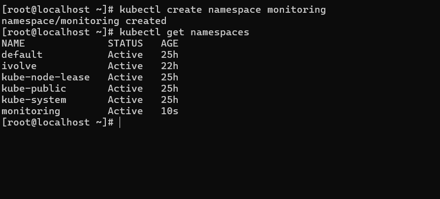
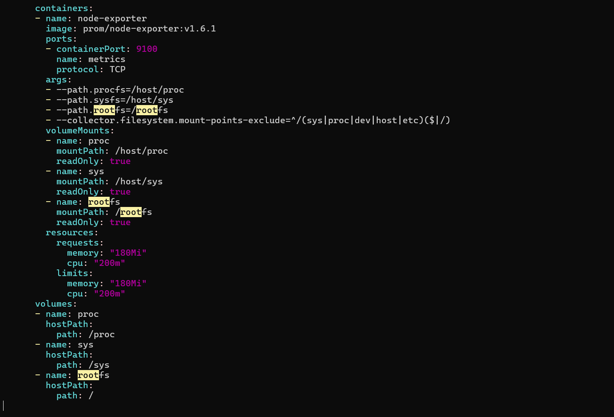
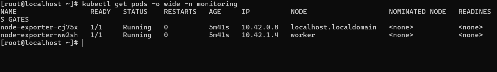

# IVOLVE Task 19 - Node-Wide Pod Management with DaemonSet

This lab is part of the IVOLVE training program. It demonstrates how to use Kubernetes DaemonSets to deploy pods on every node in the cluster, ensuring consistent monitoring and system-level services across all nodes.

## Lab Overview

In this lab you:

- **Create** a monitoring namespace
- **Deploy** a DaemonSet for Prometheus node-exporter that tolerates all existing taints
- **Validate** that a node-exporter pod is scheduled on each node
- **Confirm** correct metrics exposure by accessing `:9100/metrics` on any node

## Prerequisites from Previous Tasks

This lab builds upon concepts from previous tasks:

### Task 10: Node Taints
- A worker node is tainted with `node=worker:NoSchedule`
- Control-plane node (master) has default taints
- Understanding of taints and tolerations

**Verify prerequisites:**

```bash
# Check nodes and their taints
kubectl get nodes

# Describe nodes to see taints
kubectl describe nodes
```

## Understanding DaemonSets

**DaemonSets** are Kubernetes resources that ensure a pod runs on every node in the cluster:

- **One Pod Per Node**: Automatically creates one pod on each node
- **Automatic Scheduling**: New nodes automatically get the pod
- **Node-Specific Services**: Perfect for monitoring, logging, networking
- **Taint Tolerance**: Can tolerate taints to run on control-plane nodes
- **Automatic Cleanup**: Pods are removed when nodes are removed

### Key Concepts

**DaemonSet vs Deployment:**

| Feature | DaemonSet | Deployment |
|---------|-----------|------------|
| Pod Count | One per node | Specified replicas |
| Use Case | System services | Application workloads |
| Node Addition | Auto-creates pod | Manual scaling needed |
| Node Removal | Auto-removes pod | Pods remain |

**Common Use Cases:**

- **Monitoring**: Node-exporter, metrics collectors
- **Logging**: Log aggregation agents
- **Networking**: CNI plugins, network proxies
- **Storage**: Storage daemons
- **Security**: Security scanners, compliance agents

### Prometheus Node-Exporter

**Node-exporter** is a Prometheus exporter for hardware and OS metrics:

- **Metrics Collection**: CPU, memory, disk, network, filesystem
- **Standard Port**: Exposes metrics on port 9100
- **Metrics Endpoint**: `/metrics` endpoint for Prometheus scraping
- **Host Access**: Requires access to host filesystem (`/proc`, `/sys`)

## Project Requirements

### VMware Workstation

- **VMware Workstation** installed on your host machine
- **2 Virtual Machines** created:
  - **Master VM** (named `ks3`) - Control plane node
  - **Worker VM** - Worker node (tainted with `node=worker:NoSchedule`)

### Kubernetes

- **Kubernetes cluster** with 2 nodes (master and worker)
- **kubeadm** installed on both VMs
- Access to `kubectl` command-line tool on master node
- Cluster admin permissions

### Software

- **kubectl** - Kubernetes command-line tool
- **curl** or **wget** - For accessing metrics endpoint (optional)

## Step-by-Step Instructions

### Step 1: Create Monitoring Namespace

Create a dedicated namespace for monitoring components:

```bash
kubectl create namespace monitoring
```

**Verify the namespace was created:**

```bash
kubectl get namespace monitoring
```

You should see:

```
NAME         STATUS   AGE
monitoring   Active   5s
```

**Screenshot: Create Namespace**



**Alternative: Create namespace using YAML:**

```bash
cat > monitoring-namespace.yaml << 'EOF'
apiVersion: v1
kind: Namespace
metadata:
  name: monitoring
EOF

kubectl apply -f monitoring-namespace.yaml
```

### Step 2: Review DaemonSet YAML

The DaemonSet YAML includes:

1. **Namespace**: `monitoring`
2. **Tolerations**: Tolerates all existing taints
3. **Container**: Prometheus node-exporter image
4. **Ports**: Exposes port 9100 for metrics
5. **Volumes**: Mounts host filesystem (`/proc`, `/sys`, `/`)
6. **Resources**: CPU and memory requests/limits

**Key components explained:**

**Tolerations for All Taints:**
```yaml
tolerations:
# Tolerate control-plane/master node taint
- key: node-role.kubernetes.io/control-plane
  operator: Exists
  effect: NoSchedule
- key: node-role.kubernetes.io/master
  operator: Exists
  effect: NoSchedule
# Tolerate worker node taint (from Task 10)
- key: node
  operator: Equal
  value: worker
  effect: NoSchedule
# Tolerate any other taints
- operator: Exists
  effect: NoSchedule
- operator: Exists
  effect: NoExecute
```

**Why these tolerations:**
- **Control-plane taints**: Master nodes have default taints preventing regular pods
- **Worker taint**: From Task 10, worker node has `node=worker:NoSchedule`
- **Generic tolerations**: `operator: Exists` matches any taint with the specified effect

**Host Filesystem Access:**
```yaml
volumeMounts:
- name: proc
  mountPath: /host/proc
  readOnly: true
- name: sys
  mountPath: /host/sys
  readOnly: true
- name: rootfs
  mountPath: /rootfs
  readOnly: true
```

**Why host access:**
- Node-exporter needs to read host metrics from `/proc` and `/sys`
- Mounted as read-only for security
- Allows collection of node-level metrics

### Step 3: Deploy DaemonSet

**Apply the DaemonSet:**

```bash
kubectl apply -f node-exporter-daemonset.yaml
```

**Verify the DaemonSet was created:**

```bash
kubectl get daemonset -n monitoring
```

You should see:

```
NAME            DESIRED   CURRENT   READY   UP-TO-DATE   AVAILABLE   NODE SELECTOR   AGE
node-exporter   2         2         0       2            0           <none>          5s
```

**Screenshot: DaemonSet Created**



**Describe the DaemonSet:**

```bash
kubectl describe daemonset node-exporter -n monitoring
```

You should see details about:
- Pod template
- Tolerations
- Volume mounts
- Resource requests/limits

### Step 4: Validate Pod Scheduling on Each Node

**Check pods are scheduled on all nodes:**

```bash
kubectl get pods -n monitoring -o wide
```

You should see one pod per node:

```
NAME                  READY   STATUS    RESTARTS   AGE   IP           NODE     NOMINATED NODE   READINESS GATES
node-exporter-xxxxx   1/1     Running   0          30s   10.42.1.10   worker   <none>           <none>
node-exporter-yyyyy   1/1     Running   0          30s   10.42.0.5    ks3      <none>           <none>
```

**Key observations:**
- **2 pods**: One on master node (`ks3`), one on worker node
- **Status**: Should be `Running` after a few seconds
- **Node distribution**: Each node has exactly one pod

**Screenshot: Validate Pods Running on All Nodes**



**Verify pod details:**

```bash
# Get pod names
kubectl get pods -n monitoring -l app=node-exporter

# Describe a pod
POD_NAME=$(kubectl get pods -n monitoring -l app=node-exporter -o jsonpath='{.items[0].metadata.name}')
kubectl describe pod $POD_NAME -n monitoring
```

**Check tolerations are applied:**

```bash
kubectl get pod $POD_NAME -n monitoring -o yaml | grep -A 20 tolerations
```

You should see all the tolerations we configured.

**Verify pods are on different nodes:**

```bash
kubectl get pods -n monitoring -l app=node-exporter -o custom-columns=NAME:.metadata.name,NODE:.spec.nodeName
```

You should see pods on both nodes:

```
NAME                  NODE
node-exporter-xxxxx   worker
node-exporter-yyyyy   ks3
```

### Step 5: Confirm Metrics Exposure

**Method 1: Port Forward to Access Metrics**

Port forward to a node-exporter pod:

```bash
# Get pod name
POD_NAME=$(kubectl get pods -n monitoring -l app=node-exporter -o jsonpath='{.items[0].metadata.name}')

# Port forward
kubectl port-forward -n monitoring $POD_NAME 9100:9100
```

**In another terminal, access metrics:**

```bash
curl http://localhost:9100/metrics
```

You should see Prometheus metrics output:

```
# HELP node_cpu_seconds_total Seconds the CPUs spent in each mode.
# TYPE node_cpu_seconds_total counter
node_cpu_seconds_total{cpu="0",mode="idle"} 12345.67
node_cpu_seconds_total{cpu="0",mode="iowait"} 12.34
...
```

**Method 2: Access from Inside the Pod (What You Did)**

**Execute into the node-exporter pod:**

```bash
# Get pod name
POD_NAME=$(kubectl get pods -n monitoring -l app=node-exporter -o jsonpath='{.items[0].metadata.name}')

# Execute into the pod
kubectl exec -it $POD_NAME -n monitoring -- sh
```

**Inside the pod, access metrics:**

```bash
# Using wget
wget -qO- http://localhost:9100/metrics

# Or using curl (if available)
curl http://localhost:9100/metrics
```

**Why this works:** When you're inside the pod, `localhost:9100` refers to the node-exporter service running in the same container, so it works directly.

**Method 3: Access via Pod IP from Another Pod**

**Get pod IP:**

```bash
kubectl get pods -n monitoring -l app=node-exporter -o wide
```

**Access metrics from another pod:**

```bash
# Run a temporary pod
kubectl run curl-test --image=curlimages/curl -n monitoring --rm -it --restart=Never -- sh

# Inside the pod, access metrics using pod IP
curl http://<pod-ip>:9100/metrics
```

**Method 3: Create a Service and Access**

**Create a Service for node-exporter:**

```bash
cat > node-exporter-service.yaml << 'EOF'
apiVersion: v1
kind: Service
metadata:
  name: node-exporter
  namespace: monitoring
  labels:
    app: node-exporter
spec:
  selector:
    app: node-exporter
  ports:
  - port: 9100
    targetPort: 9100
    protocol: TCP
    name: metrics
  type: ClusterIP
EOF

kubectl apply -f node-exporter-service.yaml
```

**Access via service:**

```bash
# Port forward to service
kubectl port-forward -n monitoring svc/node-exporter 9100:9100

# Access metrics
curl http://localhost:9100/metrics
```

**Screenshot: Metrics Endpoint**


**Verify specific metrics:**

```bash
# Check node CPU metrics
curl http://localhost:9100/metrics | grep node_cpu

# Check node memory metrics
curl http://localhost:9100/metrics | grep node_memory

# Check node filesystem metrics
curl http://localhost:9100/metrics | grep node_filesystem
```

## Understanding DaemonSet Behavior

### Automatic Pod Management

**When a node is added:**
- DaemonSet automatically creates a pod on the new node
- No manual intervention required

**When a node is removed:**
- DaemonSet automatically removes the pod
- Pod is garbage collected

**When a pod fails:**
- DaemonSet controller recreates the pod
- Ensures one pod per node is always running

### Taint Tolerance

**Why tolerations are needed:**

1. **Control-plane nodes**: Have default taints preventing regular pods
2. **Tainted worker nodes**: May have custom taints (like Task 10)
3. **DaemonSet requirement**: Must run on ALL nodes, including tainted ones

**Toleration strategies:**

- **Specific tolerations**: Match exact taints (e.g., `node=worker:NoSchedule`)
- **Generic tolerations**: Match any taint with `operator: Exists`
- **All effects**: Tolerate `NoSchedule`, `PreferNoSchedule`, and `NoExecute`

## Integration Summary

This lab integrates with previous tasks:

### Task 10 Integration: Node Taints
- Worker node is tainted with `node=worker:NoSchedule`
- DaemonSet includes toleration for this taint
- Control-plane node has default taints
- DaemonSet tolerates all taints to run everywhere

### Task 11 Integration: Namespace Management
- Created `monitoring` namespace (similar to `ivolve` namespace)
- Demonstrates namespace organization

### Task 17 Integration: Resource Management
- DaemonSet includes resource requests and limits
- Ensures predictable resource usage

## Project Structure

```
task-19/
├── node-exporter-daemonset.yaml  # DaemonSet YAML
├── README.md                      # This file
└── screenshots/                   # Lab screenshots
    ├── create-namespace.png                    # Create monitoring namespace
    ├── daemonset.png                           # DaemonSet verification
    └── validate-pods-is-run-in-all-nodes.png    # Pods running on all nodes
```

## Key Concepts

### DaemonSet Selector

**Match Labels:**
- DaemonSet uses `selector.matchLabels` to identify pods
- Pods must match these labels to be managed by DaemonSet

**Example:**
```yaml
selector:
  matchLabels:
    app: node-exporter
```

### Pod Template

**Template Specification:**
- Defines how pods should be created
- Includes container spec, volumes, tolerations, etc.

**Example:**
```yaml
template:
  metadata:
    labels:
      app: node-exporter
  spec:
    tolerations: [...]
    containers: [...]
```

### Tolerations

**Toleration Structure:**
- **key**: Taint key to match
- **operator**: `Equal` or `Exists`
- **value**: Taint value (if operator is `Equal`)
- **effect**: `NoSchedule`, `PreferNoSchedule`, or `NoExecute`

**Generic Toleration:**
```yaml
tolerations:
- operator: Exists  # Matches any taint
  effect: NoSchedule
```

### Host Path Volumes

**Host Path Access:**
- Allows pods to access host filesystem
- Required for system-level monitoring
- Should be read-only when possible

**Example:**
```yaml
volumeMounts:
- name: proc
  mountPath: /host/proc
  readOnly: true
volumes:
- name: proc
  hostPath:
    path: /proc
```

## Common Commands

### DaemonSet Commands

```bash
# List DaemonSets
kubectl get daemonset -n monitoring
kubectl get ds -n monitoring  # Short form

# Describe DaemonSet
kubectl describe daemonset node-exporter -n monitoring

# View DaemonSet YAML
kubectl get daemonset node-exporter -n monitoring -o yaml

# Delete DaemonSet
kubectl delete daemonset node-exporter -n monitoring
```

### Pod Commands

```bash
# List pods managed by DaemonSet
kubectl get pods -n monitoring -l app=node-exporter

# List pods with node information
kubectl get pods -n monitoring -l app=node-exporter -o wide

# Describe a pod
kubectl describe pod <pod-name> -n monitoring

# View pod logs
kubectl logs <pod-name> -n monitoring

# Check pod on specific node
kubectl get pods -n monitoring -l app=node-exporter -o wide | grep <node-name>
```

### Namespace Commands

```bash
# Create namespace
kubectl create namespace monitoring

# List namespaces
kubectl get namespaces
kubectl get ns  # Short form

# Describe namespace
kubectl describe namespace monitoring

# Delete namespace (deletes all resources)
kubectl delete namespace monitoring
```

### Metrics Access Commands

```bash
# Port forward to pod
kubectl port-forward -n monitoring <pod-name> 9100:9100

# Port forward to service
kubectl port-forward -n monitoring svc/node-exporter 9100:9100

# Access metrics
curl http://localhost:9100/metrics

# Check specific metrics
curl http://localhost:9100/metrics | grep node_cpu
curl http://localhost:9100/metrics | grep node_memory
```

## Best Practices

### 1. Use Dedicated Namespaces

**Why:**
- Organizes resources logically
- Simplifies management and cleanup
- Enables namespace-level policies

**Example:**
```bash
kubectl create namespace monitoring
```

### 2. Tolerate All Taints

**Why:**
- DaemonSets should run on all nodes
- Control-plane nodes have default taints
- Custom taints may exist on worker nodes

**Example:**
```yaml
tolerations:
- operator: Exists
  effect: NoSchedule
- operator: Exists
  effect: NoExecute
```

### 3. Use Read-Only Host Mounts

**Why:**
- Prevents accidental modifications
- Improves security
- Reduces risk of host system damage

**Example:**
```yaml
volumeMounts:
- name: proc
  mountPath: /host/proc
  readOnly: true
```

### 4. Set Resource Limits

**Why:**
- Prevents resource exhaustion
- Ensures predictable performance
- Protects other workloads

**Example:**
```yaml
resources:
  requests:
    memory: "180Mi"
    cpu: "200m"
  limits:
    memory: "180Mi"
    cpu: "200m"
```

### 5. Use Appropriate Labels

**Why:**
- Enables easy pod selection
- Supports service discovery
- Facilitates monitoring and logging

**Example:**
```yaml
labels:
  app: node-exporter
  component: monitoring
```

### 6. Expose Metrics via Service

**Why:**
- Provides stable endpoint
- Enables service discovery
- Supports Prometheus scraping

**Example:**
```yaml
apiVersion: v1
kind: Service
metadata:
  name: node-exporter
spec:
  selector:
    app: node-exporter
  ports:
  - port: 9100
    targetPort: 9100
```

## Use Cases

### System Monitoring

**Scenario:** Collect metrics from all nodes.

```yaml
apiVersion: apps/v1
kind: DaemonSet
metadata:
  name: node-exporter
spec:
  template:
    spec:
      containers:
      - name: node-exporter
        image: prom/node-exporter:v1.6.1
```

### Log Collection

**Scenario:** Collect logs from all nodes.

```yaml
apiVersion: apps/v1
kind: DaemonSet
metadata:
  name: fluentd
spec:
  template:
    spec:
      containers:
      - name: fluentd
        image: fluent/fluentd:latest
```

### Network Proxy

**Scenario:** Run network proxy on all nodes.

```yaml
apiVersion: apps/v1
kind: DaemonSet
metadata:
  name: kube-proxy
spec:
  template:
    spec:
      containers:
      - name: kube-proxy
        image: k8s.gcr.io/kube-proxy:latest
```

## Troubleshooting

### Issue: Pod not scheduled on a node

**Cause:** Node has taint without matching toleration.

**Solution:**
```bash
# Check node taints
kubectl describe node <node-name> | grep Taints

# Add appropriate toleration to DaemonSet
kubectl edit daemonset node-exporter -n monitoring
```

### Issue: Pod in Pending state

**Cause:** No node has resources or tolerations don't match.

**Solution:**
```bash
# Check pod events
kubectl describe pod <pod-name> -n monitoring

# Check node resources
kubectl describe nodes

# Verify tolerations
kubectl get pod <pod-name> -n monitoring -o yaml | grep -A 10 tolerations
```

### Issue: Cannot access metrics

**Cause:** Port forwarding not set up or service not created.

**Solution:**
```bash
# Port forward to pod
kubectl port-forward -n monitoring <pod-name> 9100:9100

# Or create a service
kubectl apply -f node-exporter-service.yaml
kubectl port-forward -n monitoring svc/node-exporter 9100:9100
```

### Issue: Metrics show zero values

**Cause:** Host filesystem not mounted correctly.

**Solution:**
```bash
# Check volume mounts
kubectl describe pod <pod-name> -n monitoring | grep -A 5 Mounts

# Verify host paths exist
kubectl exec -n monitoring <pod-name> -- ls /host/proc
```

### Issue: DaemonSet creates too many pods

**Cause:** Multiple nodes or incorrect node selector.

**Solution:**
```bash
# Check number of nodes
kubectl get nodes

# Verify DaemonSet status
kubectl get daemonset node-exporter -n monitoring

# Check for node selector
kubectl get daemonset node-exporter -n monitoring -o yaml | grep nodeSelector
```

## Notes

- DaemonSets ensure one pod per node
- Tolerations are required for tainted nodes
- Control-plane nodes have default taints
- Host path volumes provide access to node metrics
- Read-only mounts improve security
- Resource limits prevent resource exhaustion
- Services provide stable endpoints for metrics
- DaemonSets automatically manage pod lifecycle
- Pods are recreated if they fail
- New nodes automatically get DaemonSet pods

## Next Steps

- Explore other DaemonSet use cases (logging, networking)
- Integrate node-exporter with Prometheus
- Configure service discovery for metrics scraping
- Set up alerting based on node metrics
- Explore node affinity and anti-affinity
- Configure pod disruption budgets
- Implement rolling updates for DaemonSets
- Explore node-level resource monitoring

## License

See the LICENSE file in the parent directory for license information.
