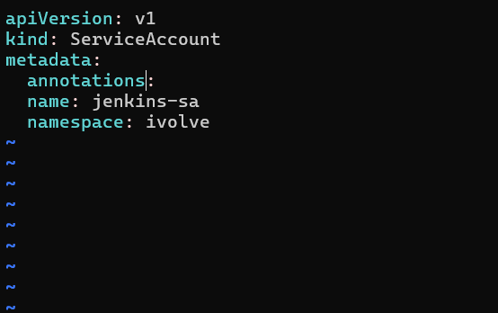
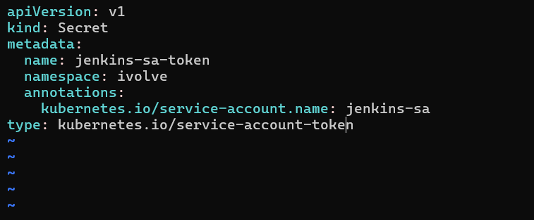
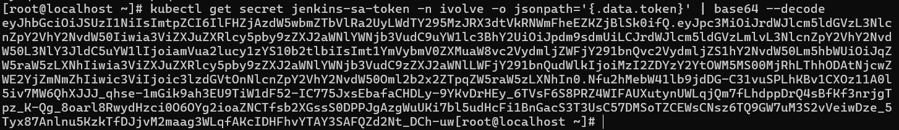
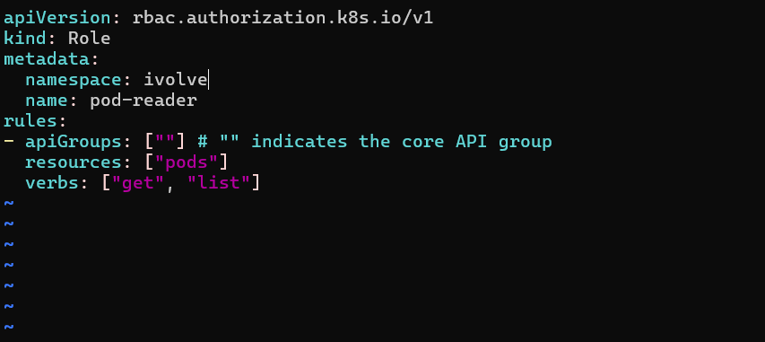
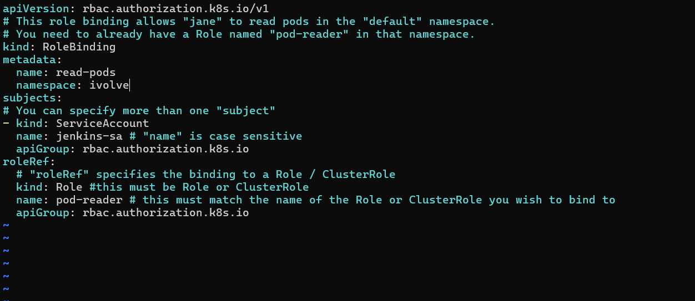
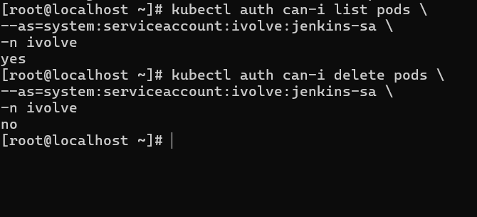

# IVOLVE Task 20 - Securing Kubernetes with RBAC and Service Accounts

This lab is part of the IVOLVE training program. It demonstrates how to use Kubernetes Role-Based Access Control (RBAC) and Service Accounts to implement fine-grained security policies, ensuring that applications and users have only the permissions they need.

## Lab Overview

In this lab you:

- **Create** a Service Account named `jenkins-sa` in the `ivolve` namespace
- **Create** a secret and retrieve the service account token
- **Define** a Role named `pod-reader` that grants read-only permissions (get, list) on Pods
- **Create** a RoleBinding to bind the `pod-reader` Role to the `jenkins-sa` ServiceAccount
- **Validate** that the role can only list pods (and verify it cannot perform other actions)

## Prerequisites from Previous Tasks

This lab builds upon concepts from previous tasks:

### Task 11: Namespace Management
- Namespace `ivolve` exists
- Understanding of namespace isolation

**Verify prerequisites:**

```bash
# Check namespace exists
kubectl get namespace ivolve

# Verify namespace is active
kubectl get namespace ivolve -o jsonpath='{.status.phase}'
```

## Understanding RBAC and Service Accounts

**Role-Based Access Control (RBAC)** is Kubernetes' authorization mechanism:

- **Service Accounts**: Non-human identities for pods and applications
- **Roles**: Define permissions within a namespace
- **RoleBindings**: Bind roles to users, groups, or service accounts
- **ClusterRoles**: Define permissions cluster-wide
- **ClusterRoleBindings**: Bind cluster roles cluster-wide

### Key Concepts

**Service Accounts:**
- Identity for pods and applications
- Used for authentication and authorization
- Can have secrets (tokens) for API access
- Default service account exists in each namespace

**Roles:**
- Namespace-scoped permissions
- Define what actions can be performed on which resources
- Consist of rules (apiGroups, resources, verbs)

**RoleBindings:**
- Bind roles to subjects (users, groups, service accounts)
- Namespace-scoped
- Links identities to permissions

**RBAC Components:**

| Component | Scope | Use Case |
|-----------|-------|----------|
| Role | Namespace | Permissions within a namespace |
| RoleBinding | Namespace | Bind role to subject in namespace |
| ClusterRole | Cluster-wide | Permissions across all namespaces |
| ClusterRoleBinding | Cluster-wide | Bind cluster role cluster-wide |

### Common Verbs

**Read Operations:**
- `get` - Get a specific resource
- `list` - List all resources of a type
- `watch` - Watch resources for changes

**Write Operations:**
- `create` - Create new resources
- `update` - Update existing resources
- `patch` - Partially update resources
- `delete` - Delete resources

**Administrative:**
- `*` or `["*"]` - All verbs (full access)

## Project Requirements

### VMware Workstation

- **VMware Workstation** installed on your host machine
- **2 Virtual Machines** created:
  - **Master VM** (named `ks3`) - Control plane node
  - **Worker VM** - Worker node

### Kubernetes

- **Kubernetes cluster** with 2 nodes (master and worker)
- **kubeadm** installed on both VMs
- Access to `kubectl` command-line tool on master node
- Cluster admin permissions

### Software

- **kubectl** - Kubernetes command-line tool
- **base64** - For decoding tokens (usually pre-installed)
- **curl** or **wget** - For API testing (optional)

## Step-by-Step Instructions

### Step 1: Create Service Account

Create a Service Account named `jenkins-sa` in the `ivolve` namespace:

```bash
kubectl apply -f jenkins-sa.yaml
```

**Verify the Service Account was created:**

```bash
kubectl get serviceaccount jenkins-sa -n ivolve
```

You should see:

```
NAME        SECRETS   AGE
jenkins-sa  0         5s
```

**Screenshot: Service Account YAML**



**Describe the Service Account:**

```bash
kubectl describe serviceaccount jenkins-sa -n ivolve
```

**View Service Account details:**

```bash
kubectl get serviceaccount jenkins-sa -n ivolve -o yaml
```

### Step 2: Create Secret and Retrieve Service Account Token

**Create a secret for the service account token:**

```bash
kubectl apply -f jenkins-sa-secret.yaml
```

**Verify the secret was created:**

```bash
kubectl get secret jenkins-sa-secret -n ivolve
```

You should see:

```
NAME                 TYPE                                  DATA   AGE
jenkins-sa-secret   kubernetes.io/service-account-token   3      5s
```

**Screenshot: Secret YAML**



**Retrieve the service account token:**

```bash
# Get the token from the secret
kubectl get secret jenkins-sa-secret -n ivolve -o jsonpath='{.data.token}' | base64 -d
```

**Save the token to a variable:**

```bash
TOKEN=$(kubectl get secret jenkins-sa-secret -n ivolve -o jsonpath='{.data.token}' | base64 -d)
echo $TOKEN
```

**Screenshot: Get Secret Token**



**Alternative: Get token from automatically created secret**

Kubernetes automatically creates a secret for service accounts. You can also retrieve the token from there:

```bash
# Get the auto-created secret name
SECRET_NAME=$(kubectl get serviceaccount jenkins-sa -n ivolve -o jsonpath='{.secrets[0].name}')

# Get the token
kubectl get secret $SECRET_NAME -n ivolve -o jsonpath='{.data.token}' | base64 -d
```

### Step 3: Define Pod Reader Role

Create a Role named `pod-reader` that grants read-only permissions (get, list) on Pods:

```bash
kubectl apply -f pod-reader-role.yaml
```

**Verify the Role was created:**

```bash
kubectl get role pod-reader -n ivolve
```

You should see:

```
NAME         CREATED AT
pod-reader   2026-01-18T10:00:00Z
```

**Screenshot: Role YAML**



**Describe the Role:**

```bash
kubectl describe role pod-reader -n ivolve
```

You should see:

```
Name:         pod-reader
Labels:       <none>
Annotations:  <none>
PolicyRule:
  Resources  Non-Resource URLs  Resource Names  Verbs
  ---------  -----------------  --------------  -----
  pods       []                 []              [get list]
```

**View Role details:**

```bash
kubectl get role pod-reader -n ivolve -o yaml
```

**Key components explained:**

```yaml
rules:
- apiGroups: [""]
  resources: ["pods"]
  verbs: ["get", "list"]
```

- **apiGroups: [""]**: Core API group (empty string for core resources)
- **resources: ["pods"]**: The resource type (pods)
- **verbs: ["get", "list"]**: Allowed actions
  - `get`: Retrieve a specific pod
  - `list`: List all pods

### Step 4: Create RoleBinding

Create a RoleBinding to bind the `pod-reader` Role to the `jenkins-sa` ServiceAccount:

```bash
kubectl apply -f pod-reader-binding.yaml
```

**Verify the RoleBinding was created:**

```bash
kubectl get rolebinding pod-reader-binding -n ivolve
```

You should see:

```
NAME                ROLE           AGE
pod-reader-binding  Role/pod-reader   5s
```

**Screenshot: RoleBinding YAML**



**Describe the RoleBinding:**

```bash
kubectl describe rolebinding pod-reader-binding -n ivolve
```

You should see:

```
Name:         pod-reader-binding
Labels:       <none>
Annotations:  <none>
Role:
  Kind:  Role
  Name:  pod-reader
Subjects:
  Kind            Name        Namespace
  ----            ----        ---------
  ServiceAccount  jenkins-sa  ivolve
```

**View RoleBinding details:**

```bash
kubectl get rolebinding pod-reader-binding -n ivolve -o yaml
```

**Key components explained:**

```yaml
subjects:
- kind: ServiceAccount
  name: jenkins-sa
  namespace: ivolve
roleRef:
  kind: Role
  name: pod-reader
  apiGroup: rbac.authorization.k8s.io
```

- **subjects**: Who gets the permissions (ServiceAccount `jenkins-sa`)
- **roleRef**: What permissions they get (Role `pod-reader`)

### Step 5: Validate the Role Permissions

**Step 5.1: Test with kubectl auth can-i**

Use `kubectl auth can-i` to check permissions:

```bash
# Check if jenkins-sa can list pods
kubectl auth can-i list pods --as=system:serviceaccount:ivolve:jenkins-sa -n ivolve

# Check if jenkins-sa can get pods
kubectl auth can-i get pods --as=system:serviceaccount:ivolve:jenkins-sa -n ivolve

# Check if jenkins-sa can create pods (should be denied)
kubectl auth can-i create pods --as=system:serviceaccount:ivolve:jenkins-sa -n ivolve

# Check if jenkins-sa can delete pods (should be denied)
kubectl auth can-i delete pods --as=system:serviceaccount:ivolve:jenkins-sa -n ivolve
```

**Expected results:**
- `list pods`: `yes`
- `get pods`: `yes`
- `create pods`: `no`
- `delete pods`: `no`

**Screenshot: Auth Can-I**



**Step 5.2: Test with API using Token**

**Get the API server address:**

```bash
# Get API server endpoint
APISERVER=$(kubectl config view --minify -o jsonpath='{.clusters[0].cluster.server}')
echo $APISERVER
```

**Test listing pods using the token:**

```bash
# List pods using the service account token
curl -k -H "Authorization: Bearer $TOKEN" $APISERVER/api/v1/namespaces/ivolve/pods
```

**Expected result:** Should return a list of pods in JSON format.

**Test getting a specific pod:**

```bash
# Get a specific pod (replace <pod-name> with actual pod name)
POD_NAME=$(kubectl get pods -n ivolve -o jsonpath='{.items[0].metadata.name}')
curl -k -H "Authorization: Bearer $TOKEN" $APISERVER/api/v1/namespaces/ivolve/pods/$POD_NAME
```

**Expected result:** Should return the pod details in JSON format.

**Test creating a pod (should fail):**

```bash
# Try to create a pod (should fail with 403 Forbidden)
curl -k -X POST \
  -H "Authorization: Bearer $TOKEN" \
  -H "Content-Type: application/json" \
  -d '{"apiVersion":"v1","kind":"Pod","metadata":{"name":"test-pod"},"spec":{"containers":[{"name":"test","image":"nginx"}]}}' \
  $APISERVER/api/v1/namespaces/ivolve/pods
```

**Expected result:** Should return `403 Forbidden` error.

**Step 5.3: Test with kubectl using Token**

**Create a kubeconfig for the service account:**

```bash
# Get cluster name and context
CLUSTER_NAME=$(kubectl config view --minify -o jsonpath='{.clusters[0].name}')
CONTEXT_NAME=$(kubectl config view --minify -o jsonpath='{.contexts[0].name}')

# Create kubeconfig for service account
kubectl config set-credentials jenkins-sa \
  --token=$TOKEN

kubectl config set-context jenkins-sa-context \
  --cluster=$CLUSTER_NAME \
  --user=jenkins-sa \
  --namespace=ivolve

# Switch to service account context
kubectl config use-context jenkins-sa-context
```

**Test listing pods:**

```bash
kubectl get pods -n ivolve
```

**Expected result:** Should successfully list pods.

**Test getting a pod:**

```bash
kubectl get pod <pod-name> -n ivolve
```

**Expected result:** Should successfully get pod details.

**Test creating a pod (should fail):**

```bash
kubectl run test-pod --image=nginx -n ivolve
```

**Expected result:** Should fail with `Error from server (Forbidden)`.

**Switch back to admin context:**

```bash
kubectl config use-context $CONTEXT_NAME
```

## Understanding RBAC Components

### Service Account

**Purpose:**
- Identity for pods and applications
- Used for authentication when accessing Kubernetes API
- Can have multiple secrets (tokens)

**Key Properties:**
- Namespace-scoped
- Can be referenced in pod specs
- Automatically gets a default secret for token

### Role

**Purpose:**
- Define permissions within a namespace
- Specify what actions can be performed on which resources

**Rule Structure:**
```yaml
rules:
- apiGroups: [""]           # API group ("" for core)
  resources: ["pods"]        # Resource type
  verbs: ["get", "list"]    # Allowed actions
```

**Common Resources:**
- `pods`, `services`, `configmaps`, `secrets`, `deployments`, etc.

**Common Verbs:**
- `get`, `list`, `watch`, `create`, `update`, `patch`, `delete`

### RoleBinding

**Purpose:**
- Bind a Role to subjects (users, groups, service accounts)
- Links identities to permissions

**Subject Types:**
- `User` - Regular user
- `Group` - Group of users
- `ServiceAccount` - Service account

**Binding Structure:**
```yaml
subjects:
- kind: ServiceAccount
  name: jenkins-sa
  namespace: ivolve
roleRef:
  kind: Role
  name: pod-reader
  apiGroup: rbac.authorization.k8s.io
```

## Integration Summary

This lab integrates with previous tasks:

### Task 11 Integration: Namespace Management
- Uses the `ivolve` namespace created in Task 11
- Demonstrates namespace-scoped RBAC

### Task 14 Integration: MySQL StatefulSet
- Pods in the `ivolve` namespace can be listed/read by `jenkins-sa`
- Demonstrates read-only access to existing resources

### Task 15-17 Integration: Node.js Deployments
- Pods from Node.js deployments can be listed/read
- Service account can monitor application pods

## Project Structure

```
task-20/
├── jenkins-sa.yaml              # Service Account YAML
├── jenkins-sa-secret.yaml       # Secret for Service Account Token
├── pod-reader-role.yaml         # Role with Pod read permissions
├── pod-reader-binding.yaml     # RoleBinding linking Role to ServiceAccount
├── README.md                    # This file
└── screenshots/                 # Lab screenshots
    ├── service-account-yaml.png    # Service Account YAML
    ├── secret-yaml.png             # Secret YAML
    ├── role-yaml.png               # Role YAML
    ├── rolebinding-yaml.png        # RoleBinding YAML
    ├── get-secret-token.png        # Retrieving token from secret
    └── auth-cani.png               # Validating permissions with auth can-i
```

## Key Concepts

### RBAC Authorization Flow

1. **Authentication**: Service account token identifies the requester
2. **Authorization**: RBAC checks if the identity has required permissions
3. **Decision**: Allow or deny based on Role/RoleBinding

### Permission Model

**Principle of Least Privilege:**
- Grant only necessary permissions
- Use specific verbs (not `*`)
- Scope to specific resources when possible

**Namespace Isolation:**
- Roles are namespace-scoped
- Service account in one namespace cannot access another namespace
- ClusterRoles needed for cluster-wide access

### Service Account Token

**Token Types:**
- **Legacy Token**: Long-lived token in secret
- **Token Request API**: Short-lived tokens (Kubernetes 1.20+)

**Token Usage:**
- Bearer token in Authorization header
- Used for API authentication
- Represents service account identity

## Common Commands

### Service Account Commands

```bash
# Create service account
kubectl create serviceaccount <name> -n <namespace>

# List service accounts
kubectl get serviceaccounts -n <namespace>
kubectl get sa -n <namespace>  # Short form

# Describe service account
kubectl describe serviceaccount <name> -n <namespace>

# Get service account token
kubectl get secret <secret-name> -n <namespace> -o jsonpath='{.data.token}' | base64 -d
```

### Role Commands

```bash
# Create role
kubectl create role <name> --verb=get,list --resource=pods -n <namespace>

# List roles
kubectl get roles -n <namespace>

# Describe role
kubectl describe role <name> -n <namespace>

# View role YAML
kubectl get role <name> -n <namespace> -o yaml
```

### RoleBinding Commands

```bash
# Create rolebinding
kubectl create rolebinding <name> --role=<role-name> --serviceaccount=<namespace>:<sa-name> -n <namespace>

# List rolebindings
kubectl get rolebindings -n <namespace>

# Describe rolebinding
kubectl describe rolebinding <name> -n <namespace>

# View rolebinding YAML
kubectl get rolebinding <name> -n <namespace> -o yaml
```

### Permission Testing Commands

```bash
# Check if can perform action
kubectl auth can-i <verb> <resource> --as=system:serviceaccount:<namespace>:<sa-name> -n <namespace>

# Check all permissions
kubectl auth can-i --list --as=system:serviceaccount:<namespace>:<sa-name> -n <namespace>

# Check cluster-wide permissions
kubectl auth can-i --list --as=system:serviceaccount:<namespace>:<sa-name> --all-namespaces
```

## Best Practices

### 1. Use Service Accounts for Applications

**Why:**
- Provides identity for applications
- Enables audit logging
- Supports fine-grained permissions

**Example:**
```yaml
apiVersion: v1
kind: Pod
spec:
  serviceAccountName: jenkins-sa
  containers:
  - name: app
    image: myapp:latest
```

### 2. Follow Principle of Least Privilege

**Why:**
- Reduces attack surface
- Limits damage from compromised accounts
- Improves security posture

**Example:**
```yaml
# Good: Specific permissions
verbs: ["get", "list"]

# Bad: Too permissive
verbs: ["*"]
```

### 3. Use Namespace-Scoped Roles When Possible

**Why:**
- Better isolation
- Easier to manage
- Reduces risk of cross-namespace access

**Example:**
```yaml
# Use Role (namespace-scoped) instead of ClusterRole when possible
kind: Role
```

### 4. Document RBAC Policies

**Why:**
- Helps understand permissions
- Easier to audit
- Simplifies troubleshooting

**Example:**
```yaml
metadata:
  name: pod-reader
  annotations:
    description: "Read-only access to pods for monitoring"
```

### 5. Regularly Audit Permissions

**Why:**
- Ensures permissions are still needed
- Identifies over-privileged accounts
- Maintains security posture

**Process:**
```bash
# List all roles and rolebindings
kubectl get roles,rolebindings -n <namespace>

# Check what a service account can do
kubectl auth can-i --list --as=system:serviceaccount:<namespace>:<sa-name> -n <namespace>
```

### 6. Use Specific Resource Names When Possible

**Why:**
- Further restricts access
- More secure than wildcards

**Example:**
```yaml
rules:
- resources: ["pods"]
  resourceNames: ["specific-pod-name"]  # Only this pod
  verbs: ["get"]
```

## Use Cases

### CI/CD Pipeline Access

**Scenario:** Jenkins needs to list pods for deployment status.

```yaml
apiVersion: rbac.authorization.k8s.io/v1
kind: Role
metadata:
  name: deployment-reader
rules:
- apiGroups: ["apps"]
  resources: ["deployments"]
  verbs: ["get", "list", "watch"]
```

### Monitoring Service

**Scenario:** Monitoring tool needs read access to all resources.

```yaml
apiVersion: rbac.authorization.k8s.io/v1
kind: ClusterRole
metadata:
  name: monitoring-reader
rules:
- apiGroups: [""]
  resources: ["*"]
  verbs: ["get", "list", "watch"]
```

### Application Pod Access

**Scenario:** Application pod needs to read ConfigMaps and Secrets.

```yaml
apiVersion: rbac.authorization.k8s.io/v1
kind: Role
metadata:
  name: config-reader
rules:
- apiGroups: [""]
  resources: ["configmaps", "secrets"]
  verbs: ["get", "list"]
```

## Troubleshooting

### Issue: Service account cannot list pods

**Cause:** RoleBinding not created or incorrect.

**Solution:**
```bash
# Check RoleBinding exists
kubectl get rolebinding -n ivolve

# Verify RoleBinding references correct Role and ServiceAccount
kubectl describe rolebinding pod-reader-binding -n ivolve

# Check Role exists and has correct permissions
kubectl describe role pod-reader -n ivolve
```

### Issue: Token not found in secret

**Cause:** Secret not properly annotated or token not generated.

**Solution:**
```bash
# Check secret exists
kubectl get secret jenkins-sa-secret -n ivolve

# Verify annotation
kubectl get secret jenkins-sa-secret -n ivolve -o yaml | grep service-account.name

# Use auto-created secret instead
kubectl get serviceaccount jenkins-sa -n ivolve -o jsonpath='{.secrets[0].name}'
```

### Issue: Permission denied when accessing API

**Cause:** Token expired, incorrect token, or insufficient permissions.

**Solution:**
```bash
# Verify token is valid
echo $TOKEN | base64 -d

# Check permissions
kubectl auth can-i list pods --as=system:serviceaccount:ivolve:jenkins-sa -n ivolve

# Verify RoleBinding is correct
kubectl get rolebinding pod-reader-binding -n ivolve -o yaml
```

### Issue: Cannot create resources even with create verb

**Cause:** Role might be missing create verb or RoleBinding incorrect.

**Solution:**
```bash
# Check Role permissions
kubectl describe role pod-reader -n ivolve

# Verify RoleBinding
kubectl describe rolebinding pod-reader-binding -n ivolve

# Test permissions
kubectl auth can-i create pods --as=system:serviceaccount:ivolve:jenkins-sa -n ivolve
```

## Notes

- Service accounts are namespace-scoped
- Roles are namespace-scoped (use ClusterRole for cluster-wide)
- RoleBindings bind roles to subjects in the same namespace
- Tokens can be retrieved from secrets
- `kubectl auth can-i` is useful for testing permissions
- Principle of least privilege should be followed
- RBAC is evaluated after authentication
- Multiple RoleBindings can bind to the same subject
- A subject can have multiple roles via multiple bindings
- Permissions are additive (union of all roles)

## Next Steps

- Explore ClusterRoles and ClusterRoleBindings
- Implement RBAC for different application types
- Set up service account tokens for pods
- Configure RBAC for CI/CD pipelines
- Implement RBAC auditing
- Explore admission controllers
- Configure service account token projection
- Implement RBAC for operators and controllers

## License

See the LICENSE file in the parent directory for license information.
