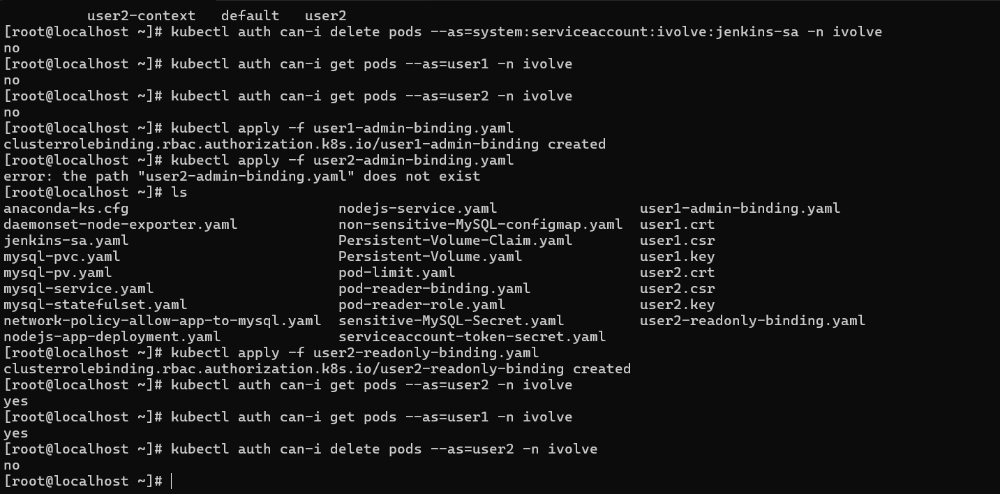
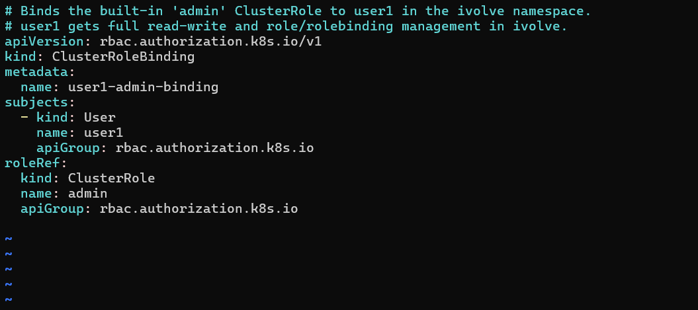
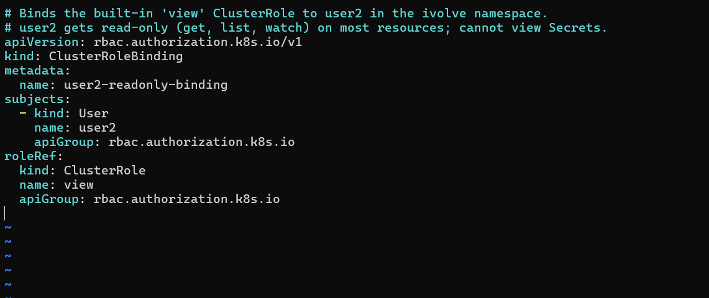

# IVOLVE Task 21 - Role-based Authorization

This lab is part of the IVOLVE training program. It demonstrates how to create **users** (user1 and user2) using client certificates and assign them different RBAC roles: **admin** for user1 and **read-only** for user2.

## Lab Overview

In this lab you:

- **Create** `user1` and `user2` using **X.509 client certificates** (the Common Name `CN` in the cert is the username)
- **Configure** kubectl contexts for user1 and user2
- **Assign** the **admin** ClusterRole to `user1` via ClusterRoleBinding
- **Assign** the **read-only** ClusterRole to `user2` via ClusterRoleBinding
- **Validate** that user1 can create/update/delete and that user2 can only read

## Prerequisites from Previous Tasks

- **Task 10**: Kubernetes cluster (master + worker nodes)
- **Task 11**: Namespace `ivolve` exists

**Check:**

```bash
kubectl get namespace ivolve
```

## Understanding Users in Kubernetes

Kubernetes does **not** have a User API object. Users are **external identities** authenticated by the API server. A common way to create users is **X.509 client certificates**:

1. Generate a private key and CSR (Certificate Signing Request) with **CN=username**.
2. Sign the CSR with the **cluster CA**.
3. Configure kubectl to use the cert and key.
4. Create a context that uses that user's credentials.

The API server reads the **CN** from the client cert and uses it as the **username** for RBAC. In RBAC `subjects`, we use `kind: User` and `name: user1` (or `user2`).

### Built-in ClusterRoles Used

| ClusterRole | Purpose |
|-------------|---------|
| **admin**   | Namespace admin: read-write, create Role/RoleBinding in namespaces |
| **view**    | Read-only: get, list, watch on most resources; **cannot** view Secrets |

### RoleBinding vs ClusterRoleBinding

**Important distinction:**

| Type | Scope | Namespace in YAML | Effect |
|------|-------|-------------------|--------|
| **RoleBinding** | Namespace-scoped | **Required** in `metadata.namespace` | Permissions apply **only in that namespace** |
| **ClusterRoleBinding** | Cluster-wide | **Not allowed** (no namespace) | Permissions apply **across all namespaces** |

**In this lab:** We use **ClusterRoleBinding**, which means:
- user1 (admin) has admin permissions in **all namespaces**
- user2 (read-only) has read-only permissions in **all namespaces**

If you want namespace-scoped permissions, use **RoleBinding** and specify `namespace: ivolve` in the metadata.

### user1 (admin) vs user2 (read-only)

| Action                 | user1 (admin) | user2 (read-only) |
|------------------------|---------------|--------------------|
| List/get pods          | Yes           | Yes                |
| Create/delete pods     | Yes           | No                 |
| List/get Secrets       | Yes           | No                 |
| Create Role/RoleBinding| Yes           | No                 |

## Project Requirements

- **Kubernetes cluster** (k3s, kubeadm, or other)
- **openssl** installed
- **kubectl** with cluster-admin access
- Access to the **cluster CA** certificate and key

### Cluster CA Location

The cluster CA location depends on your Kubernetes distribution:

| Distribution | CA Certificate | CA Key |
|--------------|----------------|--------|
| **kubeadm**  | `/etc/kubernetes/pki/ca.crt` | `/etc/kubernetes/pki/ca.key` |
| **k3s**      | `/var/lib/rancher/k3s/server/tls/client-ca.crt` | `/var/lib/rancher/k3s/server/tls/client-ca.key` |
| **minikube** | `~/.minikube/ca.crt` | `~/.minikube/ca.key` |

## Project Structure

```
task-21/
├── user1-admin-binding.yaml      # ClusterRoleBinding: admin → user1
├── user2-readonly-binding.yaml  # ClusterRoleBinding: view → user2
├── README.md
└── screenshots/
```

After completing the steps, you'll have:

- `user1.key`, `user1.crt` — client key and cert for user1
- `user2.key`, `user2.crt` — client key and cert for user2
- kubectl contexts: `user1-context`, `user2-context`

## Step-by-Step Instructions

### Step 1: Generate Private Keys

Generate RSA private keys for user1 and user2:

```bash
openssl genrsa -out user1.key 2048
openssl genrsa -out user2.key 2048
```

**Verify:**

```bash
ls -la user1.key user2.key
```

### Step 2: Create Certificate Signing Requests (CSR)

Create CSRs with **CN=user1** and **CN=user2** (the CN becomes the username):

```bash
openssl req -new -key user1.key -out user1.csr -subj "/CN=user1"
openssl req -new -key user2.key -out user2.csr -subj "/CN=user2"
```

**Verify:**

```bash
openssl req -in user1.csr -noout -subject
# Should show: subject=CN=user1
```

### Step 3: Sign Certificates with Cluster CA

Sign the CSRs using your cluster's CA. **The CA location depends on your Kubernetes distribution:**

**For k3s:**

```bash
openssl x509 -req -in user1.csr \
  -CA /var/lib/rancher/k3s/server/tls/client-ca.crt \
  -CAkey /var/lib/rancher/k3s/server/tls/client-ca.key \
  -CAcreateserial \
  -out user1.crt -days 365

openssl x509 -req -in user2.csr \
  -CA /var/lib/rancher/k3s/server/tls/client-ca.crt \
  -CAkey /var/lib/rancher/k3s/server/tls/client-ca.key \
  -CAcreateserial \
  -out user2.crt -days 365
```

**For kubeadm:**

```bash
openssl x509 -req -in user1.csr \
  -CA /etc/kubernetes/pki/ca.crt \
  -CAkey /etc/kubernetes/pki/ca.key \
  -CAcreateserial \
  -out user1.crt -days 365

openssl x509 -req -in user2.csr \
  -CA /etc/kubernetes/pki/ca.crt \
  -CAkey /etc/kubernetes/pki/ca.key \
  -CAcreateserial \
  -out user2.crt -days 365
```

**Verify certificates:**

```bash
openssl x509 -in user1.crt -noout -subject
# Should show: subject=CN=user1

openssl x509 -in user2.crt -noout -subject
# Should show: subject=CN=user2
```

**Clean up CSRs (optional):**

```bash
rm -f user1.csr user2.csr
```

### Step 4: Configure kubectl Credentials

Add user1 and user2 as credentials in your kubectl config:

```bash
kubectl config set-credentials user1 \
  --client-certificate=user1.crt \
  --client-key=user1.key

kubectl config set-credentials user2 \
  --client-certificate=user2.crt \
  --client-key=user2.key
```

**Verify:**

```bash
kubectl config get-users
# Should show: default, user1, user2
```

### Step 5: Create kubectl Contexts

Create contexts that use user1 and user2 credentials:

**First, get your cluster name:**

```bash
kubectl config get-clusters
# Example output: default
```

**Create contexts:**

```bash
kubectl config set-context user1-context \
  --cluster=default \
  --user=user1

kubectl config set-context user2-context \
  --cluster=default \
  --user=user2
```

**Verify contexts:**

```bash
kubectl config get-contexts
```

You should see:

```
CURRENT   NAME            CLUSTER   AUTHINFO   NAMESPACE
*         default         default   default
          user1-context   default   user1
          user2-context   default   user2
```



### Step 6: Apply Role Bindings

**Before applying bindings, verify users have no permissions:**

```bash
kubectl auth can-i get pods --as=user1 -n ivolve
# Should show: no

kubectl auth can-i get pods --as=user2 -n ivolve
# Should show: no
```

**Apply ClusterRoleBindings:**

```bash
kubectl apply -f user1-admin-binding.yaml
kubectl apply -f user2-readonly-binding.yaml
```

**Verify bindings were created:**

```bash
kubectl get clusterrolebinding user1-admin-binding
kubectl get clusterrolebinding user2-readonly-binding
```





**Describe the bindings:**

```bash
kubectl describe clusterrolebinding user1-admin-binding
kubectl describe clusterrolebinding user2-readonly-binding
```

You should see `User/user1` and `User/user2` as subjects, and `ClusterRole/admin` and `ClusterRole/view` as roleRef.

## Validation

### Using `--as` (from a cluster-admin kubeconfig)

If your current `kubectl` is cluster-admin, you can check permissions **as** user1 or user2 with `--as`:

**user1 (admin):**

```bash
kubectl auth can-i get pods --as=user1 -n ivolve        # yes
kubectl auth can-i create pods --as=user1 -n ivolve    # yes
kubectl auth can-i delete pods --as=user1 -n ivolve    # yes
kubectl auth can-i get secrets --as=user1 -n ivolve    # yes
kubectl auth can-i create rolebindings --as=user1 -n ivolve # yes
```

**user2 (read-only):**

```bash
kubectl auth can-i list pods --as=user2 -n ivolve       # yes
kubectl auth can-i get pods --as=user2 -n ivolve       # yes
kubectl auth can-i create pods --as=user2 -n ivolve    # no
kubectl auth can-i delete pods --as=user2 -n ivolve    # no
kubectl auth can-i get secrets --as=user2 -n ivolve   # no
```

### Using kubectl Contexts

Switch to user1's context and test:

```bash
kubectl config use-context user1-context
kubectl get pods -n ivolve          # Should work
kubectl run nginx --image=nginx -n ivolve  # Should work (admin)

kubectl config use-context user2-context
kubectl get pods -n ivolve          # Should work (read-only)
kubectl run nginx2 --image=nginx -n ivolve  # Should be forbidden

# Switch back to default
kubectl config use-context default
```

## YAML Overview

### user1-admin-binding.yaml

```yaml
apiVersion: rbac.authorization.k8s.io/v1
kind: ClusterRoleBinding
metadata:
  name: user1-admin-binding
subjects:
  - kind: User
    name: user1
    apiGroup: rbac.authorization.k8s.io
roleRef:
  kind: ClusterRole
  name: admin
  apiGroup: rbac.authorization.k8s.io
```

**Key points:**
- **kind**: `ClusterRoleBinding` (cluster-wide, no namespace in metadata)
- **subjects**: `kind: User`, `name: user1` (Users are not namespaced, so no `namespace` field)
- **roleRef**: `ClusterRole` `admin` (built-in)
- **Effect**: user1 has admin permissions in **all namespaces**

### user2-readonly-binding.yaml

```yaml
apiVersion: rbac.authorization.k8s.io/v1
kind: ClusterRoleBinding
metadata:
  name: user2-readonly-binding
subjects:
  - kind: User
    name: user2
    apiGroup: rbac.authorization.k8s.io
roleRef:
  kind: ClusterRole
  name: view
  apiGroup: rbac.authorization.k8s.io
```

**Key points:**
- **kind**: `ClusterRoleBinding` (cluster-wide)
- **subjects**: `kind: User`, `name: user2`
- **roleRef**: `ClusterRole` `view` (built-in, read-only)
- **Effect**: user2 has read-only permissions in **all namespaces**; cannot see Secrets or modify resources

## RoleBinding vs ClusterRoleBinding: When to Use Which?

### Use RoleBinding (Namespace-scoped)

When you want permissions **only in a specific namespace**:

```yaml
apiVersion: rbac.authorization.k8s.io/v1
kind: RoleBinding
metadata:
  name: user1-admin-binding
  namespace: ivolve    # ← REQUIRED: namespace must be specified
subjects:
  - kind: User
    name: user1
    apiGroup: rbac.authorization.k8s.io
roleRef:
  kind: ClusterRole
  name: admin
  apiGroup: rbac.authorization.k8s.io
```

**Effect:** user1 has admin permissions **only in `ivolve` namespace**, not in other namespaces.

### Use ClusterRoleBinding (Cluster-wide)

When you want permissions **across all namespaces** (as in this lab):

```yaml
apiVersion: rbac.authorization.k8s.io/v1
kind: ClusterRoleBinding
metadata:
  name: user1-admin-binding
  # ← NO namespace field (ClusterRoleBinding is cluster-scoped)
subjects:
  - kind: User
    name: user1
    apiGroup: rbac.authorization.k8s.io
roleRef:
  kind: ClusterRole
  name: admin
  apiGroup: rbac.authorization.k8s.io
```

**Effect:** user1 has admin permissions in **all namespaces**.

## Assigning Users to Groups

In Kubernetes RBAC, you can also assign permissions to **Groups** instead of individual users. This is useful for managing multiple users with the same permissions.

### How Groups Work

Groups are identified by the **Organization (O)** field in the X.509 certificate, not the CN. The CN is the username, and the O is the group.

**Example:** Create a user certificate with a group:

```bash
openssl req -new -key user1.key -out user1.csr \
  -subj "/CN=user1/O=developers"
```

When you sign this cert, the API server will recognize:
- **Username**: `user1` (from CN)
- **Groups**: `developers` (from O)

### Binding Roles to Groups

You can bind a role to a group in the same way:

```yaml
apiVersion: rbac.authorization.k8s.io/v1
kind: ClusterRoleBinding
metadata:
  name: developers-admin-binding
subjects:
  - kind: Group
    name: developers
    apiGroup: rbac.authorization.k8s.io
roleRef:
  kind: ClusterRole
  name: admin
  apiGroup: rbac.authorization.k8s.io
```

**Effect:** All users in the `developers` group get admin permissions.

### Multiple Groups

You can specify multiple groups in a certificate:

```bash
openssl req -new -key user1.key -out user1.csr \
  -subj "/CN=user1/O=developers/O=admins"
```

This user belongs to both `developers` and `admins` groups.

### Important Notes About Groups

1. **Groups are not namespaced** (like Users), so you don't specify `namespace` in the subject.
2. **Groups are case-sensitive**: `developers` ≠ `Developers`
3. **A user can belong to multiple groups** by specifying multiple `O=` fields in the CSR.
4. **Group membership is determined at authentication time** from the certificate; you cannot add/remove users from groups via API calls.

## Troubleshooting

### "Could not open file or uri for loading CA certificate"

**Problem:** The CA path is incorrect for your Kubernetes distribution.

**Solution:** Identify your cluster type and use the correct path:

- **k3s**: `/var/lib/rancher/k3s/server/tls/client-ca.crt` and `client-ca.key`
- **kubeadm**: `/etc/kubernetes/pki/ca.crt` and `ca.key`
- **minikube**: `~/.minikube/ca.crt` and `ca.key`

### `auth can-i` says `no` for user1 on create/delete

**Problem:** The ClusterRoleBinding might not be applied, or it's a RoleBinding without namespace.

**Solution:**

```bash
# Check if ClusterRoleBinding exists
kubectl get clusterrolebinding user1-admin-binding

# Verify it references User/user1
kubectl describe clusterrolebinding user1-admin-binding

# If you used RoleBinding, ensure it's in the correct namespace
kubectl get rolebinding user1-admin-binding -n ivolve
```

### user2 can get Secrets

**Problem:** The built-in `view` ClusterRole does not allow access to Secrets. If you bound `edit` or `admin` by mistake, fix the ClusterRoleBinding.

**Solution:**

```bash
kubectl get clusterrolebinding user2-readonly-binding -o yaml
# Verify roleRef.name is "view", not "edit" or "admin"
```

### "forbidden" when using user1-context or user2-context

**Problem:** The certificate CN might not match the username in the binding, or the cert/key are incorrect.

**Solution:**

```bash
# Verify certificate CN
openssl x509 -in user1.crt -noout -subject
# Should show: subject=CN=user1

# Verify the binding references the correct user
kubectl describe clusterrolebinding user1-admin-binding
# Should show: User/user1 in subjects
```

### RoleBinding created but permissions don't work

**Problem:** If you use **RoleBinding**, you **must** specify `namespace` in the metadata. If you forgot it, the binding might be in the wrong namespace or not created.

**Solution:**

```yaml
apiVersion: rbac.authorization.k8s.io/v1
kind: RoleBinding
metadata:
  name: user1-admin-binding
  namespace: ivolve    # ← REQUIRED for RoleBinding
```

**Remember:** RoleBinding = namespace-scoped (requires namespace), ClusterRoleBinding = cluster-wide (no namespace).

## Summary

| User  | How created        | Binding Type | Role (ClusterRole) | Scope        | Permissions                  |
|-------|--------------------|--------------|--------------------|--------------|------------------------------|
| user1 | Client cert CN=user1 | ClusterRoleBinding | admin              | All namespaces | Read-write, Role/RoleBinding |
| user2 | Client cert CN=user2 | ClusterRoleBinding | view               | All namespaces | Read-only (no Secrets)       |

## Key Takeaways

1. **Users are created via X.509 certificates** with CN=username.
2. **ClusterRoleBinding** grants permissions **cluster-wide** (all namespaces).
3. **RoleBinding** grants permissions **only in the specified namespace** (requires `namespace` in metadata).
4. **Groups** can be assigned via the `O` field in certificates for managing multiple users.
5. **CA location** depends on your Kubernetes distribution (k3s vs kubeadm vs minikube).

## Next Steps

- Create namespace-scoped RoleBindings to restrict user1 and user2 to specific namespaces.
- Experiment with **Groups** by creating certificates with `O=developers` and binding roles to groups.
- Use `kubeconfig-user1` and `kubeconfig-user2` from another machine to simulate real user access.
- Create custom ClusterRoles for more granular permissions.

## License

See the LICENSE file in the parent directory for license information.
