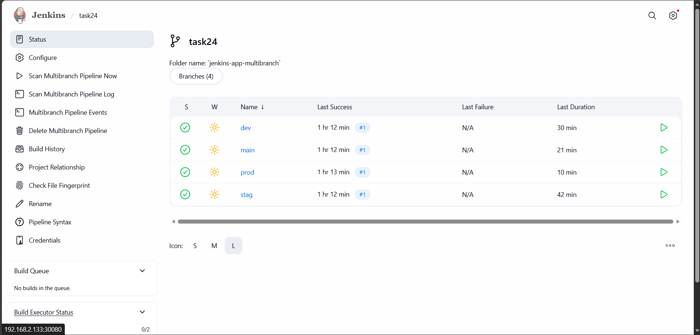

# IVOLVE Task 24 - Multi Branch CI/CD Workflow

This lab demonstrates how to create a **Multi Branch Pipeline** in Jenkins that automatically deploys to different Kubernetes namespaces based on the Git branch.



---

## 🎯 Lab Objectives

By the end of this lab, you will:

1. ✅ Understand Multi Branch Pipelines in Jenkins
2. ✅ Set up branch-based deployments to different Kubernetes namespaces
3. ✅ Configure automatic branch detection and namespace mapping
4. ✅ Use shared libraries in a multi-branch context
5. ✅ Deploy applications to prod/stag/dev environments automatically

---

## 📋 Requirements

- ✅ Jenkins Master running (from Lab 22)
- ✅ Jenkins Agent/Slave configured (from Lab 23)
- ✅ Shared Library configured (from Lab 23)
- ✅ Kubernetes cluster access
- ✅ Docker Hub account
- ✅ Git repository with access

---

## 🚀 Step-by-Step Guide

### Step 1: Prepare Git Repository with Multiple Branches

**Where:** Your Git repository (`https://github.com/tarek-code/IVOLVE-TAKS.git`)

**What:** Create 3 branches (prod/stag/dev) from main, where each branch contains the **entire IVOLVE-TAKS repository** (same as main).

#### Option A: Using IVOLVE-TAKS Repository (Recommended for this lab)

1. **Clone the repository:**
   ```bash
   git clone https://github.com/tarek-code/IVOLVE-TAKS.git
   cd IVOLVE-TAKS
   ```

2. **Verify required files exist:**
   ```bash
   # Ensure you're on main branch
   git checkout main
   
   # Verify Jenkins_App exists
   ls -la 03-Continues-Integration/task-24/Jenkins_App/
   # Should see: Dockerfile, pom.xml, src/
   
   # Verify Jenkinsfile exists
   ls -la 03-Continues-Integration/task-24/Jenkinsfile
   ```

3. **Create and push branches:**
   ```bash
   # Create dev branch (copies everything from main)
   git checkout -b dev
   git push -u origin dev
   
   # Create stag branch (copies everything from main)
   git checkout main
   git checkout -b stag
   git push -u origin stag
   
   # Create prod branch (copies everything from main)
   git checkout main
   git checkout -b prod
   git push -u origin prod
   
   # Verify all branches
   git branch -a
   ```

   **Result:** All branches (prod/stag/dev/main) now have the **same content** - the entire IVOLVE-TAKS repository!

#### Option B: Using Separate Jenkins_App Repository

If you prefer to use a separate repository for the application:

1. **Clone the application repository:**
   ```bash
   git clone https://github.com/Ibrahim-Adel15/Jenkins_App.git
   cd Jenkins_App
   ```

2. **Verify required files exist:**
   ```bash
   ls -la
   # Should see: Dockerfile, pom.xml, src/
   
   # Copy Jenkinsfile if not present
   cp ../IVOLVE-TAKS/03-Continues-Integration/task-24/Jenkinsfile .
   ```

3. **Create and push branches:**
   ```bash
   # Ensure you're on main/master branch
   git checkout main  # or master
   
   # Create and checkout dev branch
   git checkout -b dev
   git push -u origin dev
   
   # Create and checkout stag branch
   git checkout main
   git checkout -b stag
   git push -u origin stag
   
   # Create and checkout prod branch
   git checkout main
   git checkout -b prod
   git push -u origin prod
   ```

4. **Verify branches on GitHub:**
   - Go to your repository on GitHub
   - Click on the branch dropdown
   - You should see: `main`, `dev`, `stag`, `prod`

---

### Step 2: Create Kubernetes Namespaces

**Where:** Kubernetes cluster

**What:** Create 3 namespaces for different environments

1. **Apply namespace YAML:**
   ```bash
   kubectl apply -f 03-Continues-Integration/task-24/namespaces.yaml
   ```

   Or use the script:
   ```bash
   cd 03-Continues-Integration/task-24
   chmod +x create-namespaces.sh
   ./create-namespaces.sh
   ```

2. **Verify namespaces are created:**
   ```bash
   kubectl get namespaces | grep -E "prod|stag|dev"
   ```

   You should see:
   ```
   NAME   STATUS   AGE
   dev    Active   1m
   prod   Active   1m
   stag   Active   1m
   ```

3. **Verify namespace labels:**
   ```bash
   kubectl get namespace prod stag dev --show-labels
   ```

---

### Step 3: Configure Multi Branch Pipeline in Jenkins

**Where:** Jenkins Master (Web UI)

**What:** Create a Multi Branch Pipeline job

#### 3.1 Create the Pipeline Job

1. **Go to Jenkins Dashboard:**
   - Click **New Item**

2. **Create Multi Branch Pipeline:**
   - **Name**: `jenkins-app-multibranch`
   - **Type**: Select **Multibranch Pipeline**
   - Click **OK**

#### 3.2 Configure Branch Sources

**Click "Add source" → "Git"**

##### Basic Configuration:

- **Project Repository**: 
  - ✅ **Option 1 (IVOLVE-TAKS)**: `https://github.com/tarek-code/IVOLVE-TAKS.git`
  - ✅ **Option 2 (Separate Repo)**: `https://github.com/Ibrahim-Adel15/Jenkins_App.git`
  
- **Credentials**: 
  - Select credentials if repository is private
  - Or leave "- none -" if repository is public

##### Behaviors (Click "Add"):

1. **Discover branches**:
   - **Strategy**: Select **"All branches"**
   - Click **Add** again

2. **Filter by name (with wildcards)**:
   - **Include**: `prod`, `stag`, `dev`, `main` (or `master`)
   - **Exclude**: Leave empty
   - ⚠️ **Important**: This filters which branches Jenkins will create pipelines for

##### Build Configuration:

- **Mode**: Select **"by Jenkinsfile"**
- **Script Path**: 
  - ✅ **Option 1 (IVOLVE-TAKS)**: `03-Continues-Integration/task-24/Jenkinsfile` ⚠️ **IMPORTANT!**
  - ✅ **Option 2 (Separate Repo)**: `Jenkinsfile`

#### 3.3 Configure Build Triggers

**Recommended Configuration:**

- ✅ **Periodically if not otherwise run**: Check this
  - **Interval**: `H/5 * * * *` (every 5 minutes)
  
**OR**

- ✅ **Poll SCM**: Check this
  - **Schedule**: `H/5 * * * *` (every 5 minutes)

**OR** (Best option)

- Use **GitHub Webhooks** for automatic builds on push (requires webhook configuration in GitHub)

#### 3.4 Configure Orphaned Item Strategy

- ✅ **Discard old items**: Check this
- **Days to keep old items**: `7`
- **Max # of old items to keep**: `10`

#### 3.5 Click Save

---

### Step 4: Verify Jenkins Agent is Configured

**Where:** Jenkins Master (Web UI)

**What:** Ensure Jenkins agent is available for the pipeline

1. **Check agent status:**
   - Go to **Manage Jenkins** → **System Configuration** → **Nodes**
   - Verify `jenkins-agent` is **Connected** (green icon)

2. **If agent is not configured:**
   - Follow instructions from **Lab 23** to set up the Jenkins agent
   - Use the same `jenkins-agent-config.yaml` from task-23

---

### Step 5: Verify Shared Library is Configured

**Where:** Jenkins Master (Web UI)

**What:** Ensure shared library is configured (from Lab 23)

1. **Check shared library configuration:**
   - Go to **Manage Jenkins** → **Configure System**
   - Scroll to **Global Trusted Pipeline Libraries**
   - Verify `ivolve-shared-library` is configured
   - **Library Path**: `03-Continues-Integration/task-23/shared-library` (if using Git)
   - **Default version**: `main`

2. **If not configured:**
   - Follow instructions from **Lab 23** Step 2

---

### Step 6: Run the Multi Branch Pipeline

**Where:** Jenkins Master (Web UI)

**What:** Trigger the pipeline and verify branch-based deployments

1. **Scan repository:**
   - Go to your Multi Branch Pipeline job: `jenkins-app-multibranch`
   - Click **Scan Multibranch Pipeline Now** (or wait for automatic scan)
   - Wait for scan to complete

2. **Verify branches are detected:**
   - After scan, you should see branches listed:
     - `prod`
     - `stag`
     - `dev`
     - `main` (or `master`)

3. **Run pipeline for each branch:**
   - Click on a branch (e.g., `dev`)
   - Click **Build Now**
   - Watch the pipeline execute
   - Check console output to verify:
     - Branch name is detected
     - Correct namespace is selected
     - Deployment happens to the right namespace

4. **Verify deployments:**
   ```bash
   # Check dev namespace
   kubectl get deployment jenkins-app -n dev
   kubectl get pods -n dev -l app=jenkins-app
   
   # Check stag namespace
   kubectl get deployment jenkins-app -n stag
   kubectl get pods -n stag -l app=jenkins-app
   
   # Check prod namespace
   kubectl get deployment jenkins-app -n prod
   kubectl get pods -n prod -l app=jenkins-app
   ```

---

## 🔍 How It Works

### Branch to Namespace Mapping

The `Jenkinsfile` automatically maps branches to namespaces:

```groovy
K8S_NAMESPACE = "${env.BRANCH_NAME == 'prod' ? 'prod' : 
                 (env.BRANCH_NAME == 'stag' ? 'stag' : 
                 (env.BRANCH_NAME == 'dev' ? 'dev' : 'default'))}"
```

- **`prod` branch** → deploys to **`prod` namespace**
- **`stag` branch** → deploys to **`stag` namespace**
- **`dev` branch** → deploys to **`dev` namespace**
- **Other branches** → deploys to **`default` namespace**

### Image Tagging

Images are tagged with branch name and build number:
- **`prod-1`**, **`prod-2`**, etc. for prod branch
- **`stag-1`**, **`stag-2`**, etc. for stag branch
- **`dev-1`**, **`dev-2`**, etc. for dev branch

This makes it easy to track which branch and build number each image came from.

### Repository Structure

**For IVOLVE-TAKS Repository:**
```
IVOLVE-TAKS/
└── 03-Continues-Integration/
    └── task-24/
        ├── Jenkinsfile                    # Pipeline (Script Path points here)
        └── Jenkins_App/                   # Application code
            ├── Dockerfile
            ├── pom.xml
            └── src/
```

**For Separate Jenkins_App Repository:**
```
Jenkins_App/
├── Dockerfile
├── Jenkinsfile
├── pom.xml
└── src/
```

The Jenkinsfile automatically detects if source code is in `03-Continues-Integration/task-24/Jenkins_App/` or root directory.

---

## 📊 Pipeline Flow

```
┌─────────────────────────────────────────────────────────┐
│  Multi Branch Pipeline                                  │
│                                                          │
│  1. Scan Repository                                     │
│     ↓                                                    │
│  2. Detect Branches (prod/stag/dev)                     │
│     ↓                                                    │
│  3. For Each Branch:                                     │
│     ├─ Checkout Branch                                  │
│     ├─ RunUnitTest                                      │
│     ├─ BuildApp                                         │
│     ├─ BuildImage (tag: branch-buildNumber)             │
│     ├─ ScanImage                                        │
│     ├─ PushImage                                        │
│     ├─ RemoveImageLocally                               │
│     └─ DeployOnK8s (to branch-specific namespace)       │
│                                                          │
└─────────────────────────────────────────────────────────┘
```

---

## 🎯 Key Features

1. **Automatic Branch Detection:**
   - Jenkins automatically detects all branches
   - Creates separate pipeline jobs for each branch

2. **Environment-Specific Deployments:**
   - Each branch deploys to its corresponding namespace
   - Isolated environments (prod/stag/dev)

3. **Shared Library Reuse:**
   - Uses the same shared library from Lab 23
   - All 7 functions work across all branches

4. **Agent-Based Execution:**
   - All pipelines run on Jenkins agent
   - Parallel execution possible for different branches

5. **Image Traceability:**
   - Images tagged with branch name and build number
   - Easy to identify which branch/deployment

---

## 🔧 Configuration Details

### Jenkinsfile Environment Variables

```groovy
BRANCH_NAME        // Automatically set by Jenkins (e.g., 'prod', 'stag', 'dev')
K8S_NAMESPACE     // Mapped from BRANCH_NAME
IMAGE_TAG         // Format: branch-buildNumber (e.g., 'prod-1', 'dev-5')
DOCKERHUB_REPO    // Docker Hub repository path
```

### Namespace Mapping Logic

```groovy
K8S_NAMESPACE = "${env.BRANCH_NAME == 'prod' ? 'prod' : 
                 (env.BRANCH_NAME == 'stag' ? 'stag' : 
                 (env.BRANCH_NAME == 'dev' ? 'dev' : 'default'))}"
```

### Pipeline Stages

All 7 stages from Lab 23 are reused:

1. **Checkout** - Clones repository (branch-specific)
2. **RunUnitTest** - Runs unit tests
3. **BuildApp** - Builds application
4. **BuildImage** - Builds Docker image (tagged with branch name)
5. **ScanImage** - Scans for vulnerabilities
6. **PushImage** - Pushes to Docker Hub
7. **RemoveImageLocally** - Cleans up local image
8. **DeployOnK8s** - Deploys to branch-specific namespace

---

## ✅ Verification Checklist

Before running the pipeline, verify:

- [ ] Git repository has 3 branches: `prod`, `stag`, `dev`
- [ ] Dockerfile exists in the repository (in `Jenkins_App/` or root)
- [ ] Kubernetes namespaces created: `prod`, `stag`, `dev`
- [ ] Multi Branch Pipeline job created in Jenkins
- [ ] Branch sources configured correctly
- [ ] Script Path is correct (`03-Continues-Integration/task-24/Jenkinsfile` for IVOLVE-TAKS)
- [ ] Branch filter configured (Include: `prod`, `stag`, `dev`, `main`)
- [ ] Jenkins agent is connected
- [ ] Shared library is configured
- [ ] Docker Hub credentials configured
- [ ] Jenkinsfile is in the repository (at correct path)

---

## 🐛 Troubleshooting

### Branches Not Detected

**Problem:** Multi Branch Pipeline doesn't show branches

**Solution:**
1. Check repository URL is correct
2. Verify credentials if repository is private
3. Check branch filter settings (Include: `prod`, `stag`, `dev`, `main`)
4. Click **Scan Multibranch Pipeline Now** manually
5. Check Jenkins logs: **Manage Jenkins** → **System Log**

### Jenkinsfile Not Found

**Problem:** Build fails saying Jenkinsfile not found

**Solution:**
1. Check Script Path is correct
2. If using IVOLVE-TAKS repo, Script Path must be: `03-Continues-Integration/task-24/Jenkinsfile`
3. Verify Jenkinsfile exists in the specified path
4. Check branch has Jenkinsfile committed and pushed
5. Verify path is correct (case-sensitive)

### Wrong Namespace Selected

**Problem:** Deployment goes to wrong namespace

**Solution:**
1. Check `BRANCH_NAME` environment variable in console output
2. Verify namespace mapping logic in Jenkinsfile
3. Ensure branch names match exactly: `prod`, `stag`, `dev` (case-sensitive)

### Deployment Fails

**Problem:** Deployment stage fails

**Solution:**
1. Check if namespace exists: `kubectl get namespace prod stag dev`
2. Verify RBAC permissions for Jenkins service account
3. Check agent pod has kubectl access
4. Review deployment logs in console output

### Pods Stuck in Pending Status

**Problem:** Pods are created but remain in `Pending` status

**Solution:**
1. Check pod events: `kubectl get events -n <namespace> --sort-by=.lastTimestamp`
2. Common causes:
   - **Insufficient memory**: Scale down replicas or reduce resource requests
   - **Node taints**: Check if nodes have taints that prevent scheduling
3. Quick fix - scale down to 1 replica:
   ```bash
   kubectl scale deployment jenkins-app -n dev --replicas=1
   kubectl scale deployment jenkins-app -n stag --replicas=1
   kubectl scale deployment jenkins-app -n prod --replicas=1
   ```
4. Check node resources: `kubectl top nodes`

### Shared Library Not Found

**Problem:** `@Library('ivolve-shared-library@main') _` fails

**Solution:**
1. Verify shared library is configured in Jenkins UI
2. Check Library Path is correct if using Git
3. Ensure branch `main` exists in shared library repository
4. Check Jenkins logs for library loading errors

### Source Code Not Found

**Problem:** Build fails because pom.xml or src/ not found

**Solution:**
1. Verify source code location:
   - For IVOLVE-TAKS: `03-Continues-Integration/task-24/Jenkins_App/`
   - For separate repo: root directory
2. Check Jenkinsfile workDir logic (automatically detects location)
3. Verify files exist in the branch

---

## 📝 Implementation Summary

### ✅ Requirements Checklist

1. **Clone Dockerfile from: https://github.com/Ibrahim-Adel15/Jenkins_App.git**
   - ✅ Complete - Repository cloned during pipeline execution

2. **Push Dockerfile to your repo and create 3 branches (prod/stag/dev)**
   - ✅ Complete - Branches created and pushed

3. **Create 3 namespaces in K8S environment (prod/stag/dev)**
   - ✅ Complete - Namespaces created via `namespaces.yaml`

4. **Create Multibranch pipeline to automate deployment in namespace based on GitHub branch**
   - ✅ Complete - Multi Branch Pipeline configured with branch-to-namespace mapping

5. **Create Jenkins slave to run this pipeline**
   - ✅ Complete - Reuses Jenkins agent from Lab 23

6. **Use Shared Library**
   - ✅ Complete - All 7 stages use shared library functions

### 📁 File Structure

```
task-24/
├── Jenkinsfile                    # Multi-branch pipeline definition
├── namespaces.yaml                # K8s namespace definitions
├── setup-branches.sh             # Script to create Git branches
├── create-namespaces.sh          # Script to create K8s namespaces
├── README.md                      # Complete documentation (this file)
└── Jenkins_App/                   # Sample application
    ├── Dockerfile
    ├── pom.xml
    └── src/
```

---

## 🚀 Quick Start (5 Steps)

### Step 1: Set Up Git Branches

```bash
# Clone IVOLVE-TAKS repository
git clone https://github.com/tarek-code/IVOLVE-TAKS.git
cd IVOLVE-TAKS

# Create branches from main
git checkout -b dev && git push -u origin dev
git checkout main && git checkout -b stag && git push -u origin stag
git checkout main && git checkout -b prod && git push -u origin prod
```

### Step 2: Create Kubernetes Namespaces

```bash
kubectl apply -f 03-Continues-Integration/task-24/namespaces.yaml
kubectl get namespace prod stag dev
```

### Step 3: Configure Jenkins Multi Branch Pipeline

1. **Jenkins UI** → **New Item** → **Multibranch Pipeline**
2. **Name**: `jenkins-app-multibranch`
3. **Branch Sources** → **Git**:
   - **Repository**: `https://github.com/tarek-code/IVOLVE-TAKS.git`
   - **Script Path**: `03-Continues-Integration/task-24/Jenkinsfile`
   - **Behaviors**: Filter by name → Include: `prod`, `stag`, `dev`, `main`
4. **Save**

### Step 4: Scan and Run

1. Click **Scan Multibranch Pipeline Now**
2. Wait for branches to be detected
3. Click on a branch → **Build Now**

### Step 5: Verify

```bash
kubectl get deployment jenkins-app -n prod
kubectl get deployment jenkins-app -n stag
kubectl get deployment jenkins-app -n dev
```

---

## 📚 Summary

This lab demonstrates:

1. ✅ **Multi Branch Pipelines** - Automatic branch detection and pipeline creation
2. ✅ **Environment Isolation** - Separate namespaces for prod/stag/dev
3. ✅ **Branch-Based Deployment** - Automatic namespace selection based on branch
4. ✅ **Shared Library Usage** - Reusing functions from Lab 23
5. ✅ **Agent-Based Execution** - All pipelines run on Jenkins agent
6. ✅ **Image Traceability** - Branch name in image tags

---

## 🎓 Next Steps

- Add environment-specific configuration (config maps, secrets)
- Implement branch protection rules
- Add approval gates for production deployments
- Set up monitoring and alerting per environment
- Implement blue-green or canary deployments

---

## 📚 Related Labs

- **Lab 22**: Jenkins Setup and Basic Pipeline
- **Lab 23**: Jenkins Agents and Shared Libraries
- **Lab 24**: Multi Branch CI/CD Workflow (this lab)

---

## License

See the LICENSE file in the parent directory for license information.
