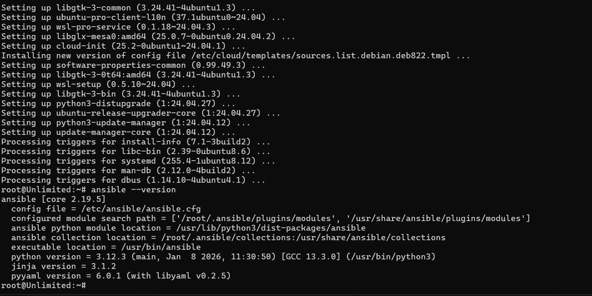
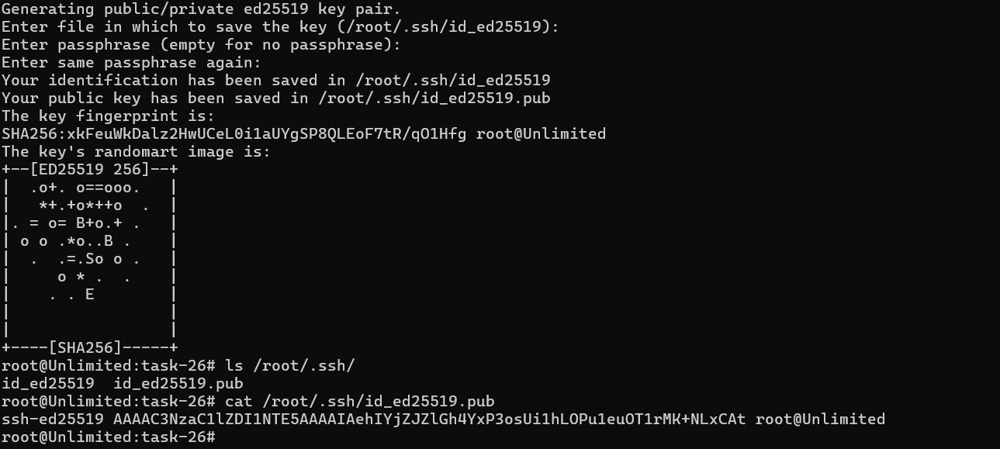
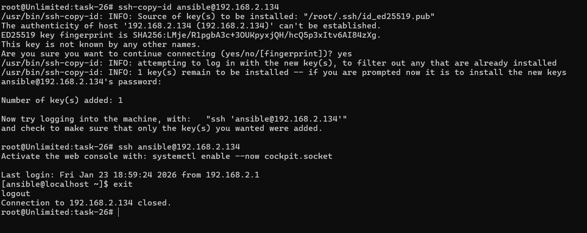
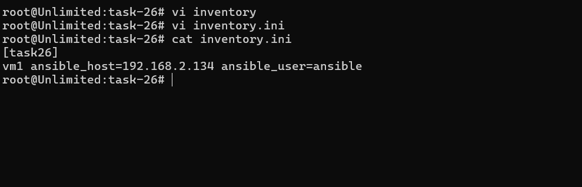
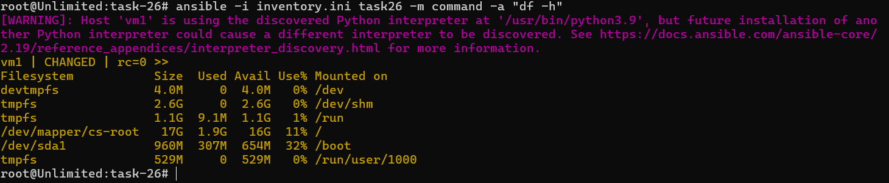

# IVOLVE Task 26 - Initial Ansible Configuration and Ad-Hoc Execution

This lab demonstrates how to set up Ansible Automation Platform on a control node, configure SSH key-based authentication with managed nodes, create an inventory, and perform ad-hoc commands.

---

## 🎯 Lab Objectives

By the end of this lab, you will:

1. ✅ Install and configure Ansible Automation Platform on control node
2. ✅ Generate SSH key pair on control node
3. ✅ Transfer public key to managed node using ssh-copy-id
4. ✅ Create inventory file for managed nodes
5. ✅ Perform ad-hoc Ansible commands (check disk space)

---

## 📋 Requirements

- ✅ Control node (Ansible controller) with Linux OS
- ✅ Managed node (target server) with Linux OS
- ✅ Network connectivity between control and managed nodes
- ✅ SSH access to managed node (password authentication initially)
- ✅ Python installed on both nodes
- ✅ Sudo/root access on managed node

---

## 🔍 What is Ansible?

**Ansible** is an open-source automation tool that:
- **Automates IT infrastructure** configuration, deployment, and orchestration
- **Uses SSH** for secure communication (no agents required)
- **Uses YAML** for playbooks (human-readable automation)
- **Idempotent** - can run multiple times safely
- **Agentless** - no software needed on managed nodes

### Ansible Architecture

```
┌─────────────────────────────────────────────────────────┐
│  Control Node (Ansible Controller)                      │
│  ├─ Ansible installed                                   │
│  ├─ Inventory file (list of managed nodes)              │
│  ├─ Playbooks/Ad-hoc commands                           │
│  └─ SSH keys for authentication                         │
│     ↓ (SSH connection)                                   │
│  Managed Node (Target Server)                           │
│  ├─ No Ansible required                                 │
│  ├─ Only SSH and Python needed                          │
│  └─ Executes commands sent from control node           │
│                                                          │
└─────────────────────────────────────────────────────────┘
```

---

## 🚀 Step-by-Step Guide

### Step 1: Install Ansible on Control Node

**Where:** Control node (Ansible controller)

**What:** Install Ansible Automation Platform

#### For RHEL/CentOS/Fedora:

```bash
# Update system
sudo dnf update -y

# Install Ansible
sudo dnf install ansible -y

# Or for older versions
sudo yum install ansible -y
```

#### For Ubuntu/Debian:

```bash
# Update system
sudo apt update

# Install Ansible
sudo apt install ansible -y
```

#### For macOS:

```bash
# Using Homebrew
brew install ansible
```

#### Verify Installation:

```bash
ansible --version
```

You should see Ansible version information:



**Expected output:**
```
ansible [core 2.x.x]
  config file = /etc/ansible/ansible.cfg
  configured module search path = ['/home/user/.ansible/plugins/modules', '/usr/share/ansible/plugins/modules']
  ansible python module location = /usr/lib/python3.x/site-packages/ansible
  ansible collection location = /home/user/.ansible/collections:/usr/share/ansible/collections
  executable location = /usr/bin/ansible
  python version = 3.x.x
```

---

### Step 2: Generate SSH Key Pair on Control Node

**Where:** Control node

**What:** Generate SSH key pair for passwordless authentication

1. **Generate SSH key pair:**

   ```bash
   ssh-keygen -t rsa -b 4096 -C "ansible-control-node"
   ```

   - Press Enter to accept default location (`~/.ssh/id_rsa`)
   - Optionally set a passphrase (or press Enter for no passphrase)
   - This creates:
     - Private key: `~/.ssh/id_rsa` (keep this secret!)
     - Public key: `~/.ssh/id_rsa.pub` (share this)

   

2. **Verify keys created:**

   ```bash
   ls -la ~/.ssh/
   ```

   You should see:
   - `id_rsa` (private key)
   - `id_rsa.pub` (public key)

---

### Step 3: Transfer Public Key to Managed Node

**Where:** Control node

**What:** Copy public key to managed node using ssh-copy-id

1. **Use ssh-copy-id command:**

   ```bash
   ssh-copy-id username@managed-node-ip
   ```

   Replace:
   - `username`: User on managed node (e.g., `root`, `ubuntu`, `ec2-user`)
   - `managed-node-ip`: IP address or hostname of managed node

   Example:
   ```bash
   ssh-copy-id root@192.168.1.100
   ```

   You'll be prompted for the password (this is the last time you'll need it).

   

2. **Verify passwordless SSH:**

   ```bash
   ssh username@managed-node-ip
   ```

   You should be able to SSH without entering a password.

3. **Test SSH connection:**

   ```bash
   ssh username@managed-node-ip "hostname"
   ```

   This should return the hostname of the managed node without prompting for password.

---

### Step 4: Create Inventory File

**Where:** Control node

**What:** Create inventory file listing managed nodes

1. **Create inventory file:**

   ```bash
   mkdir -p ~/ansible
   cd ~/ansible
   nano inventory.ini
   ```

   Or use the provided `inventory.ini` file.

2. **Add managed nodes to inventory:**

   **Simple format:**
   ```ini
   192.168.1.100
   managed-node-1.example.com
   ```

   **With variables:**
   ```ini
   [web-servers]
   web1 ansible_host=192.168.1.100 ansible_user=root
   web2 ansible_host=192.168.1.101 ansible_user=ubuntu

   [db-servers]
   db1 ansible_host=192.168.1.200 ansible_user=root
   ```

   **Complete example (inventory.ini):**
   ```ini
   [managed-nodes]
   node1 ansible_host=192.168.1.100 ansible_user=root ansible_ssh_private_key_file=~/.ssh/id_rsa
   ```

   

3. **Verify inventory:**

   ```bash
   ansible-inventory -i inventory.ini --list
   ```

   Or:
   ```bash
   ansible all -i inventory.ini --list-hosts
   ```

---

### Step 5: Perform Ad-Hoc Command (Check Disk Space)

**Where:** Control node

**What:** Execute ad-hoc Ansible command to check disk space on managed node

1. **Test connectivity:**

   ```bash
   ansible all -i inventory.ini -m ping
   ```

   Expected output:
   ```
   node1 | SUCCESS => {
       "changed": false,
       "ping": "pong"
   }
   ```

2. **Check disk space:**

   ```bash
   ansible all -i inventory.ini -m shell -a "df -h"
   ```

   Or using the `command` module:
   ```bash
   ansible all -i inventory.ini -a "df -h"
   ```

   

3. **Other useful ad-hoc commands:**

   **Check uptime:**
   ```bash
   ansible all -i inventory.ini -a "uptime"
   ```

   **Check memory:**
   ```bash
   ansible all -i inventory.ini -a "free -h"
   ```

   **Check CPU info:**
   ```bash
   ansible all -i inventory.ini -a "lscpu"
   ```

   **Check running processes:**
   ```bash
   ansible all -i inventory.ini -a "ps aux | head -20"
   ```

   **Install package (with sudo):**
   ```bash
   ansible all -i inventory.ini -m yum -a "name=httpd state=present" --become
   ```

---

## 📊 Ad-Hoc Command Syntax

### Basic Syntax:

```bash
ansible <pattern> -i <inventory> -m <module> -a "<arguments>"
```

### Common Options:

- `-i` or `--inventory`: Inventory file path
- `-m` or `--module-name`: Module to use (default: `command`)
- `-a` or `--args`: Module arguments
- `--become` or `-b`: Use privilege escalation (sudo)
- `--become-user`: User to become (default: root)
- `-u` or `--user`: SSH user (default: current user)
- `-k` or `--ask-pass`: Prompt for SSH password
- `-K` or `--ask-become-pass`: Prompt for sudo password
- `-v`, `-vv`, `-vvv`: Verbose output (more v's = more detail)

### Examples:

```bash
# Ping all hosts
ansible all -i inventory.ini -m ping

# Run command on specific host
ansible node1 -i inventory.ini -a "hostname"

# Run with sudo
ansible all -i inventory.ini -a "systemctl status httpd" --become

# Run on specific group
ansible web-servers -i inventory.ini -a "uptime"
```

---

## 🔧 Configuration Files

### Ansible Configuration

**Location:** `/etc/ansible/ansible.cfg` (global) or `~/.ansible.cfg` (user-specific)

**Common settings:**
```ini
[defaults]
inventory = /path/to/inventory.ini
host_key_checking = False
remote_user = root
private_key_file = ~/.ssh/id_rsa
```

### Inventory File Structure

```ini
# Simple format
host1.example.com
host2.example.com

# With groups
[web-servers]
web1 ansible_host=192.168.1.10
web2 ansible_host=192.168.1.11

[db-servers]
db1 ansible_host=192.168.1.20

# With variables
[all:vars]
ansible_user=root
ansible_ssh_private_key_file=~/.ssh/id_rsa
```

---

## ✅ Verification Checklist

Before proceeding, verify:

- [ ] Ansible installed on control node
- [ ] Ansible version verified (`ansible --version`)
- [ ] SSH key pair generated on control node
- [ ] Public key copied to managed node (`ssh-copy-id`)
- [ ] Passwordless SSH working (`ssh user@host` without password)
- [ ] Inventory file created with managed node(s)
- [ ] Inventory verified (`ansible-inventory --list`)
- [ ] Connectivity tested (`ansible all -m ping`)
- [ ] Ad-hoc command executed successfully

---

## 🐛 Troubleshooting

### Ansible Not Found

**Problem:** `ansible: command not found`

**Solution:**
1. Verify Ansible is installed: `which ansible`
2. Check Python is installed: `python3 --version`
3. Reinstall Ansible using package manager
4. Check PATH includes Ansible binary location

### SSH Connection Failed

**Problem:** `UNREACHABLE! => {"changed": false, "msg": "Failed to connect to the host"}`

**Solution:**
1. Verify SSH connectivity: `ssh user@host`
2. Check SSH key is copied: `ssh-copy-id user@host`
3. Verify inventory file has correct IP/hostname
4. Check network connectivity: `ping host`
5. Verify SSH service is running on managed node
6. Check firewall rules allow SSH (port 22)

### Permission Denied

**Problem:** `Permission denied (publickey,password)`

**Solution:**
1. Verify public key is in `~/.ssh/authorized_keys` on managed node
2. Check file permissions on managed node:
   ```bash
   chmod 700 ~/.ssh
   chmod 600 ~/.ssh/authorized_keys
   ```
3. Verify SSH key permissions on control node:
   ```bash
   chmod 600 ~/.ssh/id_rsa
   chmod 644 ~/.ssh/id_rsa.pub
   ```
4. Test SSH manually: `ssh -i ~/.ssh/id_rsa user@host`

### Host Key Verification Failed

**Problem:** `Host key verification failed`

**Solution:**
1. Add host to known_hosts: `ssh-keyscan host >> ~/.ssh/known_hosts`
2. Or disable host key checking in `ansible.cfg`:
   ```ini
   [defaults]
   host_key_checking = False
   ```

### Module Not Found

**Problem:** `MODULE FAILURE` or `module not found`

**Solution:**
1. Verify Python is installed on managed node: `ansible all -a "python3 --version"`
2. Install required Python packages on managed node
3. Check module name is correct: `ansible-doc -l | grep module-name`

---

## 📝 File Structure

```
task-26/
├── README.md              # This file
├── inventory.ini          # Ansible inventory file
└── screenshots/           # Screenshots directory
    ├── ansible-version.png      # Ansible installation verification
    ├── sshkygen.png             # SSH key generation
    ├── sshCopyId.png            # SSH key copy to managed node
    ├── inventory.png            # Inventory file creation
    └── addhoc.png               # Ad-hoc command execution
```

---

## 🎯 Key Concepts

### Control Node vs Managed Node

- **Control Node:** Where Ansible is installed and commands are executed from
- **Managed Node:** Target servers that Ansible manages (no Ansible needed)

### Inventory

- **Inventory:** List of managed nodes organized into groups
- Can be static file (`.ini` or `.yaml`) or dynamic script
- Defines hosts, groups, and variables

### Ad-Hoc Commands

- **Ad-Hoc:** One-time commands executed directly from command line
- Quick way to run tasks without creating playbooks
- Useful for testing, troubleshooting, and simple tasks

### Modules

- **Modules:** Reusable units of work in Ansible
- Examples: `ping`, `shell`, `command`, `yum`, `apt`, `copy`, `file`
- Each module has specific purpose and parameters

---

## 🚀 Quick Reference

### Essential Commands

```bash
# Install Ansible (RHEL/CentOS)
sudo dnf install ansible -y

# Install Ansible (Ubuntu/Debian)
sudo apt install ansible -y

# Generate SSH key
ssh-keygen -t rsa -b 4096

# Copy SSH key to managed node
ssh-copy-id user@host

# Test connectivity
ansible all -i inventory.ini -m ping

# Run ad-hoc command
ansible all -i inventory.ini -a "df -h"

# List all modules
ansible-doc -l

# Get module documentation
ansible-doc module-name
```

---

## 📚 Summary

This lab covered:

1. ✅ **Ansible Installation** - Installed Ansible on control node
2. ✅ **SSH Key Setup** - Generated and distributed SSH keys for passwordless access
3. ✅ **Inventory Creation** - Created inventory file with managed nodes
4. ✅ **Ad-Hoc Commands** - Executed commands directly on managed nodes
5. ✅ **Basic Ansible Usage** - Learned Ansible command syntax and options

---

## 🎓 Next Steps

- Create Ansible playbooks for automation
- Use Ansible roles for reusable configurations
- Implement Ansible Vault for secrets management
- Set up Ansible Tower/AWX for web-based management
- Configure Ansible for multi-environment deployments
- Learn about Ansible variables and templates
- Implement Ansible best practices

---

## 📚 Related Labs

- **Lab 26**: Initial Ansible Configuration and Ad-Hoc Execution (this lab)
- **Lab 27**: Ansible Playbooks (next lab)
- **Lab 28**: Ansible Roles and Best Practices

---

## License

See the LICENSE file in the parent directory for license information.
