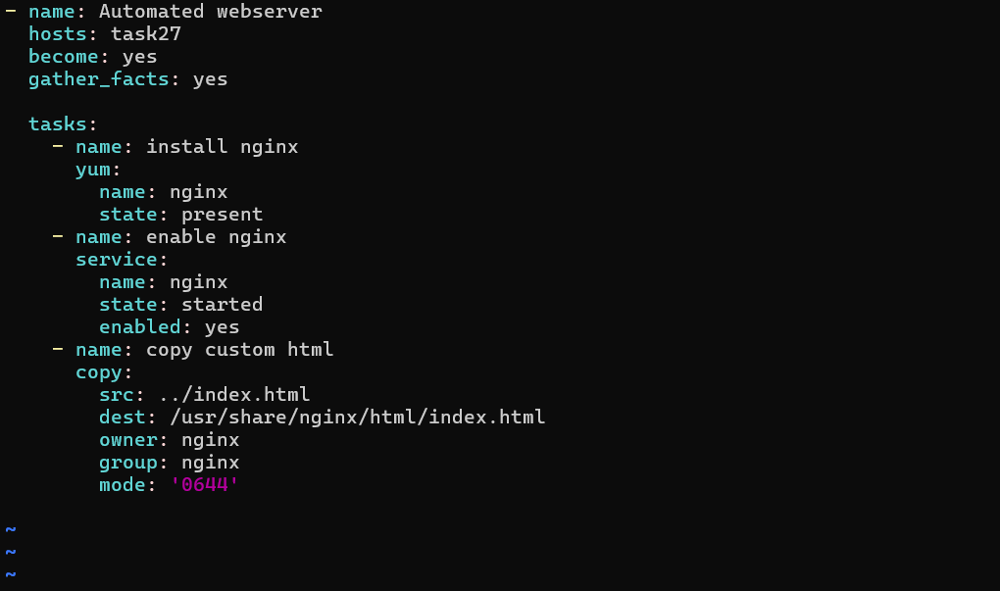
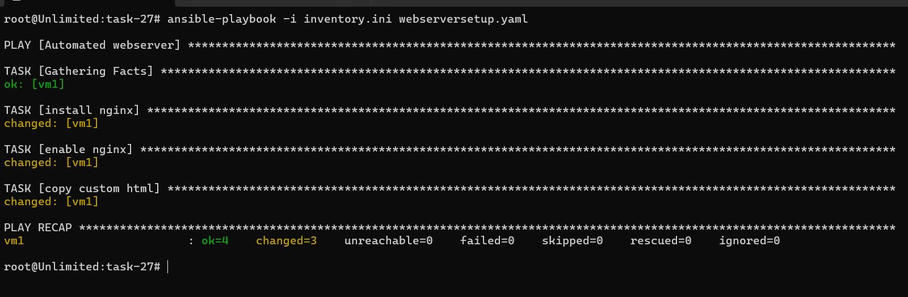
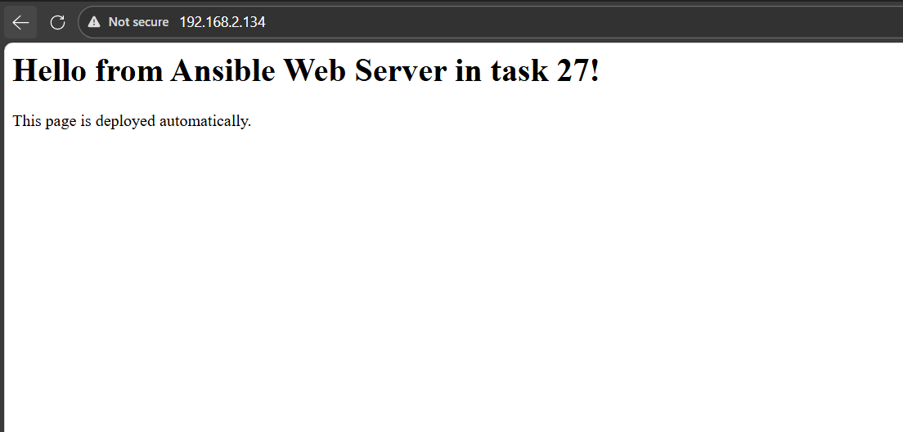

# IVOLVE Task 27 - Automated Web Server Configuration Using Ansible Playbooks

This lab demonstrates how to create and execute Ansible playbooks to automate web server configuration, including Nginx installation, custom web page deployment, and firewall configuration.

---

## 🎯 Lab Objectives

By the end of this lab, you will:

1. ✅ Write an Ansible playbook to automate web server configuration
2. ✅ Install and configure Nginx web server
3. ✅ Customize and deploy a custom web page
4. ✅ Configure firewall rules for HTTP access
5. ✅ Verify the configuration on managed node

---

## 📋 Requirements

- ✅ Control node with Ansible installed (from Lab 26)
- ✅ Managed node accessible via SSH
- ✅ SSH key-based authentication configured (from Lab 26)
- ✅ Inventory file with managed node(s)
- ✅ Sudo/root access on managed node
- ✅ Network connectivity between control and managed nodes

---

## 🔍 What is an Ansible Playbook?

**Ansible Playbooks** are:
- **YAML files** that define automation tasks
- **Idempotent** - can run multiple times safely
- **Human-readable** - easy to understand and maintain
- **Reusable** - can be version controlled and shared
- **Declarative** - describe desired state, not steps

### Playbook Structure

```yaml
---
- name: Playbook description
  hosts: target-hosts
  become: yes  # Use sudo
  tasks:
    - name: Task description
      module_name:
        parameter: value
```

---

## 🚀 Step-by-Step Guide

### Step 1: Prepare the Environment

**Where:** Control node

**What:** Ensure prerequisites are met

1. **Verify Ansible is installed:**
   ```bash
   ansible --version
   ```

2. **Verify inventory file exists:**
   ```bash
   cat inventory.ini
   ```

   Your inventory should look like:
   ```ini
   [task27]
   vm1 ansible_host=192.168.2.134 ansible_user=ansible ansible_python_interpreter=/usr/bin/python3 ansible_become=yes ansible_become_method=sudo
   ```

3. **Test connectivity:**
   ```bash
   ansible task27 -i inventory.ini -m ping
   ```

---

### Step 2: Create Custom HTML Page

**Where:** Control node

**What:** Create a custom HTML file to deploy

1. **Create index.html file:**

   ```bash
   cd ~/ansible/task-27  # or your task directory
   nano index.html
   ```

2. **Add custom content:**

   ```html
   <html>
   <head>
       <title>Welcome to My Automated Web Server from ivolve</title>
   </head>
   <body>
       <h1>Hello from Ansible Web Server in task 27!</h1>
       <p>This page is deployed automatically.</p>
   </body>
   </html>
   ```

3. **Save the file** (Ctrl+X, Y, Enter)

---

### Step 3: Create Ansible Playbook

**Where:** Control node

**What:** Create playbook to automate web server setup

1. **Create playbook file:**

   ```bash
   nano webserversetup.yaml
   ```

2. **Write the playbook:**

   ```yaml
   ---
   - name: Automated webserver
     hosts: task27
     become: yes
     gather_facts: yes

     tasks:
       - name: install nginx
         yum:
           name: nginx
           state: present
       
       - name: enable nginx
         service:
           name: nginx
           state: started
           enabled: yes
       
       - name: copy custom html
         copy:
           src: index.html
           dest: /usr/share/nginx/html/index.html
           owner: nginx
           group: nginx
           mode: "0644"
       
       - name: Open HTTP port in firewall
         firewalld:
           service: http
           permanent: yes
           state: enabled
           immediate: yes

       - name: Reload firewalld
         command: firewall-cmd --reload
         when: ansible_facts['os_family'] == "RedHat"
   ```

3. **Save the file**

   

---

### Step 4: Understand the Playbook

**Playbook Breakdown:**

1. **`hosts: task27`** - Target hosts from inventory group
2. **`become: yes`** - Use sudo for privileged tasks
3. **`gather_facts: yes`** - Collect system information

**Tasks Explained:**

- **Install Nginx:** Uses `yum` module to install nginx package
- **Enable Nginx:** Starts nginx service and enables it on boot
- **Copy HTML:** Copies custom index.html to nginx web root
- **Firewall:** Opens HTTP port in firewalld (RedHat/CentOS)
- **Reload Firewall:** Reloads firewall rules (only on RedHat family)

---

### Step 5: Run the Playbook

**Where:** Control node

**What:** Execute the playbook

1. **Run the playbook:**

   ```bash
   ansible-playbook -i inventory.ini webserversetup.yaml
   ```

   If sudo password is required:
   ```bash
   ansible-playbook -i inventory.ini webserversetup.yaml -K
   ```

   

2. **Expected output:**

   ```
   PLAY [Automated webserver] ************************************

   TASK [Gathering Facts] ****************************************
   ok: [vm1]

   TASK [install nginx] ******************************************
   changed: [vm1]

   TASK [enable nginx] ******************************************
   changed: [vm1]

   TASK [copy custom html] *************************************
   changed: [vm1]

   TASK [Open HTTP port in firewall] ****************************
   changed: [vm1]

   TASK [Reload firewalld] **************************************
   changed: [vm1]

   PLAY RECAP ****************************************************
   vm1  : ok=6    changed=5    unreachable=0    failed=0
   ```

3. **Verify playbook syntax (optional):**

   ```bash
   ansible-playbook --syntax-check webserversetup.yaml
   ```

4. **Dry run (check mode):**

   ```bash
   ansible-playbook -i inventory.ini webserversetup.yaml --check
   ```

---

### Step 6: Verify Configuration on Managed Node

**Where:** Managed node and browser

**What:** Verify Nginx is running and serving custom page

#### 6.1 Check Nginx Status

```bash
# From control node
ansible task27 -i inventory.ini -a "systemctl status nginx" --become

# Or SSH into managed node
ssh ansible@192.168.2.134
sudo systemctl status nginx
```

**Expected output:**
```
● nginx.service - The nginx HTTP and reverse proxy server
   Loaded: loaded (/usr/lib/systemd/system/nginx.service; enabled)
   Active: active (running) since ...
```

#### 6.2 Check Nginx is Listening

```bash
# From control node
ansible task27 -i inventory.ini -a "ss -tlnp | grep :80" --become

# Or on managed node
sudo ss -tlnp | grep :80
```

**Expected output:**
```
LISTEN 0      128          0.0.0.0:80        0.0.0.0:*
```

#### 6.3 Verify Custom HTML File

```bash
# From control node
ansible task27 -i inventory.ini -a "cat /usr/share/nginx/html/index.html" --become

# Or on managed node
cat /usr/share/nginx/html/index.html
```

#### 6.4 Test Web Server from Browser

1. **Get the managed node IP:**
   ```bash
   ansible task27 -i inventory.ini -a "hostname -I"
   ```

2. **Open browser and navigate to:**
   ```
   http://192.168.2.134
   ```

   Or:
   ```
   http://managed-node-hostname
   ```

3. **You should see your custom page:**

   

#### 6.5 Test with curl (Alternative)

```bash
# From control node
ansible task27 -i inventory.ini -a "curl http://localhost" --become

# Or from any machine
curl http://192.168.2.134
```

**Expected output:**
```html
<html>
<head>
    <title>Welcome to My Automated Web Server from ivolve</title>
</head>
<body>
    <h1>Hello from Ansible Web Server in task 27!</h1>
    <p>This page is deployed automatically.</p>
</body>
</html>
```

---

## 📊 Playbook Modules Used

### yum Module
- **Purpose:** Package management on RedHat/CentOS
- **Parameters:**
  - `name`: Package name
  - `state`: `present` (install), `absent` (remove), `latest` (update)

### service Module
- **Purpose:** Manage system services
- **Parameters:**
  - `name`: Service name
  - `state`: `started`, `stopped`, `restarted`
  - `enabled`: `yes` (start on boot), `no` (don't start on boot)

### copy Module
- **Purpose:** Copy files to remote hosts
- **Parameters:**
  - `src`: Source file (local)
  - `dest`: Destination path (remote)
  - `owner`: File owner
  - `group`: File group
  - `mode`: File permissions (octal)

### firewalld Module
- **Purpose:** Manage firewalld rules
- **Parameters:**
  - `service`: Service name (http, https, ssh, etc.)
  - `permanent`: Make rule persistent
  - `state`: `enabled` or `disabled`
  - `immediate`: Apply immediately

### command Module
- **Purpose:** Execute shell commands
- **Note:** Use specific modules when available (more idempotent)

---

## 🔧 Advanced Playbook Features

### Conditional Execution

The playbook uses `when` condition:

```yaml
- name: Reload firewalld
  command: firewall-cmd --reload
  when: ansible_facts['os_family'] == "RedHat"
```

This only runs on RedHat-based systems (RHEL, CentOS, Fedora).

### Using Facts

`ansible_facts` contains system information:
- `ansible_facts['os_family']` - OS family (RedHat, Debian, etc.)
- `ansible_facts['distribution']` - Distribution name
- `ansible_facts['ip_addresses']` - IP addresses

---

## ✅ Verification Checklist

Before and after running the playbook, verify:

- [ ] Inventory file configured correctly
- [ ] SSH connectivity to managed node
- [ ] Sudo access configured (passwordless or with `-K` flag)
- [ ] Custom HTML file created (`index.html`)
- [ ] Playbook syntax is correct
- [ ] Playbook executed successfully
- [ ] Nginx service is running
- [ ] Nginx is enabled on boot
- [ ] Custom HTML file deployed correctly
- [ ] Firewall rules configured
- [ ] Web server accessible from browser
- [ ] Custom page displays correctly

---

## 🐛 Troubleshooting

### Playbook Fails: Missing Sudo Password

**Problem:**
```
[ERROR]: Task failed: Missing sudo password
```

**Solution:**
```bash
# Add -K flag to prompt for password
ansible-playbook -i inventory.ini webserversetup.yaml -K

# Or configure passwordless sudo on managed node
sudo visudo
# Add: ansible ALL=(ALL) NOPASSWD: ALL
```

### Nginx Installation Fails

**Problem:** `yum` module fails

**Solution:**
1. Check if managed node is RedHat/CentOS (playbook uses `yum`)
2. For Ubuntu/Debian, use `apt` module instead:
   ```yaml
   - name: install nginx
     apt:
       name: nginx
       state: present
   ```

### Firewall Module Not Available

**Problem:** `firewalld` module fails on non-RedHat systems

**Solution:**
The playbook already handles this with `when` condition. For Ubuntu, use `ufw`:
```yaml
- name: Allow HTTP
  ufw:
    rule: allow
    port: '80'
    proto: tcp
  when: ansible_facts['os_family'] == "Debian"
```

### Web Page Not Accessible

**Problem:** Can't access web server from browser

**Solution:**
1. Check nginx is running: `systemctl status nginx`
2. Check firewall: `firewall-cmd --list-services`
3. Verify port 80 is open: `ss -tlnp | grep :80`
4. Check SELinux (if enabled): `getenforce`
5. Verify HTML file exists: `ls -la /usr/share/nginx/html/`

### File Copy Fails

**Problem:** `copy` module can't find `index.html`

**Solution:**
1. Ensure `index.html` is in the same directory as playbook
2. Or use absolute path: `src: /path/to/index.html`
3. Check file permissions on control node

---

## 📝 File Structure

```
task-27/
├── README.md              # This file
├── webserversetup.yaml    # Ansible playbook
├── inventory.ini          # Inventory file
├── index.html             # Custom HTML page
└── screenshots/           # Screenshots directory
    ├── playbook.png                    # Playbook content
    ├── run-playbook.png                 # Playbook execution
    └── validate-nginx-from-brawser.png # Browser validation
```

---

## 🎯 Key Concepts

### Playbook vs Ad-Hoc Commands

- **Ad-Hoc:** One-time commands (`ansible all -a "command"`)
- **Playbook:** Reusable automation scripts (`.yaml` files)

### Idempotency

- **Idempotent:** Running playbook multiple times produces same result
- Ansible modules are designed to be idempotent
- Safe to run playbooks repeatedly

### Become (Privilege Escalation)

- **`become: yes`** - Use sudo for all tasks
- **`become_user: root`** - Become specific user (default: root)
- **`ansible_become_method`** - Method (sudo, su, etc.)

---

## 🚀 Quick Reference

### Essential Commands

```bash
# Run playbook
ansible-playbook -i inventory.ini webserversetup.yaml

# Run with sudo password prompt
ansible-playbook -i inventory.ini webserversetup.yaml -K

# Check syntax
ansible-playbook --syntax-check webserversetup.yaml

# Dry run (check mode)
ansible-playbook -i inventory.ini webserversetup.yaml --check

# Verbose output
ansible-playbook -i inventory.ini webserversetup.yaml -v

# Test connectivity
ansible task27 -i inventory.ini -m ping

# Check nginx status
ansible task27 -i inventory.ini -a "systemctl status nginx" --become
```

---

## 📚 Summary

This lab covered:

1. ✅ **Playbook Creation** - Created YAML playbook for web server automation
2. ✅ **Nginx Installation** - Automated Nginx web server installation
3. ✅ **Service Management** - Configured Nginx to start automatically
4. ✅ **File Deployment** - Deployed custom HTML page
5. ✅ **Firewall Configuration** - Opened HTTP port in firewall
6. ✅ **Verification** - Validated configuration through multiple methods

---

## 🎓 Next Steps

- Create playbooks for other services (database, application servers)
- Use Ansible roles for reusable configurations
- Implement Ansible variables and templates
- Use Ansible Vault for sensitive data
- Create multi-play playbooks
- Implement error handling and retries
- Use tags to run specific tasks
- Learn about Ansible handlers

---

## 📚 Related Labs

- **Lab 26**: Initial Ansible Configuration and Ad-Hoc Execution
- **Lab 27**: Automated Web Server Configuration Using Ansible Playbooks (this lab)
- **Lab 28**: Ansible Roles and Best Practices (next lab)

---

## License

See the LICENSE file in the parent directory for license information.
