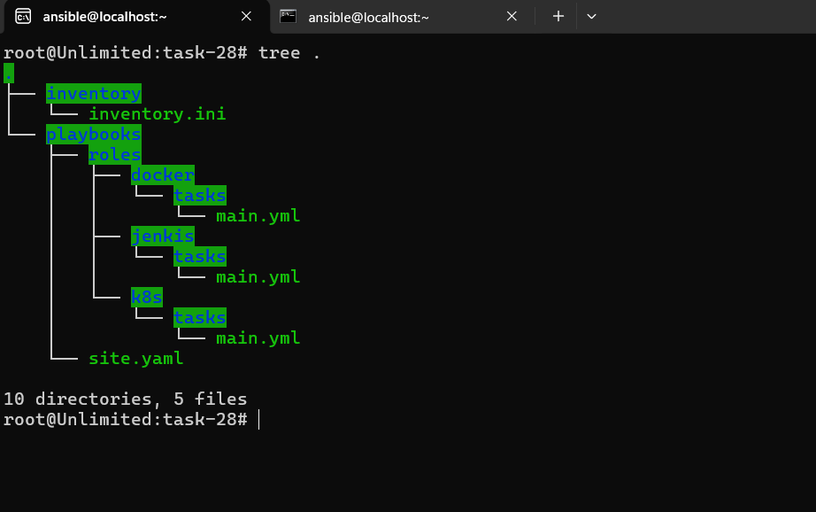
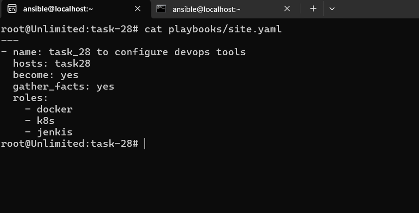
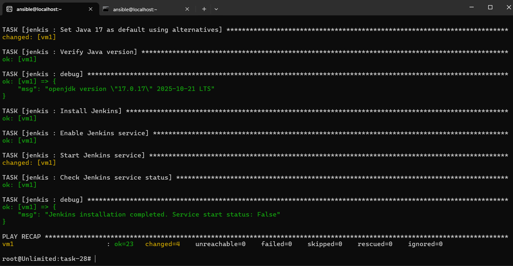
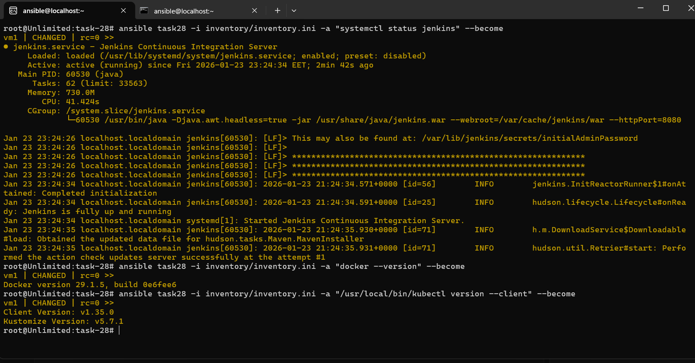

# IVOLVE Task 28 - DevOps Tools Configuration Using Ansible Roles

This lab demonstrates how to use Ansible roles to automate the installation and configuration of multiple DevOps tools (Docker, Kubernetes/kubectl, and Jenkins) on managed nodes.

---

## 🎯 Lab Objectives

By the end of this lab, you will:

1. ✅ Understand Ansible roles and their structure
2. ✅ Create reusable Ansible roles for DevOps tools
3. ✅ Install and configure Docker using Ansible role
4. ✅ Install and configure kubectl using Ansible role
5. ✅ Install and configure Jenkins using Ansible role
6. ✅ Execute a multi-role playbook to deploy all tools

---

## 📋 Requirements

- ✅ Control node with Ansible installed (from Lab 26)
- ✅ Managed node accessible via SSH
- ✅ SSH key-based authentication configured (from Lab 26)
- ✅ Passwordless sudo configured on managed node
- ✅ Inventory file with managed node(s)
- ✅ Network connectivity between control and managed nodes

---

## 🔍 What are Ansible Roles?

**Ansible Roles** are:
- **Reusable** automation units that organize tasks, variables, files, and templates
- **Structured** with a standard directory layout
- **Shareable** across multiple playbooks and projects
- **Modular** - each role has a specific purpose
- **Best Practice** for organizing complex automation

### Role Structure

```
role-name/
├── tasks/
│   └── main.yml      # Main tasks file
├── handlers/
│   └── main.yml      # Handlers (optional)
├── vars/
│   └── main.yml      # Variables (optional)
├── defaults/
│   └── main.yml      # Default variables (optional)
├── files/            # Static files (optional)
├── templates/        # Jinja2 templates (optional)
└── meta/
    └── main.yml      # Role metadata (optional)
```

---

## 🚀 Step-by-Step Guide

### Step 1: Prepare Directory Structure

**Where:** Control node

**What:** Create the proper directory structure for roles

1. **Create task directory:**
   ```bash
   mkdir -p ~/ansible/task-28
   cd ~/ansible/task-28
   ```

2. **Create directory structure:**
   ```bash
   mkdir -p inventory
   mkdir -p playbooks/roles/{docker,k8s,jenkis}/tasks
   ```

   

---

### Step 2: Create Inventory File

**Where:** Control node

**What:** Create inventory file with managed node

1. **Create inventory file:**
   ```bash
   nano inventory/inventory.ini
   ```

2. **Add managed node:**
   ```ini
   [task28]
   vm1 ansible_host=192.168.2.134 ansible_user=ansible ansible_python_interpreter=/usr/bin/python3 ansible_become=yes ansible_become_method=sudo ansible_become_user=root
   ```

3. **Test connectivity:**
   ```bash
   ansible task28 -i inventory/inventory.ini -m ping
   ```

---

### Step 3: Create Docker Role

**Where:** Control node

**What:** Create role to install and configure Docker

1. **Create Docker role tasks:**
   ```bash
   nano playbooks/roles/docker/tasks/main.yml
   ```

2. **Add Docker installation tasks:**
   ```yaml
   ---
   - name: install required packages
     yum:
       name:
         - yum-utils
         - device-mapper-persistent-data
         - lvm2
         - dnf-plugins-core
       state: present
   
   - name: Set up the repository
     get_url:
       url: https://download.docker.com/linux/centos/docker-ce.repo
       dest: /etc/yum.repos.d/docker-ce.repo
   
   - name: Install the Docker packages
     yum:
       name:
         - docker-ce 
         - docker-ce-cli 
         - containerd.io 
         - docker-buildx-plugin 
         - docker-compose-plugin
       state: present
   
   - name: docker service up
     service:
       name: docker
       state: started
       enabled: yes
   ```

---

### Step 4: Create Kubernetes (kubectl) Role

**Where:** Control node

**What:** Create role to install kubectl

1. **Create kubectl role tasks:**
   ```bash
   nano playbooks/roles/k8s/tasks/main.yml
   ```

2. **Add kubectl installation tasks:**
   ```yaml
   ---
   - name: Get latest kubectl version
     uri:
       url: https://dl.k8s.io/release/stable.txt
       return_content: yes
     register: kubectl_version
   
   - name: Download kubectl
     get_url:
       url: "https://dl.k8s.io/release/{{ kubectl_version.content | trim }}/bin/linux/amd64/kubectl"
       dest: /usr/local/bin/kubectl
       mode: '0755'
   
   - name: Verify kubectl file exists
     stat:
       path: /usr/local/bin/kubectl
     register: kubectl_file
   
   - name: Verify kubectl
     command: /usr/local/bin/kubectl version --client
     register: kubectl_verify
     changed_when: false
     when: kubectl_file.stat.exists
   
   - debug:
       msg: "{{ kubectl_verify.stdout }}"
     when: kubectl_verify is defined
   ```

---

### Step 5: Create Jenkins Role

**Where:** Control node

**What:** Create role to install and configure Jenkins

1. **Create Jenkins role tasks:**
   ```bash
   nano playbooks/roles/jenkis/tasks/main.yml
   ```

2. **Add Jenkins installation tasks:**
   ```yaml
   ---
   - name: Add Jenkins repo
     yum_repository:
       name: jenkins
       description: Jenkins Repo
       baseurl: http://pkg.jenkins.io/redhat-stable/
       gpgcheck: yes
       gpgkey: https://pkg.jenkins.io/redhat-stable/jenkins.io.key
   
   - name: Download Jenkins GPG key
     get_url:
       url: https://pkg.jenkins.io/redhat-stable/jenkins.io.key
       dest: /tmp/jenkins.io.key
       mode: "0644"
   
   - name: Import Jenkins GPG key
     command: rpm --import /tmp/jenkins.io.key
   
   - name: Refresh yum cache
     command: yum makecache
   
   - name: Install Java 17 (required for Jenkins)
     yum:
       name: java-17-openjdk
       state: present
   
   - name: Set Java 17 as default using alternatives
     shell: |
       JAVA17_PATH=$(find /usr/lib/jvm -name "java-17*" -type d | head -1)
       if [ -n "$JAVA17_PATH" ] && [ -f "$JAVA17_PATH/bin/java" ]; then
         alternatives --set java "$JAVA17_PATH/bin/java"
       fi
     args:
       executable: /bin/bash
     ignore_errors: yes
   
   - name: Verify Java version
     command: java -version
     register: java_version
     changed_when: false
     failed_when: false
   
   - debug:
       msg: "{{ java_version.stderr_lines[0] }}"
   
   - name: Install Jenkins
     yum:
       name: jenkins
       state: present
       disable_gpg_check: yes
   
   - name: Enable Jenkins service
     service:
       name: jenkins
       enabled: yes
   
   - name: Start Jenkins service
     service:
       name: jenkins
       state: started
     register: jenkins_start_result
   
   - name: Check Jenkins service status
     command: systemctl status jenkins
     register: jenkins_status
     changed_when: false
     failed_when: false
   
   - debug:
       msg: "Jenkins installation completed. Service start status: {{ jenkins_start_result.failed | default('success') }}"
   ```

---

### Step 6: Create Main Playbook

**Where:** Control node

**What:** Create playbook that uses all roles

1. **Create main playbook:**
   ```bash
   nano playbooks/site.yaml
   ```

2. **Add playbook content:**
   ```yaml
   ---
   - name: task_28 to configure devops tools
     hosts: task28
     become: yes
     gather_facts: yes
     roles:
       - docker
       - k8s
       - jenkis
   ```

   

---

### Step 7: Run the Playbook

**Where:** Control node

**What:** Execute the playbook to install all DevOps tools

1. **Run the playbook:**
   ```bash
   ansible-playbook -i inventory/inventory.ini playbooks/site.yaml
   ```

   

2. **Expected output:**
   ```
   PLAY [task_28 to configure devops tools] ********************
   
   TASK [Gathering Facts] ************************************
   ok: [vm1]
   
   TASK [docker : install required packages] ******************
   changed: [vm1]
   
   TASK [docker : Set up the repository] **********************
   changed: [vm1]
   
   TASK [docker : Install the Docker packages] ***************
   changed: [vm1]
   
   TASK [docker : docker service up] *************************
   changed: [vm1]
   
   TASK [k8s : Get latest kubectl version] *******************
   ok: [vm1]
   
   TASK [k8s : Download kubectl] *****************************
   changed: [vm1]
   
   TASK [k8s : Verify kubectl] *******************************
   ok: [vm1]
   
   TASK [jenkis : Add Jenkins repo] **************************
   changed: [vm1]
   
   TASK [jenkis : Install Java 17] ***************************
   changed: [vm1]
   
   TASK [jenkis : Install Jenkins] **************************
   changed: [vm1]
   
   TASK [jenkis : Start Jenkins service] *********************
   changed: [vm1]
   
   PLAY RECAP ************************************************
   vm1  : ok=23    changed=10   unreachable=0    failed=0
   ```

---

### Step 8: Verify Installation

**Where:** Managed node

**What:** Verify all tools are installed and working

1. **Check Docker:**
   ```bash
   ansible task28 -i inventory/inventory.ini -a "docker --version" --become
   ```

2. **Check kubectl:**
   ```bash
   ansible task28 -i inventory/inventory.ini -a "/usr/local/bin/kubectl version --client" --become
   ```

3. **Check Jenkins:**
   ```bash
   ansible task28 -i inventory/inventory.ini -a "systemctl status jenkins" --become
   ```

   

---

## 🐛 Troubleshooting: Errors and Solutions

During this lab, we encountered several errors. Here's how we fixed them:

### Error 1: Missing Sudo Password

**Error:**
```
[ERROR]: Task failed: Missing sudo password
fatal: [vm1]: FAILED! => {"changed": false, "msg": "Task failed: Missing sudo password"}
```

**Solution:**
Configure passwordless sudo on the managed node:

1. SSH into managed node:
   ```bash
   ssh ansible@192.168.2.134
   ```

2. Edit sudoers:
   ```bash
   sudo visudo
   ```

3. Add this line:
   ```
   ansible ALL=(ALL) NOPASSWD: ALL
   ```

4. Or create dedicated file:
   ```bash
   echo "ansible ALL=(ALL) NOPASSWD: ALL" | sudo tee /etc/sudoers.d/ansible
   sudo chmod 0440 /etc/sudoers.d/ansible
   ```

---

### Error 2: Wrong Command Syntax

**Error:**
```
[WARNING]: provided hosts list is empty
[ERROR]: YAML parsing failed: Did not find expected <document start>
```

**Problem:** Missing `-i` flag in ansible-playbook command

**Solution:**
Use correct syntax:
```bash
# ❌ Wrong
ansible-playbook inventory/inventory.ini playbooks/site.yaml

# ✅ Correct
ansible-playbook -i inventory/inventory.ini playbooks/site.yaml
```

---

### Error 3: Role Structure Issue

**Error:**
```
PLAY RECAP shows only "Gathering Facts" - roles not executing
```

**Problem:** Role files were in wrong location (`main.yaml` in role root instead of `tasks/main.yml`)

**Solution:**
Create proper role structure:
```bash
# Correct structure
playbooks/roles/
├── docker/
│   └── tasks/
│       └── main.yml    # ✅ Correct
├── k8s/
│   └── tasks/
│       └── main.yml    # ✅ Correct
└── jenkis/
    └── tasks/
        └── main.yml    # ✅ Correct
```

**Not:**
```
playbooks/roles/
├── docker/
│   └── main.yaml       # ❌ Wrong location
```

---

### Error 4: Package Name Typo

**Error:**
```
[ERROR]: Failed to install some of the specified packages
failures: ["No package device-maper-presistent-data available."]
```

**Problem:** Typo in package name: `device-maper-presistent-data`

**Solution:**
Fixed to correct package name: `device-mapper-persistent-data`

```yaml
# ❌ Wrong
- device-maper-presistent-data

# ✅ Correct
- device-mapper-persistent-data
```

---

### Error 5: kubectl Path Issue

**Error:**
```
[ERROR]: Error executing command: [Errno 2] No such file or directory: b'kubectl'
```

**Problem:** `kubectl` command not found in PATH

**Solution:**
Use full path in command:
```yaml
# ❌ Wrong
- name: Verify kubectl
  command: kubectl version --client

# ✅ Correct
- name: Verify kubectl
  command: /usr/local/bin/kubectl version --client
```

Also added file existence check:
```yaml
- name: Verify kubectl file exists
  stat:
    path: /usr/local/bin/kubectl
  register: kubectl_file

- name: Verify kubectl
  command: /usr/local/bin/kubectl version --client
  when: kubectl_file.stat.exists
```

---

### Error 6: Jenkins GPG Key Import Issues

**Error:**
```
[ERROR]: Failed to validate GPG signature for jenkins-2.541.1-1.noarch: 
Public key for jenkins-2.541.1-1.noarch.rpm is not installed
```

**Problem:** GPG key not being imported correctly

**Solution:**
1. Download key first, then import:
   ```yaml
   - name: Download Jenkins GPG key
     get_url:
       url: https://pkg.jenkins.io/redhat-stable/jenkins.io.key
       dest: /tmp/jenkins.io.key
       mode: "0644"
   
   - name: Import Jenkins GPG key
     command: rpm --import /tmp/jenkins.io.key
   ```

2. If still failing, disable GPG check for installation:
   ```yaml
   - name: Install Jenkins
     yum:
       name: jenkins
       state: present
       disable_gpg_check: yes  # Workaround for GPG issues
   ```

---

### Error 7: Jenkins Java Version Mismatch

**Error:**
```
Running with Java 11 from /usr/lib/jvm/java-11-openjdk-11.0.20.1.1-2.el9.x86_64, 
which is older than the minimum required version (Java 17).
Supported Java versions are: [17, 21, 25]
```

**Problem:** Jenkins 2.541+ requires Java 17+, but Java 11 was installed

**Solution:**
1. Install Java 17 instead of Java 11:
   ```yaml
   # ❌ Wrong
   - name: Install Java
     yum:
       name: java-11-openjdk
   
   # ✅ Correct
   - name: Install Java 17 (required for Jenkins)
     yum:
       name: java-17-openjdk
   ```

2. Set Java 17 as default:
   ```yaml
   - name: Set Java 17 as default using alternatives
     shell: |
       JAVA17_PATH=$(find /usr/lib/jvm -name "java-17*" -type d | head -1)
       if [ -n "$JAVA17_PATH" ] && [ -f "$JAVA17_PATH/bin/java" ]; then
         alternatives --set java "$JAVA17_PATH/bin/java"
       fi
     args:
       executable: /bin/bash
     ignore_errors: yes
   ```

---

### Error 8: Java 17 Path Not Found

**Error:**
```
[ERROR]: Specified path /usr/lib/jvm/java-17-openjdk/bin/java does not exist
```

**Problem:** Hardcoded Java path doesn't match actual installation path

**Solution:**
Use dynamic path finding:
```yaml
# ❌ Wrong (hardcoded path)
- name: Set Java 17 as default
  alternatives:
    name: java
    path: /usr/lib/jvm/java-17-openjdk/bin/java

# ✅ Correct (dynamic path finding)
- name: Set Java 17 as default using alternatives
  shell: |
    JAVA17_PATH=$(find /usr/lib/jvm -name "java-17*" -type d | head -1)
    if [ -n "$JAVA17_PATH" ] && [ -f "$JAVA17_PATH/bin/java" ]; then
      alternatives --set java "$JAVA17_PATH/bin/java"
    fi
  args:
    executable: /bin/bash
  ignore_errors: yes
```

---

## 📊 Role Breakdown

### Docker Role

**Purpose:** Install and configure Docker Engine

**Tasks:**
1. Install required packages (yum-utils, device-mapper, lvm2)
2. Add Docker repository
3. Install Docker packages
4. Start and enable Docker service

**Modules Used:**
- `yum` - Package management
- `get_url` - Download repository file
- `service` - Service management

---

### Kubernetes (k8s) Role

**Purpose:** Install kubectl CLI tool

**Tasks:**
1. Get latest kubectl version from Kubernetes API
2. Download kubectl binary
3. Verify installation
4. Display version

**Modules Used:**
- `uri` - Get version information
- `get_url` - Download binary
- `stat` - Check file existence
- `command` - Execute kubectl
- `debug` - Display output

---

### Jenkins Role

**Purpose:** Install and configure Jenkins CI/CD server

**Tasks:**
1. Add Jenkins repository
2. Import GPG key
3. Install Java 17
4. Set Java 17 as default
5. Install Jenkins
6. Start and enable Jenkins service

**Modules Used:**
- `yum_repository` - Add repository
- `get_url` - Download GPG key
- `command` - Import key, refresh cache
- `yum` - Install packages
- `shell` - Set Java alternatives
- `service` - Manage service

---

## ✅ Verification Checklist

Before and after running the playbook, verify:

- [ ] Inventory file configured correctly
- [ ] SSH connectivity to managed node
- [ ] Passwordless sudo configured
- [ ] Role directory structure is correct (`tasks/main.yml`)
- [ ] All role files created
- [ ] Main playbook (`site.yaml`) created
- [ ] Playbook executed successfully
- [ ] Docker installed and running
- [ ] kubectl installed and accessible
- [ ] Jenkins installed and service started
- [ ] All tools verified on managed node

---

## 📝 File Structure

```
task-28/
├── README.md                    # This file
├── inventory/
│   └── inventory.ini            # Inventory file
├── playbooks/
│   ├── site.yaml                # Main playbook
│   └── roles/
│       ├── docker/
│       │   └── tasks/
│       │       └── main.yml     # Docker installation tasks
│       ├── k8s/
│       │   └── tasks/
│       │       └── main.yml     # kubectl installation tasks
│       └── jenkis/
│           └── tasks/
│               └── main.yml     # Jenkins installation tasks
└── screenshots/
    ├── tree-for-all-files.png              # Directory structure
    ├── siteyaml.png                       # Main playbook content
    ├── playbook-run-success.png            # Successful execution
    └── verify-taskes-worked-installed-in-target.png  # Verification
```

---

## 🎯 Key Concepts

### Roles vs Playbooks

- **Playbooks:** Define what to run and on which hosts
- **Roles:** Define how to do it (reusable tasks)

### Role Benefits

1. **Reusability:** Use same role in multiple playbooks
2. **Organization:** Logical grouping of related tasks
3. **Sharing:** Easy to share and version control
4. **Maintainability:** Update role once, affects all playbooks using it

### Role Execution Order

When a playbook includes roles:
1. Roles execute in the order listed
2. Each role's `tasks/main.yml` runs
3. Handlers are collected and run at the end

---

## 🚀 Quick Reference

### Essential Commands

```bash
# Run playbook
ansible-playbook -i inventory/inventory.ini playbooks/site.yaml

# Test connectivity
ansible task28 -i inventory/inventory.ini -m ping

# Run specific role only
ansible-playbook -i inventory/inventory.ini playbooks/site.yaml --tags docker

# Check syntax
ansible-playbook --syntax-check playbooks/site.yaml

# Dry run
ansible-playbook -i inventory/inventory.ini playbooks/site.yaml --check

# Verbose output
ansible-playbook -i inventory/inventory.ini playbooks/site.yaml -v
```

### Verify Tools

```bash
# Check Docker
ansible task28 -i inventory/inventory.ini -a "docker --version" --become

# Check kubectl
ansible task28 -i inventory/inventory.ini -a "/usr/local/bin/kubectl version --client" --become

# Check Jenkins
ansible task28 -i inventory/inventory.ini -a "systemctl status jenkins" --become
```

---

## 📚 Summary

This lab covered:

1. ✅ **Role Structure** - Created proper Ansible role directory structure
2. ✅ **Docker Role** - Automated Docker installation and configuration
3. ✅ **Kubernetes Role** - Automated kubectl installation
4. ✅ **Jenkins Role** - Automated Jenkins installation with Java 17
5. ✅ **Multi-Role Playbook** - Combined all roles in a single playbook
6. ✅ **Error Resolution** - Fixed multiple issues during implementation
7. ✅ **Verification** - Validated all tools are installed correctly

---

## 🎓 Next Steps

- Create roles for other tools (Git, Maven, etc.)
- Use role variables for customization
- Create role handlers for service restarts
- Use role dependencies
- Share roles via Ansible Galaxy
- Create role documentation
- Implement role testing
- Use role tags for selective execution

---

## 📚 Related Labs

- **Lab 26**: Initial Ansible Configuration and Ad-Hoc Execution
- **Lab 27**: Automated Web Server Configuration Using Ansible Playbooks
- **Lab 28**: DevOps Tools Configuration Using Ansible Roles (this lab)

---

## License

See the LICENSE file in the parent directory for license information.
