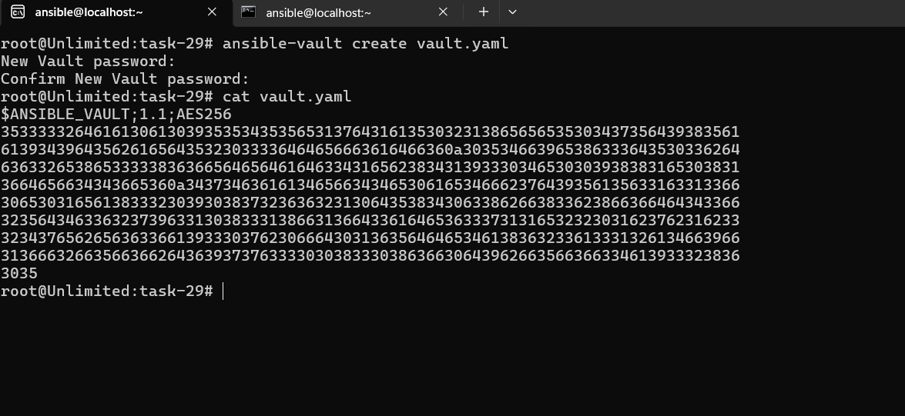
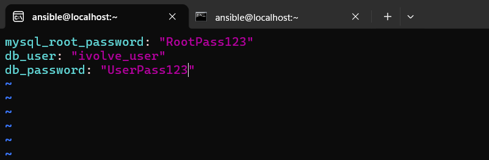
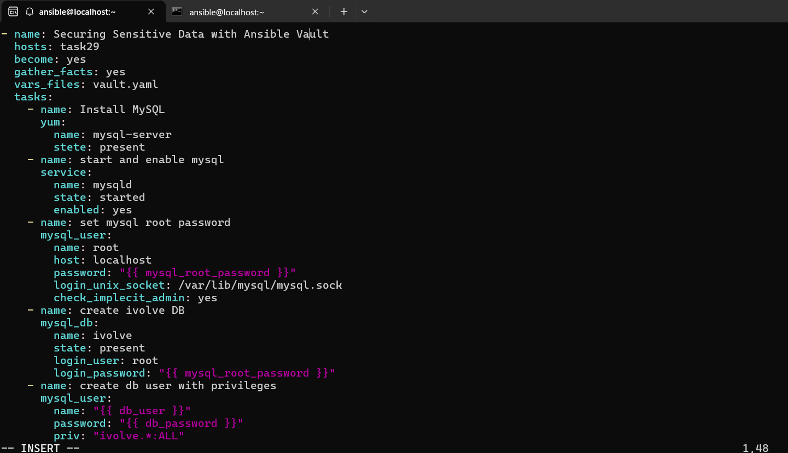
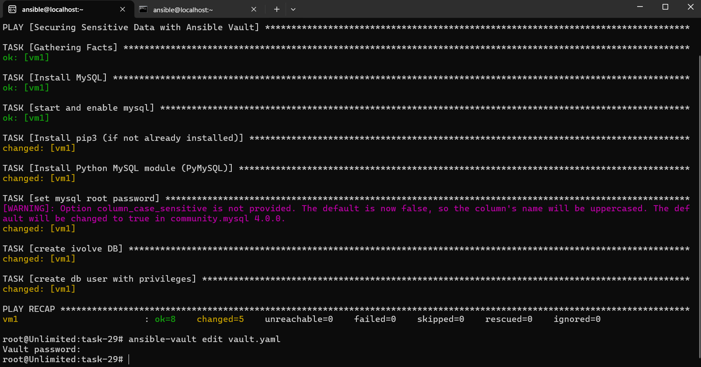
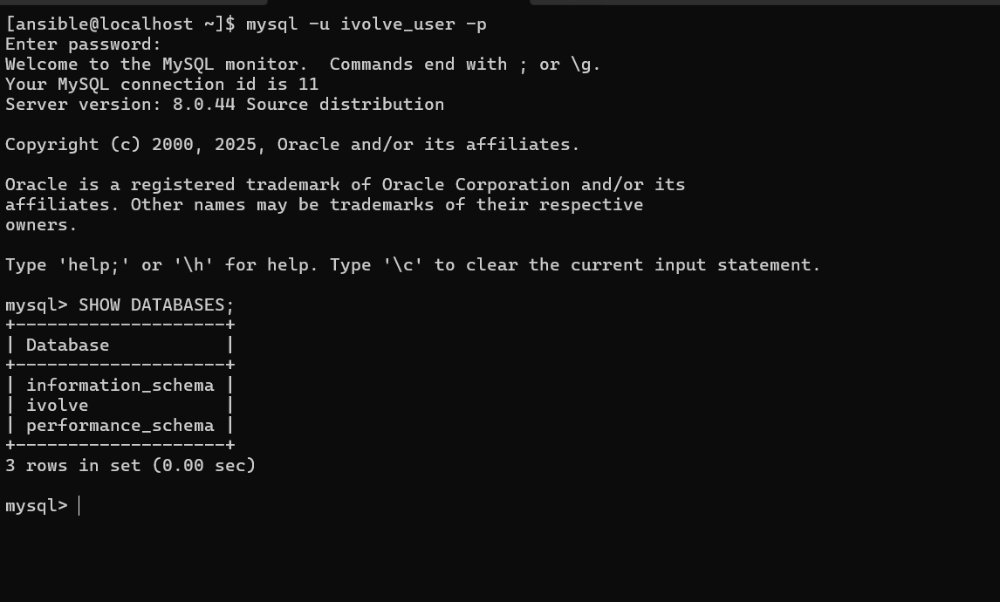

# IVOLVE Task 29 - Securing Sensitive Data with Ansible Vault

This lab demonstrates how to use Ansible Vault to encrypt sensitive data (like passwords) in playbooks, and how to automate MySQL database installation and configuration using encrypted credentials.

---

## 🎯 Lab Objectives

By the end of this lab, you will:

1. ✅ Understand Ansible Vault and its purpose
2. ✅ Create encrypted vault files for sensitive data
3. ✅ Use vault-encrypted variables in playbooks
4. ✅ Automate MySQL server installation
5. ✅ Configure MySQL with encrypted passwords
6. ✅ Create databases and users using Ansible

---

## 📋 Requirements

- ✅ Control node with Ansible installed (from Lab 26)
- ✅ Managed node accessible via SSH
- ✅ SSH key-based authentication configured (from Lab 26)
- ✅ Passwordless sudo configured on managed node
- ✅ Inventory file with managed node(s)
- ✅ Network connectivity between control and managed nodes

---

## 🔍 What is Ansible Vault?

**Ansible Vault** is a feature that:
- **Encrypts sensitive data** (passwords, API keys, secrets)
- **Keeps secrets secure** in version control
- **Uses AES256 encryption** for strong security
- **Requires password** to decrypt and use
- **Integrates seamlessly** with Ansible playbooks

### Why Use Ansible Vault?

- ✅ **Security:** Passwords not visible in plain text
- ✅ **Version Control Safe:** Encrypted files can be committed to Git
- ✅ **Team Collaboration:** Share playbooks without exposing secrets
- ✅ **Best Practice:** Industry standard for secret management

---

## 🚀 Step-by-Step Guide

### Step 1: Create Inventory File

**Where:** Control node

**What:** Create inventory file with managed node

1. **Create inventory file:**
   ```bash
   nano inventory.ini
   ```

2. **Add managed node:**
   ```ini
   [task29]
   vm1 ansible_host=192.168.2.134 ansible_user=ansible ansible_python_interpreter=/usr/bin/python3 ansible_become=yes ansible_become_method=sudo ansible_become_user=root
   ```

3. **Test connectivity:**
   ```bash
   ansible task29 -i inventory.ini -m ping
   ```

---

### Step 2: Create Ansible Vault File

**Where:** Control node

**What:** Create encrypted vault file with sensitive data

1. **Create vault file:**
   ```bash
   ansible-vault create vault.yaml
   ```

2. **Enter vault password when prompted** (e.g., `123`)

3. **Add sensitive variables:**
   ```yaml
   mysql_root_password: "MySecureRootPass123!"
   db_user: "ivolve_user"
   db_password: "SecureUserPass456!"
   ```

   

4. **Save and exit** (Ctrl+X, Y, Enter)

   The file will be encrypted and look like:
   ```
   $ANSIBLE_VAULT;1.1;AES256
   353333326461613061303935353435356531376431613530323138656565353034...
   ```

   

---

### Step 3: View/Edit Vault File

**Where:** Control node

**What:** Learn how to view and edit encrypted vault files

**View encrypted file:**
```bash
ansible-vault view vault.yaml
# Enter password when prompted
```

**Edit encrypted file:**
```bash
ansible-vault edit vault.yaml
# Enter password when prompted
```

**Change vault password:**
```bash
ansible-vault rekey vault.yaml
# Enter old password, then new password
```

---

### Step 4: Create Playbook

**Where:** Control node

**What:** Create playbook that uses vault-encrypted variables

1. **Create playbook:**
   ```bash
   nano installdb.yaml
   ```

2. **Add playbook content:**
   ```yaml
   - name: Securing Sensitive Data with Ansible Vault
     hosts: task29
     become: yes
     gather_facts: yes
     vars_files: vault.yaml
     tasks:
       - name: Install MySQL
         yum:
           name: mysql-server
           state: present
       
       - name: start and enable mysql
         service:
           name: mysqld
           state: started
           enabled: yes
       
       - name: Install pip3 (if not already installed)
         yum:
           name: python3-pip
           state: present
       
       - name: Install Python MySQL module (PyMySQL)
         pip:
           name: PyMySQL
           executable: pip3
           state: present
       
       - name: set mysql root password
         mysql_user:
           name: root
           host: localhost
           password: "{{ mysql_root_password }}"
           login_unix_socket: /var/lib/mysql/mysql.sock
           check_implicit_admin: yes
       
       - name: create ivolve DB
         mysql_db:
           name: ivolve
           state: present
           login_user: root
           login_password: "{{ mysql_root_password }}"
       
       - name: create db user with privileges
         mysql_user:
           name: "{{ db_user }}"
           password: "{{ db_password }}"
           priv: "ivolve.*:ALL"
           host: "%"
           state: present
           login_user: root
           login_password: "{{ mysql_root_password }}"
   ```

   

---

### Step 5: Run the Playbook

**Where:** Control node

**What:** Execute playbook with vault password

1. **Run playbook with vault password prompt:**
   ```bash
   ansible-playbook -i inventory.ini installdb.yaml --ask-vault-pass
   ```

2. **Enter vault password when prompted** (e.g., `123`)

   

3. **Expected output:**
   ```
   PLAY [Securing Sensitive Data with Ansible Vault] ********
   
   TASK [Gathering Facts] **********************************
   ok: [vm1]
   
   TASK [Install MySQL] ************************************
   changed: [vm1]
   
   TASK [start and enable mysql] **************************
   changed: [vm1]
   
   TASK [Install pip3] *************************************
   ok: [vm1]
   
   TASK [Install Python MySQL module (PyMySQL)] ***********
   changed: [vm1]
   
   TASK [set mysql root password] **************************
   changed: [vm1]
   
   TASK [create ivolve DB] *********************************
   changed: [vm1]
   
   TASK [create db user with privileges] ******************
   changed: [vm1]
   
   PLAY RECAP **********************************************
   vm1  : ok=8    changed=6    unreachable=0    failed=0
   ```

---

### Step 6: Verify Database Creation

**Where:** Managed node

**What:** Verify MySQL database and user were created

1. **Connect to MySQL:**
   ```bash
   ssh ansible@192.168.2.134
   mysql -u root -p
   # Enter the root password from vault
   ```

2. **Verify database exists:**
   ```sql
   SHOW DATABASES;
   ```

   You should see `ivolve` database.

3. **Verify user exists:**
   ```sql
   SELECT user, host FROM mysql.user WHERE user='ivolve_user';
   ```

4. **Check user privileges:**
   ```sql
   SHOW GRANTS FOR 'ivolve_user'@'%';
   ```

   

5. **Exit MySQL:**
   ```sql
   EXIT;
   ```

---

## 🐛 Troubleshooting: Errors and Solutions

During this lab, we encountered several errors. Here's how we fixed them:

### Error 1: Typo in State Parameter

**Error:**
```
[ERROR]: Unsupported parameters for (ansible.legacy.dnf) module: stete. 
Supported parameters include: ... state ...
```

**Problem:** Typo in playbook - `stete` instead of `state`

**Solution:**
Fixed the typo:
```yaml
# ❌ Wrong
- name: Install MySQL
  yum:
    name: mysql-server
    stete: present

# ✅ Correct
- name: Install MySQL
  yum:
    name: mysql-server
    state: present
```

---

### Error 2: Typo in check_implicit_admin

**Error:**
```
[ERROR]: Unsupported parameters for (ansible.legacy.mysql_user) module: check_implecit_admin
```

**Problem:** Typo in parameter name - `check_implecit_admin` instead of `check_implicit_admin`

**Solution:**
Fixed the typo:
```yaml
# ❌ Wrong
check_implecit_admin: yes

# ✅ Correct
check_implicit_admin: yes
```

---

### Error 3: Missing Python MySQL Module

**Error:**
```
[ERROR]: A MySQL module is required: for Python 2.7 either PyMySQL, or MySQL-python, 
or for Python 3.X mysqlclient or PyMySQL.
```

**Problem:** The `mysql_user` and `mysql_db` modules require a Python MySQL library, but it wasn't installed on the managed node.

**Solution:**
Added tasks to install Python 3 pip and PyMySQL:
```yaml
- name: Install pip3 (if not already installed)
  yum:
    name: python3-pip
    state: present

- name: Install Python MySQL module (PyMySQL)
  pip:
    name: PyMySQL
    executable: pip3
    state: present
```

**Note:** Since the inventory uses `ansible_python_interpreter=/usr/bin/python3`, we need the Python 3 version of PyMySQL, not Python 2.7.

---

## 📊 Playbook Breakdown

### Variables from Vault

The playbook uses these encrypted variables from `vault.yaml`:
- `mysql_root_password` - MySQL root user password
- `db_user` - Database user name
- `db_password` - Database user password

### Tasks Explained

1. **Install MySQL:** Installs MySQL server package
2. **Start MySQL Service:** Starts and enables mysqld service
3. **Install pip3:** Installs Python 3 pip package manager
4. **Install PyMySQL:** Installs Python MySQL module for Ansible
5. **Set Root Password:** Configures MySQL root password
6. **Create Database:** Creates `ivolve` database
7. **Create User:** Creates database user with privileges

---

## 🔐 Ansible Vault Commands

### Create Vault File

```bash
# Create new encrypted file
ansible-vault create vault.yaml

# Create with specific password file
ansible-vault create --vault-password-file=password.txt vault.yaml
```

### View Vault File

```bash
# View encrypted file (prompts for password)
ansible-vault view vault.yaml

# View with password file
ansible-vault view --vault-password-file=password.txt vault.yaml
```

### Edit Vault File

```bash
# Edit encrypted file
ansible-vault edit vault.yaml

# Edit with password file
ansible-vault edit --vault-password-file=password.txt vault.yaml
```

### Encrypt Existing File

```bash
# Encrypt an existing plain text file
ansible-vault encrypt vault.yaml
```

### Decrypt Vault File

```bash
# Decrypt to plain text (use with caution!)
ansible-vault decrypt vault.yaml
```

### Change Vault Password

```bash
# Change password for encrypted file
ansible-vault rekey vault.yaml
```

---

## 🚀 Running Playbooks with Vault

### Method 1: Prompt for Password (Interactive)

```bash
ansible-playbook -i inventory.ini installdb.yaml --ask-vault-pass
```

Prompts you to enter the vault password.

### Method 2: Password File

1. **Create password file:**
   ```bash
   echo "123" > .vault_pass
   chmod 600 .vault_pass
   ```

2. **Run playbook:**
   ```bash
   ansible-playbook -i inventory.ini installdb.yaml --vault-password-file=.vault_pass
   ```

### Method 3: Environment Variable

```bash
export ANSIBLE_VAULT_PASSWORD_FILE=.vault_pass
ansible-playbook -i inventory.ini installdb.yaml
```

### Method 4: Script (Advanced)

Create a script that retrieves password from a secret manager:
```bash
#!/bin/bash
echo "password_from_secret_manager"
```

Then use:
```bash
ansible-playbook -i inventory.ini installdb.yaml --vault-password-file=./get_password.sh
```

---

## ✅ Verification Checklist

Before and after running the playbook, verify:

- [ ] Inventory file configured correctly
- [ ] SSH connectivity to managed node
- [ ] Passwordless sudo configured
- [ ] Vault file created with encrypted variables
- [ ] Playbook created with correct syntax
- [ ] Vault password known (or password file created)
- [ ] Playbook executed successfully
- [ ] MySQL installed and running
- [ ] PyMySQL module installed
- [ ] Database `ivolve` created
- [ ] Database user created with correct privileges
- [ ] Can connect to MySQL with vault password

---

## 📝 File Structure

```
task-29/
├── README.md              # This file
├── installdb.yaml         # Main playbook
├── vault.yaml             # Encrypted vault file (AES256)
├── inventory.ini          # Inventory file
└── screenshots/           # Screenshots directory
    ├── create-vault-with-pass-123.png    # Creating vault file
    ├── vault-content.png                 # Encrypted vault content
    ├── playbook.png                      # Playbook content
    ├── ansible-worked.png                # Successful execution
    └── show-db-to-make-sure-its-really-created.png  # Database verification
```

---

## 🔐 Security Best Practices

### Vault Password Management

1. **Never commit password files to Git:**
   ```bash
   # Add to .gitignore
   echo ".vault_pass" >> .gitignore
   echo "*.vault_pass" >> .gitignore
   ```

2. **Use strong passwords:**
   - Minimum 16 characters
   - Mix of letters, numbers, symbols
   - Don't use common passwords

3. **Rotate passwords regularly:**
   ```bash
   ansible-vault rekey vault.yaml
   ```

4. **Use password files in CI/CD:**
   - Store passwords in secret managers (HashiCorp Vault, AWS Secrets Manager)
   - Use scripts to retrieve passwords
   - Never hardcode passwords

### Vault File Management

1. **Separate vaults per environment:**
   - `vault-dev.yaml`
   - `vault-prod.yaml`
   - `vault-staging.yaml`

2. **Limit access:**
   - Only authorized users should have vault password
   - Use different passwords for different environments

3. **Audit access:**
   - Log who accesses vault files
   - Monitor vault file changes

---

## 🎯 Key Concepts

### Ansible Vault Encryption

- **Algorithm:** AES256 (strong encryption)
- **Format:** Encrypted files start with `$ANSIBLE_VAULT;1.1;AES256`
- **Reversible:** Can decrypt with correct password
- **Version Control Safe:** Encrypted files can be committed to Git

### Variable Precedence

When using `vars_files`:
1. Variables from vault are loaded
2. Can be overridden by command-line vars (`-e`)
3. Can be overridden by inventory vars
4. Can be overridden by playbook vars

### MySQL Modules

- **`mysql_user`:** Manage MySQL users
- **`mysql_db`:** Manage MySQL databases
- **Requires:** PyMySQL or mysqlclient Python module
- **Connection:** Can use socket or TCP/IP

---

## 🚀 Quick Reference

### Essential Commands

```bash
# Create vault
ansible-vault create vault.yaml

# View vault
ansible-vault view vault.yaml

# Edit vault
ansible-vault edit vault.yaml

# Encrypt existing file
ansible-vault encrypt vault.yaml

# Decrypt vault (use carefully!)
ansible-vault decrypt vault.yaml

# Change password
ansible-vault rekey vault.yaml

# Run playbook with vault
ansible-playbook -i inventory.ini installdb.yaml --ask-vault-pass

# Run with password file
ansible-playbook -i inventory.ini installdb.yaml --vault-password-file=.vault_pass
```

### Verify MySQL

```bash
# Connect to MySQL
mysql -u root -p

# Show databases
SHOW DATABASES;

# Show users
SELECT user, host FROM mysql.user;

# Show grants
SHOW GRANTS FOR 'ivolve_user'@'%';
```

---

## 📚 Summary

This lab covered:

1. ✅ **Ansible Vault** - Created encrypted vault files for sensitive data
2. ✅ **Vault Management** - Learned vault create, view, edit commands
3. ✅ **MySQL Installation** - Automated MySQL server installation
4. ✅ **Database Configuration** - Configured MySQL with encrypted passwords
5. ✅ **Database Creation** - Created database and user using Ansible
6. ✅ **Error Resolution** - Fixed typos and missing dependencies
7. ✅ **Security Best Practices** - Learned secure secret management

---

## 🎓 Next Steps

- Use Ansible Vault for other sensitive data (API keys, certificates)
- Implement multi-vault strategy (dev/staging/prod)
- Integrate with secret managers (HashiCorp Vault, AWS Secrets Manager)
- Use vault IDs for multiple passwords
- Encrypt entire playbooks if needed
- Implement vault password rotation
- Use Ansible Tower/AWX for centralized vault management

---

## 📚 Related Labs

- **Lab 26**: Initial Ansible Configuration and Ad-Hoc Execution
- **Lab 27**: Automated Web Server Configuration Using Ansible Playbooks
- **Lab 28**: DevOps Tools Configuration Using Ansible Roles
- **Lab 29**: Securing Sensitive Data with Ansible Vault (this lab)

---

## License

See the LICENSE file in the parent directory for license information.
