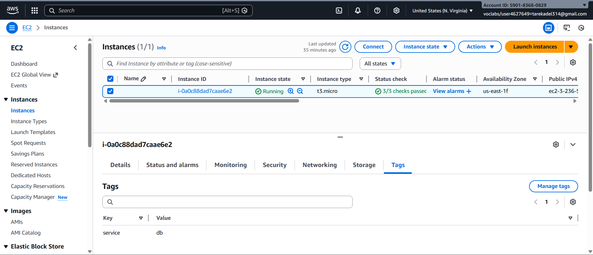
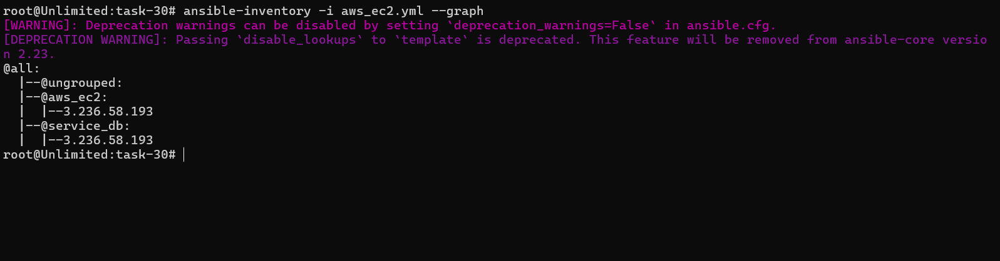
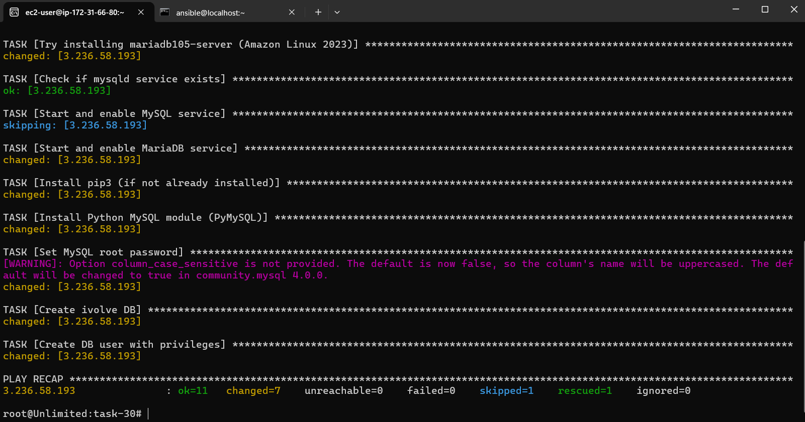
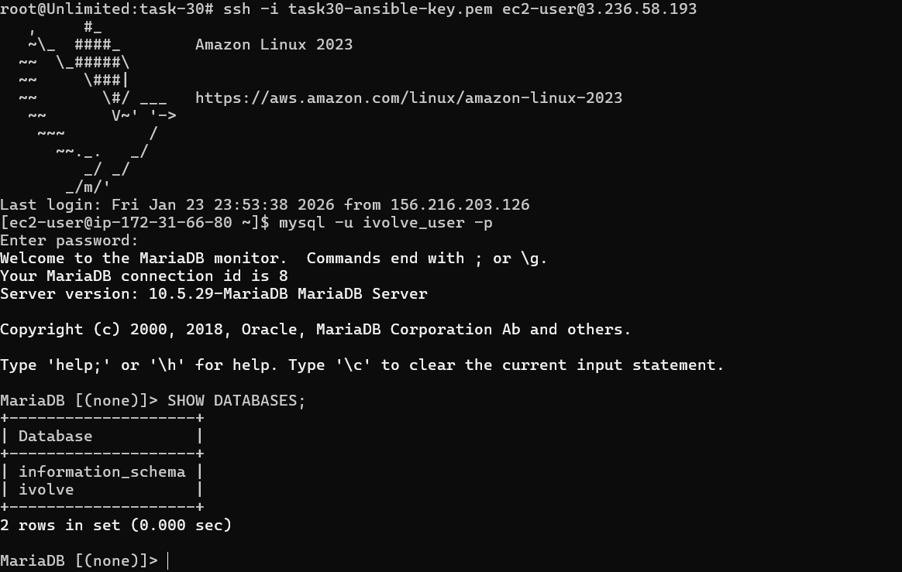

# IVOLVE Task 30 - Automated Host Discovery with Ansible Dynamic Inventory

This lab demonstrates how to use Ansible's dynamic inventory to automatically discover and manage AWS EC2 instances, eliminating the need for static inventory files.

---

## 🎯 Lab Objectives

By the end of this lab, you will:

1. ✅ Create AWS EC2 instance with tag `service:db`
2. ✅ Set up Ansible dynamic inventory for AWS EC2
3. ✅ Configure AWS credentials for Ansible
4. ✅ List discovered EC2 hosts using dynamic inventory
5. ✅ Run MySQL role on dynamically discovered hosts

---

## 📋 Requirements

- ✅ AWS account with EC2 access
- ✅ AWS Access Key ID and Secret Access Key
- ✅ Control node with Ansible installed
- ✅ Python 3 and pip installed on control node
- ✅ Network access to AWS EC2 instances
- ✅ SSH key pair for EC2 access
- ✅ Ansible Vault file from Task 29 (for MySQL passwords)

---

## 🔍 What is Dynamic Inventory?

**Dynamic Inventory** is:
- **Automatic discovery** of hosts from cloud providers (AWS, Azure, GCP)
- **Real-time host discovery** based on tags, regions, or filters
- **No static files** - inventory is generated on-the-fly
- **Tag-based grouping** - automatically groups hosts by tags
- **Scalable** - handles hundreds or thousands of instances

### Benefits

- ✅ **Automatic:** Discovers new instances automatically
- ✅ **Tag-based:** Groups hosts by AWS tags
- ✅ **Real-time:** Always reflects current EC2 state
- ✅ **Scalable:** Works with any number of instances

---

## 🚀 Step-by-Step Guide

### Step 1: Install Required Python Packages

**Where:** Control node

**What:** Install boto3 and botocore for AWS API access

```bash
# Install boto3 (AWS SDK for Python)
pip3 install boto3 botocore

# Or using yum/dnf (if available)
sudo yum install python3-boto3 python3-botocore
```

**Verify installation:**
```bash
python3 -c "import boto3; print(boto3.__version__)"
```

---

### Step 2: Configure AWS Credentials

**Where:** Control node

**What:** Set up AWS credentials for Ansible

#### Option A: AWS Credentials File (Recommended)

1. **Create AWS credentials directory:**
   ```bash
   mkdir -p ~/.aws
   ```

2. **Create credentials file:**
   ```bash
   nano ~/.aws/credentials
   ```

3. **Add your AWS credentials:**
   ```ini
   [default]
   aws_access_key_id = YOUR_ACCESS_KEY_ID
   aws_secret_access_key = YOUR_SECRET_ACCESS_KEY
   ```

4. **Set permissions:**
   ```bash
   chmod 600 ~/.aws/credentials
   ```

#### Option B: Environment Variables

```bash
export AWS_ACCESS_KEY_ID=YOUR_ACCESS_KEY_ID
export AWS_SECRET_ACCESS_KEY=YOUR_SECRET_ACCESS_KEY
export AWS_DEFAULT_REGION=us-east-1
```

#### Option C: AWS Configure Command

```bash
aws configure
# Enter Access Key ID
# Enter Secret Access Key
# Enter default region (e.g., us-east-1)
# Enter output format (json)
```

---

### Step 3: Create AWS EC2 Instance with Tag

**Where:** AWS Console or CLI

**What:** Launch EC2 instance with `service:db` tag

#### Option A: Using AWS Console

1. **Launch EC2 Instance:**
   - Go to EC2 Dashboard → Launch Instance
   - Choose Amazon Linux 2 or RHEL/CentOS AMI
   - Select instance type (t2.micro for testing)
   - Configure security group (allow SSH on port 22)
   - Add storage (default 8GB is fine)

2. **Add Tags:**
   - In "Add Tags" section, click "Add Tag"
   - **Key:** `service`
   - **Value:** `db`
   - Click "Launch Instance"

3. **Select Key Pair:**
   - Choose existing key pair or create new one
   - Download and save the private key (`.pem` file)
   - Set permissions: `chmod 400 your-key.pem`

**Screenshot:** 

#### Option B: Using AWS CLI

```bash
# Launch instance with tag
aws ec2 run-instances \
  --image-id ami-0c55b159cbfafe1f0 \
  --instance-type t2.micro \
  --key-name your-key-name \
  --security-group-ids sg-xxxxxxxxx \
  --tag-specifications 'ResourceType=instance,Tags=[{Key=service,Value=db}]' \
  --region us-east-1
```

**Note:** Replace:
- `ami-0c55b159cbfafe1f0` with your AMI ID
- `your-key-name` with your key pair name
- `sg-xxxxxxxxx` with your security group ID
- `us-east-1` with your region

---

### Step 4: Configure Dynamic Inventory

**Where:** Control node

**What:** Create AWS EC2 dynamic inventory configuration

1. **Create inventory directory:**
   ```bash
   mkdir -p ~/ansible/task-30
   cd ~/ansible/task-30
   ```

2. **Create dynamic inventory file:**
   ```bash
   nano aws_ec2.yml
   ```

3. **Add configuration:**
   ```yaml
   ---
   plugin: aws_ec2
   regions:
     - us-east-1  # Change to your AWS region
   filters:
     instance-state-name: running
     tag:service: db
   hostnames:
     - ip-address
     - private-ip-address
   keyed_groups:
     - key: tags.service
       prefix: service
     - key: tags.Environment
       prefix: env
   compose:
     ansible_host: public_ip_address
     ansible_user: ec2-user  # For Amazon Linux, use 'ubuntu' for Ubuntu
   ```

4. **Save the file**

**Configuration Explained:**
- `plugin: aws_ec2` - Uses AWS EC2 inventory plugin
- `regions` - AWS regions to search
- `filters` - Filter instances (running, with tag service:db)
- `hostnames` - How to name hosts in inventory
- `keyed_groups` - Auto-create groups based on tags
- `compose` - Set Ansible connection variables

---

### Step 5: Test Dynamic Inventory

**Where:** Control node

**What:** Verify dynamic inventory discovers EC2 instances

1. **List all discovered hosts:**
   ```bash
   ansible-inventory -i aws_ec2.yml --list
   ```

2. **List hosts in readable format:**
   ```bash
   ansible-inventory -i aws_ec2.yml --list --output inventory.json
   cat inventory.json | python3 -m json.tool
   ```

3. **List hostnames only:**
   ```bash
   ansible-inventory -i aws_ec2.yml --list-hosts
   ```

4. **List specific group:**
   ```bash
   ansible-inventory -i aws_ec2.yml --list-hosts service_db
   ```

5. **Graph view:**
   ```bash
   ansible-inventory -i aws_ec2.yml --graph
   ```

**Expected output:**
```
@all:
  |--@service_db:
  |  |--ec2-xx-xx-xx-xx.compute-1.amazonaws.com
  |--@ungrouped:
```

**Screenshot:** 

---

### Step 6: Test Connectivity

**Where:** Control node

**What:** Test SSH connectivity to discovered EC2 instances

1. **Ping all discovered hosts:**
   ```bash
   ansible all -i aws_ec2.yml -m ping
   ```

2. **If using SSH key:**
   ```bash
   ansible all -i aws_ec2.yml -m ping --private-key ~/.ssh/your-key.pem
   ```

3. **Test specific group:**
   ```bash
   ansible service_db -i aws_ec2.yml -m ping --private-key ~/.ssh/your-key.pem
   ```

**If connection fails:**
- Check security group allows SSH (port 22) from your IP
- Verify SSH key is correct
- Check instance is running
- Verify `ansible_user` is correct (ec2-user for Amazon Linux, ubuntu for Ubuntu)

---

### Step 7: Create MySQL Playbook

**Where:** Control node

**What:** Create playbook to run MySQL installation on discovered hosts

1. **Create playbook:**
   ```bash
   nano mysql-role-playbook.yaml
   ```

2. **Add playbook content:**
   ```yaml
   ---
   - name: Install and Configure MySQL on AWS EC2
     hosts: service_db
     become: yes
     gather_facts: yes
     vars_files: 
       - ../task-29/vault.yaml
     tasks:
       - name: Install MySQL
         yum:
           name: mysql-server
           state: present

       - name: Start and enable MySQL
         service:
           name: mysqld
           state: started
           enabled: yes

       - name: Install pip3 (if not already installed)
         yum:
           name: python3-pip
           state: present

       - name: Install Python MySQL module (PyMySQL)
         pip:
           name: PyMySQL
           executable: pip3
           state: present

       - name: Set MySQL root password
         mysql_user:
           name: root
           host: localhost
           password: "{{ mysql_root_password }}"
           login_unix_socket: /var/lib/mysql/mysql.sock
           check_implicit_admin: yes

       - name: Create ivolve DB
         mysql_db:
           name: ivolve
           state: present
           login_user: root
           login_password: "{{ mysql_root_password }}"

       - name: Create DB user with privileges
         mysql_user:
           name: "{{ db_user }}"
           password: "{{ db_password }}"
           priv: "ivolve.*:ALL"
           host: "%"
           state: present
           login_user: root
           login_password: "{{ mysql_root_password }}"
   ```

---

### Step 8: Run MySQL Playbook

**Where:** Control node

**What:** Execute playbook on dynamically discovered EC2 instances

1. **Run playbook:**
   ```bash
   ansible-playbook -i aws_ec2.yml mysql-role-playbook.yaml \
     --private-key ~/.ssh/your-key.pem \
     --ask-vault-pass
   ```

2. **Enter vault password when prompted**

3. **Expected output:**
   ```
   PLAY [Install and Configure MySQL on AWS EC2] ********
   
   TASK [Gathering Facts] ******************************
   ok: [ec2-xx-xx-xx-xx.compute-1.amazonaws.com]
   
   TASK [Install MySQL] ********************************
   changed: [ec2-xx-xx-xx-xx.compute-1.amazonaws.com]
   
   TASK [Start and enable MySQL] ***********************
   changed: [ec2-xx-xx-xx-xx.compute-1.amazonaws.com]
   
   ...
   
   PLAY RECAP ******************************************
   ec2-xx-xx-xx-xx.compute-1.amazonaws.com : ok=8 changed=6
   ```

**Screenshot:** 

---

## 🔧 Configuration Details

### AWS EC2 Inventory Plugin Options

**Common filters:**
```yaml
filters:
  instance-state-name: running      # Only running instances
  tag:service: db                   # Tag-based filtering
  tag:Environment: production       # Multiple tag filters
  instance-type: t2.micro           # Instance type filter
```

**Hostname options:**
```yaml
hostnames:
  - ip-address           # Public IP
  - private-ip-address   # Private IP
  - dns-name            # DNS name
  - tag:Name            # Tag value
```

**Grouping options:**
```yaml
keyed_groups:
  - key: tags.service
    prefix: service
  - key: tags.Environment
    prefix: env
  - key: instance_type
    prefix: type
```

---

## 🐛 Troubleshooting

### Error: No module named 'boto3'

**Problem:** boto3 not installed

**Solution:**
```bash
pip3 install boto3 botocore
```

---

### Error: Unable to locate credentials

**Problem:** AWS credentials not configured

**Solution:**
1. Configure credentials file: `~/.aws/credentials`
2. Or set environment variables
3. Or use `aws configure`

---

### Error: No hosts matched

**Problem:** No EC2 instances found matching filters

**Solution:**
1. Check region is correct
2. Verify instances are running
3. Verify tags are correct (`service:db`)
4. Test with broader filter:
   ```yaml
   filters:
     instance-state-name: running
   ```

---

### Error: Connection timeout

**Problem:** Can't connect to EC2 instance

**Solution:**
1. Check security group allows SSH (port 22) from your IP
2. Verify instance is running
3. Check `ansible_user` is correct:
   - `ec2-user` for Amazon Linux
   - `ubuntu` for Ubuntu
   - `admin` for Debian
4. Verify SSH key is correct

---

### Error: Permission denied (publickey)

**Problem:** SSH key authentication failed

**Solution:**
1. Use `--private-key` flag:
   ```bash
   ansible-playbook -i aws_ec2.yml playbook.yaml --private-key ~/.ssh/key.pem
   ```

2. Or configure in inventory:
   ```yaml
   compose:
     ansible_ssh_private_key_file: ~/.ssh/key.pem
   ```

---

### Error: No package mysql-server available / No package mariadb-server available

**Problem:** MySQL/MariaDB package not found on Amazon Linux EC2 instances

**Error Message:**
```
TASK [Install MySQL] ********************************
[ERROR]: Task failed: Module failed: Failed to install some of the specified packages
failures: ["No package mysql-server available."]
```

**Root Cause:** Amazon Linux 2023 uses different package names and repositories than RHEL/CentOS.

**Solution:** Updated the MySQL role to handle both MySQL and MariaDB installations with a `block/rescue` strategy:

1. **First attempt:** Install MySQL from official MySQL repository
2. **Fallback:** Install `mariadb105-server` (Amazon Linux 2023 compatible)

**Code Fix:**
```yaml
- name: Install MySQL from MySQL repository
  block:
    - name: Download MySQL repository
      get_url:
        url: https://dev.mysql.com/get/mysql80-community-release-el9-1.noarch.rpm
        dest: /tmp/mysql-release.rpm
    - name: Install MySQL repository
      command: dnf localinstall -y /tmp/mysql-release.rpm
    - name: Install MySQL server
      dnf:
        name: mysql-server
        state: present
  rescue:
    - name: Try installing mariadb105-server (Amazon Linux 2023)
      dnf:
        name: mariadb105-server
        state: present
      ignore_errors: yes
```

**Note:** Changed `yum` to `dnf` for Amazon Linux 2023 compatibility.

---

### Error: Access denied for user 'root'@'localhost' (using password: NO)

**Problem:** MySQL root password setting fails on first run and subsequent reruns

**Error Message:**
```
TASK [mysql : Set MySQL root password] **************
[ERROR]: Task failed: unable to connect to database, check login_user and login_password are correct
Exception message: (1045, "Access denied for user 'root'@'localhost' (using password: NO)")
```

**Root Cause:** 
- **First run:** MySQL/MariaDB fresh install has no root password initially
- **Subsequent runs:** Task tries to connect without password when password is already set, causing authentication failure

**Solution:** Implemented idempotent root password setting with two-step approach:

1. **First attempt:** Try to set password using `mysql_user` module with `login_password` (for existing installations)
2. **Fallback:** Use `shell` command to directly `ALTER USER` if first attempt fails (for fresh installs)
3. **Verification:** Always verify password is set correctly

**Code Fix:**
```yaml
- name: Try to set MySQL root password using mysql_user module (if password already set)
  mysql_user:
    name: root
    host: localhost
    password: "{{ mysql_root_password }}"
    login_unix_socket: /var/lib/mysql/mysql.sock
    login_password: "{{ mysql_root_password }}"
  ignore_errors: yes
  register: set_password_with_pass

- name: Set MySQL root password using mysql command (for fresh install - no password yet)
  shell: |
    {{ mysql_cmd }} -u root <<EOF
    ALTER USER 'root'@'localhost' IDENTIFIED BY '{{ mysql_root_password }}';
    FLUSH PRIVILEGES;
    EOF
  args:
    executable: /bin/bash
  when: set_password_with_pass.failed | default(false)
  ignore_errors: yes
  register: set_password_cmd
  changed_when: "'ERROR' not in (set_password_cmd.stderr | default(''))"

- name: Verify root password is set correctly
  mysql_user:
    name: root
    host: localhost
    password: "{{ mysql_root_password }}"
    login_unix_socket: /var/lib/mysql/mysql.sock
    login_password: "{{ mysql_root_password }}"
  when: (not (set_password_with_pass.failed | default(false))) or (set_password_cmd is defined and not (set_password_cmd.skipped | default(false)) and (set_password_cmd.rc | default(1)) == 0)
```

**Key Points:**
- Uses `login_password` in first attempt to handle existing installations
- Falls back to shell command for fresh installs (no password yet)
- Verification task handles both scenarios safely

---

### Error: Error while evaluating conditional: object of type 'dict' has no attribute 'rc'

**Problem:** Conditional check fails when task is skipped

**Error Message:**
```
TASK [mysql : Verify root password is set correctly] **************
[ERROR]: Task failed: Error while evaluating conditional: object of type 'dict' has no attribute 'rc'
Error while evaluating conditional: object of type 'dict' has no attribute 'rc'
```

**Root Cause:** When a task is skipped in Ansible, the registered variable is still created but doesn't have an `rc` attribute. The conditional tried to access `set_password_cmd.rc` without checking if the task was skipped or if `rc` exists.

**Solution:** Updated the conditional to safely check for skipped tasks and handle missing attributes:

**Code Fix:**
```yaml
when: (not (set_password_with_pass.failed | default(false))) or (set_password_cmd is defined and not (set_password_cmd.skipped | default(false)) and (set_password_cmd.rc | default(1)) == 0)
```

**Explanation:**
- `set_password_cmd is defined` - Check if variable exists
- `not (set_password_cmd.skipped | default(false))` - Check if task was NOT skipped
- `(set_password_cmd.rc | default(1)) == 0` - Safely access `rc` with default value

This ensures the verification task runs when:
- First method (`set_password_with_pass`) succeeded, OR
- Second method (`set_password_cmd`) ran (not skipped) and succeeded

---

### Error: No hosts matched / Could not match supplied host pattern

**Problem:** Playbook reports "no hosts matched" when using multiple tag filters

**Error Message:**
```
[WARNING]: Could not match supplied host pattern, ignoring: service_db
[WARNING]: Could not match supplied host pattern, ignoring: task30_ivolve
PLAY [Install and Configure MySQL on AWS EC2] ********
skipping: no hosts matched
```

**Root Cause:** AWS EC2 inventory filters use AND logic. When you specify multiple tag filters:
```yaml
filters:
  tag:service: db
  tag:task30: ivolve
```
Only instances with BOTH tags are discovered. If instances only have one tag, they won't be found.

**Solution:** Remove tag filters from the `filters` section and rely on `keyed_groups` for automatic grouping:

**Code Fix:**
```yaml
filters:
  instance-state-name: running
  # Remove specific tag filters - let keyed_groups handle grouping
keyed_groups:
  - key: tags.service
    prefix: service
  - key: tags.task30
    prefix: task30
```

**How it works:**
1. Discovers ALL running instances (no tag filter restriction)
2. Automatically creates groups:
   - `service_db` for instances with `tag:service: db`
   - `task30_ivolve` for instances with `tag:task30: ivolve`
3. Playbook with `hosts: service_db,task30_ivolve` targets instances in either group

**Alternative:** If you want to filter instances, use a single tag filter and let keyed_groups create additional groups:
```yaml
filters:
  instance-state-name: running
  tag:service: db  # Only discover instances with this tag
# Instances with tag:task30: ivolve won't be discovered, but if they also have service:db, they'll be in both groups
```

---

## ✅ Verification Checklist

Before running the playbook, verify:

- [ ] boto3 and botocore installed
- [ ] AWS credentials configured
- [ ] EC2 instance created with tag `service:db`
- [ ] EC2 instance is running
- [ ] Security group allows SSH from your IP
- [ ] SSH key pair available
- [ ] Dynamic inventory file (`aws_ec2.yml`) created
- [ ] Can list hosts: `ansible-inventory -i aws_ec2.yml --list-hosts`
- [ ] Can ping hosts: `ansible all -i aws_ec2.yml -m ping`
- [ ] Vault file from task-29 accessible
- [ ] Playbook created

**Verification Screenshot:** 

---

## 📝 File Structure

```
task-30/
├── README.md                    # This file
├── aws_ec2.yml                  # Dynamic inventory configuration
├── mysql-role-playbook.yaml     # MySQL installation playbook
├── roles/
│   └── mysql/
│       └── tasks/
│           └── main.yml        # MySQL/MariaDB installation role
└── screenshots/                 # Screenshots directory
    ├── show-ec2-in-aws-ui.png  # EC2 instance in AWS Console
    ├── ansible-graph.png       # Ansible inventory graph output
    ├── ansible-success.png     # Successful playbook execution
    └── showdb-from-ec2.png     # Database verification from EC2
```

---

## 🎯 Key Concepts

### Static vs Dynamic Inventory

**Static Inventory:**
- Manual list of hosts in `.ini` or `.yaml` file
- Must update manually when hosts change
- Good for fixed infrastructure

**Dynamic Inventory:**
- Automatically discovers hosts from cloud providers
- Updates automatically as instances change
- Good for cloud environments

### AWS EC2 Plugin

- **Plugin:** `aws_ec2`
- **Requires:** boto3 Python library
- **Authentication:** AWS credentials
- **Filters:** Tag-based, state-based, type-based
- **Groups:** Auto-created from tags

---

## 🚀 Quick Reference

### Essential Commands

```bash
# Install AWS SDK
pip3 install boto3 botocore

# Configure AWS credentials
aws configure

# List discovered hosts
ansible-inventory -i aws_ec2.yml --list-hosts

# List all inventory (JSON)
ansible-inventory -i aws_ec2.yml --list

# Test connectivity
ansible all -i aws_ec2.yml -m ping --private-key ~/.ssh/key.pem

# Run playbook
ansible-playbook -i aws_ec2.yml mysql-role-playbook.yaml \
  --private-key ~/.ssh/key.pem \
  --ask-vault-pass
```

### AWS CLI Commands

```bash
# List running instances
aws ec2 describe-instances --filters "Name=instance-state-name,Values=running" "Name=tag:service,Values=db"

# Create instance with tag
aws ec2 run-instances \
  --image-id ami-xxx \
  --instance-type t2.micro \
  --tag-specifications 'ResourceType=instance,Tags=[{Key=service,Value=db}]'
```

---

## 📚 Summary

This lab covered:

1. ✅ **AWS EC2 Setup** - Created EC2 instance with proper tags
2. ✅ **Dynamic Inventory** - Configured AWS EC2 dynamic inventory
3. ✅ **Host Discovery** - Automatically discovered EC2 instances
4. ✅ **MySQL Deployment** - Deployed MySQL on discovered hosts
5. ✅ **Tag-based Management** - Used tags for automatic grouping

---

## 🎓 Next Steps

- Use multiple regions in dynamic inventory
- Implement tag-based environment separation (dev/staging/prod)
- Use dynamic inventory with other cloud providers (Azure, GCP)
- Implement instance filtering by multiple tags
- Use dynamic inventory in CI/CD pipelines
- Combine static and dynamic inventories
- Use Ansible Tower/AWX for centralized management

---

## 📚 Related Labs

- **Lab 29**: Securing Sensitive Data with Ansible Vault
- **Lab 30**: Automated Host Discovery with Ansible Dynamic Inventory (this lab)

---

## License

See the LICENSE file in the parent directory for license information.
